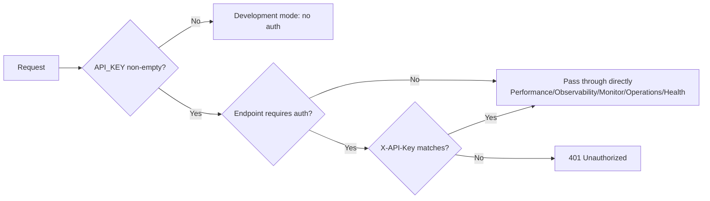

# API Reference

All external interfaces of this system use the `/api/v1/` prefix and follow RESTful conventions. Request and response bodies are JSON (file uploads use multipart). This document lists all endpoints grouped by module.

!!! info "Transport conventions"

    - All endpoints (except health check and read-only ops endpoints) are authenticated via the `verify_api_key` dependency.
    - Request header `Content-Type: application/json` (except file uploads, which use `multipart/form-data`).
    - Time fields use ISO8601 (UTC) format, e.g. `2026-07-03T08:30:00+00:00`.

---

## Authentication

The system authenticates via the `X-API-Key` request header. The logic is implemented by `verify_api_key` in `app/core/security.py`.

=== "Production mode (API_KEY non-empty)"

    ```bash
    curl -H "X-API-Key: $API_KEY" \
         -H "Content-Type: application/json" \
         http://localhost:8000/api/v1/chat \
         -d '{"message": "Hello"}'
    ```

=== "Development mode (API_KEY empty)"

    ```bash
    # When API_KEY is empty, the system enters no-auth mode; no X-API-Key header required
    curl -H "Content-Type: application/json" \
         http://localhost:8000/api/v1/chat \
         -d '{"message": "Hello"}'
    ```

    !!! warning "Security note"
        Development mode is for local debugging only. Production must set a non-empty `API_KEY`; otherwise any caller can access the system.

=== "Authentication failure response"

    ```json
    {
      "detail": "Invalid or missing API key"
    }
    ```

    Authentication failures uniformly return `401 Unauthorized`.

---

## Unified Error Response

Beyond HTTP status codes, all error responses follow a unified structure:

```json
{
  "detail": "Error description text"
}
```

| Status Code | Meaning | Trigger Scenario |
|-------------|---------|-------------------|
| 200 | Success | Successful GET / POST / PUT |
| 201 | Created | Resource-creating endpoints such as creating an experiment |
| 204 | No Content | Endpoints with no response body, such as recording experiment metrics |
| 400 | Bad Request | Invalid parameter value (e.g., alert level not in enum) |
| 401 | Unauthorized | `X-API-Key` missing or invalid |
| 404 | Not Found | session_id / doc_id / report_id / trace_id does not exist |
| 409 | Conflict | State transition conflicts such as duplicate agent acceptance or sending messages to a non-`assigned` session |
| 422 | Validation Failed | Pydantic validation failure (e.g., `min_length=1` constraint) |
| 500 | Internal Error | Uncaught server-side exception |

---

## Endpoint List Overview

### Chat Module

| Endpoint | Method | Description | Auth |
|----------|--------|-------------|------|
| `/api/v1/chat` | POST | Synchronous chat; returns a full `ChatResponse` | ✅ |
| `/api/v1/chat/stream` | POST | SSE streaming chat; event sequence meta → token → done | ✅ |
| `/api/v1/gateway` | POST | Unified multi-channel access gateway | ✅ |

### Agent Assist

| Endpoint | Method | Description | Auth |
|----------|--------|-------------|------|
| `/api/v1/agent/sessions/pending` | GET | Pending session list (sorted by priority descending) | ✅ |
| `/api/v1/agent/sessions/{session_id}` | GET | Session details (including EscalationCard + history) | ✅ |
| `/api/v1/agent/sessions/{session_id}/accept` | POST | Agent accepts the session (CAS pending → assigned) | ✅ |
| `/api/v1/agent/sessions/{session_id}/messages` | POST | Agent sends a message appended to history | ✅ |
| `/api/v1/agent/sessions/{session_id}/knowledge-recommend` | POST | Knowledge recommendation assist | ✅ |
| `/api/v1/agent/sessions/{session_id}/business-assist` | POST | Business query assist (with masking) | ✅ |
| `/api/v1/agent/sessions/{session_id}/resolve` | POST | Mark resolved (CAS assigned → resolved) | ✅ |
| `/api/v1/agent/sessions/{session_id}/solution` | POST | Consolidate a solution back to the knowledge base | ✅ |

### Knowledge Base Management

| Endpoint | Method | Description | Auth |
|----------|--------|-------------|------|
| `/api/v1/knowledge/ingest` | POST | Document ingestion (multipart) | ✅ |
| `/api/v1/knowledge/stats` | GET | Knowledge base statistics | ✅ |
| `/api/v1/knowledge/documents` | GET | Paginated document list | ✅ |
| `/api/v1/knowledge/documents/{doc_id}` | GET | Document details (with version history) | ✅ |
| `/api/v1/knowledge/documents/{doc_id}` | DELETE | Delete a document (removes all chunks) | ✅ |
| `/api/v1/knowledge/quality/check` | POST | Quality check inspection | ✅ |
| `/api/v1/knowledge/documents/{doc_id}/rollback` | POST | Roll back to a specified version | ✅ |
| `/api/v1/knowledge/canary/ingest` | POST | Write to the canary collection | ✅ |
| `/api/v1/knowledge/canary/compare` | POST | Compare main collection vs canary collection | ✅ |

### Document Updates

| Endpoint | Method | Description | Auth |
|----------|--------|-------------|------|
| `/api/v1/update/full` | POST | Full update (monthly) | ✅ |
| `/api/v1/update/incremental` | POST | Incremental update (weekly) | ✅ |
| `/api/v1/update/file` | POST | Single-file real-time update | ✅ |
| `/api/v1/update/status` | GET | Result of the most recent update | ✅ |

### Ticket Mining and Retrieval Tuning

| Endpoint | Method | Description | Auth |
|----------|--------|-------------|------|
| `/api/v1/mining/tickets` | POST | Trigger historical ticket knowledge mining | ✅ |
| `/api/v1/mining/status` | GET | Most recent mining report | ✅ |
| `/api/v1/tuner/params` | GET | Query current tuning parameters | ✅ |
| `/api/v1/tuner/params` | PUT | Update tuning parameters (takes effect immediately) | ✅ |
| `/api/v1/tuner/reset` | POST | Reset to default parameters | ✅ |

### Retrieval Evaluation

| Endpoint | Method | Description | Auth |
|----------|--------|-------------|------|
| `/api/v1/evaluation/run` | POST | Trigger an evaluation run | ✅ |
| `/api/v1/evaluation/reports` | GET | Historical report summary list | ✅ |
| `/api/v1/evaluation/reports/{report_id}` | GET | Single report details | ✅ |

### Performance Monitoring

| Endpoint | Method | Description | Auth |
|----------|--------|-------------|------|
| `/api/v1/performance/metrics` | GET | Comprehensive performance metrics | ❌ |
| `/api/v1/performance/cache/stats` | GET | Hot cache statistics | ❌ |
| `/api/v1/performance/cache/invalidate` | POST | Clear the hot cache | ❌ |

!!! note "Performance endpoints are unauthenticated"
    Performance monitoring endpoints are not authenticated, so ops dashboards and knowledge base update pipelines can call them without credentials. In production, we recommend adding IP allowlists or authentication at the reverse proxy layer.

### Observability

| Endpoint | Method | Description | Auth |
|----------|--------|-------------|------|
| `/api/v1/observability/circuit-breakers` | GET | List all circuit breaker states | ❌ |
| `/api/v1/observability/circuit-breakers/{name}/reset` | POST | Manually reset a circuit breaker | ❌ |
| `/api/v1/observability/alerts` | GET | Query alert list (supports filtering) | ❌ |
| `/api/v1/observability/health` | GET | Health check report | ❌ |
| `/api/v1/observability/token-usage` | GET | Token usage statistics | ❌ |

### Monitoring (Agent dimension)

| Endpoint | Method | Description | Auth |
|----------|--------|-------------|------|
| `/api/v1/monitor/overview` | GET | System overview (total traces, success rate, active sessions) | ❌ |
| `/api/v1/monitor/traces` | GET | Recent trace list summary | ❌ |
| `/api/v1/monitor/traces/{trace_id}` | GET | Single trace details (including steps) | ❌ |
| `/api/v1/monitor/agents` | GET | Each Agent's current state | ❌ |
| `/api/v1/monitor/sessions` | GET | Active session list | ❌ |

### Operations Management

| Endpoint | Method | Description | Auth |
|----------|--------|-------------|------|
| `/api/v1/operations/experiments` | POST | Create an experiment (overwrites if it exists) | ❌ |
| `/api/v1/operations/experiments` | GET | List all experiments | ❌ |
| `/api/v1/operations/experiments/{name}/results` | GET | Query experiment results | ❌ |
| `/api/v1/operations/experiments/{name}/metrics` | POST | Record one metric | ❌ |
| `/api/v1/operations/dashboard` | GET | Operations dashboard (30s cache) | ❌ |
| `/api/v1/operations/release-checklist` | GET | Go-live checklist report | ❌ |

### Escalation

| Endpoint | Method | Description | Auth |
|----------|--------|-------------|------|
| `/api/v1/escalation/solution` | POST | Human-entered solution (pending review) | ✅ |
| `/api/v1/escalation/solutions/pending` | GET | List pending solutions | ✅ |
| `/api/v1/escalation/solutions/{solution_id}/approve` | POST | Approve and ingest as a FAQ | ✅ |

### Health Check

| Endpoint | Method | Description | Auth |
|----------|--------|-------------|------|
| `/api/v1/health` | GET | Service health status (liveness probe) | ❌ |

---

## Endpoint Details

### Chat Module

#### POST /api/v1/chat

Synchronous chat endpoint; returns a full `ChatResponse` after multi-agent orchestration.

**Request body** (`ChatRequest`):

| Field | Type | Required | Description |
|-------|------|----------|--------------|
| `message` | string | ✅ | User message |
| `session_id` | string | ❌ | Session ID; auto-created when empty |
| `channel` | string | ❌ | Channel: web/app/wechat/dingtalk/api, default `web` |
| `user_id` | string | ❌ | User ID |

**Response body** (`ChatResponse`):

```json
{
  "session_id": "sess-abc123",
  "reply": "Hello, I have found the relevant content for you...",
  "status": "ok",
  "data": {
    "intent": "knowledge_qa",
    "sources": [{"source": "product_manual.md", "score": 0.92}],
    "escalate_to_human": false,
    "escalation_card": null,
    "turn_count": 1,
    "failed_attempts": 0,
    "emotion_score": 0.8,
    "sub_tasks": []
  }
}
```

??? example "curl example"
    ```bash
    curl -X POST http://localhost:8000/api/v1/chat \
      -H "X-API-Key: $API_KEY" \
      -H "Content-Type: application/json" \
      -d '{
        "message": "What is the return process?",
        "session_id": "sess-abc123",
        "channel": "web"
      }'
    ```

#### POST /api/v1/chat/stream

SSE streaming chat; event sequence `meta` → `token` (multiple) → `done`.

**Event format**: `event: <type>\ndata: <json>\n\n`

| Event Type | data Fields | Description |
|------------|-------------|-------------|
| `meta` | `intent`, `sources`, `escalate?` | Metadata; the first event |
| `token` | `content` | Streaming token chunk |
| `done` | `turn_count`, `escalate`, `answer` | Full answer and escalation flag |
| `error` | `message` | Error event (HTTP still 200) |

??? example "curl example"
    ```bash
    curl -N -X POST http://localhost:8000/api/v1/chat/stream \
      -H "X-API-Key: $API_KEY" \
      -H "Content-Type: application/json" \
      -H "Accept: text/event-stream" \
      -d '{"message": "What is the return process?"}'
    ```

??? tip "Nginx buffering configuration"
    The streaming endpoint already sets `X-Accel-Buffering: no`, but if buffering still occurs behind Nginx/CDN, disable it explicitly in the Nginx config:
    ```nginx
    location /api/v1/chat/stream {
        proxy_buffering off;
        proxy_cache off;
        chunked_transfer_encoding on;
    }
    ```

---

### Agent Assist

#### GET /api/v1/agent/sessions/pending

Returns all pending sessions, sorted by `EscalationPriority` descending.

**Response body**: `List[AgentSessionSummary]`

```json
[
  {
    "session_id": "sess-abc",
    "user_id": "u-001",
    "channel": "web",
    "agent_status": "pending",
    "priority": "urgent",
    "turn_count": 3,
    "created_at": "2026-07-03T08:00:00+00:00"
  }
]
```

#### GET /api/v1/agent/sessions/{session_id}

Returns session details, including the `EscalationCard` and full `history`. Rebuilt on the fly on cache miss.

**Path parameters**:

| Parameter | Type | Description |
|-----------|------|-------------|
| `session_id` | string | Session ID |

**Status codes**:

| Status Code | Description |
|-------------|-------------|
| 200 | Success |
| 404 | Session does not exist |

#### POST /api/v1/agent/sessions/{session_id}/accept

Agent accepts the session. CAS ensures only one concurrent acceptance succeeds.

**Request body** (`AcceptRequest`, optional):

| Field | Type | Description |
|-------|------|-------------|
| `agent_id` | string | Agent ID |

**Status codes**:

| Status Code | Description |
|-------------|-------------|
| 200 | Acceptance succeeded |
| 404 | Session does not exist |
| 409 | Session is already `assigned`/`resolved`; cannot accept |

#### POST /api/v1/agent/sessions/{session_id}/messages

Agent sends a message, appended to `history`.

**Request body** (`AgentMessageRequest`):

| Field | Type | Required | Description |
|-------|------|----------|-------------|
| `content` | string | ✅ | Message content |

**Response body** (`AgentMessageResponse`):

```json
{
  "message_id": "msg-uuid",
  "timestamp": "2026-07-03T08:30:00+00:00",
  "role": "assistant"
}
```

**Status codes**:

| Status Code | Description |
|-------------|-------------|
| 200 | Sent successfully |
| 404 | Session does not exist |
| 409 | Current state is not `assigned`; cannot send |

#### POST /api/v1/agent/sessions/{session_id}/knowledge-recommend

Knowledge recommendation assist; reuses `HybridRetriever.retrieve`.

**Request body** (`KnowledgeRecommendRequest`):

| Field | Type | Required | Default | Description |
|-------|------|----------|---------|-------------|
| `query` | string | ✅ | — | Query text |
| `top_k` | int | ❌ | 5 | Number of chunks to return |

**Response body** (`KnowledgeRecommendResponse`):

```json
{
  "chunks": [
    {"content": "Return process...", "score": 0.92, "source": "return_policy.md"}
  ],
  "total": 1
}
```

!!! note "Retrieval failure fallback"
    On retrieval exception, it degrades to an empty `chunks` list without error, ensuring the agent workbench is not interrupted.

#### POST /api/v1/agent/sessions/{session_id}/business-assist

Business query assist; reuses `BusinessAgent.execute` (with masking).

**Request body** (`BusinessAssistRequest`):

| Field | Type | Required | Description |
|-------|------|----------|-------------|
| `query` | string | ✅ | Business query text |

**Response body** (`BusinessAssistResponse`):

```json
{
  "result": {
    "reply": "Your order #12345 has shipped...",
    "data": {"order_id": "12345", "phone_masked": "138****8888"},
    "error": null,
    "need_confirmation": false,
    "scene": "order_query"
  },
  "masked_fields": ["phone_masked"]
}
```

#### POST /api/v1/agent/sessions/{session_id}/resolve

Marks the session as resolved. CAS guards `assigned → resolved`.

**Request body** (`ResolveRequest`, optional):

| Field | Type | Description |
|-------|------|-------------|
| `note` | string | Resolution note |

**Status codes**:

| Status Code | Description |
|-------------|-------------|
| 200 | Marked successfully |
| 404 | Session does not exist |
| 409 | Current state is not `assigned` |

#### POST /api/v1/agent/sessions/{session_id}/solution

Records a human solution, consolidated as a FAQ candidate (enters the `pending` review queue).

**Request body** (`SolutionSubmitRequest`):

| Field | Type | Required | Description |
|-------|------|----------|-------------|
| `question` | string | ✅ | User question (`min_length=1`) |
| `solution` | string | ✅ | Solution (`min_length=1`) |
| `intent` | string | ❌ | Intent label; recognized by the system when empty |

**Response body** (`HumanSolutionRecord`):

```json
{
  "solution_id": "sol-uuid",
  "session_id": "sess-abc",
  "question": "How do I return a product?",
  "solution": "Please click Return on the order page...",
  "intent": "knowledge_qa",
  "status": "pending",
  "created_at": "2026-07-03T08:30:00+00:00"
}
```

**Status codes**:

| Status Code | Description |
|-------------|-------------|
| 200 | Recorded successfully |
| 404 | Session does not exist |
| 422 | Empty `question`/`solution` triggers validation failure |

---

### Knowledge Base Management

#### POST /api/v1/knowledge/ingest

Upload a document for ingestion (multipart).

**Request body** (form-data):

| Field | Type | Required | Default | Description |
|-------|------|----------|---------|-------------|
| `file` | file | ✅ | — | File to ingest |
| `product_category` | string | ❌ | `unknown` | Product category |
| `applicable_version` | string | ❌ | `latest` | Applicable version |
| `knowledge_type` | string | ❌ | — | faq/policy/doc/tutorial/ticket |
| `published_at` | string | ❌ | — | Publish time ISO8601 |
| `register` | bool | ❌ | false | Whether to register to the document registry |
| `validate_quality` | bool | ❌ | false | Whether to run quality checks at ingestion |

**Response body** (`IngestResult`):

```json
{
  "doc_id": "doc-uuid",
  "source": "return_policy.md",
  "chunk_count": 12,
  "status": "success",
  "errors": []
}
```

??? example "curl example"
    ```bash
    curl -X POST http://localhost:8000/api/v1/knowledge/ingest \
      -H "X-API-Key: $API_KEY" \
      -F "file=@return_policy.md" \
      -F "product_category=electronics" \
      -F "knowledge_type=policy" \
      -F "register=true"
    ```

#### GET /api/v1/knowledge/stats

Returns knowledge base statistics.

**Response body** (`KnowledgeStats`):

```json
{
  "total_chunks": 1280,
  "total_documents": 15,
  "collection_name": "knowledge_base",
  "embedding_dim": 1024
}
```

#### GET /api/v1/knowledge/documents

Paginated list of registered documents.

**Query parameters**:

| Parameter | Type | Default | Range | Description |
|-----------|------|---------|-------|-------------|
| `limit` | int | 20 | 1–200 | Page size |
| `offset` | int | 0 | ≥0 | Starting offset |

#### GET /api/v1/knowledge/documents/{doc_id}

Query a single document's details, including full version history.

**Response body** (`DocumentDetail`):

```json
{
  "doc_id": "doc-uuid",
  "source": "return_policy.md",
  "current_version": "v2",
  "status": "active",
  "created_at": "2026-06-01T00:00:00+00:00",
  "updated_at": "2026-07-01T00:00:00+00:00",
  "versions": [
    {"version": "v1", "doc_hash": "abc", "status": "superseded", "chunk_count": 10, "created_at": "..."},
    {"version": "v2", "doc_hash": "def", "status": "active", "chunk_count": 12, "created_at": "..."}
  ]
}
```

!!! note "Document not found"
    When the document does not exist, an empty detail with `status: "not_found"` is returned; HTTP remains 200, and the frontend prompts accordingly.

#### DELETE /api/v1/knowledge/documents/{doc_id}

Delete a document by `doc_id`; removes all chunks of the document from the vector store.

**Response body** (`DeleteResult`):

```json
{"doc_id": "doc-uuid", "deleted_chunks": 12, "success": true}
```

#### POST /api/v1/knowledge/quality/check

Run a batch quality inspection on ingested content.

**Request body** (`QualityCheckRequest`):

| Field | Type | Description |
|-------|------|-------------|
| `source` | string | Filter by source (optional) |
| `doc_id` | string | Filter by doc_id (optional) |

**Response body** (`QualityReport`): includes inspection results such as duplicate chunks, terminology hit rate, and sensitive word hits.

#### POST /api/v1/knowledge/documents/{doc_id}/rollback

Roll back a document to a specified version.

**Request body** (`RollbackRequest`):

| Field | Type | Description |
|-------|------|-------------|
| `target_version` | string | Target version number |

#### POST /api/v1/knowledge/canary/ingest & /canary/compare

Two canary verification endpoints; both use `CanaryRequest` as the request body:

| Field | Type | Description |
|-------|------|-------------|
| `doc_id` | string | Document ID |
| `version` | string | Target version |
| `sample_queries` | list[string] | Sample queries for comparison |

---

### Document Updates

#### POST /api/v1/update/full

Trigger a full update (monthly).

**Request body** (`UpdateRequest`):

| Field | Type | Description |
|-------|------|-------------|
| `dir_path` | string | Directory to scan |
| `extensions` | list[string] | File extension filter |

#### POST /api/v1/update/incremental

Trigger an incremental update (weekly); processes only new files or files whose hash changed.

#### POST /api/v1/update/file

Single-file real-time update.

**Request body** (`UpdateSingleFileRequest`):

| Field | Type | Description |
|-------|------|-------------|
| `file_path` | string | Absolute file path |
| `metadata` | dict | Metadata overrides |

#### GET /api/v1/update/status

Returns the most recent update result; empty if never run.

---

### Retrieval Evaluation

#### POST /api/v1/evaluation/run

Trigger an evaluation run.

**Request body** (`EvaluationRunRequest`):

| Field | Type | Default | Description |
|-------|------|---------|-------------|
| `testset_path` | string | Built-in 30 cases | External test set path |
| `top_k` | int | `rerank_top_k` | Retrieval top_k |

**Response body** (`EvaluationReport`): includes `report_id`, `total_queries`, `recall@5`, `hit_rate`, and other metrics.

#### GET /api/v1/evaluation/reports

List historical report summaries, sorted by time descending.

#### GET /api/v1/evaluation/reports/{report_id}

Query a single report's details; returns 404 if it does not exist.

---

### Performance Monitoring

#### GET /api/v1/performance/metrics

Returns comprehensive performance metrics.

**Response body** (`MetricsResponse`):

```json
{
  "metrics": {
    "cache_hit_rate": 0.65,
    "concurrent_requests": 3,
    "model_router_stats": {"small_llm": 120, "main_llm": 30},
    "avg_response_ms": 1850
  }
}
```

#### GET /api/v1/performance/cache/stats

Returns hot cache statistics: hit/miss counts, hit rate, current entry count, LRU evictions.

#### POST /api/v1/performance/cache/invalidate

Clear the hot cache (call after knowledge base updates).

**Response body** (`InvalidateResult`):

```json
{"success": true, "cleared": 42, "message": "Cleared 42 cache entries"}
```

!!! tip "Must call after knowledge base updates"
    After ingesting/deleting/rolling back knowledge base entries, you must call this endpoint to clear the cache; otherwise `HotQueryCache` will return stale replies.

---

### Observability

#### GET /api/v1/observability/circuit-breakers

Returns a dict of `name → CircuitBreakerStats`, including state, failure count, and last failure time.

#### POST /api/v1/observability/circuit-breakers/{name}/reset

Manually reset a specified circuit breaker to CLOSED. Returns 404 if the breaker does not exist.

#### GET /api/v1/observability/alerts

Query the alert list, supports `level` / `source` / `since` filters.

**Query parameters**:

| Parameter | Type | Description |
|-----------|------|-------------|
| `level` | string | info/warn/error/critical |
| `source` | string | Source, e.g. `token_usage` |
| `since` | string | ISO8601 start time |

#### GET /api/v1/observability/health

Run all health checks and return an aggregate report.

#### GET /api/v1/observability/token-usage

Returns Token usage statistics for the specified window.

**Query parameters**:

| Parameter | Type | Default | Values |
|-----------|------|---------|--------|
| `window` | string | `hour` | minute/hour/day |

---

### Monitoring (Agent dimension)

#### GET /api/v1/monitor/overview

Returns a system overview: total traces, success rate, average duration, active sessions.

#### GET /api/v1/monitor/traces

Returns recent trace list summary (without steps).

**Query parameters**:

| Parameter | Type | Default | Range |
|-----------|------|---------|-------|
| `limit` | int | 50 | 1–200 |

#### GET /api/v1/monitor/traces/{trace_id}

Returns a single trace's details (including steps and sub_tasks). Returns 404 if not found.

#### GET /api/v1/monitor/agents

Returns each Agent's current state (including uncalled agents with a call count of 0).

#### GET /api/v1/monitor/sessions

Returns the active session list, sorted by last-active time descending.

---

### Operations Management

#### POST /api/v1/operations/experiments

Create an experiment; if it already exists, it is overwritten and historical metrics are cleared. Returns 201.

**Request body** (`CreateExperimentRequest`): includes experiment name, variant definitions, and traffic split.

#### GET /api/v1/operations/experiments

List all experiments.

#### GET /api/v1/operations/experiments/{name}/results

Query experiment results; returns 404 if the experiment does not exist.

#### POST /api/v1/operations/experiments/{name}/metrics

Record one experiment metric; returns 204. Recording is allowed even if the experiment does not exist, for replay.

#### GET /api/v1/operations/dashboard

Returns aggregated dashboard data, cached for 30 seconds. `force_refresh=true` bypasses the cache.

#### GET /api/v1/operations/release-checklist

Runs the go-live checklist and returns a report. Each check runs independently; a failure does not interrupt the others.

---

### Escalation

#### POST /api/v1/escalation/solution

A human agent enters a solution (pending review).

**Request body** (`HumanSolutionRequest`):

| Field | Type | Required | Description |
|-------|------|----------|-------------|
| `session_id` | string | ✅ | Session ID |
| `question` | string | ✅ | User question |
| `solution` | string | ✅ | Solution |
| `intent` | string | ❌ | Intent label |

#### GET /api/v1/escalation/solutions/pending

List all pending solutions.

#### POST /api/v1/escalation/solutions/{solution_id}/approve

Approve a solution and ingest it as a FAQ. Returns 404 if the solution does not exist or ingestion fails.

!!! tip "Closed-loop value"
    After approval, the next time the bot retrieves a similar question, it can match this solution, forming the closed loop of "human handles → consolidate → bot answers next time".

---

### Health Check

#### GET /api/v1/health

Liveness probe endpoint; not authenticated.

**Response body** (`HealthResponse`):

```json
{
  "status": "ok",
  "app": "Intelligent Customer Service System",
  "version": "0.1.0",
  "timestamp": "2026-07-03T08:30:00+00:00"
}
```

---

## Appendix

### Endpoint Authentication Summary



### OpenAPI Documentation

FastAPI auto-generated interactive documentation:

- Swagger UI: `http://localhost:8000/docs`
- ReDoc: `http://localhost:8000/redoc`

### Related Documentation

- [Examples](examples.en.md)
- [FAQ](faq.en.md)
- [Configuration](configuration.md)
- [Agent Assist Workbench](tutorials/agent-assist.md)
