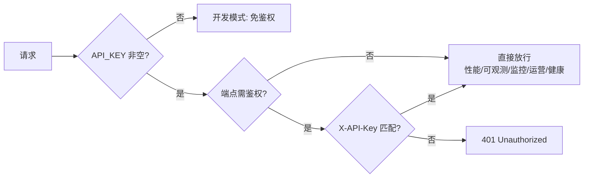

# API 参考

本系统所有对外接口统一使用 `/api/v1/` 前缀，遵循 RESTful 风格，请求与响应体均为 JSON（文件上传走 multipart）。本文档按模块分组列出全部端点。

!!! info "传输约定"

    - 所有端点（除健康检查与运维只读接口）均通过 `verify_api_key` 依赖鉴权。
    - 请求头 `Content-Type: application/json`（除文件上传为 `multipart/form-data`）。
    - 时间字段统一使用 ISO8601（UTC）格式，如 `2026-07-03T08:30:00+00:00`。

---

## 鉴权机制

系统通过 `X-API-Key` 请求头进行鉴权，逻辑由 `app/core/security.py` 的 `verify_api_key` 实现。

=== "生产模式（API_KEY 非空）"

    ```bash
    curl -H "X-API-Key: $API_KEY" \
         -H "Content-Type: application/json" \
         http://localhost:8000/api/v1/chat \
         -d '{"message": "你好"}'
    ```

=== "开发模式（API_KEY 为空）"

    ```bash
    # API_KEY 留空时进入免鉴权模式，无需 X-API-Key 头
    curl -H "Content-Type: application/json" \
         http://localhost:8000/api/v1/chat \
         -d '{"message": "你好"}'
    ```

    !!! warning "安全提示"
        开发模式仅供本地调试，生产环境必须设置非空 `API_KEY`，否则任意调用方均可访问。

=== "鉴权失败响应"

    ```json
    {
      "detail": "Invalid or missing API key"
    }
    ```

    鉴权失败统一返回 `401 Unauthorized`。

---

## 统一错误响应

除 HTTP 状态码外，所有错误响应遵循统一结构：

```json
{
  "detail": "错误描述文本"
}
```

| 状态码 | 含义 | 触发场景 |
|--------|------|----------|
| 200 | 成功 | GET / POST / PUT 成功 |
| 201 | 已创建 | 创建实验等资源类端点 |
| 204 | 无内容 | 记录实验指标等无返回体端点 |
| 400 | 请求错误 | 参数取值非法（如告警级别不在枚举内） |
| 401 | 未授权 | `X-API-Key` 缺失或无效 |
| 404 | 资源不存在 | session_id / doc_id / report_id / trace_id 不存在 |
| 409 | 状态冲突 | 坐席重复接手、向非 `assigned` 会话发消息等状态流转冲突 |
| 422 | 校验失败 | Pydantic 校验失败（如 `min_length=1` 约束） |
| 500 | 内部错误 | 服务端未捕获异常 |

---

## 端点清单总览

### 对话模块

| 端点 | 方法 | 说明 | 鉴权 |
|------|------|------|------|
| `/api/v1/chat` | POST | 同步对话，返回完整 `ChatResponse` | ✅ |
| `/api/v1/chat/stream` | POST | SSE 流式对话，事件序列 meta → token → done | ✅ |
| `/api/v1/gateway` | POST | 多渠道统一接入网关 | ✅ |

### 坐席辅助

| 端点 | 方法 | 说明 | 鉴权 |
|------|------|------|------|
| `/api/v1/agent/sessions/pending` | GET | 待接入会话列表（按优先级降序） | ✅ |
| `/api/v1/agent/sessions/{session_id}` | GET | 会话详情（含 EscalationCard + history） | ✅ |
| `/api/v1/agent/sessions/{session_id}/accept` | POST | 坐席接手会话（CAS pending → assigned） | ✅ |
| `/api/v1/agent/sessions/{session_id}/messages` | POST | 坐席发送消息追加到 history | ✅ |
| `/api/v1/agent/sessions/{session_id}/knowledge-recommend` | POST | 知识推荐辅助 | ✅ |
| `/api/v1/agent/sessions/{session_id}/business-assist` | POST | 业务查询辅助（含脱敏） | ✅ |
| `/api/v1/agent/sessions/{session_id}/resolve` | POST | 标记已解决（CAS assigned → resolved） | ✅ |
| `/api/v1/agent/sessions/{session_id}/solution` | POST | 录入方案沉淀回库 | ✅ |

### 知识库管理

| 端点 | 方法 | 说明 | 鉴权 |
|------|------|------|------|
| `/api/v1/knowledge/ingest` | POST | 文档入库（multipart） | ✅ |
| `/api/v1/knowledge/stats` | GET | 知识库统计信息 | ✅ |
| `/api/v1/knowledge/documents` | GET | 分页查询文档列表 | ✅ |
| `/api/v1/knowledge/documents/{doc_id}` | GET | 文档详情（含版本历史） | ✅ |
| `/api/v1/knowledge/documents/{doc_id}` | DELETE | 删除文档（移除全部 chunks） | ✅ |
| `/api/v1/knowledge/quality/check` | POST | 质量校验巡检 | ✅ |
| `/api/v1/knowledge/documents/{doc_id}/rollback` | POST | 回滚到指定版本 | ✅ |
| `/api/v1/knowledge/canary/ingest` | POST | 写入灰度集合 | ✅ |
| `/api/v1/knowledge/canary/compare` | POST | 主集合 vs 灰度集合对比 | ✅ |

### 文档更新

| 端点 | 方法 | 说明 | 鉴权 |
|------|------|------|------|
| `/api/v1/update/full` | POST | 全量更新（月度） | ✅ |
| `/api/v1/update/incremental` | POST | 增量更新（周度） | ✅ |
| `/api/v1/update/file` | POST | 单文件实时更新 | ✅ |
| `/api/v1/update/status` | GET | 最近一次更新结果 | ✅ |

### 工单挖掘与检索调优

| 端点 | 方法 | 说明 | 鉴权 |
|------|------|------|------|
| `/api/v1/mining/tickets` | POST | 触发历史工单知识挖掘 | ✅ |
| `/api/v1/mining/status` | GET | 最近一次挖掘报告 | ✅ |
| `/api/v1/tuner/params` | GET | 查询当前调优参数 | ✅ |
| `/api/v1/tuner/params` | PUT | 更新调优参数（立即生效） | ✅ |
| `/api/v1/tuner/reset` | POST | 重置为默认参数 | ✅ |

### 检索评测

| 端点 | 方法 | 说明 | 鉴权 |
|------|------|------|------|
| `/api/v1/evaluation/run` | POST | 触发评测运行 | ✅ |
| `/api/v1/evaluation/reports` | GET | 历史报告摘要列表 | ✅ |
| `/api/v1/evaluation/reports/{report_id}` | GET | 单个报告详情 | ✅ |

### RAGAS 生成质量评估

| 端点 | 方法 | 说明 | 鉴权 |
|------|------|------|------|
| `/api/v1/evaluation/ragas/run` | POST | 触发 RAGAS 评测（需 ragas 库 + LLM_API_KEY） | ✅ |
| `/api/v1/evaluation/ragas/reports` | GET | 历史 RAGAS 报告摘要列表 | ✅ |
| `/api/v1/evaluation/ragas/reports/{report_id}` | GET | 单个 RAGAS 报告详情 | ✅ |

### 性能监控

| 端点 | 方法 | 说明 | 鉴权 |
|------|------|------|------|
| `/api/v1/performance/metrics` | GET | 综合性能指标 | ❌ |
| `/api/v1/performance/cache/stats` | GET | 热点缓存统计 | ❌ |
| `/api/v1/performance/cache/invalidate` | POST | 清空热点缓存 | ❌ |

!!! note "性能端点无鉴权说明"
    性能监控端点不做鉴权，便于运维面板与知识库更新流水线无凭据调用。生产环境建议在反向代理层加 IP 白名单或鉴权。

### 可观测性

| 端点 | 方法 | 说明 | 鉴权 |
|------|------|------|------|
| `/api/v1/observability/circuit-breakers` | GET | 列出所有熔断器状态 | ❌ |
| `/api/v1/observability/circuit-breakers/{name}/reset` | POST | 手动重置熔断器 | ❌ |
| `/api/v1/observability/alerts` | GET | 查询告警列表（支持过滤） | ❌ |
| `/api/v1/observability/health` | GET | 健康检查报告 | ❌ |
| `/api/v1/observability/token-usage` | GET | Token 用量统计 | ❌ |

### 监控（Agent 维度）

| 端点 | 方法 | 说明 | 鉴权 |
|------|------|------|------|
| `/api/v1/monitor/overview` | GET | 系统概览（总 trace、成功率、活跃会话） | ❌ |
| `/api/v1/monitor/traces` | GET | 最近 trace 列表摘要 | ❌ |
| `/api/v1/monitor/traces/{trace_id}` | GET | 单条 trace 详情（含 steps） | ❌ |
| `/api/v1/monitor/agents` | GET | 各 Agent 当前状态 | ❌ |
| `/api/v1/monitor/sessions` | GET | 活跃会话列表 | ❌ |

### 运营管理

| 端点 | 方法 | 说明 | 鉴权 |
|------|------|------|------|
| `/api/v1/operations/experiments` | POST | 创建实验（已存在则覆盖） | ❌ |
| `/api/v1/operations/experiments` | GET | 列出全部实验 | ❌ |
| `/api/v1/operations/experiments/{name}/results` | GET | 查询实验结果 | ❌ |
| `/api/v1/operations/experiments/{name}/metrics` | POST | 记录一条指标 | ❌ |
| `/api/v1/operations/dashboard` | GET | 运营看板（30s 缓存） | ❌ |
| `/api/v1/operations/release-checklist` | GET | 上线检查报告 | ❌ |

### 人工转接

| 端点 | 方法 | 说明 | 鉴权 |
|------|------|------|------|
| `/api/v1/escalation/solution` | POST | 人工录入方案（待审核） | ✅ |
| `/api/v1/escalation/solutions/pending` | GET | 列出待审核方案 | ✅ |
| `/api/v1/escalation/solutions/{solution_id}/approve` | POST | 审核通过并入库为 FAQ | ✅ |

### 健康检查

| 端点 | 方法 | 说明 | 鉴权 |
|------|------|------|------|
| `/api/v1/health` | GET | 服务健康状态（探活） | ❌ |

---

## 端点详情

### 对话模块

#### POST /api/v1/chat

同步对话端点，多 Agent 协同后返回完整 `ChatResponse`。

**请求体**（`ChatRequest`）：

| 字段 | 类型 | 必填 | 说明 |
|------|------|------|------|
| `message` | string | ✅ | 用户消息 |
| `session_id` | string | ❌ | 会话 ID，留空自动创建 |
| `channel` | string | ❌ | 渠道：web/app/wechat/dingtalk/api，默认 `web` |
| `user_id` | string | ❌ | 用户 ID |

**响应体**（`ChatResponse`）：

```json
{
  "session_id": "sess-abc123",
  "reply": "您好，已为您查到相关内容……",
  "status": "ok",
  "data": {
    "intent": "knowledge_qa",
    "sources": [{"source": "product_manual.md", "score": 0.92}],
    "escalate_to_human": false,
    "escalation_card": null,
    "turn_count": 1,
    "failed_attempts": 0,
    "emotion_score": 0.8,
    "sub_tasks": []
  }
}
```

??? example "curl 示例"
    ```bash
    curl -X POST http://localhost:8000/api/v1/chat \
      -H "X-API-Key: $API_KEY" \
      -H "Content-Type: application/json" \
      -d '{
        "message": "退货流程是什么？",
        "session_id": "sess-abc123",
        "channel": "web"
      }'
    ```

#### POST /api/v1/chat/stream

SSE 流式对话，事件序列 `meta` → `token`（多次）→ `done`。

**事件格式**：`event: <type>\ndata: <json>\n\n`

| 事件类型 | data 字段 | 说明 |
|----------|-----------|------|
| `meta` | `intent`, `sources`, `escalate?` | 元信息，首个事件 |
| `token` | `content` | 流式 token 片段 |
| `done` | `turn_count`, `escalate`, `answer` | 完整答案与转接标志 |
| `error` | `message` | 异常事件（HTTP 仍 200） |

??? example "curl 示例"
    ```bash
    curl -N -X POST http://localhost:8000/api/v1/chat/stream \
      -H "X-API-Key: $API_KEY" \
      -H "Content-Type: application/json" \
      -H "Accept: text/event-stream" \
      -d '{"message": "退货流程是什么？"}'
    ```

??? tip "Nginx 缓冲配置"
    流式端点已设置 `X-Accel-Buffering: no`，但若经 Nginx/CDN 仍出现缓冲，需在 Nginx 配置中显式关闭：
    ```nginx
    location /api/v1/chat/stream {
        proxy_buffering off;
        proxy_cache off;
        chunked_transfer_encoding on;
    }
    ```

---

### 坐席辅助

#### GET /api/v1/agent/sessions/pending

返回所有待接入会话，按 `EscalationPriority` 降序。

**响应体**：`List[AgentSessionSummary]`

```json
[
  {
    "session_id": "sess-abc",
    "user_id": "u-001",
    "channel": "web",
    "agent_status": "pending",
    "priority": "urgent",
    "turn_count": 3,
    "created_at": "2026-07-03T08:00:00+00:00"
  }
]
```

#### GET /api/v1/agent/sessions/{session_id}

返回会话详情，含 `EscalationCard` 与完整 `history`。缓存未命中时即时重建。

**路径参数**：

| 参数 | 类型 | 说明 |
|------|------|------|
| `session_id` | string | 会话 ID |

**状态码**：

| 状态码 | 说明 |
|--------|------|
| 200 | 成功 |
| 404 | 会话不存在 |

#### POST /api/v1/agent/sessions/{session_id}/accept

坐席接手会话，CAS 保证并发接手仅一个成功。

**请求体**（`AcceptRequest`，可选）：

| 字段 | 类型 | 说明 |
|------|------|------|
| `agent_id` | string | 坐席 ID |

**状态码**：

| 状态码 | 说明 |
|--------|------|
| 200 | 接手成功 |
| 404 | 会话不存在 |
| 409 | 会话已 `assigned`/`resolved`，无法接手 |

#### POST /api/v1/agent/sessions/{session_id}/messages

坐席发送消息，追加到 `history`。

**请求体**（`AgentMessageRequest`）：

| 字段 | 类型 | 必填 | 说明 |
|------|------|------|------|
| `content` | string | ✅ | 消息内容 |

**响应体**（`AgentMessageResponse`）：

```json
{
  "message_id": "msg-uuid",
  "timestamp": "2026-07-03T08:30:00+00:00",
  "role": "assistant"
}
```

**状态码**：

| 状态码 | 说明 |
|--------|------|
| 200 | 发送成功 |
| 404 | 会话不存在 |
| 409 | 当前状态非 `assigned`，不可发送 |

#### POST /api/v1/agent/sessions/{session_id}/knowledge-recommend

知识推荐辅助，复用 `HybridRetriever.retrieve`。

**请求体**（`KnowledgeRecommendRequest`）：

| 字段 | 类型 | 必填 | 默认 | 说明 |
|------|------|------|------|------|
| `query` | string | ✅ | — | 查询文本 |
| `top_k` | int | ❌ | 5 | 返回片段数 |

**响应体**（`KnowledgeRecommendResponse`）：

```json
{
  "chunks": [
    {"content": "退货流程……", "score": 0.92, "source": "return_policy.md"}
  ],
  "total": 1
}
```

!!! note "检索失败降级"
    检索异常时降级为空 `chunks` 列表，不报错，保证坐席工作台不中断。

#### POST /api/v1/agent/sessions/{session_id}/business-assist

业务查询辅助，复用 `BusinessAgent.execute`（含脱敏）。

**请求体**（`BusinessAssistRequest`）：

| 字段 | 类型 | 必填 | 说明 |
|------|------|------|------|
| `query` | string | ✅ | 业务查询文本 |

**响应体**（`BusinessAssistResponse`）：

```json
{
  "result": {
    "reply": "您的订单 #12345 已发货……",
    "data": {"order_id": "12345", "phone_masked": "138****8888"},
    "error": null,
    "need_confirmation": false,
    "scene": "order_query"
  },
  "masked_fields": ["phone_masked"]
}
```

#### POST /api/v1/agent/sessions/{session_id}/resolve

标记会话已解决，CAS 判断 `assigned → resolved`。

**请求体**（`ResolveRequest`，可选）：

| 字段 | 类型 | 说明 |
|------|------|------|
| `note` | string | 解决备注 |

**状态码**：

| 状态码 | 说明 |
|--------|------|
| 200 | 标记成功 |
| 404 | 会话不存在 |
| 409 | 当前状态非 `assigned` |

#### POST /api/v1/agent/sessions/{session_id}/solution

录入人工方案，沉淀为 FAQ 候选（进入 `pending` 审核队列）。

**请求体**（`SolutionSubmitRequest`）：

| 字段 | 类型 | 必填 | 说明 |
|------|------|------|------|
| `question` | string | ✅ | 用户问题（`min_length=1`） |
| `solution` | string | ✅ | 解决方案（`min_length=1`） |
| `intent` | string | ❌ | 意图标签，留空由系统识别 |

**响应体**（`HumanSolutionRecord`）：

```json
{
  "solution_id": "sol-uuid",
  "session_id": "sess-abc",
  "question": "如何退货？",
  "solution": "请在订单页点击退货……",
  "intent": "knowledge_qa",
  "status": "pending",
  "created_at": "2026-07-03T08:30:00+00:00"
}
```

**状态码**：

| 状态码 | 说明 |
|--------|------|
| 200 | 录入成功 |
| 404 | 会话不存在 |
| 422 | `question`/`solution` 为空触发校验失败 |

---

### 知识库管理

#### POST /api/v1/knowledge/ingest

上传文档入库（multipart）。

**请求体**（form-data）：

| 字段 | 类型 | 必填 | 默认 | 说明 |
|------|------|------|------|------|
| `file` | file | ✅ | — | 待入库文件 |
| `product_category` | string | ❌ | `unknown` | 产品分类 |
| `applicable_version` | string | ❌ | `latest` | 适用版本 |
| `knowledge_type` | string | ❌ | — | faq/policy/doc/tutorial/ticket |
| `published_at` | string | ❌ | — | 发布时间 ISO8601 |
| `register` | bool | ❌ | false | 是否注册到文档注册表 |
| `validate_quality` | bool | ❌ | false | 是否入库时执行质量校验 |

**响应体**（`IngestResult`）：

```json
{
  "doc_id": "doc-uuid",
  "source": "return_policy.md",
  "chunk_count": 12,
  "status": "success",
  "errors": []
}
```

??? example "curl 示例"
    ```bash
    curl -X POST http://localhost:8000/api/v1/knowledge/ingest \
      -H "X-API-Key: $API_KEY" \
      -F "file=@return_policy.md" \
      -F "product_category=electronics" \
      -F "knowledge_type=policy" \
      -F "register=true"
    ```

#### GET /api/v1/knowledge/stats

返回知识库统计信息。

**响应体**（`KnowledgeStats`）：

```json
{
  "total_chunks": 1280,
  "total_documents": 15,
  "collection_name": "knowledge_base",
  "embedding_dim": 1024
}
```

#### GET /api/v1/knowledge/documents

分页查询已注册文档列表。

**查询参数**：

| 参数 | 类型 | 默认 | 范围 | 说明 |
|------|------|------|------|------|
| `limit` | int | 20 | 1–200 | 分页大小 |
| `offset` | int | 0 | ≥0 | 起始偏移 |

#### GET /api/v1/knowledge/documents/{doc_id}

查询单个文档详情，含完整版本历史。

**响应体**（`DocumentDetail`）：

```json
{
  "doc_id": "doc-uuid",
  "source": "return_policy.md",
  "current_version": "v2",
  "status": "active",
  "created_at": "2026-06-01T00:00:00+00:00",
  "updated_at": "2026-07-01T00:00:00+00:00",
  "versions": [
    {"version": "v1", "doc_hash": "abc", "status": "superseded", "chunk_count": 10, "created_at": "..."},
    {"version": "v2", "doc_hash": "def", "status": "active", "chunk_count": 12, "created_at": "..."}
  ]
}
```

!!! note "文档不存在"
    文档不存在时返回 `status: "not_found"` 的空详情，HTTP 仍 200，前端据此提示。

#### DELETE /api/v1/knowledge/documents/{doc_id}

按 `doc_id` 删除文档，移除向量库中该文档全部 chunks。

**响应体**（`DeleteResult`）：

```json
{"doc_id": "doc-uuid", "deleted_chunks": 12, "success": true}
```

#### POST /api/v1/knowledge/quality/check

对已入库内容执行批量质量巡检。

**请求体**（`QualityCheckRequest`）：

| 字段 | 类型 | 说明 |
|------|------|------|
| `source` | string | 按 source 过滤（可选） |
| `doc_id` | string | 按 doc_id 过滤（可选） |

**响应体**（`QualityReport`）：包含重复片段、术语命中率、敏感词命中等巡检结果。

#### POST /api/v1/knowledge/documents/{doc_id}/rollback

回滚文档到指定版本。

**请求体**（`RollbackRequest`）：

| 字段 | 类型 | 说明 |
|------|------|------|
| `target_version` | string | 目标版本号 |

#### POST /api/v1/knowledge/canary/ingest & /canary/compare

灰度验证两个端点，请求体均为 `CanaryRequest`：

| 字段 | 类型 | 说明 |
|------|------|------|
| `doc_id` | string | 文档 ID |
| `version` | string | 目标版本 |
| `sample_queries` | list[string] | 对比样本查询 |

---

### 文档更新

#### POST /api/v1/update/full

触发全量更新（月度）。

**请求体**（`UpdateRequest`）：

| 字段 | 类型 | 说明 |
|------|------|------|
| `dir_path` | string | 扫描目录 |
| `extensions` | list[string] | 文件扩展名过滤 |

#### POST /api/v1/update/incremental

触发增量更新（周度），仅处理新增或 hash 变化的文件。

#### POST /api/v1/update/file

单文件实时更新。

**请求体**（`UpdateSingleFileRequest`）：

| 字段 | 类型 | 说明 |
|------|------|------|
| `file_path` | string | 文件绝对路径 |
| `metadata` | dict | 元数据覆盖项 |

#### GET /api/v1/update/status

返回最近一次更新结果，未执行过返回空。

---

### 检索评测

#### POST /api/v1/evaluation/run

触发评测运行。

**请求体**（`EvaluationRunRequest`）：

| 字段 | 类型 | 默认 | 说明 |
|------|------|------|------|
| `testset_path` | string | 内置 30 条 | 外部测试集路径 |
| `top_k` | int | `rerank_top_k` | 检索 top_k |

**响应体**（`EvaluationReport`）：含 `report_id`、`total_queries`、`recall@5`、`hit_rate` 等指标。

#### GET /api/v1/evaluation/reports

按时间倒序列出历史报告摘要。

#### GET /api/v1/evaluation/reports/{report_id}

查询单个报告详情，不存在返回 404。

---

### RAGAS 生成质量评估

通过 LLM 对「问题 → 检索上下文 → 生成答案 → 标准答案」全链路打分，量化 RAG 端到端生成质量。四项核心指标：`faithfulness`、`answer_relevancy`、`context_precision`、`context_recall`。详见 [RAGAS 评估教程](tutorials/evaluation-ragas.md)。

#### POST /api/v1/evaluation/ragas/run

触发 RAGAS 评测。**前置条件**：已安装 `ragas` 库且 `LLM_API_KEY` 非空，否则返回 `503`。

**请求体**（`RagasRunRequest`）：

| 字段 | 类型 | 默认 | 说明 |
|------|------|------|------|
| `testset_path` | string | 内置 12 条 | 外部测试集 JSON 路径，为空用内置默认集 |
| `top_k` | int | `RAGAgent` 默认值 | 检索 Top-K，范围 1–50 |

**响应体**（`RagasEvaluationReport`）：

```json
{
  "report_id": "20260704_103045_a1b2c3d4",
  "created_at": "2026-07-04T10:30:45",
  "total_queries": 12,
  "faithfulness": 0.8723,
  "answer_relevancy": 0.9015,
  "context_precision": 0.8456,
  "context_recall": 0.7890,
  "duration_seconds": 187.45,
  "source": "default",
  "case_details": [
    {
      "question": "忘记登录密码怎么办？",
      "ground_truth": "如果忘记登录密码……",
      "answer": "您可以在登录页点击「忘记密码」……",
      "contexts": ["用户忘记密码时……", "重置链接 30 分钟内有效……"],
      "faithfulness": 0.92,
      "answer_relevancy": 0.95,
      "context_precision": 0.88,
      "context_recall": 0.85,
      "error": null
    }
  ]
}
```

**状态码**：

| 状态码 | 说明 |
|--------|------|
| 200 | 评测成功 |
| 503 | `ragas` 未安装或 `LLM_API_KEY` 未配置 |

??? example "curl 示例"
    ```bash
    curl -X POST http://localhost:8000/api/v1/evaluation/ragas/run \
      -H "X-API-Key: $API_KEY" \
      -H "Content-Type: application/json" \
      -d '{"top_k": 5}'
    ```

??? warning "503 降级响应"
    ```json
    {"detail": "RAGAS 评估需要安装 ragas 库并配置 LLM_API_KEY"}
    ```

#### GET /api/v1/evaluation/ragas/reports

按时间倒序列出历史 RAGAS 报告摘要。

**响应体**：`List[RagasReportSummary]`，仅含概要字段（无 `case_details`），详情通过 `/ragas/reports/{report_id}` 查询。

#### GET /api/v1/evaluation/ragas/reports/{report_id}

查询单个 RAGAS 报告详情（含 `case_details`），不存在返回 404。

---

### 性能监控

#### GET /api/v1/performance/metrics

返回综合性能指标。

**响应体**（`MetricsResponse`）：

```json
{
  "metrics": {
    "cache_hit_rate": 0.65,
    "concurrent_requests": 3,
    "model_router_stats": {"small_llm": 120, "main_llm": 30},
    "avg_response_ms": 1850
  }
}
```

#### GET /api/v1/performance/cache/stats

返回热点缓存统计：命中/未命中次数、命中率、当前条目数、LRU 淘汰数。

#### POST /api/v1/performance/cache/invalidate

清空热点缓存（知识库更新后调用）。

**响应体**（`InvalidateResult`）：

```json
{"success": true, "cleared": 42, "message": "已清空 42 条缓存"}
```

!!! tip "知识库更新后必调"
    知识库入库/删除/回滚后必须调用此端点清缓存，否则 `HotQueryCache` 会返回过期回复。

---

### 可观测性

#### GET /api/v1/observability/circuit-breakers

返回 `name → CircuitBreakerStats` 的字典，含状态、失败次数、最近失败时间。

#### POST /api/v1/observability/circuit-breakers/{name}/reset

手动重置指定熔断器到 CLOSED。熔断器不存在返回 404。

#### GET /api/v1/observability/alerts

查询告警列表，支持 `level` / `source` / `since` 过滤。

**查询参数**：

| 参数 | 类型 | 说明 |
|------|------|------|
| `level` | string | info/warn/error/critical |
| `source` | string | 来源，如 `token_usage` |
| `since` | string | ISO8601 起始时间 |

#### GET /api/v1/observability/health

执行全部健康检查并返回聚合报告。

#### GET /api/v1/observability/token-usage

返回指定窗口的 Token 用量统计。

**查询参数**：

| 参数 | 类型 | 默认 | 取值 |
|------|------|------|------|
| `window` | string | `hour` | minute/hour/day |

---

### 监控（Agent 维度）

#### GET /api/v1/monitor/overview

返回系统概览：总 trace 数、成功率、平均耗时、活跃会话数。

#### GET /api/v1/monitor/traces

返回最近 trace 列表摘要（不含 steps）。

**查询参数**：

| 参数 | 类型 | 默认 | 范围 |
|------|------|------|------|
| `limit` | int | 50 | 1–200 |

#### GET /api/v1/monitor/traces/{trace_id}

返回单条 trace 详情（含 steps 与 sub_tasks）。不存在返回 404。

#### GET /api/v1/monitor/agents

返回各 Agent 当前状态（含未调用的 agent，调用次数为 0）。

#### GET /api/v1/monitor/sessions

返回活跃会话列表，按最后活跃时间倒序。

---

### 运营管理

#### POST /api/v1/operations/experiments

创建实验，已存在则覆盖并清空历史指标，返回 201。

**请求体**（`CreateExperimentRequest`）：含实验名、分组定义、流量分配。

#### GET /api/v1/operations/experiments

列出全部实验。

#### GET /api/v1/operations/experiments/{name}/results

查询实验结果，实验不存在返回 404。

#### POST /api/v1/operations/experiments/{name}/metrics

记录一条实验指标，返回 204。即使实验不存在也允许记录，便于回放。

#### GET /api/v1/operations/dashboard

返回运营看板聚合数据，30 秒缓存。`force_refresh=true` 跳过缓存。

#### GET /api/v1/operations/release-checklist

执行上线检查清单并返回报告，每项检查独立执行，失败不中断。

---

### 人工转接

#### POST /api/v1/escalation/solution

人工客服录入解决方案（待审核）。

**请求体**（`HumanSolutionRequest`）：

| 字段 | 类型 | 必填 | 说明 |
|------|------|------|------|
| `session_id` | string | ✅ | 会话 ID |
| `question` | string | ✅ | 用户问题 |
| `solution` | string | ✅ | 解决方案 |
| `intent` | string | ❌ | 意图标签 |

#### GET /api/v1/escalation/solutions/pending

列出所有待审核方案。

#### POST /api/v1/escalation/solutions/{solution_id}/approve

审核通过方案并入库为 FAQ。方案不存在或入库失败返回 404。

!!! tip "闭环价值"
    审核通过后下次智能客服检索相似问题可命中该方案，形成「人工处理 → 沉淀 → 下次智能回答」闭环。

---

### 健康检查

#### GET /api/v1/health

探活端点，不做鉴权。

**响应体**（`HealthResponse`）：

```json
{
  "status": "ok",
  "app": "Intelligent Customer Service System",
  "version": "0.1.0",
  "timestamp": "2026-07-03T08:30:00+00:00"
}
```

---

## 附录

### 端点鉴权汇总



### OpenAPI 文档

FastAPI 自动生成的交互式文档：

- Swagger UI：`http://localhost:8000/docs`
- ReDoc：`http://localhost:8000/redoc`

### 相关文档

- [示例代码](examples.zh.md)
- [常见问题](faq.zh.md)
- [配置说明](configuration.md)
- [坐席辅助工作台](tutorials/agent-assist.md)
