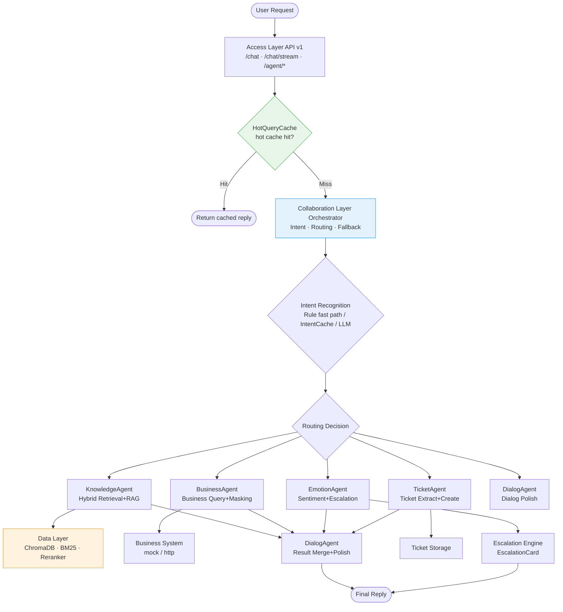
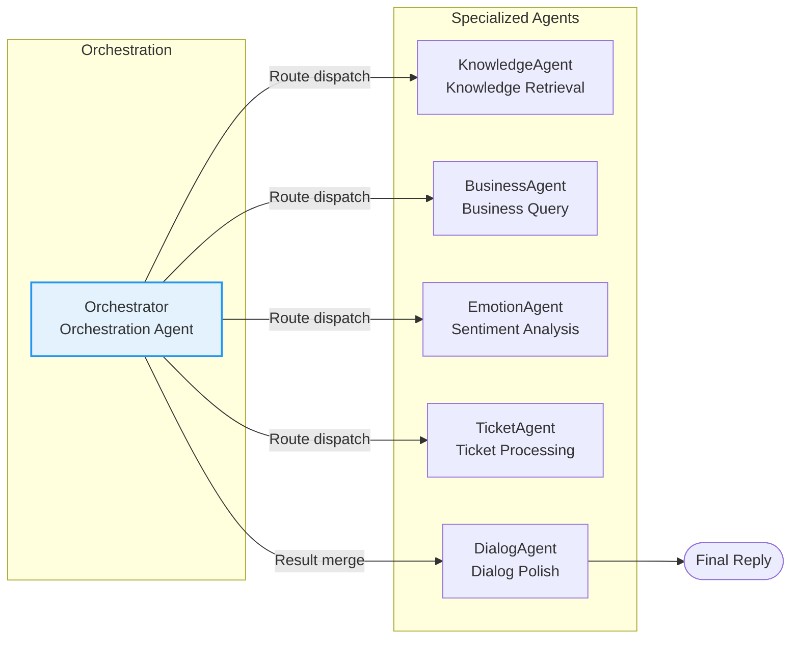
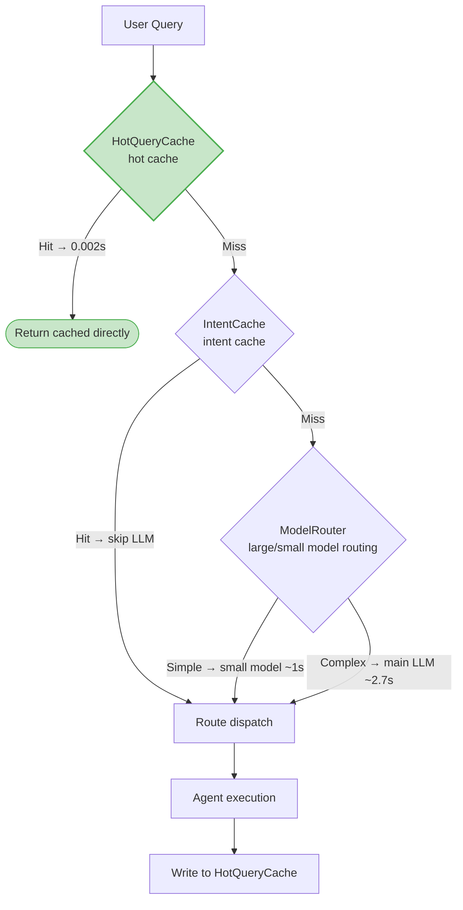

# :material-sitemap: Architecture

The system is built on dual engines of "Multi-Agent Collaboration + RAG Knowledge Enhancement", adopting a three-layer architecture and a "1+5" multi-Agent collaboration design, with built-in fallback at each layer to ensure availability.

---

## :material-image: System Overview



---

## :material-layers-triple: Three-Layer Architecture

The system is divided into access layer, collaboration layer, and data layer, each with clear responsibilities and one-way dependencies.

### Access Layer (API v1)

Located in `app/api/v1/`, responsible for HTTP access, authentication, request validation, and response wrapping.

| Module | Endpoints | Responsibility |
|--------|-----------|----------------|
| `chat.py` | `/chat`, `/chat/stream` | Sync chat and SSE streaming chat |
| `agent.py` | `/agent/sessions/*` (8 endpoints) | Agent assist workbench |
| `knowledge.py` | `/knowledge/ingest`, `/knowledge/stats` | Knowledge base management |
| `evaluation.py` | `/evaluation/run` | Retrieval evaluation (Recall/Hit/MRR/hallucination rate) |
| `performance.py` | `/performance/metrics`, `/performance/cache/invalidate` | Performance monitoring and cache cleanup |
| `observability.py` | `/observability/health` | Component health check |
| `operations.py` | `/operations/dashboard` | Operations dashboard and canary release |

!!! tip "Async-first"
    All endpoints are `async def`. IO-intensive scenarios (LLM calls, vector retrieval, business API) do not block the event loop, allowing a single process to handle high concurrency.

### Collaboration Layer (agents)

Located in `app/agents/`, the core of multi-Agent collaboration, responsible for intent recognition, task routing, Agent execution, and result merging.

- `orchestrator.py`: Orchestration Agent, intent recognition and routing dispatch
- `graph.py`: LangGraph state machine orchestration (degrades to synchronous orchestrator)
- `knowledge_agent.py`: Knowledge Retrieval Agent (hybrid retrieval + reranking + summary)
- `business_agent.py`: Business Query Agent
- `emotion_agent.py`: Sentiment Analysis Agent
- `ticket_agent.py`: Ticket Processing Agent
- `dialog_agent.py`: Dialog Polish Agent
- `llm_client.py`: LLM client (incl. `_MockLLM` fallback)

### Data Layer (knowledge + core)

Located in `app/knowledge/` and `app/core/`, provides knowledge retrieval, persistence, and infrastructure.

| Module | Responsibility |
|--------|----------------|
| `hybrid_retriever.py` | Hybrid retrieval (vector + BM25 + RRF fusion) |
| `reranker.py` | CrossEncoder reranking (degrades to cosine) |
| `vectorstore.py` | ChromaDB wrapper |
| `embeddings.py` | BGE embedding service (degrades to hash fallback) |
| `bm25.py` | BM25 keyword retrieval |
| `query_rewriter.py` | Query rewriting |
| `pipeline.py` | Document ingestion pipeline |
| `performance.py` | HotQueryCache / ModelRouter / IntentCache |
| `circuit_breaker.py` | Circuit breaker fallback |
| `langfuse_client.py` | Langfuse tracing (degrades to no-op) |
| `session.py` | Session management |

---

## :material-robot-outline: Multi-Agent "1+5" Architecture

The system uses 1 orchestration Agent to coordinate 5 specialized Agents, each with its own responsibility and no overlap.



### Orchestrator (Orchestration Agent)

:material-brain: The "brain" of the multi-Agent architecture, responsible for:

- **Intent recognition**: Three-level mechanism (rule fast path → IntentCache → LLM), see [Multi-Agent Collaboration](architecture/agents.md)
- **Routing dispatch**: Routes the query to the corresponding specialized Agent based on intent
- **Sentiment priority**: When sentiment sensitivity or agitation is detected, forcibly switches to sentiment handling
- **Fallback handling**: unknown intent returns a guidance message; 2 consecutive unresolved turns escalate to human

### KnowledgeAgent (Knowledge Retrieval Agent)

:material-book-search: The core of knowledge Q&A, orchestrates the full RAG chain:

- Query rewriting → hybrid retrieval (vector + BM25 + RRF) → Reranker reranking → threshold filtering
- Optional LLM summary generation (`generate_summary=True`)
- Returns a fallback reply when retrieval is empty, avoiding meaningless LLM calls
- See [RAG Retrieval Pipeline](architecture/rag.md)

### BusinessAgent (Business Query Agent)

:material-domain: Integrates with the business system to query orders/members/returns/accounts:

- Supports both `mock` (in-memory mock) and `http` (real business system) modes
- **Phone number masking**: phone numbers in results are auto-masked (middle 4 digits replaced with `****`)
- **Write operation confirmation**: write operations like refunds/returns require user confirmation before execution
- **Failure fallback**: when the business API is unavailable, degrades to the mock business system

### EmotionAgent (Sentiment Analysis Agent)

:material-emotion: Recognizes user sentiment and triggers corresponding handling:

- Keyword sentiment scoring: profanity +5, complaint words +3
- When sentiment is agitated (score > 4), prioritizes sentiment handling: soothe first, then resolve
- Sentiment-sensitive intent directly triggers escalation to human, avoiding escalation of conflict

### TicketAgent (Ticket Processing Agent)

:material-ticket: Extracts ticket information from user conversations and ingests it:

- Recognizes ticket intents like returns/refunds/complaints/after-sales
- Extracts key info (order number, problem description) to create a ticket
- Returns an acceptance script after ticket ingestion

### DialogAgent (Dialog Polish Agent)

:material-format-align-left: Unifies the style and annotates sources for the final reply:

- Merges the raw results of each Agent into a coherent reply
- Annotates citation sources (`Source: faq.md page 3`)
- **Performance optimization**: chitchat/ticket/business_query intents skip LLM polishing and use the raw reply directly

---

## :material-shield-check: Key Design Principles

### 1. Fallback-First

Each layer has fallback guarantees, ensuring the system remains available under any single-point failure:

| Layer | Component | Fallback Target |
|-------|-----------|-----------------|
| Access | API auth | `API_KEY` empty → no-auth mode |
| Collaboration | LangGraph | Unavailable → synchronous orchestrator `_SynchOrchestrator` |
| Collaboration | LLM | Unavailable → `_MockLLM` assembled reply |
| Collaboration | Real LLM call | Failure → ModelRouter falls back to default model retry |
| Data | BGE embedding | Load failure → hash fallback vectors |
| Data | Reranker | Load failure → cosine similarity reranking |
| Data | Redis | Unreachable → in-memory queue |
| Data | Business API | Failure → mock business system |
| Observability | Langfuse | Not configured → no-op, no impact on main path |

> See [Fallback Strategy](architecture/fallback.md) for details.

### 2. Async-First

All middleware and API endpoints are `async/await`. IO-intensive operations do not block the event loop:

- LLM calls, vector retrieval, and business API calls all go async or via thread pool
- Complex problems with multiple subtasks run in parallel via `ThreadPoolExecutor` (4 workers)
- SSE streaming responses return token-by-token with low first-token latency

### 3. Cache-First

The system is designed with multi-layer caching to reduce latency and LLM call cost:

| Cache | Location | Hit Effect |
|-------|----------|------------|
| HotQueryCache | `run_graph` entry/exit | Knowledge Q&A cache hit drops to **0.002s**, skipping all LLM calls |
| IntentCache | Intent recognition stage | First token from 2.7s down to **~800ms** |
| ModelRouter | Intent recognition stage | Simple queries route to small model, first token down to **~1s** |

---

## :material-speedometer: Three-Layer Performance Optimization Combo

The `HotQueryCache + ModelRouter + IntentCache` three-layer combo is the core of system performance optimization:



!!! success "Measured performance"
    
    | Metric | Target | Actual | Pass |
    |--------|--------|--------|------|
    | Recall@5 | ≥ 0.85 | **1.0** | :material-check: |
    | Hit Rate | ≥ 0.90 | **0.9333** | :material-check: |
    | Hallucination Rate | ≤ 0.10 | **0.0** | :material-check: |
    | Independent Resolution Rate | ≥ 60% | **80%** | :material-check: |
    | Avg Response Time | ≤ 3s | **2.27s** | :material-check: |
    | Hot Cache Hit | — | **0.002s** | :material-check: |

---

## :material-folder-outline: Project Structure Overview

```
app/
├── api/v1/              # Access Layer: REST API endpoints
│   ├── chat.py          # Chat endpoint (sync + SSE streaming)
│   ├── agent.py         # Agent assist endpoints (8)
│   ├── knowledge.py     # Knowledge base management
│   ├── evaluation.py    # Retrieval evaluation
│   ├── performance.py   # Performance monitoring
│   ├── observability.py # Observability
│   └── operations.py    # Operations dashboard
├── agents/              # Collaboration Layer
│   ├── orchestrator.py  # Orchestration Agent
│   ├── graph.py         # LangGraph state machine
│   ├── knowledge_agent.py    # Knowledge Retrieval Agent
│   ├── business_agent.py     # Business Query Agent
│   ├── emotion_agent.py      # Sentiment Analysis Agent
│   ├── ticket_agent.py       # Ticket Processing Agent
│   ├── dialog_agent.py       # Dialog Polish Agent
│   └── llm_client.py    # LLM client (mock fallback)
├── core/                # Core infrastructure
│   ├── config.py        # Configuration management
│   ├── session.py       # Session management
│   ├── performance.py   # HotQueryCache / ModelRouter / IntentCache
│   ├── circuit_breaker.py   # Circuit breaker fallback
│   └── langfuse_client.py   # Langfuse tracing
├── knowledge/           # Data Layer
│   ├── hybrid_retriever.py  # Hybrid retrieval
│   ├── reranker.py      # Reranking
│   ├── vectorstore.py   # ChromaDB
│   ├── embeddings.py    # BGE embedding
│   ├── bm25.py          # BM25 retrieval
│   └── pipeline.py      # Document ingestion pipeline
└── schemas/             # Pydantic data models
```

---

## :material-arrow-right: Further Reading

| Topic | Link |
|-------|------|
| Multi-Agent collaboration (LangGraph state machine) | [Multi-Agent Collaboration](architecture/agents.md) |
| RAG retrieval pipeline (hybrid retrieval + reranking) | [RAG Retrieval Pipeline](architecture/rag.md) |
| Fallback and fault tolerance (7-layer fallback matrix) | [Fallback Strategy](architecture/fallback.md) |
| All configuration options | [Configuration Guide](configuration.md) |
