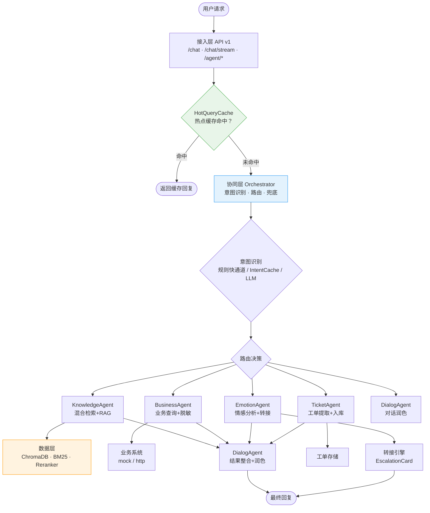
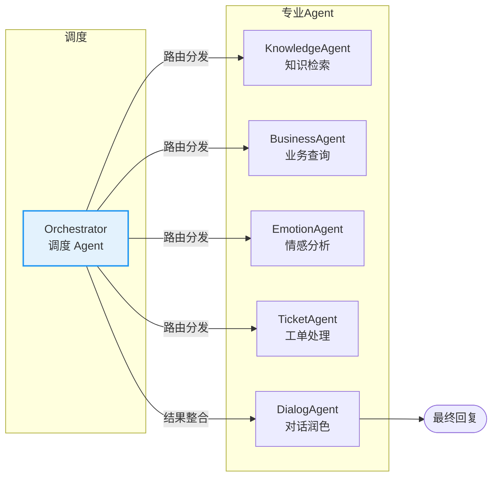
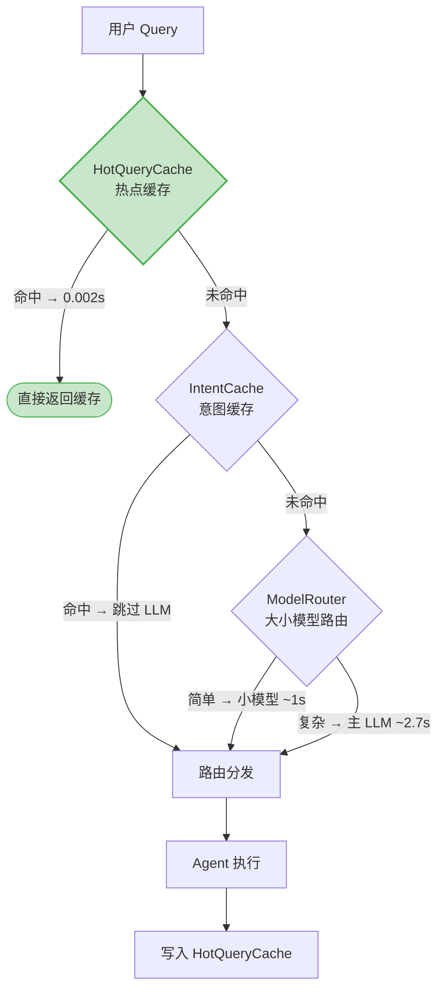

# :material-sitemap: 总体架构

系统基于「多 Agent 分工协作 + RAG 知识增强」双轮驱动，采用三层架构与「1+5」多 Agent 协同设计，在每一层都内置降级保障可用性。

---

## :material-image: 系统全景图



---

## :material-layers-triple: 三层架构

系统分为接入层、协同层、数据层三层，各层职责清晰、单向依赖。

### 接入层（API v1）

位于 `app/api/v1/`，负责 HTTP 接入、鉴权、请求校验与响应封装。

| 模块 | 端点 | 职责 |
|------|------|------|
| `chat.py` | `/chat`、`/chat/stream` | 同步对话与 SSE 流式对话 |
| `agent.py` | `/agent/sessions/*`（8 个端点） | 坐席辅助工作台 |
| `knowledge.py` | `/knowledge/ingest`、`/knowledge/stats` | 知识库管理 |
| `evaluation.py` | `/evaluation/run` | 检索评估（Recall/Hit/MRR/幻觉率） |
| `performance.py` | `/performance/metrics`、`/performance/cache/invalidate` | 性能监控与缓存清理 |
| `observability.py` | `/observability/health` | 组件健康检查 |
| `operations.py` | `/operations/dashboard` | 运营看板与灰度发布 |

!!! tip "异步优先"
    所有端点均为 `async def`，IO 密集场景（LLM 调用、向量检索、业务 API）不阻塞事件循环，单进程可承载高并发。

### 协同层（agents）

位于 `app/agents/`，是多 Agent 协同的核心，负责意图识别、任务路由、Agent 执行与结果整合。

- `orchestrator.py`：调度 Agent，意图识别与路由分发
- `graph.py`：LangGraph 状态机编排（降级同步编排器）
- `knowledge_agent.py`：知识检索 Agent（混合检索+重排序+摘要）
- `business_agent.py`：业务查询 Agent
- `emotion_agent.py`：情感分析 Agent
- `ticket_agent.py`：工单处理 Agent
- `dialog_agent.py`：对话润色 Agent
- `llm_client.py`：LLM 客户端（含 `_MockLLM` 兜底）

### 数据层（knowledge + core）

位于 `app/knowledge/` 与 `app/core/`，提供知识检索、持久化与基础设施。

| 模块 | 职责 |
|------|------|
| `hybrid_retriever.py` | 混合检索（向量+BM25+RRF 融合） |
| `reranker.py` | CrossEncoder 重排序（降级 cosine） |
| `vectorstore.py` | ChromaDB 封装 |
| `embeddings.py` | BGE 嵌入服务（降级 hash fallback） |
| `bm25.py` | BM25 关键词检索 |
| `query_rewriter.py` | Query 改写 |
| `pipeline.py` | 文档入库流水线 |
| `performance.py` | HotQueryCache / ModelRouter / IntentCache |
| `circuit_breaker.py` | 熔断降级 |
| `langfuse_client.py` | Langfuse 链路追踪（降级 no-op） |
| `session.py` | 会话管理 |

---

## :material-robot-outline: 多 Agent「1+5」架构

系统采用 1 个调度 Agent 协调 5 个专业 Agent 的协同架构，各司其职、互不越界。



### Orchestrator（调度 Agent）

:material-brain: 多 Agent 架构的「大脑」，负责：

- **意图识别**：三级识别机制（规则快通道 → IntentCache → LLM），见 [多 Agent 协同](architecture/agents.md)
- **路由分发**：根据意图将 query 路由到对应专业 Agent
- **情绪优先**：检测到情绪敏感或情绪激动时强制改走情绪处理
- **兜底处理**：unknown 意图返回引导语，连续 2 轮未解决转人工

### KnowledgeAgent（知识检索 Agent）

:material-book-search: 知识问答核心，编排完整 RAG 链路：

- Query 改写 → 混合检索（向量+BM25+RRF）→ Reranker 重排序 → 阈值过滤
- 可选 LLM 摘要生成（`generate_summary=True`）
- 检索为空时返回兜底回复，避免无意义 LLM 调用
- 详见 [RAG 检索流程](architecture/rag.md)

### BusinessAgent（业务查询 Agent）

:material-domain: 对接业务系统查询订单/会员/退换货/账户信息：

- 支持 `mock`（内存 mock）与 `http`（真实业务系统）两种模式
- **手机号脱敏**：返回结果中手机号自动脱敏（中间 4 位用 `****` 替换）
- **写操作二次确认**：退款/退货等写操作需用户确认后才执行
- **失败降级**：业务 API 不可用时降级到 mock 业务系统

### EmotionAgent（情感分析 Agent）

:material-emotion: 识别用户情绪并触发相应处理：

- 关键词情绪评分：脏话 +5、投诉词 +3
- 情绪激动（score > 4）时优先走情绪处理，先安抚再解决
- 情绪敏感意图直接触发转人工，避免激化矛盾

### TicketAgent（工单处理 Agent）

:material-ticket: 从用户对话中提取工单信息并入库：

- 识别退货/退款/投诉/售后等工单意图
- 提取关键信息（订单号、问题描述）生成工单
- 工单入库后返回受理话术

### DialogAgent（对话润色 Agent）

:material-format-align-left: 对最终回复做风格统一与来源标注：

- 把各 Agent 的原始结果整合为连贯回复
- 标注引用来源（`来源：faq.md 第3页`）
- **性能优化**：chitchat/ticket/business_query 意图跳过 LLM 润色，直接使用原始回复

---

## :material-shield-check: 关键设计原则

### 1. 降级优先

每一层都有降级保障，确保系统在任何单点故障下仍可用：

| 层级 | 组件 | 降级目标 |
|------|------|----------|
| 接入层 | API 鉴权 | `API_KEY` 留空 → 免鉴权模式 |
| 协同层 | LangGraph | 不可用 → 同步编排器 `_SynchOrchestrator` |
| 协同层 | LLM | 不可用 → `_MockLLM` 拼装回复 |
| 协同层 | 真实 LLM 调用 | 失败 → ModelRouter 回退默认模型重试 |
| 数据层 | BGE 嵌入 | 加载失败 → hash fallback 向量 |
| 数据层 | Reranker | 加载失败 → cosine 相似度重排序 |
| 数据层 | Redis | 不可达 → 内存队列 |
| 数据层 | 业务 API | 失败 → mock 业务系统 |
| 可观测 | Langfuse | 未配置 → no-op 不影响主链路 |

> 详见 [降级策略](architecture/fallback.md)。

### 2. 异步优先

所有中间件与 API 端点均为 `async/await`，IO 密集操作不阻塞事件循环：

- LLM 调用、向量检索、业务 API 调用均走异步或线程池
- 复杂问题多子任务通过 `ThreadPoolExecutor`（4 workers）并行执行
- SSE 流式响应逐 token 返回，首字延迟低

### 3. 缓存优先

系统设计了多层缓存降低延迟与 LLM 调用成本：

| 缓存 | 位置 | 命中效果 |
|------|------|----------|
| HotQueryCache | `run_graph` 入出口 | 知识问答命中缓存降至 **0.002s**，跳过全部 LLM 调用 |
| IntentCache | 意图识别阶段 | 首 Token 从 2.7s 降到 **~800ms** |
| ModelRouter | 意图识别阶段 | 简单查询路由小模型，首 Token 降到 **~1s** |

---

## :material-speedometer: 性能优化三层组合

`HotQueryCache + ModelRouter + IntentCache` 三层组合是系统性能优化的核心：



!!! success "实测性能"
    
    | 指标 | 目标 | 实测 | 达标 |
    |------|------|------|------|
    | Recall@5 | ≥ 0.85 | **1.0** | :material-check: |
    | Hit Rate | ≥ 0.90 | **0.9333** | :material-check: |
    | 幻觉率 | ≤ 0.10 | **0.0** | :material-check: |
    | 独立解决率 | ≥ 60% | **80%** | :material-check: |
    | 平均响应时间 | ≤ 3s | **2.27s** | :material-check: |
    | 热点缓存命中 | — | **0.002s** | :material-check: |

---

## :material-folder-outline: 项目结构概览

```
app/
├── api/v1/              # 接入层：REST API 端点
│   ├── chat.py          # 对话端点（同步 + SSE 流式）
│   ├── agent.py         # 坐席辅助端点（8 个）
│   ├── knowledge.py     # 知识库管理
│   ├── evaluation.py    # 检索评估
│   ├── performance.py   # 性能监控
│   ├── observability.py # 可观测性
│   └── operations.py    # 运营看板
├── agents/              # 协同层
│   ├── orchestrator.py  # 调度 Agent
│   ├── graph.py         # LangGraph 状态机
│   ├── knowledge_agent.py    # 知识检索 Agent
│   ├── business_agent.py     # 业务查询 Agent
│   ├── emotion_agent.py      # 情感分析 Agent
│   ├── ticket_agent.py       # 工单处理 Agent
│   ├── dialog_agent.py       # 对话润色 Agent
│   └── llm_client.py    # LLM 客户端（mock 兜底）
├── core/                # 核心基础设施
│   ├── config.py        # 配置管理
│   ├── session.py       # 会话管理
│   ├── performance.py   # HotQueryCache / ModelRouter / IntentCache
│   ├── circuit_breaker.py   # 熔断降级
│   └── langfuse_client.py   # Langfuse 追踪
├── knowledge/           # 数据层
│   ├── hybrid_retriever.py  # 混合检索
│   ├── reranker.py      # 重排序
│   ├── vectorstore.py   # ChromaDB
│   ├── embeddings.py    # BGE 嵌入
│   ├── bm25.py          # BM25 检索
│   └── pipeline.py      # 文档入库流水线
└── schemas/             # Pydantic 数据模型
```

---

## :material-arrow-right: 深入阅读

| 主题 | 链接 |
|------|------|
| 多 Agent 协同机制（LangGraph 状态机） | [多 Agent 协同](architecture/agents.md) |
| RAG 检索流程（混合检索+重排序） | [RAG 检索流程](architecture/rag.md) |
| 降级容错策略（七层降级矩阵） | [降级策略](architecture/fallback.md) |
| 全部配置项 | [配置说明](configuration.md) |
