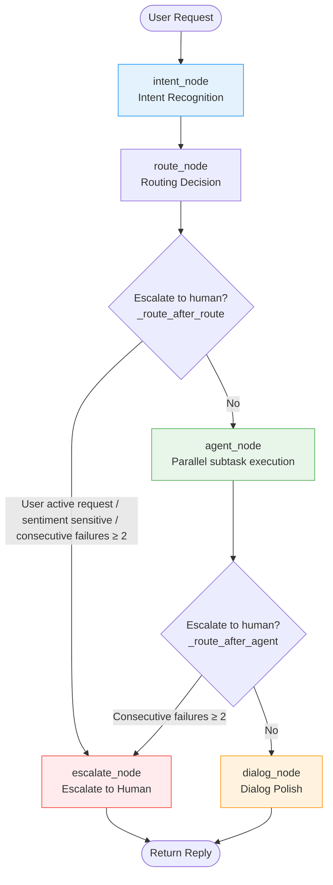
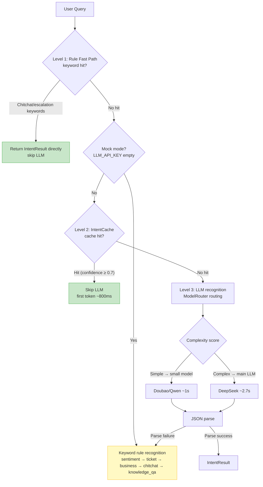
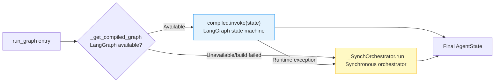

# :material-robot-group: Multi-Agent Collaboration

The system uses a LangGraph state machine to orchestrate the multi-Agent collaboration flow, assembling "intent recognition → routing → Agent execution → dialog polish" into a directed graph. When LangGraph is unavailable, it auto-degrades to a synchronous orchestrator with fully consistent behavior.

---

## :material-state-machine: LangGraph State Machine

### Node Flow Diagram



### Node Definitions

| Node | Function | Responsibility |
|------|----------|----------------|
| `intent` | `intent_node` | Intent recognition + sentiment scoring + intent switch detection |
| `route` | `route_node` | Pure decision anchor, does not modify state, branches by conditional edge |
| `agent` | `agent_node` | Parallel execution of subtasks, updates failure count |
| `dialog` | `dialog_node` | Result merging + LLM polish (skipped for non-knowledge Q&A) |
| `escalate` | `escalate_node` | Mark escalation to human + generate EscalationCard |

### Transition Conditions

The system uses two conditional edges to decide the flow:

=== "_route_after_route (after route)"

    ```python
    # Escalation trigger conditions (by priority)
    # 1. User actively requests escalation → highest priority, ignores other conditions
    if _is_user_request_human(message):
        return "escalate"
    # 2. Sentiment-sensitive intent → escalate directly, to avoid escalating conflict
    if intent == "emotion_sensitive":
        return "escalate"
    # 3. Consecutive failures reach threshold (≥2) → escalate
    if failed_attempts >= ESCALATE_FAILED_THRESHOLD:
        return "escalate"
    return "agent"
    ```

=== "_route_after_agent (after agent)"

    ```python
    # If accumulated failures reach threshold, escalate to human
    if failed_attempts >= ESCALATE_FAILED_THRESHOLD:
        return "escalate"
    # Otherwise proceed to dialog polish
    return "dialog"
    ```

!!! info "ESCALATE_FAILED_THRESHOLD = 2"
    Escalation to human triggers after 2 consecutive unresolved turns, to avoid the user looping in automated replies. The threshold is defined in `orchestrator.py` and can be adjusted as needed.

---

## :material-database: AgentState Structure

`AgentState` is the state object shared between LangGraph nodes, using `TypedDict(total=False)` to make all fields optional, allowing each node to update locally.

```python
class AgentState(TypedDict, total=False):
    # Session and user identifiers
    session_id: Optional[str]
    user_id: Optional[str]
    # User input for this turn
    message: str
    # Recognized intent (Intent enum string)
    intent: str
    # Decomposed subtask list
    sub_tasks: List[Dict[str, Any]]
    # Sentiment score (0-1, lower is more negative)
    emotion_score: float
    # Orchestration state counters
    turn_count: int
    failed_attempts: int
    # Conversation history, for DialogAgent to keep context
    history: List[Dict[str, Any]]
    # Raw output of each agent, indexed by agent_name
    raw_results: Dict[str, Any]
    # Final reply to the user
    final_reply: str
    # Citation source list
    sources: List[str]
    # Whether to escalate to human
    escalate_to_human: bool
    # Escalation context card (dict form, easy to serialize)
    escalation_card: Optional[Dict[str, Any]]
    # Monitoring trace ID
    trace_id: Optional[str]
    # Layered summary context text (reduces token consumption)
    layered_context_text: Optional[str]
    # Intent switch detection result
    intent_switch: Optional[Dict[str, Any]]
```

??? tip "Why total=False?"
    `total=False` makes all fields optional, so each node only needs to update the fields it is responsible for, without constructing a full state. The entry `run_graph` initializes core fields, and nodes supplement as needed. When tests call a single node function directly, they also do not need to construct all fields.

---

## :material-brain: Three-Level Intent Recognition

The Orchestrator's intent recognition uses a three-level mechanism, degrading level-by-level to ensure availability and performance:



### Level 1: Rule Fast Path

High-frequency simple intents match keywords directly, skipping LLM calls:

```python
# Chitchat keywords: hello/thanks/hi/are you there/goodbye/good morning/good night
if any(w in q for w in CHITCHAT_KEYWORDS):
    return IntentResult(intent=Intent.CHITCHAT, confidence=0.95, ...)

# Escalation keywords: escalate to human/human agent/contact human/find human
if any(w in q for w in ("转人工", "人工客服", "联系人工", "找人工")):
    return IntentResult(intent=Intent.TICKET, confidence=0.9, ...)
```

### Level 2: IntentCache

In LLM mode, check IntentCache first; on hit, skip the LLM call:

```python
# Intent is stable (the intent of the same query usually does not change); reuse within 30-min TTL is safe
# Only cache high-confidence results with confidence >= 0.7, to avoid reusing low-quality intents
cached_intent = get_intent_cache().get(query)
if cached_intent is not None:
    return cached_intent  # First token from 2.7s down to ~800ms
```

### Level 3: LLM Recognition + ModelRouter

On cache miss, go through the LLM, routed by ModelRouter by complexity:

```python
# Simple query → small model (Doubao/Qwen-turbo), first token ~1s
# Complex query → main LLM (DeepSeek), to preserve quality
if get_small_llm_client() is not None:
    raw = get_model_router().chat_with_routing(
        messages=messages, query=query, temperature=0.0,
        name="intent_recognition", ...
    )
else:
    # When small model is not configured, use main LLM directly, to avoid dual-Provider model name incompatibility
    raw = self.llm_client.chat(messages, ...)
```

### Fallback: Keyword Rules

When the LLM returns non-JSON or missing fields, degrade to keyword rules:

```python
# Match by priority: sentiment → ticket → business → chitchat → knowledge_qa
if any(word in query for word in OFFENSIVE_KEYWORDS):
    return IntentResult(intent=Intent.EMOTION_SENSITIVE, ...)
if any(word in query for word in TICKET_KEYWORDS):  # return/refund/complaint
    return IntentResult(intent=Intent.BUSINESS_QUERY, ...)  # also generates a ticket subtask
# ... default to knowledge_qa
```

!!! tip "Dual subtasks for returns/refunds"
    When ticket keywords (return/refund/exchange/complaint/after-sales) are hit, it is also treated as a business query, generating both `business_query` + `ticket` subtasks to run in parallel, querying business status while creating a ticket.

---

## :material-run-fast: agent_node Parallel Execution

Complex problems (multiple subtasks) are executed in parallel via `ThreadPoolExecutor`, significantly reducing total latency in IO-intensive scenarios:

```python
# Thread pool size for parallel subtask execution on complex problems
# 4 balances concurrency and resource usage; can be increased for IO-intensive scenarios
_AGENT_PARALLEL_WORKERS = 4

def agent_node(state: AgentState) -> AgentState:
    sub_tasks = state.get("sub_tasks", [])
    tasks = [(task["agent_name"], task["input"]) for task in sub_tasks]

    if len(tasks) <= 1:
        # Single subtask runs synchronously, avoiding thread pool overhead
        for agent_name, task_input in tasks:
            result = _dispatch_to_agent(agent_name, task_input, state)
            raw_results[agent_name] = result
    else:
        # Multiple subtasks run in parallel
        with ThreadPoolExecutor(max_workers=_AGENT_PARALLEL_WORKERS) as executor:
            futures = {
                executor.submit(_dispatch_to_agent, name, inp, state): name
                for name, inp in tasks
            }
            for future in futures:
                agent_name = futures[future]
                try:
                    result = future.result()
                except Exception as exc:
                    # A single subtask failure does not affect others; overall remains available
                    result = {"result": "This capability is under development and cannot be processed yet.", "sources": []}
                raw_results[agent_name] = result
```

!!! note "Failure count and escalation"
    After `agent_node` executes, `failed_attempts` is updated based on results:
    
    - Any subtask returns a placeholder message ("under development") or a miss marker ("[knowledge base miss]") → treated as unresolved, `failed_attempts += 1`
    - All subtasks return normally → treated as resolved, `failed_attempts = 0`
    - Accumulated `failed_attempts >= 2` → next conditional edge triggers escalation

### Agent Executor Mapping

```python
_AGENT_EXECUTORS = {
    "knowledge_qa": _execute_knowledge,      # KnowledgeAgent hybrid retrieval + RAG
    "business_query": _execute_business,      # BusinessAgent business query
    "emotion_sensitive": _execute_emotion,    # EmotionAgent sentiment soothing
    "ticket": _execute_ticket,                # TicketAgent ticket processing
    "chitchat": _execute_chitchat,            # chitchat response
}
```

---

## :material-swap-horizontal: Intent Switch Detection and Context Management

Before intent recognition, the system first does "intent switch detection", to prevent old-topic slots from polluting the new intent:

```python
def intent_node(state: AgentState) -> AgentState:
    # Pre-step: intent switch detection
    if session_id:
        session = session_manager.get_session(session_id) or {}
        current_intent = session.get("current_intent")
        if current_intent:  # skip on first turn
            detector = get_intent_detector()
            switch_result = detector.detect_switch(message, session_id, current_intent)
            if switch_result.switched:
                # Switched: reset slots, keep history for backtracking
                session_manager.reset_slots(session_id)
```

**Layered summary context**: At the `run_graph` entry, `ContextManager` generates a refined context text, injected by `dialog_node` into `DialogContext.layered_summary`, replacing full history with the refined context to reduce token consumption.

---

## :material-sync-off: Synchronous Fallback Path

When LangGraph is unavailable or build fails, the system degrades to the `_SynchOrchestrator` synchronous orchestrator:



### _SynchOrchestrator Implementation

The synchronous orchestrator **reuses the same node functions**, calling them in order, with behavior fully consistent with the LangGraph version:

```python
class _SynchOrchestrator:
    """Synchronous orchestrator: fallback when LangGraph is unavailable.

    Directly reuses graph node functions (intent_node / agent_node / dialog_node / escalate_node),
    calling them in order. Behavior is fully consistent with the LangGraph version, just without
    graph-structure scheduling.
    """

    def run(self, initial_state: AgentState) -> AgentState:
        state = initial_state
        state = intent_node(state)          # 1. Intent recognition
        state = route_node(state)           # 2. Routing decision
        next_node = _route_after_route(state)
        if next_node == "escalate":         # 3. Escalate or execute agent
            return escalate_node(state)
        state = agent_node(state)           # 4. Parallel subtask execution
        next_node = _route_after_agent(state)
        if next_node == "escalate":         # 5. Escalate if failures reach threshold
            return escalate_node(state)
        return dialog_node(state)           # 6. Dialog polish
```

!!! success "Seamless degradation"
    The synchronous orchestrator reuses the exact same node functions and conditional logic. `failed_attempts` accumulation, escalation triggers, and dialog polish behavior are consistent with the LangGraph version. Users and callers perceive no difference; only the log records `LangGraph build failed, degrading to synchronous orchestrator`.

### Fallback Trigger Timing

| Timing | Behavior |
|--------|----------|
| LangGraph package not installed | `_get_compiled_graph()` returns `None`, goes directly to synchronous orchestration |
| LangGraph build exception | Records `_graph_init_error`, no retry afterward, goes to synchronous orchestration |
| LangGraph runtime exception | Degrades to synchronous orchestration, ensuring this request is available |

!!! tip "Retry mechanism"
    After LangGraph build fails, it does not retry on every request (to avoid repeated exception overhead). To retry, call `reset_graph()` to clear the cache, and the next `run_graph` will rebuild. This is commonly used in tests after switching configs.

---

## :material-arrow-right: Related Documentation

| Topic | Link |
|-------|------|
| RAG retrieval pipeline (inside KnowledgeAgent) | [RAG Retrieval Pipeline](rag.md) |
| Fallback strategy (incl. LangGraph fallback) | [Fallback Strategy](fallback.md) |
| Architecture | [Architecture](../architecture.md) |
