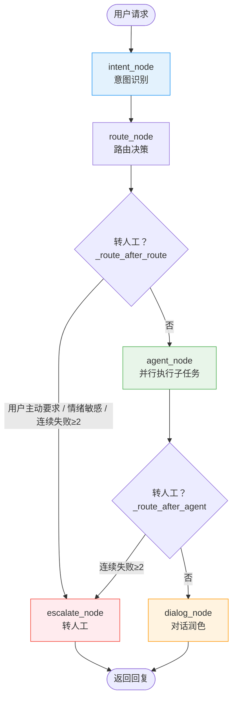
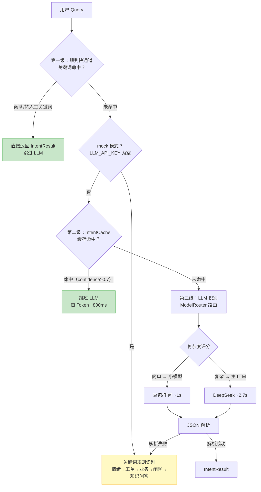
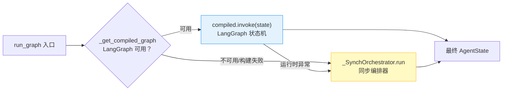

# :material-robot-group: 多 Agent 协同

系统基于 LangGraph 状态机编排多 Agent 协同流程，将「意图识别 → 路由 → Agent 执行 → 对话润色」组装成一张有向图。LangGraph 不可用时自动降级到同步编排器，行为完全一致。

---

## :material-state-machine: LangGraph 状态机

### 节点流程图



### 节点定义

| 节点 | 函数 | 职责 |
|------|------|------|
| `intent` | `intent_node` | 意图识别 + 情绪评分 + 意图切换检测 |
| `route` | `route_node` | 纯决策锚点，不修改 state，由条件边分流 |
| `agent` | `agent_node` | 并行执行各子任务，更新失败计数 |
| `dialog` | `dialog_node` | 结果整合 + LLM 润色（非知识问答跳过润色） |
| `escalate` | `escalate_node` | 标记转人工 + 生成 EscalationCard |

### 流转条件

系统通过两个条件边（conditional edge）决定走向：

=== "_route_after_route（route 之后）"

    ```python
    # 转接触发条件（按优先级）
    # 1. 用户主动要求转人工 → 最高优先级，无视其他条件
    if _is_user_request_human(message):
        return "escalate"
    # 2. 情绪敏感意图 → 直接转人工，避免激化矛盾
    if intent == "emotion_sensitive":
        return "escalate"
    # 3. 连续失败达阈值（≥2）→ 转人工
    if failed_attempts >= ESCALATE_FAILED_THRESHOLD:
        return "escalate"
    return "agent"
    ```

=== "_route_after_agent（agent 之后）"

    ```python
    # 累计失败达阈值则转人工
    if failed_attempts >= ESCALATE_FAILED_THRESHOLD:
        return "escalate"
    # 其余情况进入对话润色
    return "dialog"
    ```

!!! info "ESCALATE_FAILED_THRESHOLD = 2"
    连续 2 轮未解决用户问题即触发转人工，避免用户在自动回复里反复兜圈子。阈值定义在 `orchestrator.py`，可按需调整。

---

## :material-database: AgentState 状态结构

`AgentState` 是 LangGraph 节点间共享的状态对象，使用 `TypedDict(total=False)` 让所有字段可选，便于各节点局部更新。

```python
class AgentState(TypedDict, total=False):
    # 会话与用户标识
    session_id: Optional[str]
    user_id: Optional[str]
    # 用户本轮输入
    message: str
    # 识别到的意图（Intent 枚举字符串）
    intent: str
    # 拆解出的子任务列表
    sub_tasks: List[Dict[str, Any]]
    # 情绪分数（0-1，越低越负面）
    emotion_score: float
    # 调度状态计数
    turn_count: int
    failed_attempts: int
    # 对话历史，供 DialogAgent 保持上下文
    history: List[Dict[str, Any]]
    # 各 agent 的原始输出，按 agent_name 索引
    raw_results: Dict[str, Any]
    # 最终给用户的回复
    final_reply: str
    # 引用来源列表
    sources: List[str]
    # 是否转人工
    escalate_to_human: bool
    # 转接上下文卡片（dict 形式，便于序列化）
    escalation_card: Optional[Dict[str, Any]]
    # 监控追踪 ID
    trace_id: Optional[str]
    # 分层摘要上下文文本（降低 token 消耗）
    layered_context_text: Optional[str]
    # 意图切换检测结果
    intent_switch: Optional[Dict[str, Any]]
```

??? tip "为什么用 total=False？"
    `total=False` 让所有字段可选，这样每个节点只需更新自己负责的字段，不必构造完整 state。入口 `run_graph` 初始化核心字段，节点按需补充。测试中直接调用单个节点函数时也无需构造全部字段。

---

## :material-brain: 意图识别三级机制

Orchestrator 的意图识别采用三级机制，逐级降级保证可用性与性能：



### 第一级：规则快通道

高频简单意图直接关键词匹配，跳过 LLM 调用：

```python
# 闲聊关键词：你好/您好/谢谢/嗨/在吗/再见/早安/晚安
if any(w in q for w in CHITCHAT_KEYWORDS):
    return IntentResult(intent=Intent.CHITCHAT, confidence=0.95, ...)

# 转人工关键词：转人工/人工客服/联系人工/找人工
if any(w in q for w in ("转人工", "人工客服", "联系人工", "找人工")):
    return IntentResult(intent=Intent.TICKET, confidence=0.9, ...)
```

### 第二级：IntentCache

LLM 模式下优先查 IntentCache，命中跳过 LLM 调用：

```python
# 意图稳定（同一 query 的意图通常不变），TTL 30 分钟内复用安全
# 仅缓存 confidence >= 0.7 的高置信结果，避免低质意图被复用
cached_intent = get_intent_cache().get(query)
if cached_intent is not None:
    return cached_intent  # 首 Token 从 2.7s 降到 ~800ms
```

### 第三级：LLM 识别 + ModelRouter

未命中缓存时走 LLM，由 ModelRouter 按复杂度路由：

```python
# 简单查询 → 小模型（豆包/千问-turbo），首 Token ~1s
# 复杂查询 → 主 LLM（DeepSeek），保质量
if get_small_llm_client() is not None:
    raw = get_model_router().chat_with_routing(
        messages=messages, query=query, temperature=0.0,
        name="intent_recognition", ...
    )
else:
    # 小模型未配置时直接用主 LLM，避免双 Provider 模型名不兼容
    raw = self.llm_client.chat(messages, ...)
```

### 兜底：关键词规则

LLM 返回非 JSON 或字段缺失时，降级到关键词规则：

```python
# 按优先级匹配：情绪 → 工单 → 业务 → 闲聊 → 知识问答
if any(word in query for word in OFFENSIVE_KEYWORDS):
    return IntentResult(intent=Intent.EMOTION_SENSITIVE, ...)
if any(word in query for word in TICKET_KEYWORDS):  # 退货/退款/投诉
    return IntentResult(intent=Intent.BUSINESS_QUERY, ...)  # 同时生成工单子任务
# ... 默认走知识问答
```

!!! tip "退货/退款的双子任务"
    命中工单关键词（退货/退款/换货/投诉/售后）时，同时视为业务查询，生成 `business_query` + `ticket` 两个子任务并行执行，既查业务状态又创建工单。

---

## :material-run-fast: agent_node 并发执行

复杂问题（多子任务）通过 `ThreadPoolExecutor` 并行执行，IO 密集场景显著降低总延迟：

```python
# 复杂问题并行执行子任务的线程池大小
# 取 4 兼顾并发与资源占用；IO 密集场景可调大
_AGENT_PARALLEL_WORKERS = 4

def agent_node(state: AgentState) -> AgentState:
    sub_tasks = state.get("sub_tasks", [])
    tasks = [(task["agent_name"], task["input"]) for task in sub_tasks]

    if len(tasks) <= 1:
        # 单子任务直接同步执行，避免线程池开销
        for agent_name, task_input in tasks:
            result = _dispatch_to_agent(agent_name, task_input, state)
            raw_results[agent_name] = result
    else:
        # 多子任务并行执行
        with ThreadPoolExecutor(max_workers=_AGENT_PARALLEL_WORKERS) as executor:
            futures = {
                executor.submit(_dispatch_to_agent, name, inp, state): name
                for name, inp in tasks
            }
            for future in futures:
                agent_name = futures[future]
                try:
                    result = future.result()
                except Exception as exc:
                    # 单个子任务失败不影响其他，整体保持可用
                    result = {"result": "该能力开发中，暂无法处理。", "sources": []}
                raw_results[agent_name] = result
```

!!! note "失败计数与转人工"
    `agent_node` 执行后根据结果更新 `failed_attempts`：
    
    - 任一子任务返回占位文案（"开发中"）或未命中标记（"[未命中知识库]"）→ 视为未解决，`failed_attempts += 1`
    - 全部子任务正常返回 → 视为已解决，`failed_attempts = 0`
    - 累计 `failed_attempts >= 2` → 下一条件边触发转人工

### Agent 执行器映射

```python
_AGENT_EXECUTORS = {
    "knowledge_qa": _execute_knowledge,      # KnowledgeAgent 混合检索+RAG
    "business_query": _execute_business,      # BusinessAgent 业务查询
    "emotion_sensitive": _execute_emotion,    # EmotionAgent 情绪安抚
    "ticket": _execute_ticket,                # TicketAgent 工单处理
    "chitchat": _execute_chitchat,            # 闲聊回应
}
```

---

## :material-swap-horizontal: 意图切换检测与上下文管理

在意图识别前，系统先做「意图切换检测」，避免旧话题的槽位污染新意图：

```python
def intent_node(state: AgentState) -> AgentState:
    # 前置：意图切换检测
    if session_id:
        session = session_manager.get_session(session_id) or {}
        current_intent = session.get("current_intent")
        if current_intent:  # 首轮对话跳过
            detector = get_intent_detector()
            switch_result = detector.detect_switch(message, session_id, current_intent)
            if switch_result.switched:
                # 切换：重置槽位，保留 history 用于回溯
                session_manager.reset_slots(session_id)
```

**分层摘要上下文**：`run_graph` 入口由 `ContextManager` 生成精炼上下文文本，供 `dialog_node` 注入 `DialogContext.layered_summary`，用精炼上下文替代完整 history，降低 token 消耗。

---

## :material-sync-off: 同步降级路径

LangGraph 不可用或构建失败时，系统降级到 `_SynchOrchestrator` 同步编排器：



### _SynchOrchestrator 实现

同步编排器**复用相同的节点函数**，按顺序调用，行为与 LangGraph 版本完全一致：

```python
class _SynchOrchestrator:
    """同步编排器：LangGraph 不可用时的 fallback。

    直接复用 graph 节点函数（intent_node / agent_node / dialog_node / escalate_node）
    按顺序调用，行为与 LangGraph 版本完全一致，只是没有图结构调度。
    """

    def run(self, initial_state: AgentState) -> AgentState:
        state = initial_state
        state = intent_node(state)          # 1. 意图识别
        state = route_node(state)           # 2. 路由决策
        next_node = _route_after_route(state)
        if next_node == "escalate":         # 3. 转人工或执行 agent
            return escalate_node(state)
        state = agent_node(state)           # 4. 并行执行子任务
        next_node = _route_after_agent(state)
        if next_node == "escalate":         # 5. 失败达阈值转人工
            return escalate_node(state)
        return dialog_node(state)           # 6. 对话润色
```

!!! success "降级无感知"
    同步编排器复用完全相同的节点函数与条件判断逻辑，`failed_attempts` 累计、转人工触发、对话润色等行为与 LangGraph 版本一致。用户与调用方无感知差异，仅日志中会记录 `LangGraph 构建失败，降级到同步编排器`。

### 降级触发时机

| 时机 | 行为 |
|------|------|
| LangGraph 包未安装 | `_get_compiled_graph()` 返回 `None`，直接走同步编排 |
| LangGraph 构建异常 | 记录 `_graph_init_error`，后续不再重试，走同步编排 |
| LangGraph 运行时异常 | 降级同步编排，保证本次请求可用 |

!!! tip "重试机制"
    LangGraph 构建失败后不会每次请求都重试（避免重复异常开销）。如需重新尝试，调用 `reset_graph()` 清空缓存，下次 `run_graph` 重新构建。测试中切换配置后常用此函数重置。

---

## :material-arrow-right: 相关文档

| 主题 | 链接 |
|------|------|
| RAG 检索流程（KnowledgeAgent 内部） | [RAG 检索流程](rag.md) |
| 降级策略（含 LangGraph 降级） | [降级策略](fallback.md) |
| 总体架构 | [总体架构](../architecture.md) |
