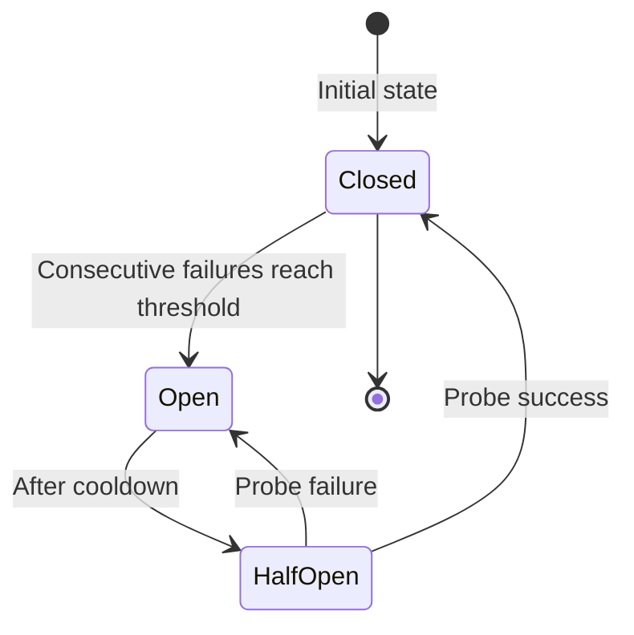
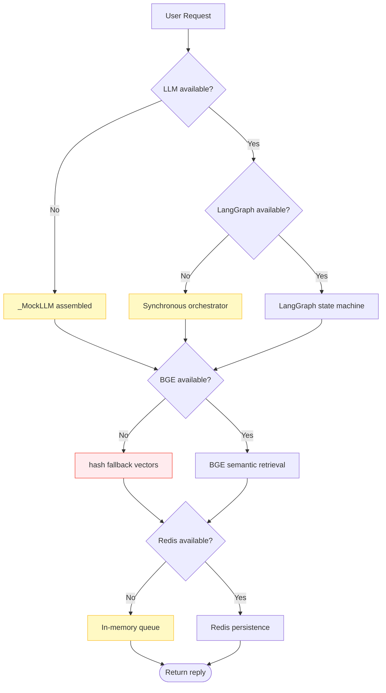

# :material-shield-alert: Fallback Strategy

The system designs fallback guarantees at every layer, ensuring the main path remains available under any single-point failure. Core philosophy: **Prefer degraded service over service interruption**.

---

## :material-grid: Seven-Layer Fallback Matrix

| Layer | Component | Failure Scenario | Fallback Target | User Perception |
|-------|-----------|------------------|-----------------|-----------------|
| 1 | LLM | `LLM_API_KEY` not configured / call failed | `_MockLLM` assembled reply | Reply not LLM-generated, retrieval chain normal |
| 2 | BGE embedding | Model download failed / load timeout | hash fallback vectors (1024-dim) | Semantic retrieval disabled, flow runs |
| 3 | LangGraph | Package not installed / build failed / runtime exception | `_SynchOrchestrator` synchronous orchestration | No perception, behavior fully consistent |
| 4 | Redis | Connection unreachable | In-memory queue / in-memory dict | Single-machine usable, sessions lost on restart |
| 5 | Business API | `BUSINESS_API_BASE_URL` empty / call timeout | mock business system (in-memory) | Business query returns mock data |
| 6 | Real LLM | Main LLM call failed | ModelRouter falls back to default model retry | Occasional latency increase, result normal |
| 7 | Langfuse | Not configured / reporting failed | no-op (silent skip) | No trace data, no impact on main path |

---

## :material-layers: Layer-by-Layer Fallback Details

### 1. LLM Unavailable → _MockLLM

When `LLM_API_KEY` is empty, `LLMClient` auto-instantiates `_MockLLM`:

```python
class _MockLLM:
    """Mock LLM: fallback when no API Key or call fails.

    Does not call any external service; extracts the last user content from messages
    and assembles a reply. Intent recognition uses keyword rules; answer generation
    uses retrieval result concatenation.
    """
```

| Behavior | Mock mode | Real mode |
|----------|-----------|-----------|
| Intent recognition | Keyword rules (sentiment → ticket → business → chitchat → knowledge_qa) | LLM structured recognition + IntentCache |
| Query rewriting | Skipped, uses original query | DeepSeek sync rewrite |
| Answer generation | Retrieval result concatenation | LLM generates from fragments |
| Dialog polish | Skipped, uses raw reply | DialogAgent LLM polish |

!!! tip "Value of mock mode"
    Mock mode lets the system run the full chain without an LLM Key or network, ideal for local development, CI testing, and demos. The retrieval chain (vector + BM25 + RRF + Reranker) runs in full, which can verify knowledge base ingestion and retrieval effectiveness.

### 2. BGE Load Failure → hash fallback

`EmbeddingService` tries to load in a four-level order; after all fail, degrades to hash vectorization:

```python
# Load order: primary source → mirror source → local cache → hash fallback
# 1. HuggingFace primary source (https://huggingface.co)
# 2. Domestic mirror source (HF_MIRROR_URL, default https://hf-mirror.com)
# 3. Local cache directory (EMBEDDING_LOCAL_CACHE_DIR, default ./models/bge-large-zh)
# 4. hash fallback: deterministic degradation, only ensures the flow is available
```

```python
class _FallbackEmbedder:
    """Deterministic hash vectorization: only for running the flow.

    Uses hashlib.sha256 to generate 1024-dim vectors, aligned with BGE dimensions
    to avoid vector store schema conflicts. Semantic retrieval is disabled in this mode.
    """
    def encode(self, text: str) -> List[float]:
        digest = hashlib.sha256(text.encode("utf-8")).digest()
        # Generate deterministic 1024-dim vectors
        ...
```

!!! warning "hash fallback impact"
    hash fallback only ensures the flow does not break; **semantic retrieval is completely disabled** (identical text has identical vectors, but semantically similar text has no correlation). Production environments must ensure the BGE model is available; check whether the embedding mode is `bge` via `GET /api/v1/observability/health`.

### 3. LangGraph Unavailable → Synchronous Orchestrator

When LangGraph is not installed or build fails, degrades to `_SynchOrchestrator`:

```python
def _get_compiled_graph():
    """Lazily get the compiled LangGraph instance.

    Tries to build on first call; on failure records the error and returns None,
    subsequent calls reuse the result, avoiding retries every time.
    """
    global _compiled_graph, _graph_init_error
    if _compiled_graph is not None:
        return _compiled_graph
    if _graph_init_error is not None:
        return None  # Previously failed, no retry
    try:
        _compiled_graph = _build_lang_graph()
        return _compiled_graph
    except Exception as exc:
        _graph_init_error = exc
        logger.warning("LangGraph build failed, degrading to synchronous orchestrator: %s", exc)
        return None
```

The synchronous orchestrator reuses the exact same node functions and conditional logic, with behavior consistent with the LangGraph version. See [Multi-Agent Collaboration · Synchronous Fallback Path](agents.md#synchronous-fallback-path).

### 4. Redis Unreachable → In-Memory Queue

When Redis connection fails, degrades to in-process in-memory data structures:

| Feature | Redis mode | In-memory mode (fallback) |
|---------|------------|---------------------------|
| Session storage | Cross-process persistence | In-process dict, lost on restart |
| Cache | Distributed cache | In-memory dict |
| Message queue | Redis Pub/Sub | In-memory queue |

!!! note "In-memory mode use cases"
    In-memory mode is suitable for single-machine development and testing. Multi-instance deployment or production environments requiring session persistence must enable Redis.

### 5. Business API Failure → mock Business System

When `BUSINESS_ADAPTER_MODE=http` but config is missing or calls fail, degrades:

```python
# http mode but BASE_URL empty → auto-degrade to mock with warning
# Business API call timeout/failure → degrade to mock business system
```

The mock business system provides in-memory order/member/return/account data, ensuring the business query Agent chain is available.

### 6. Real LLM Failure → ModelRouter Fallback

ModelRouter falls back to the main LLM retry when the small model call fails:

```python
try:
    # Prefer small model (Doubao/Qwen), first token ~1s
    raw = get_model_router().chat_with_routing(messages=messages, query=query, ...)
except Exception as exc:
    # ModelRouter call failed: degrade to main LLM direct call, ensure availability
    logger.warning("ModelRouter call failed, degrading main LLM intent recognition: %s", exc)
    raw = self.llm_client.chat(messages, ...)
```

!!! tip "Dual-Provider routing safety"
    The small model (Doubao/Qwen) and main LLM (DeepSeek) are different Providers, with incompatible model names. When the small model is not configured, the system uses the main LLM directly, avoiding call failures from model name switching.

### 7. Langfuse Not Configured → no-op

When `LANGFUSE_ENABLED=False` or Key is empty, `LangfuseClient` degrades to no-op:

```python
# When not enabled, start_langfuse_trace returns None
langfuse_trace = start_langfuse_trace(name="run_graph", metadata={...})

# finish_langfuse_trace(None, ...) is a no-op, silently skipped
finish_langfuse_trace(langfuse_trace, status="success")
```

LLM calls fall back to the native OpenAI SDK (not wrapped by langfuse.openai), so the main path is completely unaffected.

---

## :material-cog-sync: Fallback Implementation Mechanism

### try/except + warning log

Every potentially failing call is wrapped in `try/except`; on failure, a warning is logged and degraded, **without throwing to the caller**:

```python
# Typical pattern: cache read failure does not block the main path
try:
    cached_intent = get_intent_cache().get(query)
    if cached_intent is not None:
        return cached_intent
except Exception as exc:
    # Cache read failure does not block the main path; proceed normally to LLM
    logger.warning("Intent cache read failed, degrading to LLM intent recognition: %s", exc)
```

### Singleton Reset

A degraded singleton marks its state and does not retry afterward (to avoid repeated exception overhead). After tests or config changes, use `reset_*` functions to clear the cache and re-initialize:

| Reset function | Effect |
|----------------|--------|
| `reset_graph()` | Resets LangGraph compile cache and synchronous orchestrator instance |
| `reset_orchestrator()` | Resets OrchestratorAgent singleton |
| `reset_hybrid_retriever()` | Resets HybridRetriever singleton |
| `get_settings.cache_clear()` | Resets Settings config singleton |

!!! example "Reset usage in tests"
    ```python
    from app.agents.graph import reset_graph
    from app.agents.orchestrator import reset_orchestrator

    def test_with_new_config():
        # After modifying config, reset singletons for new config to take effect
        reset_graph()
        reset_orchestrator()
        # Subsequent calls will re-initialize
    ```

### Monitoring Instrumentation Fault Tolerance

Monitoring instrumentation failure also does not affect the business path:

```python
def _record_step_safe(trace_id, node, input_summary, output_summary, duration_ms):
    """Safely record a node step: any exception does not affect the main path.

    On instrumentation failure, only logs, to avoid the observability system
    taking down the business path.
    """
    if not trace_id:
        return
    try:
        get_monitor().record_step(trace_id, node, input_summary, output_summary, duration_ms)
    except Exception as exc:
        logger.warning("Monitoring instrumentation failed node=%s err=%s", node, exc)
```

---

## :material-lightning-bolt: Fault Self-Healing: circuit_breaker

The system has a built-in `CircuitBreaker` that automatically trips and degrades external calls that repeatedly fail, with half-open probing to recover:

### State Machine



### Three States

| State | Behavior | Description |
|-------|----------|-------------|
| `CLOSED` | Normal call | Default state, requests pass normally |
| `OPEN` | Direct rejection | Trips after consecutive failures reach threshold; requests go directly to the fallback path, no longer calling the target service |
| `HALF_OPEN` | Probe pass | After cooldown, passes one probe request; success restores CLOSED, failure re-opens OPEN |

### Workflow

```python
class CircuitBreaker:
    """Circuit breaker: CLOSED → OPEN → HALF_OPEN → CLOSED.

    Trips (OPEN) after consecutive failures reach threshold; after cooldown enters
    half-open (HALF_OPEN), passes one probe request; success restores (CLOSED),
    failure re-trips (OPEN).
    """

    def call(self, func, *args, **kwargs):
        # CLOSED: normal call, record success/failure
        # OPEN: directly raise CircuitBreakerOpenError, go to fallback path
        # HALF_OPEN: pass one probe
        ...

    def record_success(self):
        # HALF_OPEN → CLOSED (probe success, service restored)
        # CLOSED: reset failure count

    def record_failure(self):
        # HALF_OPEN → OPEN (probe failure, re-trip)
        # CLOSED: accumulate failures; reach threshold → OPEN
```

!!! tip "Value of circuit breaking"
    When an external service (e.g., LLM API) is persistently unavailable, the circuit breaker goes directly to the fallback path, avoiding waiting for timeout on every request (e.g., 30s), significantly reducing user-perceived latency. After service recovery, half-open probing automatically switches back, without manual intervention.

### Circuit Breaker Statistics

View each component's circuit state via `GET /api/v1/observability/health`:

```json
{
  "llm": {"state": "closed", "failures": 0},
  "vectorstore": {"state": "closed", "failures": 0},
  "redis": {"state": "open", "failures": 5}
}
```

---

## :material-check-decagram: Fallback Design Summary



!!! success "Design principles"
    - **Fallback-first**: Every layer has fallback guarantees; single-point failure does not interrupt service
    - **Seamless switching**: Post-degradation behavior is as consistent as possible with normal mode (e.g., synchronous orchestrator reuses the same node functions)
    - **Observable**: Warnings are logged on degradation; component status can be viewed via the health check endpoint
    - **Self-healing**: Circuit breaker half-open probing auto-recovers, without manual intervention
    - **No retry**: Degraded singletons mark their state and do not retry, avoiding repeated exception overhead (tests can manually reset)

---

## :material-arrow-right: Related Documentation

| Topic | Link |
|-------|------|
| Multi-Agent collaboration (incl. LangGraph fallback details) | [Multi-Agent Collaboration](agents.md) |
| RAG retrieval pipeline (incl. BGE/Reranker fallback) | [RAG Retrieval Pipeline](rag.md) |
| Architecture (incl. fallback design principles) | [Architecture](../architecture.md) |
| Configuration guide (fallback-related options) | [Configuration Guide](../configuration.md) |
