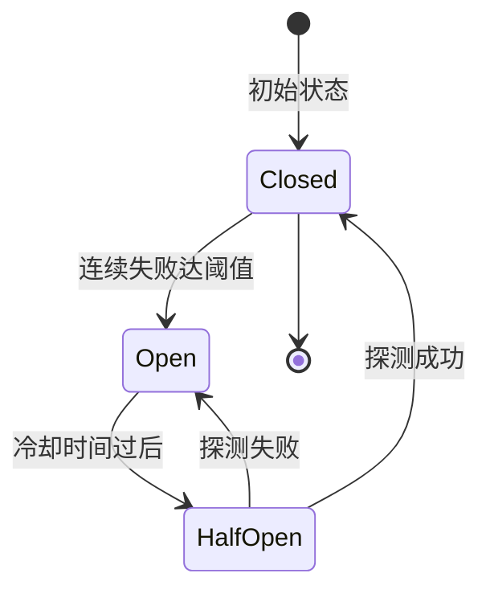
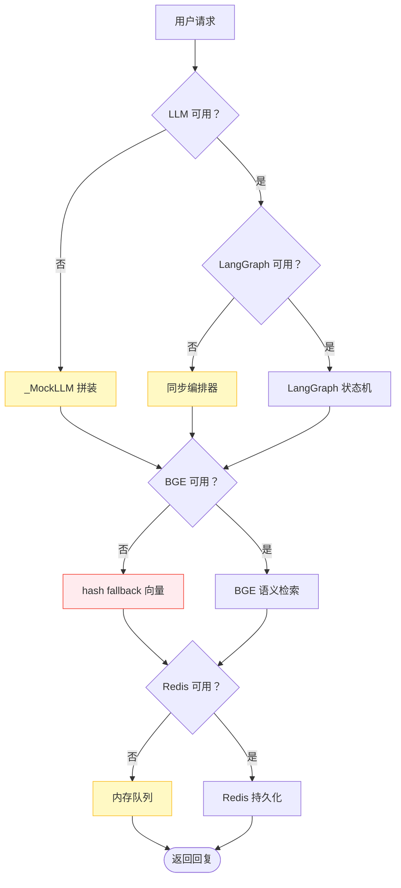

# :material-shield-alert: 降级策略

系统在每一层都设计了降级保障，确保任何单点故障下主链路仍可用。核心理念：**宁可降级服务，不可中断服务**。

---

## :material-grid: 七层降级矩阵

| 层级 | 组件 | 失败场景 | 降级目标 | 用户感知 |
|------|------|----------|----------|----------|
| 1 | LLM | `LLM_API_KEY` 未配置 / 调用失败 | `_MockLLM` 拼装回复 | 回复非 LLM 生成，检索链路正常 |
| 2 | BGE 嵌入 | 模型下载失败 / 加载超时 | hash fallback 向量（1024 维） | 语义检索失效，流程可跑通 |
| 3 | LangGraph | 包未安装 / 构建失败 / 运行异常 | `_SynchOrchestrator` 同步编排 | 无感知，行为完全一致 |
| 4 | Redis | 连接不可达 | 内存队列 / 内存字典 | 单机可用，重启丢会话 |
| 5 | 业务 API | `BUSINESS_API_BASE_URL` 为空 / 调用超时 | mock 业务系统（内存） | 业务查询返回 mock 数据 |
| 6 | 真实 LLM | 主 LLM 调用失败 | ModelRouter 回退默认模型重试 | 偶发延迟增加，结果正常 |
| 7 | Langfuse | 未配置 / 上报失败 | no-op（静默跳过） | 无追踪数据，主链路无影响 |

---

## :material-layers: 各层降级详解

### 1. LLM 不可用 → _MockLLM

`LLM_API_KEY` 留空时，`LLMClient` 自动实例化 `_MockLLM`：

```python
class _MockLLM:
    """Mock LLM：无 API Key 或调用失败时的兜底实现。

    不调用任何外部服务，从 messages 中提取最后一条 user 内容，
    拼装回复。意图识别走关键词规则，答案生成走检索结果拼接。
    """
```

| 行为 | mock 模式 | 真实模式 |
|------|-----------|----------|
| 意图识别 | 关键词规则（情绪→工单→业务→闲聊→知识问答） | LLM 结构化识别 + IntentCache |
| Query 改写 | 跳过，用原始 query | DeepSeek 同步改写 |
| 答案生成 | 检索结果拼接 | LLM 基于片段生成 |
| 对话润色 | 跳过，用原始回复 | DialogAgent LLM 润色 |

!!! tip "mock 模式价值"
    mock 模式让系统在无 LLM Key、无网络环境下也能跑通全链路，便于本地开发、CI 测试与演示。检索链路（向量+BM25+RRF+Reranker）完整运行，可验证知识库入库与检索效果。

### 2. BGE 加载失败 → hash fallback

`EmbeddingService` 按四级顺序尝试加载，全部失败后降级到 hash 向量化：

```python
# 加载顺序：主源 → 镜像源 → 本地缓存 → hash fallback
# 1. HuggingFace 主源（https://huggingface.co）
# 2. 国内镜像源（HF_MIRROR_URL，默认 https://hf-mirror.com）
# 3. 本地缓存目录（EMBEDDING_LOCAL_CACHE_DIR，默认 ./models/bge-large-zh）
# 4. hash fallback：确定性降级，仅保证流程可用
```

```python
class _FallbackEmbedder:
    """确定性 hash 向量化：仅供跑通流程。

    用 hashlib.sha256 生成 1024 维向量，维度与 BGE 对齐
    避免向量库 schema 冲突。此模式下语义检索失效。
    """
    def encode(self, text: str) -> List[float]:
        digest = hashlib.sha256(text.encode("utf-8")).digest()
        # 生成确定性 1024 维向量
        ...
```

!!! warning "hash fallback 影响"
    hash fallback 仅保证流程不中断，**语义检索完全失效**（相同文本向量一致，但语义相近的文本向量无关联性）。生产环境务必确保 BGE 模型可用，通过 `GET /api/v1/observability/health` 检查 embedding 模式是否为 `bge`。

### 3. LangGraph 不可用 → 同步编排器

LangGraph 包未安装或构建失败时，降级到 `_SynchOrchestrator`：

```python
def _get_compiled_graph():
    """惰性获取编译后的 LangGraph 实例。

    首次调用时尝试构建；失败则记录错误并返回 None，
    后续调用直接复用结果，避免每次都重试。
    """
    global _compiled_graph, _graph_init_error
    if _compiled_graph is not None:
        return _compiled_graph
    if _graph_init_error is not None:
        return None  # 之前已失败，不再重试
    try:
        _compiled_graph = _build_lang_graph()
        return _compiled_graph
    except Exception as exc:
        _graph_init_error = exc
        logger.warning("LangGraph 构建失败，降级到同步编排器：%s", exc)
        return None
```

同步编排器复用完全相同的节点函数与条件判断，行为与 LangGraph 版本一致。详见 [多 Agent 协同 · 同步降级路径](agents.md#_5)。

### 4. Redis 不可达 → 内存队列

Redis 连接失败时降级到进程内内存数据结构：

| 功能 | Redis 模式 | 内存模式（降级） |
|------|------------|------------------|
| 会话存储 | 跨进程持久化 | 进程内字典，重启丢失 |
| 缓存 | 分布式缓存 | 内存字典 |
| 消息队列 | Redis Pub/Sub | 内存队列 |

!!! note "内存模式适用场景"
    内存模式适合单机开发与测试。多实例部署或需会话持久化的生产环境必须启用 Redis。

### 5. 业务 API 失败 → mock 业务系统

`BUSINESS_ADAPTER_MODE=http` 但配置缺失或调用失败时降级：

```python
# http 模式但 BASE_URL 为空 → 自动降级 mock 并告警
# 业务 API 调用超时/失败 → 降级 mock 业务系统
```

mock 业务系统提供内存订单/会员/退换货/账户数据，保证业务查询 Agent 链路可用。

### 6. 真实 LLM 失败 → ModelRouter 回退

ModelRouter 在小模型调用失败时回退到主 LLM 重试：

```python
try:
    # 优先小模型（豆包/千问），首 Token ~1s
    raw = get_model_router().chat_with_routing(messages=messages, query=query, ...)
except Exception as exc:
    # ModelRouter 调用失败：降级到主 LLM 直接调用，保证可用
    logger.warning("ModelRouter 调用失败，降级主 LLM 意图识别：%s", exc)
    raw = self.llm_client.chat(messages, ...)
```

!!! tip "双 Provider 路由安全"
    小模型（豆包/千问）与主 LLM（DeepSeek）是不同 Provider，模型名不兼容。系统在小模型未配置时直接用主 LLM，避免模型名切换导致调用失败。

### 7. Langfuse 未配置 → no-op

`LANGFUSE_ENABLED=False` 或 Key 为空时，`LangfuseClient` 降级为 no-op：

```python
# 未启用时 start_langfuse_trace 返回 None
langfuse_trace = start_langfuse_trace(name="run_graph", metadata={...})

# finish_langfuse_trace(None, ...) 为 no-op，静默跳过
finish_langfuse_trace(langfuse_trace, status="success")
```

LLM 调用回退原生 OpenAI SDK（不经 langfuse.openai 包装），主链路完全不受影响。

---

## :material-cog-sync: 降级实现机制

### try/except + warning 日志

每个可能失败的调用都包裹 `try/except`，失败时记录 warning 日志并降级，**不向调用方抛异常**：

```python
# 典型模式：缓存读取失败不阻断主链路
try:
    cached_intent = get_intent_cache().get(query)
    if cached_intent is not None:
        return cached_intent
except Exception as exc:
    # 缓存读取失败不阻断主链路，正常走 LLM
    logger.warning("意图缓存读取失败，降级到 LLM 意图识别：%s", exc)
```

### 单例重置

降级后的单例会标记状态，后续不再重试（避免重复异常开销）。测试或配置变更后通过 `reset_*` 函数清空缓存重新初始化：

| 重置函数 | 作用 |
|----------|------|
| `reset_graph()` | 重置 LangGraph 编译缓存与同步编排器实例 |
| `reset_orchestrator()` | 重置 OrchestratorAgent 单例 |
| `reset_hybrid_retriever()` | 重置 HybridRetriever 单例 |
| `get_settings.cache_clear()` | 重置 Settings 配置单例 |

!!! example "测试中的重置用法"
    ```python
    from app.agents.graph import reset_graph
    from app.agents.orchestrator import reset_orchestrator

    def test_with_new_config():
        # 修改配置后重置单例，让新配置生效
        reset_graph()
        reset_orchestrator()
        # 接下来的调用会重新初始化
    ```

### 监控埋点容错

监控埋点失败也不影响业务链路：

```python
def _record_step_safe(trace_id, node, input_summary, output_summary, duration_ms):
    """安全记录节点步骤：任何异常都不影响主链路。

    监控埋点失败时仅记录日志，避免观测系统故障拖垮业务链路。
    """
    if not trace_id:
        return
    try:
        get_monitor().record_step(trace_id, node, input_summary, output_summary, duration_ms)
    except Exception as exc:
        logger.warning("监控埋点失败 node=%s err=%s", node, exc)
```

---

## :material-lightning-bolt: 故障自愈：circuit_breaker 熔断

系统内置 `CircuitBreaker` 熔断器，对反复失败的外部调用自动熔断降级，半开探测恢复：

### 状态机



### 三种状态

| 状态 | 行为 | 说明 |
|------|------|------|
| `CLOSED` | 正常调用 | 默认状态，请求正常放行 |
| `OPEN` | 直接拒绝 | 连续失败达阈值后熔断，请求直接走降级路径，不再调用目标服务 |
| `HALF_OPEN` | 探测放行 | 冷却时间过后放行一次请求探测，成功则恢复 CLOSED，失败则重新 OPEN |

### 工作流程

```python
class CircuitBreaker:
    """熔断器：CLOSED → OPEN → HALF_OPEN → CLOSED。

    连续失败达阈值后熔断（OPEN），冷却时间过后进入半开（HALF_OPEN），
    放行一次探测请求，成功则恢复（CLOSED），失败则重新熔断（OPEN）。
    """

    def call(self, func, *args, **kwargs):
        # CLOSED: 正常调用，记录成功/失败
        # OPEN: 直接抛 CircuitBreakerOpenError，走降级路径
        # HALF_OPEN: 放行一次探测
        ...

    def record_success(self):
        # HALF_OPEN → CLOSED（探测成功，恢复服务）
        # CLOSED: 重置失败计数

    def record_failure(self):
        # HALF_OPEN → OPEN（探测失败，重新熔断）
        # CLOSED: 累计失败，达阈值则 → OPEN
```

!!! tip "熔断的价值"
    当外部服务（如 LLM API）持续不可用时，熔断器直接走降级路径，避免每次请求都等待超时（如 30s），显著降低用户感知延迟。服务恢复后通过半开探测自动切回，无需人工干预。

### 熔断统计

通过 `GET /api/v1/observability/health` 可查看各组件熔断状态：

```json
{
  "llm": {"state": "closed", "failures": 0},
  "vectorstore": {"state": "closed", "failures": 0},
  "redis": {"state": "open", "failures": 5}
}
```

---

## :material-check-decagram: 降级设计总结



!!! success "设计原则"
    - **降级优先**：每一层都有降级保障，单点故障不中断服务
    - **无感知切换**：降级后行为尽量与正常模式一致（如同步编排器复用相同节点函数）
    - **可观测**：降级时记录 warning 日志，可通过健康检查接口查看组件状态
    - **可自愈**：熔断器半开探测自动恢复，无需人工干预
    - **不重试**：降级后的单例标记状态不再重试，避免重复异常开销（测试可手动重置）

---

## :material-arrow-right: 相关文档

| 主题 | 链接 |
|------|------|
| 多 Agent 协同（含 LangGraph 降级细节） | [多 Agent 协同](agents.md) |
| RAG 检索流程（含 BGE/Reranker 降级） | [RAG 检索流程](rag.md) |
| 总体架构（含降级设计原则） | [总体架构](../architecture.md) |
| 配置说明（降级相关配置项） | [配置说明](../configuration.md) |
