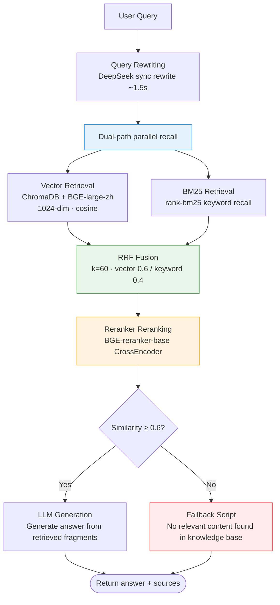

# :material-book-search: RAG Retrieval Pipeline

KnowledgeAgent orchestrates the complete RAG chain: Query rewriting → vector retrieval + BM25 retrieval → RRF fusion → Reranker reranking → threshold filtering → LLM generation. No forced answer when similarity is below threshold; a fallback script is returned.

---

## :material-chart-timeline: RAG Full Pipeline Diagram



---

## :material-pencil: Query Rewriting

User questions are often colloquial, contain references or omissions, and direct retrieval works poorly. `QueryRewriter` uses DeepSeek to synchronously rewrite them into a form more suitable for retrieval:

| Feature | Description |
|---------|-------------|
| Model | Main LLM (DeepSeek-V3) |
| Latency | ~1.5s (sync call) |
| Effect | Completes references, expands abbreviations, normalizes expressions |
| Optional | Can be disabled to use the original query for retrieval |

!!! warning "Rewriting latency trade-off"
    Query rewriting adds ~1.5s latency but significantly improves recall. For latency-sensitive scenarios, you can disable rewriting, or use HotQueryCache to offset the latency.

---

## :material-vector-curve: Vector Retrieval

Uses the BGE-large-zh-v1.5 embedding model + ChromaDB vector store for semantic recall.

| Parameter | Value | Description |
|-----------|-------|-------------|
| Embedding model | `BAAI/bge-large-zh-v1.5` | Optimized for Chinese semantic retrieval |
| Vector dimension | 1024 | BGE-large-zh output dimension |
| Similarity metric | cosine | ChromaDB `hnsw:space=cosine` |
| Recall count | `VECTOR_TOP_K=25` | Vector path recalls top-25 |

```python
def _vector_retrieve(self, question, where):
    """Vector recall: embed_query → vectorstore.query."""
    embedding_service = get_embedding_service()
    query_embedding = embedding_service.embed_query(question)
    if not query_embedding:
        # Vectorization failed (still generates vectors when BGE degrades to hash fallback)
        return []
    # Relax the threshold during recall (0.0); unified filtering at the fusion stage
    return self.vector_store.query(
        query_embedding=query_embedding,
        top_k=self._vector_top_k,  # default 25
        score_threshold=0.0,
        where=where,
    )
```

!!! note "Why does vector retrieval excel at semantic matching?"
    Users ask in diverse ways ("forgot password" / "can't log in" / "unable to sign in to account"). Vector retrieval captures semantic similarity, recalling correct results even when keywords don't fully match. But it is weaker for proper nouns (product models, order numbers), which BM25 supplements.

---

## :material-format-list-text: BM25 Retrieval

Uses `rank-bm25` for keyword recall, supplementing vector retrieval's weakness in exact matching.

| Parameter | Value | Description |
|-----------|-------|-------------|
| Retriever | `rank-bm25` | Classic BM25 keyword retrieval algorithm |
| Recall count | `BM25_TOP_K=25` | Keyword path recalls top-25 |
| Index build | On-demand build + cache | Auto-rebuilds on knowledge base change |

```python
def _ensure_bm25_index(self):
    """Ensure the BM25 index is built and in sync with the vector store.

    Determines whether rebuild is needed by comparing the vector store entry count:
    - Rebuilds when the index is empty or the entry count is inconsistent
    - Avoids full rebuild on every retrieval, saving CPU and memory
    """
    current_count = self.vector_store.count()
    if self.bm25_retriever.size == 0 or self._indexed_count != current_count:
        self._build_bm25_index()  # Pull all chunks from the vector store to build
        self._indexed_count = current_count
```

!!! tip "BM25 index lazy build"
    The BM25 index is built only on first retrieval, pulling all chunks from ChromaDB, and caches `_indexed_count` to mark the current index state. It auto-rebuilds when the knowledge base changes (entry count changes), without manual triggering.

---

## :material-blender: RRF Fusion

After vector and BM25 dual-path recall, **RRF (Reciprocal Rank Fusion)** weighted-fuses the ranks, taking the best of both.

### Fusion Formula

```
score(chunk) = Σ weight_i × 1 / (k + rank_i)
```

- `rank_i`: the rank of a chunk in the i-th recall path (starting from 1)
- `k=60`: empirical smoothing value, prevents rank=1 results from dominating
- Weights: vector path `0.6` + keyword path `0.4 = 1.0`

### Implementation Code

```python
def _rrf_fuse(self, vector_hits, bm25_hits):
    """RRF weighted fusion: score = Σ weight_i * 1/(k + rank_i).

    rank starts from 1 (rank=1 means rank-1 in that path);
    k=60 is an empirical value, smoothing rank differences to avoid top-1 dominance.
    """
    scores = {}
    # Vector path: assign rank by descending similarity
    vector_ranked = sorted(vector_hits, key=lambda h: h.get("similarity", 0.0), reverse=True)
    for rank, hit in enumerate(vector_ranked, start=1):
        chunk_id = str(hit.get("id", ""))
        scores[chunk_id] = scores.get(chunk_id, 0.0) + self._rrf_vector_weight * (1.0 / (self._rrf_k + rank))
    # Keyword path: BM25 already returns in descending score order, assign rank directly
    for rank, (chunk_id, _) in enumerate(bm25_hits, start=1):
        scores[chunk_id] = scores.get(chunk_id, 0.0) + self._rrf_keyword_weight * (1.0 / (self._rrf_k + rank))
    # Sort by fused score in descending order
    return sorted(scores.items(), key=lambda x: x[1], reverse=True)
```

??? info "Why is the vector weight higher (0.6 vs 0.4)?"
    In customer service scenarios, users ask in diverse ways, so semantic matching is more important than keyword matching. But keyword matching captures proper nouns (product models, order numbers, error codes), so a 40% weight is retained. The project tested Recall@5=1.0 under this ratio.

---

## :material-sort-variant: Reranker Reranking

RRF fusion's sorting quality is still limited (rank-based, not semantic). **CrossEncoder** does fine ranking on query-chunk pairs:

| Parameter | Value | Description |
|-----------|-------|-------------|
| Model | `BAAI/bge-reranker-base` | BGE Chinese reranker model |
| Top-K | `RERANK_TOP_K=5` | Take the top 5 after reranking for the final answer |
| Fallback | cosine similarity | Degrades when model loading fails |

```python
class Reranker:
    """Reranker: CrossEncoder first, cosine fallback.

    Lazy model loading: only tries to load on first rerank, to avoid slowing down startup.
    After load failure, marks _use_fallback and does not retry afterward, saving overhead.
    """
```

!!! tip "Why is reranking needed?"
    Dual-tower vector retrieval (encoding query and doc separately, then computing similarity) loses query-doc interaction info; CrossEncoder directly models the `(query, doc)` pair interaction, more precise than dual-tower. Coarse recall first (25 items) then fine rerank (take 5), balancing recall and sorting quality.

### Reranking Fallback

When model loading fails, degrades to cosine similarity reranking, reusing embedding vectors:

```python
# After load failure, marks _use_fallback and does not retry afterward
if self._use_fallback:
    # Sort by query-chunk embedding cosine similarity
    # Less precise than CrossEncoder, but better than no reranking
```

---

## :material-gauge: Similarity Threshold and Fallback

After reranking, filter by `SIMILARITY_THRESHOLD=0.6`; no forced answer below threshold:

```python
# RRF scores have no unified scale; threshold filtering uses normalized scores after rerank
_DEFAULT_SCORE_THRESHOLD = 0.6

# Recall below threshold is treated as weakly relevant and filtered out
if score_threshold > 0:
    retrieved = [c for c in retrieved if c.score >= score_threshold]
```

### Fallback Script

When retrieval is empty or all below threshold, returns a fixed fallback reply, **does not call LLM to fabricate**:

```python
if not chunks:
    # Empty retrieval: return fallback directly, avoiding meaningless LLM calls
    return KnowledgeAnswer(
        answer="Sorry, no relevant content found in the knowledge base.",
        sources=[],
        hit=False,
        confidence=0.0,
    )
```

!!! success "Hallucination rate = 0"
    Strict threshold filtering + fallback mechanism ensures the system does not fabricate answers based on weakly related fragments. The project tested hallucination rate = 0, far better than the ≤ 0.10 target.

---

## :material-robot: LLM Generation

After retrieving high-quality fragments, construct a prompt and hand it to the LLM to generate the final answer:

### System Prompt

```python
SYSTEM_PROMPT = (
    "You are an enterprise customer service assistant. Please answer the user's question strictly "
    "based on the knowledge fragments provided below. Do not fabricate information not present in the "
    "fragments. If the knowledge fragments are insufficient to answer the question, clearly state "
    "\"No relevant content found in the knowledge base.\" At the end of the answer, list the cited "
    "knowledge fragment sources starting with \"Sources:\", in the format \"Sources: ProductFAQ.md "
    "page 3\". Separate multiple sources with commas."
)
```

### Prompt Construction

```python
# Character limit per fragment text in the prompt, to control token cost
MAX_CHUNK_CHARS = 800
# Citation limit per fragment, to avoid overly long source lines
MAX_SOURCE_COUNT = 3

def _build_prompt_messages(question, chunks):
    """Construct a prompt with retrieved fragments, constraining the LLM to answer only from fragments."""
    context = "\n\n".join(
        f"[Fragment {i+1}] {chunk.text[:MAX_CHUNK_CHARS]}\nSource: {chunk.source}"
        for i, chunk in enumerate(chunks)
    )
    return [
        {"role": "system", "content": SYSTEM_PROMPT},
        {"role": "user", "content": f"Knowledge fragments:\n{context}\n\nQuestion: {question}"},
    ]
```

---

## :material-chart-bar: Evaluation Metrics

Validated under a real DeepSeek LLM + BGE embedding environment:

| Metric | Target | Actual | Pass | Description |
|--------|--------|--------|------|-------------|
| Recall@5 | ≥ 0.85 | **1.0** | :material-check: | Top 5 recall covers all correct answers |
| Hit Rate | ≥ 0.90 | **0.9333** | :material-check: | Proportion of top-1 correct answers |
| MRR | — | High | :material-check: | Mean reciprocal rank (closer to 1 is better) |
| Hallucination Rate | ≤ 0.10 | **0.0** | :material-check: | Threshold filtering + fallback ensures no fabrication |

!!! info "How to run the evaluation"
    ```bash
    # Run retrieval evaluation (Recall@K / Hit Rate / MRR / hallucination rate)
    curl -X POST http://localhost:8000/api/v1/evaluation/run \
      -H "Content-Type: application/json" \
      -d '{"top_k": 5}'
    ```

---

## :material-tune-vertical: Retrieval Parameter Tuning

| Parameter | Default | Tuning Tips |
|-----------|---------|-------------|
| `VECTOR_TOP_K` | 25 | Increase when recall is insufficient (e.g., 30), decrease when latency-sensitive (e.g., 15) |
| `BM25_TOP_K` | 25 | Same as above, keep close to the vector path |
| `RRF_K` | 60 | Usually no need to adjust; too large weakens rank differences, too small top-1 dominates |
| `RRF_VECTOR_WEIGHT` | 0.6 | Increase when semantic matching matters (e.g., 0.7), decrease when keyword matching matters |
| `RERANK_TOP_K` | 5 | Increase when the answer needs more context (e.g., 8), decrease when latency-sensitive (e.g., 3) |
| `SIMILARITY_THRESHOLD` | 0.6 | Decrease when recall is insufficient (e.g., 0.5), increase when false recalls are high (e.g., 0.7) |

!!! warning "Clear cache after tuning"
    After modifying retrieval parameters, call `POST /api/v1/performance/cache/invalidate` to clear HotQueryCache, otherwise cached old results will not update.

---

## :material-arrow-right: Related Documentation

| Topic | Link |
|-------|------|
| Multi-Agent collaboration (KnowledgeAgent's role) | [Multi-Agent Collaboration](agents.md) |
| Fallback strategy (BGE/Reranker fallback) | [Fallback Strategy](fallback.md) |
| Configuration guide (retrieval parameter details) | [Configuration Guide](../configuration.md) |
