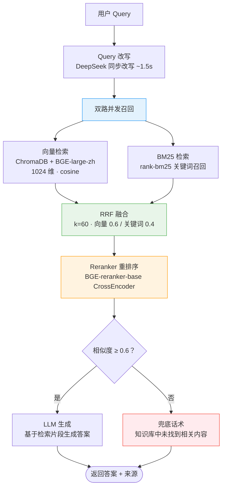

# :material-book-search: RAG 检索流程

KnowledgeAgent 编排完整的 RAG 链路：Query 改写 → 向量检索 + BM25 检索 → RRF 融合 → Reranker 重排序 → 阈值过滤 → LLM 生成。相似度低于阈值不强答，返回兜底话术。

---

## :material-chart-timeline: RAG 全流程图



---

## :material-pencil: Query 改写

用户提问往往口语化、含指代或省略，直接检索效果不佳。`QueryRewriter` 用 DeepSeek 同步改写为更适合检索的形式：

| 特性 | 说明 |
|------|------|
| 模型 | 主 LLM（DeepSeek-V3） |
| 耗时 | 约 1.5s（同步调用） |
| 作用 | 补全指代、扩展缩写、标准化表述 |
| 可选 | 可关闭改写直接用原始 query 检索 |

!!! warning "改写延迟权衡"
    Query 改写约增加 1.5s 延迟，但显著提升召回率。对延迟敏感的场景可关闭改写，或配合 HotQueryCache 缓存抵消延迟。

---

## :material-vector-curve: 向量检索

使用 BGE-large-zh-v1.5 嵌入模型 + ChromaDB 向量库做语义召回。

| 参数 | 值 | 说明 |
|------|-----|------|
| 嵌入模型 | `BAAI/bge-large-zh-v1.5` | 中文语义检索专优 |
| 向量维度 | 1024 | BGE-large-zh 输出维度 |
| 相似度度量 | cosine | ChromaDB `hnsw:space=cosine` |
| 召回数量 | `VECTOR_TOP_K=25` | 向量路召回 top-25 |

```python
def _vector_retrieve(self, question, where):
    """向量召回：embed_query → vectorstore.query。"""
    embedding_service = get_embedding_service()
    query_embedding = embedding_service.embed_query(question)
    if not query_embedding:
        # 向量化失败（BGE 降级 hash fallback 时仍可生成向量）
        return []
    # 召回阶段放宽阈值（0.0），融合阶段统一过滤
    return self.vector_store.query(
        query_embedding=query_embedding,
        top_k=self._vector_top_k,  # 默认 25
        score_threshold=0.0,
        where=where,
    )
```

!!! note "为什么向量检索擅长语义匹配？"
    用户提问方式多样（"密码忘了" / "登不上" / "无法登录账户"），向量检索能捕捉语义相似性，即使关键词不完全匹配也能召回正确结果。但对专有名词（产品型号、订单号）效果较差，需 BM25 补充。

---

## :material-format-list-text: BM25 检索

使用 `rank-bm25` 做关键词召回，补充向量检索在精确匹配上的不足。

| 参数 | 值 | 说明 |
|------|-----|------|
| 检索器 | `rank-bm25` | 经典 BM25 关键词检索算法 |
| 召回数量 | `BM25_TOP_K=25` | 关键词路召回 top-25 |
| 索引构建 | 按需构建 + 缓存 | 知识库变更时自动重建 |

```python
def _ensure_bm25_index(self):
    """确保 BM25 索引已构建且与向量库同步。

    通过比较向量库条目数判断是否需要重建：
    - 索引为空或条目数不一致时重建
    - 避免每次检索都全量重建，节省 CPU 与内存
    """
    current_count = self.vector_store.count()
    if self.bm25_retriever.size == 0 or self._indexed_count != current_count:
        self._build_bm25_index()  # 从向量库拉取全部 chunks 构建
        self._indexed_count = current_count
```

!!! tip "BM25 索引懒构建"
    BM25 索引在首次检索时才从 ChromaDB 拉取全部 chunks 构建，并缓存 `_indexed_count` 标记当前索引状态。知识库变更（条目数变化）时自动重建，无需手动触发。

---

## :material-blender: RRF 融合

向量与 BM25 两路召回后，用 **RRF（Reciprocal Rank Fusion）** 加权融合排名，取长补短。

### 融合公式

```
score(chunk) = Σ weight_i × 1 / (k + rank_i)
```

- `rank_i`：某 chunk 在第 i 路召回中的排名（从 1 开始）
- `k=60`：经验平滑值，避免 rank=1 的结果过度主导
- 权重：向量路 `0.6` + 关键词路 `0.4 = 1.0`

### 实现代码

```python
def _rrf_fuse(self, vector_hits, bm25_hits):
    """RRF 加权融合：score = Σ weight_i * 1/(k + rank_i)。

    rank 从 1 开始（rank=1 表示该路第 1 名）；
    k=60 是经验值，平滑排名差异避免 top-1 过度主导。
    """
    scores = {}
    # 向量路：按 similarity 降序赋 rank
    vector_ranked = sorted(vector_hits, key=lambda h: h.get("similarity", 0.0), reverse=True)
    for rank, hit in enumerate(vector_ranked, start=1):
        chunk_id = str(hit.get("id", ""))
        scores[chunk_id] = scores.get(chunk_id, 0.0) + self._rrf_vector_weight * (1.0 / (self._rrf_k + rank))
    # 关键词路：BM25 已按分数降序返回，直接赋 rank
    for rank, (chunk_id, _) in enumerate(bm25_hits, start=1):
        scores[chunk_id] = scores.get(chunk_id, 0.0) + self._rrf_keyword_weight * (1.0 / (self._rrf_k + rank))
    # 按融合分数降序排列
    return sorted(scores.items(), key=lambda x: x[1], reverse=True)
```

??? info "为什么向量权重更高（0.6 vs 0.4）？"
    客服场景下用户提问方式多样，语义匹配比关键词匹配更重要。但关键词匹配能捕获专有名词（产品型号、订单号、错误码），因此保留 40% 权重。项目实测该配比下 Recall@5=1.0。

---

## :material-sort-variant: Reranker 重排序

RRF 融合后的排序质量仍有限（基于排名而非语义），用 **CrossEncoder** 对 query-chunk 对做精排：

| 参数 | 值 | 说明 |
|------|-----|------|
| 模型 | `BAAI/bge-reranker-base` | BGE 中文重排序模型 |
| 取 Top-K | `RERANK_TOP_K=5` | 重排序后取前 5 进入最终答案 |
| 降级 | cosine 相似度 | 模型加载失败时降级 |

```python
class Reranker:
    """重排序器：CrossEncoder 优先，cosine 兜底。

    模型延迟加载：首次 rerank 时才尝试加载，避免导入阶段拖慢启动。
    加载失败后标记 _use_fallback，后续不再重试，节省开销。
    """
```

!!! tip "为什么需要重排序？"
    双塔向量检索（query 和 doc 分别编码再算相似度）丢失了 query-doc 交互信息；CrossEncoder 直接建模 `(query, doc)` 对的交互，比双塔更精准。先粗召回（25 条）再精排（取 5 条），兼顾召回率与排序质量。

### 重排序降级

模型加载失败时降级到 cosine 相似度重排序，复用 embedding 向量：

```python
# 加载失败后标记 _use_fallback，后续不再重试
if self._use_fallback:
    # 用 query 与 chunk 的 embedding cosine 相似度排序
    # 虽不如 CrossEncoder 精准，但优于无重排序
```

---

## :material-gauge: 相似度阈值与兜底

重排序后按 `SIMILARITY_THRESHOLD=0.6` 过滤，低于阈值不强答：

```python
# RRF 分数无统一量纲，阈值过滤改用 rerank 后的归一化分数
_DEFAULT_SCORE_THRESHOLD = 0.6

# 低于阈值的召回视为弱相关，过滤掉
if score_threshold > 0:
    retrieved = [c for c in retrieved if c.score >= score_threshold]
```

### 兜底话术

检索为空或全部低于阈值时，返回固定兜底回复，**不调用 LLM 编造**：

```python
if not chunks:
    # 检索为空：直接返回兜底，避免无意义调用 LLM
    return KnowledgeAnswer(
        answer="抱歉，知识库中未找到相关内容。",
        sources=[],
        hit=False,
        confidence=0.0,
    )
```

!!! success "幻觉率 = 0"
    严格的阈值过滤 + 兜底机制确保系统不会基于弱相关片段编造答案。项目实测幻觉率 = 0，远优于 ≤ 0.10 的目标。

---

## :material-robot: LLM 生成

检索到高质量片段后，构造 prompt 交给 LLM 生成最终答案：

### 系统提示

```python
SYSTEM_PROMPT = (
    "你是一名企业客服助手。请严格基于下方提供的知识片段回答用户问题，"
    "不要编造未在片段中出现的信息。若知识片段不足以回答问题，"
    "请明确说明「知识库中未找到相关内容」。"
    "回答末尾需以「来源：」开头列出引用的知识片段来源，"
    "格式如「来源：产品FAQ.md 第3页」，多个来源用逗号分隔。"
)
```

### Prompt 构造

```python
# 单条片段文本在 prompt 中的字符上限，控制 token 成本
MAX_CHUNK_CHARS = 800
# 单条片段的引用上限：避免来源行过长
MAX_SOURCE_COUNT = 3

def _build_prompt_messages(question, chunks):
    """构造含检索片段的 prompt，约束 LLM 只基于片段回答。"""
    context = "\n\n".join(
        f"【片段{i+1}】{chunk.text[:MAX_CHUNK_CHARS]}\n来源：{chunk.source}"
        for i, chunk in enumerate(chunks)
    )
    return [
        {"role": "system", "content": SYSTEM_PROMPT},
        {"role": "user", "content": f"知识片段：\n{context}\n\n问题：{question}"},
    ]
```

---

## :material-chart-bar: 评估指标

在真实 DeepSeek LLM + BGE 嵌入环境下验证：

| 指标 | 目标 | 实测 | 达标 | 说明 |
|------|------|------|------|------|
| Recall@5 | ≥ 0.85 | **1.0** | :material-check: | 前 5 条召回覆盖全部正确答案 |
| Hit Rate | ≥ 0.90 | **0.9333** | :material-check: | Top-1 命中正确答案的比例 |
| MRR | — | 高 | :material-check: | 平均倒数排名（越接近 1 越好） |
| 幻觉率 | ≤ 0.10 | **0.0** | :material-check: | 阈值过滤 + 兜底确保不编造 |

!!! info "如何跑评估"
    ```bash
    # 跑检索评估（Recall@K / Hit Rate / MRR / 幻觉率）
    curl -X POST http://localhost:8000/api/v1/evaluation/run \
      -H "Content-Type: application/json" \
      -d '{"top_k": 5}'
    ```

---

## :material-tune-vertical: 检索参数调优

| 参数 | 默认 | 调优建议 |
|------|------|----------|
| `VECTOR_TOP_K` | 25 | 召回率不足时调大（如 30），延迟敏感时调小（如 15） |
| `BM25_TOP_K` | 25 | 同上，与向量路保持接近 |
| `RRF_K` | 60 | 一般无需调整，过大削弱排名差异，过小 top-1 过度主导 |
| `RRF_VECTOR_WEIGHT` | 0.6 | 语义匹配重要时调大（如 0.7），关键词匹配重要时调小 |
| `RERANK_TOP_K` | 5 | 答案需更多上下文时调大（如 8），延迟敏感时调小（如 3） |
| `SIMILARITY_THRESHOLD` | 0.6 | 召回率不足时调低（如 0.5），误召回多时调高（如 0.7） |

!!! warning "调参后清缓存"
    修改检索参数后需调用 `POST /api/v1/performance/cache/invalidate` 清空 HotQueryCache，否则已缓存的旧结果不会更新。

---

## :material-arrow-right: 相关文档

| 主题 | 链接 |
|------|------|
| 多 Agent 协同（KnowledgeAgent 在其中的角色） | [多 Agent 协同](agents.md) |
| 降级策略（BGE/Reranker 降级） | [降级策略](fallback.md) |
| 配置说明（检索参数详解） | [配置说明](../configuration.md) |
