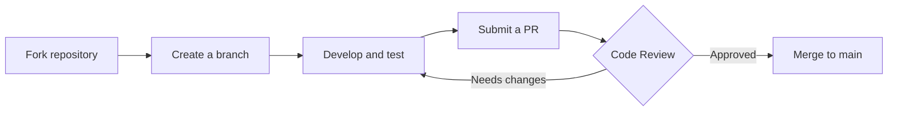
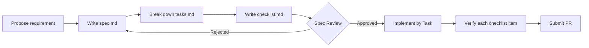

# Contributing Guide

Welcome to contribute to the "Intelligent Customer Service System Integrated with Enterprise Knowledge Base"! This guide covers the contribution process, development environment setup, spec-driven development, code standards, and documentation update requirements.

!!! info "Project repository"

    - GitHub: [sakura-del/Intelligent-customer-service-system-integrated-with-enterprise-knowledge-base](https://github.com/sakura-del/Intelligent-customer-service-system-integrated-with-enterprise-knowledge-base)
    - Current version: v0.4.0
    - Test cases: 668+

---

## Contribution Process

All contributions are submitted via Pull Request, following the Fork → Branch → PR three-step flow.



### 1. Fork and Clone

```bash
# 1. Fork the repository to your own account on GitHub
# 2. Clone the forked repository locally
git clone https://github.com/<your-username>/Intelligent-customer-service-system-integrated-with-enterprise-knowledge-base.git
cd Intelligent-customer-service-system-integrated-with-enterprise-knowledge-base

# 3. Add the upstream repository for easy sync
git remote add upstream https://github.com/sakura-del/Intelligent-customer-service-system-integrated-with-enterprise-knowledge-base.git
```

### 2. Create a Branch

**Branch naming convention**:

| Prefix | Purpose | Example |
|--------|---------|---------|
| `feat/` | New feature | `feat/agent-assist-endpoints` |
| `fix/` | Bug fix | `fix/stream-sse-buffering` |
| `docs/` | Documentation update | `docs/api-reference` |
| `test/` | Test additions | `test/escalation-coverage` |
| `refactor/` | Refactor | `refactor/session-manager` |
| `perf/` | Performance optimization | `perf/hot-query-cache` |

```bash
# Sync the upstream main branch to avoid building on stale code
git fetch upstream
git checkout main
git merge upstream/main

# Create a feature branch (always cut from the latest main)
git checkout -b feat/your-feature
```

### 3. Submit a PR

```bash
# Push to your fork
git push origin feat/your-feature

# Open a Pull Request on GitHub to upstream/main
```

**PR titles** follow the commit convention (see below). The description should include:

- Why the change (Why)
- Main changes (What)
- How it was verified (How verified)
- Related Issue (if any)

---

## Commit Convention

We follow [Conventional Commits](https://www.conventionalcommits.org/) to make auto-generating the changelog easier.

### Format

```
<type>(<scope>): <subject>

<body>

<footer>
```

### Types and Scopes

| type | Description | scope examples |
|------|-------------|----------------|
| `feat` | New feature | `core`, `api`, `agent`, `knowledge` |
| `fix` | Bug fix | `api`, `chat`, `stream` |
| `docs` | Documentation update | `api-reference`, `faq` |
| `test` | Test additions | `agent-assist`, `escalation` |
| `refactor` | Refactor (no behavior change) | `session`, `orchestrator` |
| `perf` | Performance optimization | `cache`, `retriever` |
| `chore` | Build/tooling | `deps`, `ci` |

### Examples

```bash
# New feature
git commit -m "feat(agent): add 8 agent assist endpoints to complete the human-bot collaboration loop"

# Bug fix
git commit -m "fix(chat): fix streaming endpoint first-token latency caused by Nginx buffering"

# Documentation
git commit -m "docs(api): update API reference with agent endpoint descriptions"

# Tests
git commit -m "test(agent): add 28 agent assist endpoint test cases"

# Performance
git commit -m "perf(cache): HotQueryCache hit reduces first token to under 100ms"
```

!!! tip "Commit granularity"
    Keep each commit small and working. **Frequent commits** make review and rollback easier. A single PR should ideally have ≤ 10 commits.

---

## Development Environment

### Prerequisites

| Dependency | Version | Notes |
|------------|---------|-------|
| Python | 3.11+ | 3.11.9 recommended |
| Redis | 7.0+ | Optional; auto-fallback to in-memory queue when not installed |
| pip | Latest | Avoid dependency resolution failures |

### Installation Steps

```bash
# 1. Clone the repository (see Fork and Clone above)

# 2. Create a virtual environment
python -m venv .venv
# Windows
.venv\Scripts\activate
# Linux/macOS
source .venv/bin/activate

# 3. Install dependencies
pip install -r requirements.txt

# 4. Configure environment variables
cp .env.example .env
# Edit .env; at minimum set LLM_API_KEY (empty enters mock mode)

# 5. Verify the installation: run the test suite
python -m pytest tests/ -q
```

### Run Tests

```bash
# Run all tests (668+ cases)
python -m pytest tests/ -q

# Run tests for a specific module
python -m pytest tests/test_agent_assist.py -v

# Run with coverage report
python -m pytest tests/ --cov=app --cov-report=term-missing

# Run only tests related to your changes (based on git diff)
python -m pytest tests/ -q -k "agent or chat"
```

!!! warning "Test safety net"
    - Ensure sufficient test coverage before refactoring
    - Run tests after each change to confirm behavior is unchanged
    - New features must include tests; PRs without test coverage will not be merged

### Start the Development Server

```bash
# Start in development mode (DEBUG=True, auto reload)
uvicorn app.main:app --reload --host 0.0.0.0 --port 8000

# Access the interactive API documentation
# http://localhost:8000/docs
```

---

## Spec-Driven Development

This project uses **spec-driven development**. New features must have a spec written and approved before implementation. All specs are stored in the `.trae/specs/` directory.

### Three-file Structure

Each spec is an independent directory containing three files:

```
.trae/specs/<change-id>/
├── spec.md         # Requirements spec: Why / What Changes / Impact
├── tasks.md        # Task breakdown: Task / SubTask / Evidence
└── checklist.md    # Acceptance checklist: per-item checkpoints
```

### File Responsibilities

??? note "spec.md — Requirements spec"

    Answers **why** and **what**:

    ```markdown
    # Agent Assist Endpoints Spec

    ## Why
    The system currently has no API support for human agents after escalation..., which is the biggest functional gap.

    ## What Changes
    ### New endpoints (8)
    | Endpoint | Method | Purpose |
    |----------|--------|---------|
    | /api/v1/agent/sessions/pending | GET | List pending sessions |

    ## Impact
    - New files: app/api/v1/agent.py, app/schemas/agent.py
    - Modified files: app/core/session.py (extend 4 fields)
    - Breaking changes: none (API backward compatible)
    ```

??? note "tasks.md — Task breakdown"

    Answers **how**, broken down by Task / SubTask, each with evidence:

    ```markdown
    - [x] Task 1: Extend SessionManager session state fields
      - [x] SubTask 1.1: Add agent_status / assigned_agent_id / escalation_card fields
        - Evidence: app/core/session.py:254-263
      - [x] SubTask 1.2: Add list_pending_sessions() method
        - Evidence: app/core/session.py:193-226
    ```

??? note "checklist.md — Acceptance checklist"

    Answers **whether done**, per-item checkpoints:

    ```markdown
    ## Functional acceptance
    - [x] GET /sessions/pending returns a list sorted by priority descending
    - [x] POST /sessions/{id}/accept only one concurrent acceptance succeeds
    - [x] Non-existent session returns 404

    ## Test coverage
    - [x] All 28 new test cases pass
    - [x] Existing tests are unaffected
    ```

### Spec Workflow



!!! tip "Spec naming"
    - The directory name is the `change-id`, in kebab-case: `add-agent-assist-endpoints`
    - One spec corresponds to one PR; avoid splitting a spec across multiple PRs

### Existing Spec Reference

| Spec Directory | Topic | Status |
|----------------|-------|--------|
| `build-customer-service-system` | Initial system build | ✅ Done |
| `fix-bge-and-streaming` | BGE and streaming fix | ✅ Done |
| `integrate-langfuse` | Langfuse observability integration | ✅ Done |
| `optimize-streaming-experience` | Streaming first-token optimization | ✅ Done |
| `add-agent-assist-endpoints` | Agent assist endpoints | ✅ Done |
| `verify-with-real-llm` | Real LLM verification | ✅ Done |

---

## Code Standards

### General Standards

| Standard | Requirement |
|----------|-------------|
| Language version | Python 3.11+; use `from __future__ import annotations` for backward compatibility |
| Code style | PEP 8, line width 100 characters |
| Type annotations | Public APIs must have type annotations; recommended for internal functions |
| Import order | Standard library → third-party → this project; alphabetical within each group |

### Naming Conventions

| Type | Convention | Example |
|------|------------|---------|
| Class | PascalCase | `SessionManager` |
| Function/method | snake_case | `list_pending_sessions` |
| Variable | snake_case | `escalation_card` |
| Constant | UPPER_SNAKE | `ESCALATE_FAILED_THRESHOLD` |
| Private method | underscore prefix | `_recognize_intent` |
| Module file | snake_case | `agent_assist.py` |

### Comments and Documentation

!!! note "Comment principles"
    - Comments explain **why**, not **what**
    - Self-explanatory code needs no comments
    - Public APIs must have docstrings

```python
# Good comment: explains why
# CAS ensures only one concurrent acceptance succeeds, avoiding duplicate acceptance
success = session_manager.assign_agent(session_id, request.agent_id)

# Bad comment: restates what the code does
# Call the assign_agent method
success = session_manager.assign_agent(session_id, request.agent_id)
```

```python
def list_pending_sessions() -> List[Dict]:
    """List all pending sessions, sorted by EscalationPriority descending.

    Used by the agent workbench's first-screen pending queue.
    The returned dict keys are aligned with AgentSessionSummary fields.

    Returns:
        List of pending session summaries, sorted by priority descending
    """
```

### Code Organization

- **Keep related code together**: logic for the same Agent is centralized in `app/agents/<agent>.py`
- **Functions do one thing**: consider splitting functions longer than 50 lines
- **Maintain appropriate abstraction levels**: thin API layer; push business logic down to core / agents / knowledge
- **Avoid deep nesting**: use early returns instead of deep if-else

### Test Standards

```python
# tests/test_agent_assist.py style example
class TestAcceptSession:
    """Agent accept session tests."""

    def test_accept_pending_session_success(self):
        """A pending session can be accepted; state transitions to assigned."""
        # given: prepare a pending session
        # when: call accept
        # then: assert state change and return structure

    def test_accept_already_assigned_returns_409(self):
        """Accepting an already assigned session returns 409."""
        # Test edge cases and error paths
```

!!! warning "Test coverage requirements"
    - New features must include tests, with coverage no lower than the current average
    - Edge cases (404 / 409 / 422) must have tests
    - Concurrency scenarios (e.g. CAS) must have tests

---

## Documentation Update Requirements

Keeping documentation in sync with code is a hard requirement for PR merging.

| Change Type | Documentation That Must Be Updated |
|-------------|------------------------------------|
| New feature | `README.md` |
| New endpoint | `docs/api-reference.en.md` |
| Configuration change | `docs/configuration.md` |
| New example | `docs/examples.en.md` |
| Bug fix (behavior-affecting) | `docs/changelog.en.md` |
| New FAQ | `docs/faq.en.md` |

### Documentation Style

- Use MkDocs Material-style Markdown
- Make full use of admonition (`!!!`), tabbed (`===`), and details (`???`)
- Filenames use the `.en.md` suffix (English) or `.zh.md` suffix (Chinese)
- Each document has YAML front matter at the top

```markdown
---
title: Document Title
description: Short description of the document
weight: 100
---

# Document Title

!!! info "Info box"
    Use admonition to highlight important information

=== "Tab 1"
    Content

??? question "Collapsible question"
    Answer
```

---

## Issues and Bug Reports

Please search first to see if the same issue already exists before submitting a new one.

### Bug Report Template

```markdown
**Problem description**
Briefly describe the issue you encountered.

**Reproduction steps**
1. Start the service `uvicorn app.main:app`
2. Call the endpoint `POST /api/v1/chat` with body: {...}
3. Observed: ...

**Expected behavior**
Should return ...

**Actual behavior**
Returned ...

**Environment information**
- OS: Windows 11 / Ubuntu 22.04
- Python: 3.11.9
- Project version: v0.4.0
- LLM_API_KEY configured: yes/no
- Redis started: yes/no

**Logs/screenshots**
(Attach relevant logs or screenshots)
```

### Feature Request Template

```markdown
**Use case**
Why this feature is needed and what problem it solves.

**Proposed solution**
How you would like it implemented, with any reference solutions.

**Alternatives considered**
Other implementation approaches you have considered.

**Additional context**
Anything else worth noting.
```

---

## Related Documentation

- [API Reference](api-reference.en.md): must be updated when endpoints change
- [Changelog](changelog.en.md): version release records
- [FAQ](faq.en.md): high-frequency development and usage questions
- [Architecture Design](architecture.md): understanding the overall system design
