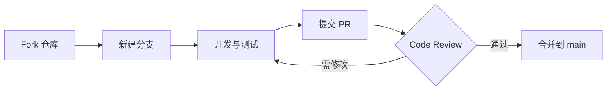
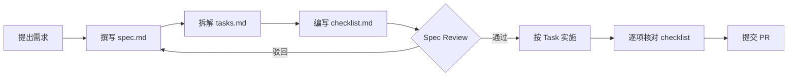

# 贡献指南

欢迎为「整合企业知识库的智能客服系统」贡献代码！本指南涵盖贡献流程、开发环境搭建、Spec 驱动开发、代码规范与文档更新要求。

!!! info "项目仓库"

    - GitHub：[sakura-del/Intelligent-customer-service-system-integrated-with-enterprise-knowledge-base](https://github.com/sakura-del/Intelligent-customer-service-system-integrated-with-enterprise-knowledge-base)
    - 当前版本：v0.4.0
    - 测试用例：668+ 个

---

## 贡献流程

所有贡献通过 Pull Request 提交，遵循 Fork → 分支 → PR 三步流程。



### 1. Fork 与克隆

```bash
# 1. 在 GitHub 上 Fork 仓库到你自己的账号
# 2. 克隆 Fork 后的仓库到本地
git clone https://github.com/<your-username>/Intelligent-customer-service-system-integrated-with-enterprise-knowledge-base.git
cd Intelligent-customer-service-system-integrated-with-enterprise-knowledge-base

# 3. 添加上游仓库，便于同步更新
git remote add upstream https://github.com/sakura-del/Intelligent-customer-service-system-integrated-with-enterprise-knowledge-base.git
```

### 2. 新建分支

**分支命名规范**：

| 前缀 | 用途 | 示例 |
|------|------|------|
| `feat/` | 新功能 | `feat/agent-assist-endpoints` |
| `fix/` | Bug 修复 | `fix/stream-sse-buffering` |
| `docs/` | 文档更新 | `docs/api-reference` |
| `test/` | 测试补充 | `test/escalation-coverage` |
| `refactor/` | 重构 | `refactor/session-manager` |
| `perf/` | 性能优化 | `perf/hot-query-cache` |

```bash
# 同步上游 main 分支，避免基于过期代码开发
git fetch upstream
git checkout main
git merge upstream/main

# 新建功能分支（务必从最新 main 切出）
git checkout -b feat/your-feature
```

### 3. 提交 PR

```bash
# 推送到你的 Fork
git push origin feat/your-feature

# 在 GitHub 上发起 Pull Request 到 upstream/main
```

**PR 标题**遵循 Commit 规范（见下文），描述需包含：

- 变更目的（Why）
- 主要改动（What）
- 测试情况（How verified）
- 关联 Issue（如有）

---

## Commit 规范

采用 [Conventional Commits](https://www.conventionalcommits.org/) 规范，便于自动生成 changelog。

### 格式

```
<type>(<scope>): <subject>

<body>

<footer>
```

### 类型与范围

| type | 说明 | scope 示例 |
|------|------|------------|
| `feat` | 新功能 | `core`, `api`, `agent`, `knowledge` |
| `fix` | Bug 修复 | `api`, `chat`, `stream` |
| `docs` | 文档更新 | `api-reference`, `faq` |
| `test` | 测试补充 | `agent-assist`, `escalation` |
| `refactor` | 重构（不改行为） | `session`, `orchestrator` |
| `perf` | 性能优化 | `cache`, `retriever` |
| `chore` | 构建/工具 | `deps`, `ci` |

### 示例

```bash
# 新功能
git commit -m "feat(agent): 新增 8 个坐席辅助端点补齐人机协同闭环"

# Bug 修复
git commit -m "fix(chat): 修复流式端点 Nginx 缓冲导致首 Token 延迟"

# 文档
git commit -m "docs(api): 更新 API 参考文档，补充坐席端点说明"

# 测试
git commit -m "test(agent): 新增 28 个坐席辅助端点测试用例"

# 性能
git commit -m "perf(cache): HotQueryCache 命中后首 Token 降至 100ms 以内"
```

!!! tip "提交粒度"
    每次提交保持小步可工作，**频繁提交**便于 review 与回滚。单个 PR 的 commit 数建议 ≤ 10 个。

---

## 开发环境

### 环境准备

| 依赖 | 版本要求 | 说明 |
|------|----------|------|
| Python | 3.11+ | 推荐 3.11.9 |
| Redis | 7.0+ | 可选，未安装自动降级内存队列 |
| pip | 最新版 | 避免依赖解析失败 |

### 安装步骤

```bash
# 1. 克隆仓库（见上文 Fork 与克隆）

# 2. 创建虚拟环境
python -m venv .venv
# Windows
.venv\Scripts\activate
# Linux/macOS
source .venv/bin/activate

# 3. 安装依赖
pip install -r requirements.txt

# 4. 配置环境变量
cp .env.example .env
# 编辑 .env，至少配置 LLM_API_KEY（留空则走 mock 模式）

# 5. 验证安装：运行测试套件
python -m pytest tests/ -q
```

### 运行测试

```bash
# 运行全部测试（668+ 用例）
python -m pytest tests/ -q

# 运行指定模块测试
python -m pytest tests/test_agent_assist.py -v

# 运行并输出覆盖率
python -m pytest tests/ --cov=app --cov-report=term-missing

# 仅运行与改动相关的测试（基于 git diff）
python -m pytest tests/ -q -k "agent or chat"
```

!!! warning "测试保障"
    - 重构前确保有足够的测试覆盖
    - 每次修改后运行测试，确保行为不变
    - 新功能必加测试，未覆盖测试的 PR 不会被合并

### 启动开发服务器

```bash
# 开发模式启动（DEBUG=True，自动 reload）
uvicorn app.main:app --reload --host 0.0.0.0 --port 8000

# 访问交互式 API 文档
# http://localhost:8000/docs
```

---

## Spec 驱动开发

本项目采用 **Spec 驱动开发**，新功能必须先写 Spec，审批后方可实施。所有 Spec 存放在 `.trae/specs/` 目录。

### 三件套结构

每个 Spec 是一个独立目录，包含三个文件：

```
.trae/specs/<change-id>/
├── spec.md         # 需求规格：Why / What Changes / Impact
├── tasks.md        # 任务拆解：Task / SubTask / 证据
└── checklist.md    # 验收清单：逐项检查点
```

### 文件职责

??? note "spec.md — 需求规格"

    回答 **为什么做** 与 **做什么**：

    ```markdown
    # 坐席辅助端点 Spec

    ## Why
    当前系统转接后人工客服无 API 支撑……是最大的功能短板。

    ## What Changes
    ### 新增端点（8 个）
    | 端点 | 方法 | 用途 |
    |------|------|------|
    | /api/v1/agent/sessions/pending | GET | 列出待接入会话 |

    ## Impact
    - 新增文件：app/api/v1/agent.py, app/schemas/agent.py
    - 修改文件：app/core/session.py（扩展 4 字段）
    - 破坏性变更：无（API 向后兼容）
    ```

??? note "tasks.md — 任务拆解"

    回答 **怎么做**，按 Task / SubTask 拆解，每项标注证据：

    ```markdown
    - [x] Task 1: 扩展 SessionManager 会话状态字段
      - [x] SubTask 1.1: 新增 agent_status / assigned_agent_id / escalation_card 字段
        - 证据：app/core/session.py:254-263
      - [x] SubTask 1.2: 新增 list_pending_sessions() 方法
        - 证据：app/core/session.py:193-226
    ```

??? note "checklist.md — 验收清单"

    回答 **是否完成**，逐项检查点：

    ```markdown
    ## 功能验收
    - [x] GET /sessions/pending 返回按优先级降序的列表
    - [x] POST /sessions/{id}/accept 并发接手仅一个成功
    - [x] 会话不存在返回 404

    ## 测试覆盖
    - [x] 新增 28 个测试用例全部通过
    - [x] 既有测试不受影响
    ```

### Spec 工作流



!!! tip "Spec 命名"
    - 目录名即 `change-id`，使用 kebab-case：`add-agent-assist-endpoints`
    - 一个 Spec 对应一个 PR，避免一个 Spec 拆多个 PR

### 现有 Spec 参考

| Spec 目录 | 主题 | 状态 |
|-----------|------|------|
| `build-customer-service-system` | 系统初始搭建 | ✅ 已完成 |
| `fix-bge-and-streaming` | BGE 与流式修复 | ✅ 已完成 |
| `integrate-langfuse` | Langfuse 可观测性集成 | ✅ 已完成 |
| `optimize-streaming-experience` | 流式首 Token 优化 | ✅ 已完成 |
| `add-agent-assist-endpoints` | 坐席辅助端点 | ✅ 已完成 |
| `verify-with-real-llm` | 真实 LLM 验证 | ✅ 已完成 |

---

## 代码规范

### 通用规范

| 规范 | 要求 |
|------|------|
| 语言版本 | Python 3.11+，使用 `from __future__ import annotations` 兼容旧语法 |
| 代码风格 | PEP 8，行宽 100 字符 |
| 类型注解 | 公共 API 必须加类型注解，内部函数推荐 |
| 导入顺序 | 标准库 → 第三方 → 本项目，每组内字母序 |

### 命名约定

| 类型 | 规范 | 示例 |
|------|------|------|
| 类 | PascalCase | `SessionManager` |
| 函数/方法 | snake_case | `list_pending_sessions` |
| 变量 | snake_case | `escalation_card` |
| 常量 | UPPER_SNAKE | `ESCALATE_FAILED_THRESHOLD` |
| 私有方法 | 前缀下划线 | `_recognize_intent` |
| 模块文件 | snake_case | `agent_assist.py` |

### 注释与文档

!!! note "注释原则"
    - 注释解释 **为什么**，而不是 **做什么**
    - 代码能自解释的无需注释
    - 公共 API 必须提供 docstring

```python
# ✅ 好的注释：解释为什么
# CAS 保证并发接手只有一个成功，避免重复接手
success = session_manager.assign_agent(session_id, request.agent_id)

# ❌ 坏的注释：复述代码做什么
# 调用 assign_agent 方法
success = session_manager.assign_agent(session_id, request.agent_id)
```

```python
def list_pending_sessions() -> List[Dict]:
    """列出所有待接入会话，按 EscalationPriority 降序。

    供坐席工作台首屏展示待接入队列，
    返回的字典 key 与 AgentSessionSummary 字段已对齐。

    Returns:
        待接入会话摘要列表，按优先级降序
    """
```

### 代码组织

- **相关代码放在一起**：同一 Agent 的逻辑集中在 `app/agents/<agent>.py`
- **函数只做一件事**：超过 50 行的函数考虑拆分
- **保持适当抽象层次**：API 层薄壳，业务逻辑下沉到 core / agents / knowledge 层
- **避免多层嵌套**：用提前返回（early return）替代深层 if-else

### 测试规范

```python
# tests/test_agent_assist.py 风格示例
class TestAcceptSession:
    """坐席接手会话测试。"""

    def test_accept_pending_session_success(self):
        """pending 状态会话可被接手，状态流转到 assigned。"""
        # given: 准备一个 pending 会话
        # when: 调用 accept
        # then: 断言状态变更与返回结构

    def test_accept_already_assigned_returns_409(self):
        """已 assigned 的会话再次接手返回 409。"""
        # 测试边界场景与错误路径
```

!!! warning "测试覆盖要求"
    - 新功能必加测试，覆盖率不低于现有平均水平
    - 边界场景（404 / 409 / 422）必须有测试
    - 并发场景（如 CAS）必须有测试

---

## 文档更新要求

文档与代码同步更新是 PR 合并的硬性要求。

| 变更类型 | 必须更新的文档 |
|----------|----------------|
| 新增功能 | `README.md` |
| 新增端点 | `docs/api-reference.zh.md` |
| 配置项变更 | `docs/configuration.md` |
| 新增示例 | `docs/examples.zh.md` |
| Bug 修复（影响行为） | `docs/changelog.zh.md` |
| 新增常见问题 | `docs/faq.zh.md` |

### 文档风格

- 使用 MkDocs Material 风格的 Markdown
- 充分使用 admonition（`!!!`）、tabbed（`===`）、details（`???`）
- 文件名使用 `.zh.md` 后缀
- 每个文档顶部有 YAML front matter

```markdown
---
title: 文档标题
description: 文档简短描述
weight: 100
---

# 文档标题

!!! info "提示框"
    使用 admonition 突出重要信息

=== "Tab 1"
    内容

??? question "可折叠问题"
    答案
```

---

## Issue 与 Bug 报告

提交 Issue 前请先搜索是否已有相同问题。

### Bug 报告模板

```markdown
**问题描述**
简明描述遇到的问题。

**复现步骤**
1. 启动服务 `uvicorn app.main:app`
2. 调用端点 `POST /api/v1/chat`，请求体：{...}
3. 观察到：...

**预期行为**
应该返回 ...

**实际行为**
返回了 ...

**环境信息**
- OS: Windows 11 / Ubuntu 22.04
- Python: 3.11.9
- 项目版本: v0.4.0
- 是否配置 LLM_API_KEY: 是/否
- 是否启动 Redis: 是/否

**日志/截图**
（附上相关日志或截图）
```

### 功能请求模板

```markdown
**需求场景**
为什么需要这个功能，解决什么问题。

**期望方案**
希望如何实现，有无参考方案。

**替代方案**
是否考虑过其他实现方式。

**额外信息**
其他需要说明的内容。
```

---

## 相关文档

- [API 参考](api-reference.zh.md)：端点变更时必更新
- [更新日志](changelog.zh.md)：版本发布记录
- [常见问题](faq.zh.md)：开发与使用中的高频问题
- [架构设计](architecture.md)：理解系统整体设计
