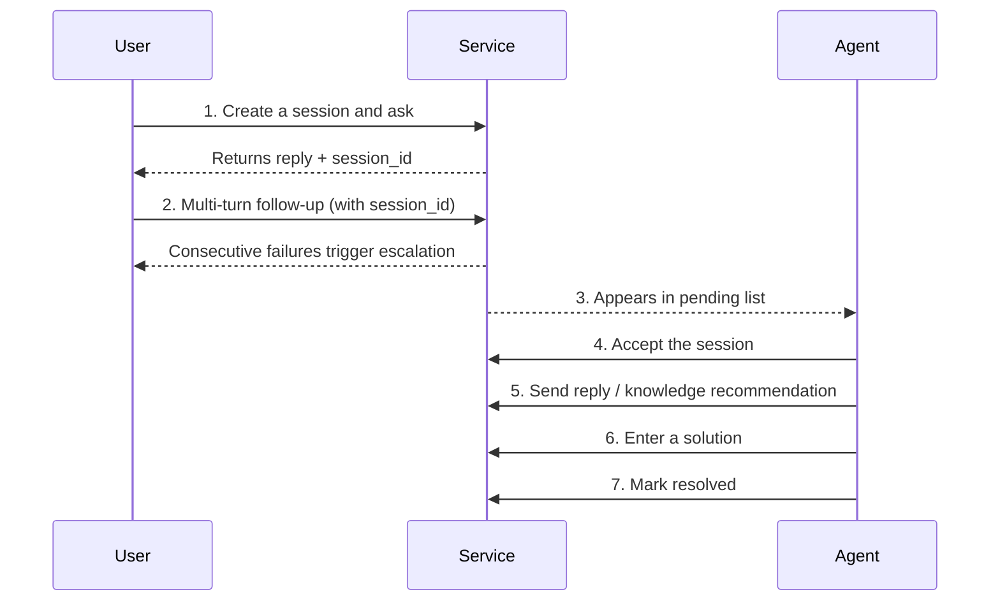

# Examples

This page provides 5 progressive hands-on examples covering the four scenarios of chat, ingestion, agent assist, and observability. All examples can be copied and run directly (please start the service first per [Quick Start](quick-start.md)).

!!! info "Environment conventions"

    The following examples assume:

    - The service is running at `http://localhost:8000`
    - `API_KEY` is set in `.env` and referenced via the environment variable `$API_KEY`
    - The knowledge base already has base documents ingested (e.g. `return_policy.md`)

---

## Example 1: Complete Customer Service Chat Flow (curl)

Simulates a typical customer service chat: user asks → multi-turn follow-up → escalation triggered → agent accepts → solution entered → marked resolved.



### Step 1: Create a session and ask the first question

```bash
# Create a session (auto-created when session_id is omitted), and keep the returned session_id for subsequent turns
curl -s -X POST http://localhost:8000/api/v1/chat \
  -H "X-API-Key: $API_KEY" \
  -H "Content-Type: application/json" \
  -d '{"message": "What is the return process?", "channel": "web"}' | jq .
```

??? success "Expected response"
    ```json
    {
      "session_id": "sess-abc123",
      "reply": "Hello, the return process is: 1. Go to My Orders...",
      "status": "ok",
      "data": {
        "intent": "knowledge_qa",
        "sources": [{"source": "return_policy.md", "score": 0.92}],
        "escalate_to_human": false,
        "turn_count": 1
      }
    }
    ```

### Step 2: Multi-turn follow-up triggers escalation

```bash
# Deliberately ask a question the system cannot answer; consecutive failures will trigger escalation
SESSION_ID="sess-abc123"

curl -s -X POST http://localhost:8000/api/v1/chat \
  -H "X-API-Key: $API_KEY" \
  -H "Content-Type: application/json" \
  -d "{\"message\": \"My order ORG-999999 cannot be found and needs urgent handling\", \"session_id\": \"$SESSION_ID\"}" | jq .
```

??? warning "Escalation triggered response"
    ```json
    {
      "session_id": "sess-abc123",
      "reply": "Transferring you to a human agent, please hold...",
      "status": "ok",
      "data": {
        "intent": "business_query",
        "escalate_to_human": true,
        "escalation_card": {
          "session_id": "sess-abc123",
          "escalate_reason": "Consecutive failures reached threshold",
          "priority": "urgent",
          "summary": "Order ORG-999999 cannot be found and needs urgent handling"
        },
        "failed_attempts": 3
      }
    }
    ```

### Step 3: Agent views the pending list

```bash
# List all pending sessions (sorted by priority descending)
curl -s http://localhost:8000/api/v1/agent/sessions/pending \
  -H "X-API-Key: $API_KEY" | jq .
```

### Step 4: Agent accepts the session

```bash
curl -s -X POST "http://localhost:8000/api/v1/agent/sessions/$SESSION_ID/accept" \
  -H "X-API-Key: $API_KEY" \
  -H "Content-Type: application/json" \
  -d '{"agent_id": "agent-001"}' | jq .
```

!!! note "CAS concurrency safety"
    When multiple agents concurrently accept the same session, only one succeeds; the rest receive `409 Conflict`.

### Step 5: Agent sends a reply + knowledge recommendation

```bash
# Call knowledge recommendation assist to get related chunks
curl -s -X POST "http://localhost:8000/api/v1/agent/sessions/$SESSION_ID/knowledge-recommend" \
  -H "X-API-Key: $API_KEY" \
  -H "Content-Type: application/json" \
  -d '{"query": "How to handle a missing order", "top_k": 3}' | jq .

# Agent sends a reply to the user
curl -s -X POST "http://localhost:8000/api/v1/agent/sessions/$SESSION_ID/messages" \
  -H "X-API-Key: $API_KEY" \
  -H "Content-Type: application/json" \
  -d '{"content": "Hello, I have found your order ORG-999999 and am expediting it..."}' | jq .
```

### Step 6: Enter a solution to consolidate back to the knowledge base

```bash
curl -s -X POST "http://localhost:8000/api/v1/agent/sessions/$SESSION_ID/solution" \
  -H "X-API-Key: $API_KEY" \
  -H "Content-Type: application/json" \
  -d '{
    "question": "How to handle a missing order ORG-999999",
    "solution": "Verify the order number, then transfer to the ticket system for expedited handling; SLA 4 hours for reply",
    "intent": "business_query"
  }' | jq .
```

### Step 7: Mark the session resolved

```bash
curl -s -X POST "http://localhost:8000/api/v1/agent/sessions/$SESSION_ID/resolve" \
  -H "X-API-Key: $API_KEY" \
  -H "Content-Type: application/json" \
  -d '{"note": "Expedited and the user confirmed receipt"}' | jq .
```

---

## Example 2: Python SDK-style Calls

Wraps a lightweight client class covering the three high-frequency scenarios of synchronous chat, streaming chat, and knowledge base ingestion.

=== "Complete client class"

    ```python
    """Lightweight client wrapper for the intelligent customer service system.

    Uses the requests library to cover synchronous chat, SSE streaming chat,
    and knowledge base ingestion.
    """
    import json
    from typing import Generator, Optional

    import requests


    class CustomerServiceClient:
        """Intelligent customer service system client.

        Wraps the auth header and base URL; provides chat, streaming chat, ingest, and other methods.
        """

        def __init__(self, base_url: str, api_key: Optional[str] = None):
            self.base_url = base_url.rstrip("/")
            # When api_key is empty, development no-auth mode is used and no auth header is set
            self.headers = {"X-API-Key": api_key} if api_key else {}

        def chat(
            self,
            message: str,
            session_id: Optional[str] = None,
            channel: str = "web",
        ) -> dict:
            """Synchronous chat; returns the full ChatResponse."""
            payload = {"message": message, "channel": channel}
            # Reuse an existing session_id to keep multi-turn context continuous
            if session_id:
                payload["session_id"] = session_id
            resp = requests.post(
                f"{self.base_url}/api/v1/chat",
                headers={**self.headers, "Content-Type": "application/json"},
                json=payload,
                timeout=30,
            )
            resp.raise_for_status()
            return resp.json()

        def chat_stream(
            self,
            message: str,
            session_id: Optional[str] = None,
        ) -> Generator[dict, None, None]:
            """SSE streaming chat; yields the parsed dict per event.

            Event types: meta / token / done / error.
            """
            payload = {"message": message}
            if session_id:
                payload["session_id"] = session_id
            # stream=True tells requests not to buffer the full response; read line by line
            with requests.post(
                f"{self.base_url}/api/v1/chat/stream",
                headers={
                    **self.headers,
                    "Content-Type": "application/json",
                    "Accept": "text/event-stream",
                },
                json=payload,
                stream=True,
                timeout=60,
            ) as resp:
                resp.raise_for_status()
                event_type = None
                # SSE pairs event: and data: lines; an empty line ends an event
                for line in resp.iter_lines(decode_unicode=True):
                    if not line:
                        continue
                    if line.startswith("event:"):
                        event_type = line[6:].strip()
                    elif line.startswith("data:") and event_type:
                        yield {"type": event_type, "data": json.loads(line[5:].strip())}
                        event_type = None

        def ingest(
            self,
            file_path: str,
            knowledge_type: str = "doc",
            register: bool = True,
        ) -> dict:
            """Upload a document for ingestion; returns IngestResult."""
            # File uploads must use multipart; do not preset Content-Type
            with open(file_path, "rb") as f:
                files = {"file": (file_path, f)}
                data = {"knowledge_type": knowledge_type, "register": str(register).lower()}
                resp = requests.post(
                    f"{self.base_url}/api/v1/knowledge/ingest",
                    headers=self.headers,
                    files=files,
                    data=data,
                    timeout=120,
                )
            resp.raise_for_status()
            return resp.json()

        def invalidate_cache(self) -> dict:
            """Clear the hot cache; must be called after knowledge base updates."""
            resp = requests.post(
                f"{self.base_url}/api/v1/performance/cache/invalidate",
                headers=self.headers,
                timeout=10,
            )
            resp.raise_for_status()
            return resp.json()
    ```

=== "Usage example"

    ```python
    # Initialize the client (development no-auth mode when API_KEY is empty)
    client = CustomerServiceClient(
        base_url="http://localhost:8000",
        api_key="your-api-key",
    )

    # 1. Synchronous chat and keep session_id
    resp = client.chat(message="What is the return process?")
    session_id = resp["session_id"]
    print(f"First reply: {resp['reply']}")

    # 2. Multi-turn chat reusing session_id
    resp = client.chat(message="What evidence do I need to provide?", session_id=session_id)
    print(f"Follow-up reply: {resp['reply']}")

    # 3. Streaming chat printing token by token
    for event in client.chat_stream(message="What benefits do membership tiers have?"):
        if event["type"] == "token":
            print(event["data"]["content"], end="", flush=True)
        elif event["type"] == "done":
            print()  # final newline

    # 4. Ingest a new document and clear the cache
    result = client.ingest(file_path="new_policy.md", knowledge_type="policy")
    print(f"Ingested {result['chunk_count']} chunks")
    client.invalidate_cache()
    ```

---

## Example 3: Knowledge Base Batch Ingestion Script {#example-3-batch-ingestion}

Iterates all PDF/Word/Markdown files in the specified directory, calls the `ingest` endpoint for each, and clears the cache after all ingestions are complete.

```python
"""Knowledge base batch ingestion script.

Iterates PDF / Word / Markdown files in the specified directory,
calls /api/v1/knowledge/ingest one by one for ingestion,
and clears the hot cache after completion to ensure new content takes effect immediately.
"""
import os
import sys
from pathlib import Path

import requests

# Supported file extensions (kept in sync with app/knowledge/parsers.py)
SUPPORTED_EXTENSIONS = {".pdf", ".docx", ".doc", ".md", ".txt", ".html"}


def batch_ingest(
    directory: str,
    base_url: str = "http://localhost:8000",
    api_key: str | None = None,
) -> None:
    """Batch ingest all supported-format documents in a directory.

    Args:
        directory: Directory containing the documents to ingest
        base_url: Service base URL
        api_key: Auth key; None enters development no-auth mode
    """
    headers = {"X-API-Key": api_key} if api_key else {}
    ingest_url = f"{base_url}/api/v1/knowledge/ingest"
    invalidate_url = f"{base_url}/api/v1/performance/cache/invalidate"

    root = Path(directory)
    if not root.is_dir():
        print(f"Directory does not exist: {directory}", file=sys.stderr)
        sys.exit(1)

    # Collect all supported-format files, sorted by filename for stable ingestion order
    files = sorted(
        p for p in root.rglob("*")
        if p.is_file() and p.suffix.lower() in SUPPORTED_EXTENSIONS
    )
    if not files:
        print(f"No ingestible files found under {directory}")
        return

    print(f"Found {len(files)} files to ingest")
    success, failed = 0, 0

    for idx, file_path in enumerate(files, start=1):
        # Use the relative path as the source identifier so it is easy to find in the document list
        source_name = str(file_path.relative_to(root))
        try:
            with open(file_path, "rb") as f:
                # register=true enables version management for later rollback
                resp = requests.post(
                    ingest_url,
                    headers=headers,
                    files={"file": (source_name, f)},
                    data={
                        "register": "true",
                        "validate_quality": "true",
                        "knowledge_type": _guess_type(file_path.suffix),
                    },
                    timeout=120,
                )
            resp.raise_for_status()
            result = resp.json()
            print(f"[{idx}/{len(files)}] OK {source_name} ingested {result['chunk_count']} chunks")
            success += 1
        except requests.RequestException as exc:
            # A single file failure does not interrupt the overall ingestion; log and continue
            print(f"[{idx}/{len(files)}] FAIL {source_name} ingestion failed: {exc}")
            failed += 1

    # After all ingestions, clear the hot cache to avoid HotQueryCache returning stale replies
    try:
        cleared = requests.post(invalidate_url, headers=headers, timeout=10).json()
        print(f"\nCleared {cleared.get('cleared', 0)} hot cache entries")
    except requests.RequestException as exc:
        print(f"\nCache clear failed (does not affect ingestion results): {exc}", file=sys.stderr)

    print(f"Ingestion complete: success {success}, failed {failed}")


def _guess_type(suffix: str) -> str:
    """Guess the knowledge type from the extension; fall back to doc if no match."""
    mapping = {".md": "doc", ".txt": "doc", ".pdf": "doc",
               ".docx": "doc", ".doc": "doc", ".html": "doc"}
    return mapping.get(suffix.lower(), "doc")


if __name__ == "__main__":
    # Usage: python batch_ingest.py <directory path> [api_key]
    import os
    api_key = sys.argv[2] if len(sys.argv) > 2 else os.getenv("API_KEY")
    batch_ingest(directory=sys.argv[1], api_key=api_key)
```

??? tip "How to run"
    ```bash
    # Set the API_KEY environment variable and run
    export API_KEY="your-api-key"
    python batch_ingest.py /path/to/docs

    # Or pass it directly
    python batch_ingest.py /path/to/docs your-api-key
    ```

---

## Example 4: Complete Agent Assist Workflow Code

Simulates the agent workbench backend logic: poll the pending list → accept the highest priority → call knowledge recommendation + business assist → send a reply → enter a solution → mark resolved.

```python
"""Agent assist workflow automation example.

Simulates the agent workbench backend logic:
1. Poll the pending list, take the highest-priority session by descending priority
2. Accept the session (CAS ensures concurrency safety)
3. Call knowledge recommendation + business assist to get context
4. Synthesize a reply from the context and send it
5. Enter a solution to consolidate back to the knowledge base
6. Mark the session resolved
"""
import time
from typing import Optional

import requests


class AgentWorkflow:
    """Agent assist workflow wrapper."""

    # Priority sort weights: urgent > high > normal > info
    PRIORITY_WEIGHT = {"urgent": 4, "high": 3, "normal": 2, "info": 1}

    def __init__(self, base_url: str, api_key: str, agent_id: str):
        self.base_url = base_url.rstrip("/")
        self.headers = {"X-API-Key": api_key, "Content-Type": "application/json"}
        self.agent_id = agent_id

    def poll_and_handle(self, poll_interval: float = 5.0, max_rounds: int = 10) -> int:
        """Poll the pending list and handle sessions; returns the number of handled sessions.

        Args:
            poll_interval: Polling interval in seconds
            max_rounds: Maximum polling rounds to avoid infinite loops
        Returns:
            Number of successfully handled sessions
        """
        handled = 0
        for round_idx in range(max_rounds):
            pending = self._list_pending()
            if not pending:
                print(f"[Round {round_idx + 1}] No pending sessions; waiting {poll_interval}s")
                time.sleep(poll_interval)
                continue

            # Take the first by descending priority so urgent sessions are handled first
            target = max(pending, key=lambda s: self.PRIORITY_WEIGHT.get(s.get("priority"), 0))
            session_id = target["session_id"]
            print(f"[Round {round_idx + 1}] Accepting session {session_id} (priority {target.get('priority')})")

            if self._handle_session(session_id):
                handled += 1
        return handled

    def _list_pending(self) -> list[dict]:
        """Get the pending session list."""
        resp = requests.get(
            f"{self.base_url}/api/v1/agent/sessions/pending",
            headers=self.headers,
            timeout=10,
        )
        resp.raise_for_status()
        return resp.json()

    def _handle_session(self, session_id: str) -> bool:
        """Handle a single session: accept -> assist -> reply -> solution -> resolve."""
        # 1. Accept the session (CAS ensures concurrency safety; failure means another agent accepted)
        if not self._accept(session_id):
            print(f"  Session {session_id} was accepted by another agent; skipping")
            return False

        # 2. View session details to get the user's last message
        detail = self._get_detail(session_id)
        user_message = self._extract_last_user_message(detail)
        print(f"  User's last message: {user_message[:50]}...")

        # 3. Call knowledge recommendation + business assist in parallel to get context
        knowledge = self._recommend_knowledge(session_id, user_message)
        business = self._assist_business(session_id, user_message)
        print(f"  Knowledge recommendations {knowledge['total']}, business scene {business['result'].get('scene')}")

        # 4. Synthesize a reply from the context and send it
        reply = self._compose_reply(knowledge, business, user_message)
        self._send_message(session_id, reply)
        print(f"  Reply sent ({len(reply)} chars)")

        # 5. Enter a solution to consolidate back to the knowledge base for the next bot match
        self._submit_solution(session_id, user_message, reply)
        print(f"  Solution entered into the pending review queue")

        # 6. Mark the session resolved
        self._resolve(session_id)
        print(f"  Session marked resolved")
        return True

    def _accept(self, session_id: str) -> bool:
        """Accept the session; treat 409 as already accepted and return False."""
        resp = requests.post(
            f"{self.base_url}/api/v1/agent/sessions/{session_id}/accept",
            headers=self.headers,
            json={"agent_id": self.agent_id},
            timeout=10,
        )
        return resp.status_code == 200

    def _get_detail(self, session_id: str) -> dict:
        """Get session details, including full history."""
        resp = requests.get(
            f"{self.base_url}/api/v1/agent/sessions/{session_id}",
            headers=self.headers,
            timeout=10,
        )
        resp.raise_for_status()
        return resp.json()

    @staticmethod
    def _extract_last_user_message(detail: dict) -> str:
        """Extract the last user message from history."""
        history = detail.get("history", [])
        # Search in reverse for the last message with role=user
        for msg in reversed(history):
            if msg.get("role") == "user":
                return msg.get("content", "")
        return ""

    def _recommend_knowledge(self, session_id: str, query: str) -> dict:
        """Knowledge recommendation assist."""
        resp = requests.post(
            f"{self.base_url}/api/v1/agent/sessions/{session_id}/knowledge-recommend",
            headers=self.headers,
            json={"query": query, "top_k": 3},
            timeout=15,
        )
        resp.raise_for_status()
        return resp.json()

    def _assist_business(self, session_id: str, query: str) -> dict:
        """Business query assist."""
        resp = requests.post(
            f"{self.base_url}/api/v1/agent/sessions/{session_id}/business-assist",
            headers=self.headers,
            json={"query": query},
            timeout=15,
        )
        resp.raise_for_status()
        return resp.json()

    @staticmethod
    def _compose_reply(knowledge: dict, business: dict, user_message: str) -> str:
        """Synthesize the agent reply from knowledge recommendation and business assist results.

        In production, an LLM can be plugged in to generate a more natural reply; here we use rule-based concatenation for demonstration.
        """
        parts = []
        if business["result"].get("reply"):
            parts.append(business["result"]["reply"])
        if knowledge["chunks"]:
            # Take the highest-scoring chunk as a supplementary note
            top_chunk = knowledge["chunks"][0]
            parts.append(f"Reference: {top_chunk['content'][:100]}")
        return "\n".join(parts) if parts else "Hello, we have received your feedback and are processing it."

    def _send_message(self, session_id: str, content: str) -> None:
        """Agent sends a message to the user."""
        resp = requests.post(
            f"{self.base_url}/api/v1/agent/sessions/{session_id}/messages",
            headers=self.headers,
            json={"content": content},
            timeout=10,
        )
        resp.raise_for_status()

    def _submit_solution(self, session_id: str, question: str, solution: str) -> None:
        """Enter a solution to consolidate back to the knowledge base."""
        resp = requests.post(
            f"{self.base_url}/api/v1/agent/sessions/{session_id}/solution",
            headers=self.headers,
            json={"question": question, "solution": solution},
            timeout=10,
        )
        resp.raise_for_status()

    def _resolve(self, session_id: str) -> None:
        """Mark the session resolved."""
        resp = requests.post(
            f"{self.base_url}/api/v1/agent/sessions/{session_id}/resolve",
            headers=self.headers,
            json={"note": "Auto-handled by agent workflow"},
            timeout=10,
        )
        resp.raise_for_status()


if __name__ == "__main__":
    workflow = AgentWorkflow(
        base_url="http://localhost:8000",
        api_key="your-api-key",
        agent_id="agent-bot-001",
    )
    handled = workflow.poll_and_handle(poll_interval=5.0, max_rounds=20)
    print(f"\nThis round handled {handled} sessions")
```

---

## Example 5: Integrating with Langfuse to View Traces {#example-5-langfuse}

The system has built-in Langfuse tracing; all 11 LLM call points are tagged with prompt name/version. This example shows how to configure and view traces via Langfuse.

### Configure Langfuse

Fill in your Langfuse credentials in `.env`:

```bash
# .env
LANGFUSE_ENABLED=True
LANGFUSE_PUBLIC_KEY=pk-lf-xxxxx
LANGFUSE_SECRET_KEY=sk-lf-xxxxx
LANGFUSE_HOST=https://cloud.langfuse.com
```

!!! tip "Obtaining credentials"
    1. Register at [Langfuse Cloud](https://cloud.langfuse.com)
    2. Go to Project Settings → API Keys
    3. Copy the `PUBLIC_KEY` and `SECRET_KEY`

### Trigger a chat to generate a trace

```python
"""Trigger a chat and query the corresponding trace via the Langfuse SDK.

The chat endpoint already reports traces automatically; this shows how to correlate traces on the client side.
"""
import os
import requests
from langfuse import Langfuse

# 1. Trigger a streaming chat (the streaming endpoint creates a stream_chat trace)
resp = requests.post(
    "http://localhost:8000/api/v1/chat/stream",
    headers={
        "X-API-Key": os.getenv("API_KEY"),
        "Content-Type": "application/json",
    },
    json={"message": "What is the return process?"},
    stream=True,
    timeout=60,
)
# Consume the full stream to ensure the trace completes
for line in resp.iter_lines():
    pass
print("Chat complete; trace reported to Langfuse")

# 2. Query recent traces via the Langfuse SDK
langfuse = Langfuse(
    public_key=os.getenv("LANGFUSE_PUBLIC_KEY"),
    secret_key=os.getenv("LANGFUSE_SECRET_KEY"),
    host=os.getenv("LANGFUSE_HOST"),
)
# Take the 5 most recent traces by time descending
recent_traces = langfuse.get_traces(limit=5)
for trace in recent_traces.data:
    print(f"- {trace.name} | id={trace.id} | latency={trace.latency}ms")
```

### View in the Langfuse Console

??? info "Observable fields"

    | Field | Description |
    |-------|-------------|
    | `trace.name` | Fixed to `stream_chat` / `recognize_intent` / `query_rewrite`, etc. |
    | `trace.session_id` | Correlated with the system session_id |
    | `generation.prompt` | Full prompt content (including system / user messages) |
    | `generation.name` | Prompt identifier, e.g. `recognize_intent_v1` |
    | `generation.usage` | Token usage (prompt / completion / total) |
    | `generation.latency` | LLM call duration |

??? question "Will not configuring Langfuse block the main chain?"
    No. When `LANGFUSE_ENABLED=False` or credentials are empty, all Langfuse calls degrade to no-op without affecting chat and retrieval performance. See [FAQ](faq.en.md).

### View Local Traces via Monitoring Endpoints

If you have not integrated Langfuse, the built-in `Monitor` also records trace summaries, viewable via `/api/v1/monitor/traces`:

```bash
# View the 10 most recent trace summaries
curl -s "http://localhost:8000/api/v1/monitor/traces?limit=10" | jq .

# View a single trace's details (including per-step duration)
TRACE_ID="trace-xxxxx"
curl -s "http://localhost:8000/api/v1/monitor/traces/$TRACE_ID" | jq .
```

??? example "Trace detail structure"
    ```json
    {
      "trace_id": "trace-xxxxx",
      "session_id": "sess-abc123",
      "status": "success",
      "start_time": "2026-07-03T08:30:00+00:00",
      "duration_ms": 1850,
      "steps": [
        {"step": "recognize_intent", "duration_ms": 320, "status": "success"},
        {"step": "retrieve", "duration_ms": 280, "status": "success"},
        {"step": "rerank", "duration_ms": 150, "status": "success"},
        {"step": "stream_first_token", "duration_ms": 850, "status": "success"},
        {"step": "generate", "duration_ms": 1100, "status": "success"}
      ]
    }
    ```

---

## Related Documentation

- [API Reference](api-reference.en.md): detailed descriptions of all endpoints
- [FAQ](faq.en.md): four categories of FAQ covering installation, configuration, usage, and performance
- [Agent Assist Workbench](tutorials/agent-assist.md): an in-depth tutorial on agent endpoints
- [Observability](tutorials/observability.md): full description of Langfuse and the monitoring dashboard
