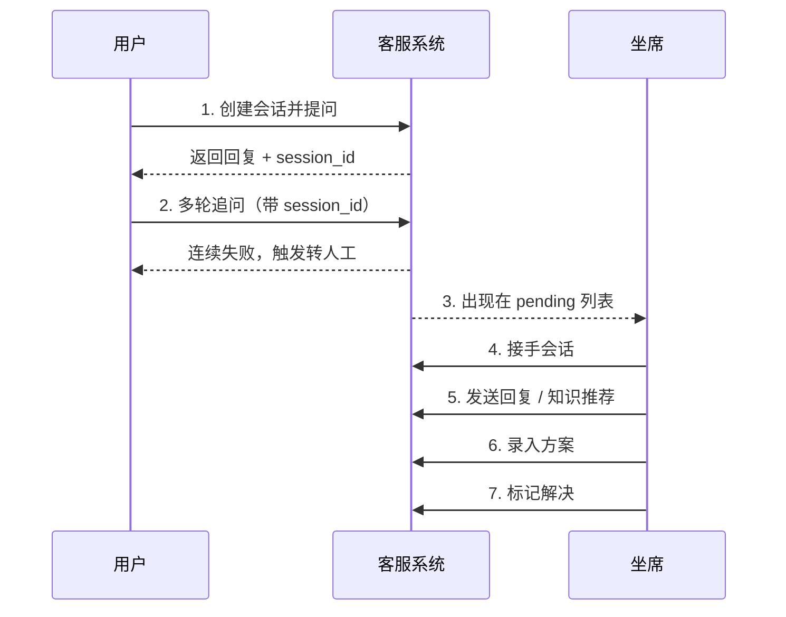

# 示例

本页提供 5 个由浅入深的实战示例，覆盖对话、入库、坐席辅助、可观测性四大场景。所有示例均可直接复制运行（请先按 [快速开始](quick-start.md) 启动服务）。

!!! info "环境约定"

    以下示例假设：

    - 服务运行在 `http://localhost:8000`
    - 已在 `.env` 中设置 `API_KEY`，并通过环境变量 `$API_KEY` 引用
    - 知识库已入库基础文档（如 `return_policy.md`）

---

## 示例 1：完整客服对话流程（curl）

模拟一次典型的客服对话：用户提问 → 多轮追问 → 触发转人工 → 坐席接手 → 录入方案 → 标记解决。



### 步骤 1：创建会话并首次提问

```bash
# 创建会话（不传 session_id 自动创建），并保留返回的 session_id 用于后续轮次
curl -s -X POST http://localhost:8000/api/v1/chat \
  -H "X-API-Key: $API_KEY" \
  -H "Content-Type: application/json" \
  -d '{"message": "退货流程是什么？", "channel": "web"}' | jq .
```

??? success "预期响应"
    ```json
    {
      "session_id": "sess-abc123",
      "reply": "您好，退货流程如下：1. 进入「我的订单」……",
      "status": "ok",
      "data": {
        "intent": "knowledge_qa",
        "sources": [{"source": "return_policy.md", "score": 0.92}],
        "escalate_to_human": false,
        "turn_count": 1
      }
    }
    ```

### 步骤 2：多轮追问触发转人工

```bash
# 故意提出系统无法解答的问题，连续失败会触发转人工
SESSION_ID="sess-abc123"

curl -s -X POST http://localhost:8000/api/v1/chat \
  -H "X-API-Key: $API_KEY" \
  -H "Content-Type: application/json" \
  -d "{\"message\": \"我的订单 ORG-999999 找不到，需要紧急处理\", \"session_id\": \"$SESSION_ID\"}" | jq .
```

??? warning "转人工触发响应"
    ```json
    {
      "session_id": "sess-abc123",
      "reply": "正在为您转接人工客服，请稍候……",
      "status": "ok",
      "data": {
        "intent": "business_query",
        "escalate_to_human": true,
        "escalation_card": {
          "session_id": "sess-abc123",
          "escalate_reason": "连续失败达阈值",
          "priority": "urgent",
          "summary": "订单 ORG-999999 找不到，需要紧急处理"
        },
        "failed_attempts": 3
      }
    }
    ```

### 步骤 3：坐席查看待接入列表

```bash
# 列出所有 pending 会话（按优先级降序）
curl -s http://localhost:8000/api/v1/agent/sessions/pending \
  -H "X-API-Key: $API_KEY" | jq .
```

### 步骤 4：坐席接手会话

```bash
curl -s -X POST "http://localhost:8000/api/v1/agent/sessions/$SESSION_ID/accept" \
  -H "X-API-Key: $API_KEY" \
  -H "Content-Type: application/json" \
  -d '{"agent_id": "agent-001"}' | jq .
```

!!! note "CAS 并发安全"
    多个坐席同时接手同一会话时只有一个成功，其余收到 `409 Conflict`。

### 步骤 5：坐席发送回复 + 知识推荐

```bash
# 调用知识推荐辅助获取相关片段
curl -s -X POST "http://localhost:8000/api/v1/agent/sessions/$SESSION_ID/knowledge-recommend" \
  -H "X-API-Key: $API_KEY" \
  -H "Content-Type: application/json" \
  -d '{"query": "订单找不到如何处理", "top_k": 3}' | jq .

# 坐席向用户发送回复
curl -s -X POST "http://localhost:8000/api/v1/agent/sessions/$SESSION_ID/messages" \
  -H "X-API-Key: $API_KEY" \
  -H "Content-Type: application/json" \
  -d '{"content": "您好，已为您查到订单 ORG-999999，正在加急处理……"}' | jq .
```

### 步骤 6：录入方案沉淀回库

```bash
curl -s -X POST "http://localhost:8000/api/v1/agent/sessions/$SESSION_ID/solution" \
  -H "X-API-Key: $API_KEY" \
  -H "Content-Type: application/json" \
  -d '{
    "question": "订单 ORG-999999 找不到如何处理",
    "solution": "核实订单号后转工单系统加急处理，SLA 4 小时内回复",
    "intent": "business_query"
  }' | jq .
```

### 步骤 7：标记会话已解决

```bash
curl -s -X POST "http://localhost:8000/api/v1/agent/sessions/$SESSION_ID/resolve" \
  -H "X-API-Key: $API_KEY" \
  -H "Content-Type: application/json" \
  -d '{"note": "已加急处理，用户确认收到"}' | jq .
```

---

## 示例 2：Python SDK 风格调用

封装一个轻量客户端类，覆盖同步对话、流式对话与知识库入库三大高频场景。

=== "完整客户端类"

    ```python
    """智能客服系统轻量客户端封装。

    使用 requests 库实现，覆盖同步对话、SSE 流式对话、知识库入库三大场景。
    """
    import json
    from typing import Generator, Optional

    import requests


    class CustomerServiceClient:
        """智能客服系统客户端。

        封装鉴权头与基础 URL，提供对话、流式对话、入库等方法。
        """

        def __init__(self, base_url: str, api_key: Optional[str] = None):
            self.base_url = base_url.rstrip("/")
            # api_key 为空时进入开发免鉴权模式，不设置鉴权头
            self.headers = {"X-API-Key": api_key} if api_key else {}

        def chat(
            self,
            message: str,
            session_id: Optional[str] = None,
            channel: str = "web",
        ) -> dict:
            """同步对话，返回完整 ChatResponse。"""
            payload = {"message": message, "channel": channel}
            # 复用已有 session_id 保证多轮上下文连续
            if session_id:
                payload["session_id"] = session_id
            resp = requests.post(
                f"{self.base_url}/api/v1/chat",
                headers={**self.headers, "Content-Type": "application/json"},
                json=payload,
                timeout=30,
            )
            resp.raise_for_status()
            return resp.json()

        def chat_stream(
            self,
            message: str,
            session_id: Optional[str] = None,
        ) -> Generator[dict, None, None]:
            """SSE 流式对话，逐事件 yield 解析后的 dict。

            事件类型：meta / token / done / error。
            """
            payload = {"message": message}
            if session_id:
                payload["session_id"] = session_id
            # stream=True 让 requests 不缓冲完整响应，逐行读取
            with requests.post(
                f"{self.base_url}/api/v1/chat/stream",
                headers={
                    **self.headers,
                    "Content-Type": "application/json",
                    "Accept": "text/event-stream",
                },
                json=payload,
                stream=True,
                timeout=60,
            ) as resp:
                resp.raise_for_status()
                event_type = None
                # SSE 按 event: / data: 行配对，遇到空行结束一个事件
                for line in resp.iter_lines(decode_unicode=True):
                    if not line:
                        continue
                    if line.startswith("event:"):
                        event_type = line[6:].strip()
                    elif line.startswith("data:") and event_type:
                        yield {"type": event_type, "data": json.loads(line[5:].strip())}
                        event_type = None

        def ingest(
            self,
            file_path: str,
            knowledge_type: str = "doc",
            register: bool = True,
        ) -> dict:
            """上传文档入库，返回 IngestResult。"""
            # 文件上传必须用 multipart，不能预设 Content-Type
            with open(file_path, "rb") as f:
                files = {"file": (file_path, f)}
                data = {"knowledge_type": knowledge_type, "register": str(register).lower()}
                resp = requests.post(
                    f"{self.base_url}/api/v1/knowledge/ingest",
                    headers=self.headers,
                    files=files,
                    data=data,
                    timeout=120,
                )
            resp.raise_for_status()
            return resp.json()

        def invalidate_cache(self) -> dict:
            """清空热点缓存，知识库更新后必调。"""
            resp = requests.post(
                f"{self.base_url}/api/v1/performance/cache/invalidate",
                headers=self.headers,
                timeout=10,
            )
            resp.raise_for_status()
            return resp.json()
    ```

=== "使用示例"

    ```python
    # 初始化客户端（API_KEY 为空时进入开发免鉴权模式）
    client = CustomerServiceClient(
        base_url="http://localhost:8000",
        api_key="your-api-key",
    )

    # 1. 同步对话并保留 session_id
    resp = client.chat(message="退货流程是什么？")
    session_id = resp["session_id"]
    print(f"首轮回复：{resp['reply']}")

    # 2. 多轮对话复用 session_id
    resp = client.chat(message="需要提供什么凭证？", session_id=session_id)
    print(f"追问回复：{resp['reply']}")

    # 3. 流式对话逐 token 打印
    for event in client.chat_stream(message="会员等级有哪些权益？"):
        if event["type"] == "token":
            print(event["data"]["content"], end="", flush=True)
        elif event["type"] == "done":
            print()  # 换行收尾

    # 4. 入库新文档并清缓存
    result = client.ingest(file_path="new_policy.md", knowledge_type="policy")
    print(f"入库 {result['chunk_count']} 个片段")
    client.invalidate_cache()
    ```

---

## 示例 3：知识库批量入库脚本 {#example-3-batch-ingestion}

遍历指定目录下所有 PDF/Word/Markdown 文件，逐个调用 `ingest` 端点，入库后统一清缓存。

```python
"""知识库批量入库脚本。

遍历指定目录下的 PDF / Word / Markdown 文件，
逐个调用 /api/v1/knowledge/ingest 入库，
全部完成后清空热点缓存，确保新内容立即生效。
"""
import os
import sys
from pathlib import Path

import requests

# 支持的文件扩展名（与 app/knowledge/parsers.py 保持一致）
SUPPORTED_EXTENSIONS = {".pdf", ".docx", ".doc", ".md", ".txt", ".html"}


def batch_ingest(
    directory: str,
    base_url: str = "http://localhost:8000",
    api_key: str | None = None,
) -> None:
    """批量入库目录下所有支持格式的文档。

    Args:
        directory: 待入库文档所在目录
        base_url: 服务基址
        api_key: 鉴权 Key，None 时进入开发免鉴权模式
    """
    headers = {"X-API-Key": api_key} if api_key else {}
    ingest_url = f"{base_url}/api/v1/knowledge/ingest"
    invalidate_url = f"{base_url}/api/v1/performance/cache/invalidate"

    root = Path(directory)
    if not root.is_dir():
        print(f"目录不存在：{directory}", file=sys.stderr)
        sys.exit(1)

    # 收集所有支持格式的文件，按文件名排序保证入库顺序稳定
    files = sorted(
        p for p in root.rglob("*")
        if p.is_file() and p.suffix.lower() in SUPPORTED_EXTENSIONS
    )
    if not files:
        print(f"目录 {directory} 下未找到可入库文件")
        return

    print(f"共发现 {len(files)} 个待入库文件")
    success, failed = 0, 0

    for idx, file_path in enumerate(files, start=1):
        # 用相对路径作为 source 标识，便于在文档列表中识别
        source_name = str(file_path.relative_to(root))
        try:
            with open(file_path, "rb") as f:
                # register=true 启用版本管理，便于后续回滚
                resp = requests.post(
                    ingest_url,
                    headers=headers,
                    files={"file": (source_name, f)},
                    data={
                        "register": "true",
                        "validate_quality": "true",
                        "knowledge_type": _guess_type(file_path.suffix),
                    },
                    timeout=120,
                )
            resp.raise_for_status()
            result = resp.json()
            print(f"[{idx}/{len(files)}] ✅ {source_name} 入库 {result['chunk_count']} 片段")
            success += 1
        except requests.RequestException as exc:
            # 单文件失败不中断整体入库，记录后继续
            print(f"[{idx}/{len(files)}] ❌ {source_name} 入库失败：{exc}")
            failed += 1

    # 全部入库后清空热点缓存，避免 HotQueryCache 返回过期回复
    try:
        cleared = requests.post(invalidate_url, headers=headers, timeout=10).json()
        print(f"\n已清空 {cleared.get('cleared', 0)} 条热点缓存")
    except requests.RequestException as exc:
        print(f"\n清缓存失败（不影响入库结果）：{exc}", file=sys.stderr)

    print(f"入库完成：成功 {success}，失败 {failed}")


def _guess_type(suffix: str) -> str:
    """根据扩展名推测知识类型，未匹配时回退 doc。"""
    mapping = {".md": "doc", ".txt": "doc", ".pdf": "doc",
               ".docx": "doc", ".doc": "doc", ".html": "doc"}
    return mapping.get(suffix.lower(), "doc")


if __name__ == "__main__":
    # 用法：python batch_ingest.py <目录路径> [api_key]
    import os
    api_key = sys.argv[2] if len(sys.argv) > 2 else os.getenv("API_KEY")
    batch_ingest(directory=sys.argv[1], api_key=api_key)
```

??? tip "运行方式"
    ```bash
    # 设置 API_KEY 环境变量后运行
    export API_KEY="your-api-key"
    python batch_ingest.py /path/to/docs

    # 或直接传参
    python batch_ingest.py /path/to/docs your-api-key
    ```

---

## 示例 4：坐席辅助工作流完整代码

模拟坐席工作台后台逻辑：轮询 pending 列表 → 接手最高优先级 → 调用知识推荐 + 业务辅助 → 发送回复 → 录入方案 → 标记解决。

```python
"""坐席辅助工作流自动化示例。

模拟坐席工作台后台逻辑：
1. 轮询 pending 列表，按优先级降序取最高优先级会话
2. 接手会话（CAS 保证并发安全）
3. 调用知识推荐 + 业务辅助获取上下文
4. 综合上下文生成回复并发送
5. 录入方案沉淀回库
6. 标记会话已解决
"""
import time
from typing import Optional

import requests


class AgentWorkflow:
    """坐席辅助工作流封装。"""

    # 优先级排序权重：urgent > high > normal > info
    PRIORITY_WEIGHT = {"urgent": 4, "high": 3, "normal": 2, "info": 1}

    def __init__(self, base_url: str, api_key: str, agent_id: str):
        self.base_url = base_url.rstrip("/")
        self.headers = {"X-API-Key": api_key, "Content-Type": "application/json"}
        self.agent_id = agent_id

    def poll_and_handle(self, poll_interval: float = 5.0, max_rounds: int = 10) -> int:
        """轮询 pending 列表并处理，返回处理的会话数。

        Args:
            poll_interval: 轮询间隔秒数
            max_rounds: 最大轮询轮次，避免无限循环
        Returns:
            成功处理的会话数
        """
        handled = 0
        for round_idx in range(max_rounds):
            pending = self._list_pending()
            if not pending:
                print(f"[轮次 {round_idx + 1}] 暂无待接入会话，等待 {poll_interval}s")
                time.sleep(poll_interval)
                continue

            # 按优先级降序取第一个，保证紧急会话优先处理
            target = max(pending, key=lambda s: self.PRIORITY_WEIGHT.get(s.get("priority"), 0))
            session_id = target["session_id"]
            print(f"[轮次 {round_idx + 1}] 接手会话 {session_id}（优先级 {target.get('priority')}）")

            if self._handle_session(session_id):
                handled += 1
        return handled

    def _list_pending(self) -> list[dict]:
        """获取待接入会话列表。"""
        resp = requests.get(
            f"{self.base_url}/api/v1/agent/sessions/pending",
            headers=self.headers,
            timeout=10,
        )
        resp.raise_for_status()
        return resp.json()

    def _handle_session(self, session_id: str) -> bool:
        """处理单个会话：接手 → 辅助 → 回复 → 方案 → 解决。"""
        # 1. 接手会话（CAS 保证并发安全，失败说明已被其他坐席接手）
        if not self._accept(session_id):
            print(f"  会话 {session_id} 已被其他坐席接手，跳过")
            return False

        # 2. 查看会话详情获取用户最后一条消息
        detail = self._get_detail(session_id)
        user_message = self._extract_last_user_message(detail)
        print(f"  用户最后消息：{user_message[:50]}...")

        # 3. 并行调用知识推荐 + 业务辅助获取上下文
        knowledge = self._recommend_knowledge(session_id, user_message)
        business = self._assist_business(session_id, user_message)
        print(f"  知识推荐 {knowledge['total']} 条，业务场景 {business['result'].get('scene')}")

        # 4. 综合上下文生成回复并发送
        reply = self._compose_reply(knowledge, business, user_message)
        self._send_message(session_id, reply)
        print(f"  已发送回复（{len(reply)} 字）")

        # 5. 录入方案沉淀回库，便于下次智能客服命中
        self._submit_solution(session_id, user_message, reply)
        print(f"  方案已录入待审核队列")

        # 6. 标记会话已解决
        self._resolve(session_id)
        print(f"  会话已标记解决")
        return True

    def _accept(self, session_id: str) -> bool:
        """接手会话，409 视为已被接手返回 False。"""
        resp = requests.post(
            f"{self.base_url}/api/v1/agent/sessions/{session_id}/accept",
            headers=self.headers,
            json={"agent_id": self.agent_id},
            timeout=10,
        )
        return resp.status_code == 200

    def _get_detail(self, session_id: str) -> dict:
        """获取会话详情，含完整 history。"""
        resp = requests.get(
            f"{self.base_url}/api/v1/agent/sessions/{session_id}",
            headers=self.headers,
            timeout=10,
        )
        resp.raise_for_status()
        return resp.json()

    @staticmethod
    def _extract_last_user_message(detail: dict) -> str:
        """从 history 中提取最后一条 user 消息。"""
        history = detail.get("history", [])
        # 倒序查找最后一条 role=user 的消息
        for msg in reversed(history):
            if msg.get("role") == "user":
                return msg.get("content", "")
        return ""

    def _recommend_knowledge(self, session_id: str, query: str) -> dict:
        """知识推荐辅助。"""
        resp = requests.post(
            f"{self.base_url}/api/v1/agent/sessions/{session_id}/knowledge-recommend",
            headers=self.headers,
            json={"query": query, "top_k": 3},
            timeout=15,
        )
        resp.raise_for_status()
        return resp.json()

    def _assist_business(self, session_id: str, query: str) -> dict:
        """业务查询辅助。"""
        resp = requests.post(
            f"{self.base_url}/api/v1/agent/sessions/{session_id}/business-assist",
            headers=self.headers,
            json={"query": query},
            timeout=15,
        )
        resp.raise_for_status()
        return resp.json()

    @staticmethod
    def _compose_reply(knowledge: dict, business: dict, user_message: str) -> str:
        """综合知识推荐与业务辅助结果生成坐席回复。

        实际生产可接入 LLM 生成更自然的回复，此处用规则拼接做演示。
        """
        parts = []
        if business["result"].get("reply"):
            parts.append(business["result"]["reply"])
        if knowledge["chunks"]:
            # 取得分最高的片段作为补充说明
            top_chunk = knowledge["chunks"][0]
            parts.append(f"参考说明：{top_chunk['content'][:100]}")
        return "\n".join(parts) if parts else "您好，已收到您的反馈，正在为您处理。"

    def _send_message(self, session_id: str, content: str) -> None:
        """坐席向用户发送消息。"""
        resp = requests.post(
            f"{self.base_url}/api/v1/agent/sessions/{session_id}/messages",
            headers=self.headers,
            json={"content": content},
            timeout=10,
        )
        resp.raise_for_status()

    def _submit_solution(self, session_id: str, question: str, solution: str) -> None:
        """录入方案沉淀回库。"""
        resp = requests.post(
            f"{self.base_url}/api/v1/agent/sessions/{session_id}/solution",
            headers=self.headers,
            json={"question": question, "solution": solution},
            timeout=10,
        )
        resp.raise_for_status()

    def _resolve(self, session_id: str) -> None:
        """标记会话已解决。"""
        resp = requests.post(
            f"{self.base_url}/api/v1/agent/sessions/{session_id}/resolve",
            headers=self.headers,
            json={"note": "坐席工作流自动处理"},
            timeout=10,
        )
        resp.raise_for_status()


if __name__ == "__main__":
    workflow = AgentWorkflow(
        base_url="http://localhost:8000",
        api_key="your-api-key",
        agent_id="agent-bot-001",
    )
    handled = workflow.poll_and_handle(poll_interval=5.0, max_rounds=20)
    print(f"\n本轮共处理 {handled} 个会话")
```

---

## 示例 5：与 Langfuse 集成查看 trace {#example-5-langfuse}

系统已内置 Langfuse 链路追踪，11 个 LLM 调用点全部标记 prompt name/version。本示例演示如何配置并通过 Langfuse 查看 trace。

### 配置 Langfuse

在 `.env` 中填入 Langfuse 凭据：

```bash
# .env
LANGFUSE_ENABLED=True
LANGFUSE_PUBLIC_KEY=pk-lf-xxxxx
LANGFUSE_SECRET_KEY=sk-lf-xxxxx
LANGFUSE_HOST=https://cloud.langfuse.com
```

!!! tip "获取凭据"
    1. 注册 [Langfuse Cloud](https://cloud.langfuse.com)
    2. 进入 Project Settings → API Keys
    3. 复制 `PUBLIC_KEY` 与 `SECRET_KEY`

### 触发一次对话生成 trace

```python
"""触发对话并通过 Langfuse SDK 查询对应 trace。

对话端点内部已自动上报 trace，此处演示如何在客户端关联 trace。
"""
import os
import requests
from langfuse import Langfuse

# 1. 触发一次流式对话（流式端点会创建 stream_chat trace）
resp = requests.post(
    "http://localhost:8000/api/v1/chat/stream",
    headers={
        "X-API-Key": os.getenv("API_KEY"),
        "Content-Type": "application/json",
    },
    json={"message": "退货流程是什么？"},
    stream=True,
    timeout=60,
)
# 消费完整流，确保 trace 完成
for line in resp.iter_lines():
    pass
print("对话已完成，trace 已上报 Langfuse")

# 2. 通过 Langfuse SDK 查询最近 trace
langfuse = Langfuse(
    public_key=os.getenv("LANGFUSE_PUBLIC_KEY"),
    secret_key=os.getenv("LANGFUSE_SECRET_KEY"),
    host=os.getenv("LANGFUSE_HOST"),
)
# 按时间倒序取最近 5 条 trace
recent_traces = langfuse.get_traces(limit=5)
for trace in recent_traces.data:
    print(f"- {trace.name} | id={trace.id} | latency={trace.latency}ms")
```

### 在 Langfuse 控制台查看

??? info "可观测的字段"

    | 字段 | 说明 |
    |------|------|
    | `trace.name` | 固定为 `stream_chat` / `recognize_intent` / `query_rewrite` 等 |
    | `trace.session_id` | 与系统 session_id 关联 |
    | `generation.prompt` | 完整 prompt 内容（含 system / user messages） |
    | `generation.name` | prompt 标识，如 `recognize_intent_v1` |
    | `generation.usage` | token 用量（prompt / completion / total） |
    | `generation.latency` | LLM 调用耗时 |

??? question "未配置 Langfuse 会阻塞主链路吗？"
    不会。`LANGFUSE_ENABLED=False` 或凭据为空时，所有 Langfuse 调用降级为 no-op，不影响对话与检索性能。详见 [常见问题](faq.zh.md)。

### 通过监控端点查看本地 trace

如果未接入 Langfuse，系统内置的 `Monitor` 也记录了 trace 摘要，可通过 `/api/v1/monitor/traces` 查看：

```bash
# 查看最近 10 条 trace 摘要
curl -s "http://localhost:8000/api/v1/monitor/traces?limit=10" | jq .

# 查看单条 trace 详情（含每步耗时）
TRACE_ID="trace-xxxxx"
curl -s "http://localhost:8000/api/v1/monitor/traces/$TRACE_ID" | jq .
```

??? example "trace 详情结构"
    ```json
    {
      "trace_id": "trace-xxxxx",
      "session_id": "sess-abc123",
      "status": "success",
      "start_time": "2026-07-03T08:30:00+00:00",
      "duration_ms": 1850,
      "steps": [
        {"step": "recognize_intent", "duration_ms": 320, "status": "success"},
        {"step": "retrieve", "duration_ms": 280, "status": "success"},
        {"step": "rerank", "duration_ms": 150, "status": "success"},
        {"step": "stream_first_token", "duration_ms": 850, "status": "success"},
        {"step": "generate", "duration_ms": 1100, "status": "success"}
      ]
    }
    ```

---

## 相关文档

- [API 参考](api-reference.zh.md)：全部端点的详细说明
- [常见问题](faq.zh.md)：安装、配置、使用、性能四类 FAQ
- [坐席辅助工作台](tutorials/agent-assist.md)：坐席端点的深入教程
- [可观测性](tutorials/observability.md)：Langfuse 与监控面板的完整说明
