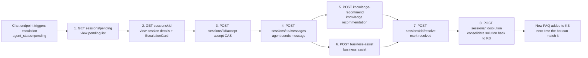
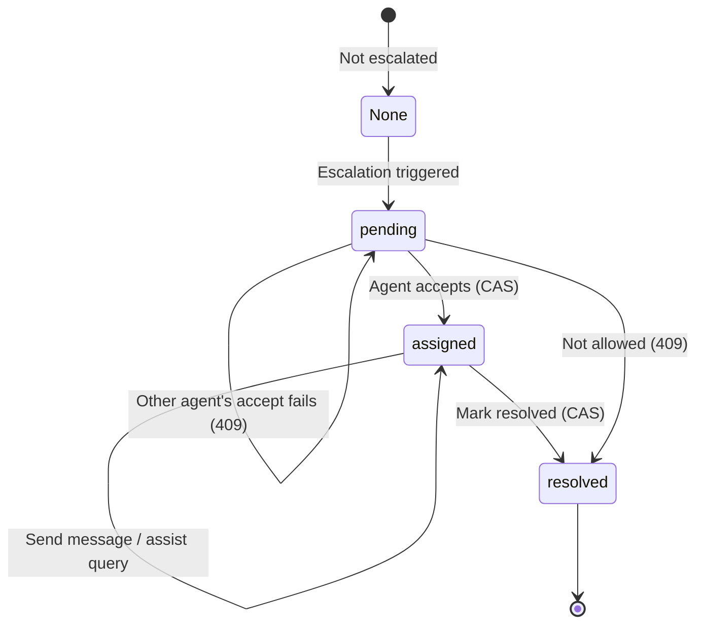

# Agent Assist Workbench Tutorial

When the intelligent customer service system decides that escalation to a human agent is needed, the session enters the `pending` state and joins the agent's pending queue. The agent assist workbench exposes 8 endpoints that support the full closed loop from "view pending → accept → communicate → assisted lookup → resolve → solution consolidation".

!!! info "Prerequisites"

    - Endpoint prefix is uniformly `/api/v1/agent`, auth header `X-API-Key`
    - Escalation has already been triggered via the chat endpoint (`escalate_to_human=true`), and the session `agent_status` is `pending`
    - The escalation context card `EscalationCard` has been generated and cached in the session

---

## Closed-loop Overview

After an escalation occurs, the agent side forms a complete handling loop through 8 endpoints:



---

## State Machine

Session state transitions on the agent side are strictly guarded by CAS (Compare-And-Swap) to prevent concurrent accepts or duplicate operations:



| State | Meaning | Allowed Operations |
| --- | --- | --- |
| `None` | Not escalated; pure bot session | Chat endpoint only |
| `pending` | Escalated; waiting for an agent | View details, accept |
| `assigned` | Agent has accepted | Send message, knowledge recommendation, business assist, mark resolved |
| `resolved` | Resolved | Solution consolidation |

!!! warning "State transition constraints"

    - `pending` cannot `resolve` directly; you must `accept` first
    - Only `assigned` can send messages; sending from `pending`/`resolved` returns 409
    - When multiple agents concurrently accept the same session, only one succeeds; the rest get 409

---

## EscalationCard Structure

The context card generated at escalation lets the agent quickly understand the user's request and the solutions the bot has already tried before accepting, avoiding repeated questions.

```json
{
  "session_id": "sess-9f3c2a1b",
  "user_id": "u_10086",
  "member_level": "gold",
  "history_ticket_count": 3,
  "turn_count": 4,
  "conversation_summary": "User asked about the shipment status of order ORD-001. The bot failed to query it and the user became agitated",
  "attempted_solutions": [
    "Suggested logging in to the My Orders page to check",
    "Provided the customer service number 400-xxx"
  ],
  "escalate_reason": "Consecutive failures reached the threshold and the user was agitated",
  "priority": "high"
}
```

| Field | Description |
| --- | --- |
| `member_level` | Membership tier; VIP users get priority |
| `history_ticket_count` | Historical ticket count, reflecting the user's past requests |
| `conversation_summary` | Conversation summary: core problem and current status |
| `attempted_solutions` | List of suggestions the bot already gave, to avoid repeating solutions |
| `escalate_reason` | Reason for this escalation |
| `priority` | Priority: `highest/high/medium/low/info` |

---

## Endpoint Details

### 1. Pending List: GET /api/v1/agent/sessions/pending

Lists all pending sessions, sorted by `EscalationPriority` descending, for the workbench's first-screen queue display.

```bash
curl http://localhost:8000/api/v1/agent/sessions/pending \
  -H "X-API-Key: ${API_KEY}"
```

```json
[
  {
    "session_id": "sess-9f3c2a1b",
    "user_id": "u_10086",
    "priority": "highest",
    "escalate_reason": "User explicitly requested transfer to a human",
    "turn_count": 4,
    "created_at": "2026-07-03T10:00:00Z",
    "agent_status": "pending",
    "assigned_agent_id": null
  }
]
```

!!! tip "Returns summary fields only"

    The list endpoint does not return the full `history` to avoid slowing down the first screen with large payloads. After clicking an entry, call the session details endpoint for the full context.

### 2. Session Details: GET /api/v1/agent/sessions/{session_id}

Returns full session information, including the `EscalationCard` and `history`. If the card cache is missing, it is rebuilt on the fly and written back to the cache.

```bash
curl http://localhost:8000/api/v1/agent/sessions/sess-9f3c2a1b \
  -H "X-API-Key: ${API_KEY}"
```

### 3. Accept Session: POST /api/v1/agent/sessions/{session_id}/accept

The agent accepts the session. CAS guards `pending → assigned`. With concurrent accepts from multiple agents, only one succeeds.

```bash
curl -X POST http://localhost:8000/api/v1/agent/sessions/sess-9f3c2a1b/accept \
  -H "Content-Type: application/json" \
  -H "X-API-Key: ${API_KEY}" \
  -d '{"agent_id": "agent-001"}'
```

```json
{
  "session_id": "sess-9f3c2a1b",
  "agent_status": "assigned",
  "assigned_agent_id": "agent-001",
  "turn_count": 4,
  "escalation_card": {...},
  "history": [...]
}
```

!!! note "agent_id is optional"

    `agent_id` defaults to `agent-default`, suitable when no agent identity system exists. In production, pass the real agent ID for ticket attribution and performance statistics.

### 4. Send Message: POST /api/v1/agent/sessions/{session_id}/messages

The agent sends a message in the original session context, appended to `history`. **Only allowed in `assigned` state**.

```bash
curl -X POST http://localhost:8000/api/v1/agent/sessions/sess-9f3c2a1b/messages \
  -H "Content-Type: application/json" \
  -H "X-API-Key: ${API_KEY}" \
  -d '{"content": "Hello, I am agent Li. I will help you check the shipment of order ORD-001"}'
```

```json
{
  "message_id": "msg-uuid-xxx",
  "timestamp": "2026-07-03T10:05:00Z",
  "role": "assistant"
}
```

### 5. Knowledge Recommendation: POST /api/v1/agent/sessions/{session_id}/knowledge-recommend

The agent enters a query to quickly retrieve related knowledge chunks, reusing `HybridRetriever.retrieve` (vector + BM25 hybrid retrieval). On miss, an empty list is returned without error.

```bash
curl -X POST http://localhost:8000/api/v1/agent/sessions/sess-9f3c2a1b/knowledge-recommend \
  -H "Content-Type: application/json" \
  -H "X-API-Key: ${API_KEY}" \
  -d '{"query": "Order shipment query process", "top_k": 5}'
```

```json
{
  "chunks": [
    {
      "content": "Shipment can be checked via the order details page...",
      "score": 0.92,
      "source": "operation_manual.md"
    }
  ],
  "total": 1
}
```

!!! tip "Can be called before accepting"

    Knowledge recommendation does not require the `assigned` state. The agent can preview knowledge before accepting, making it easier to prepare solutions in advance.

### 6. Business Assist: POST /api/v1/agent/sessions/{session_id}/business-assist

Reuses `BusinessAgent.execute` (with data masking) to let the agent query business systems in natural language. Business exceptions do not raise 5xx; they degrade to a `result.error` field so the workbench is never interrupted.

```bash
curl -X POST http://localhost:8000/api/v1/agent/sessions/sess-9f3c2a1b/business-assist \
  -H "Content-Type: application/json" \
  -H "X-API-Key: ${API_KEY}" \
  -d '{"query": "Check the status of order ORD-001"}'
```

```json
{
  "result": {
    "reply": "Order ORD-001 current status: shipped, estimated delivery July 5",
    "data": {"order_id": "ORD-001", "status": "shipped", "phone_masked": "138****1234"},
    "error": null,
    "need_confirmation": false,
    "scene": "order"
  },
  "masked_fields": ["phone_masked"]
}
```

!!! warning "Masked field indicator"

    `masked_fields` lists the names of masked fields (such as `phone_masked`); the frontend uses this to flag a "masked" hint. Write operations return `need_confirmation=true` and require a second confirmation from the agent.

### 7. Mark Resolved: POST /api/v1/agent/sessions/{session_id}/resolve

Marks the session as resolved. CAS guards `assigned → resolved`. Only `assigned` sessions can be marked.

```bash
curl -X POST http://localhost:8000/api/v1/agent/sessions/sess-9f3c2a1b/resolve \
  -H "Content-Type: application/json" \
  -H "X-API-Key: ${API_KEY}" \
  -d '{"note": "Checked the shipment and informed the user of the estimated delivery time"}'
```

```json
{
  "session_id": "sess-9f3c2a1b",
  "agent_status": "resolved",
  "resolved_at": "2026-07-03T10:15:00Z"
}
```

### 8. Solution Consolidation: POST /api/v1/agent/sessions/{session_id}/solution

Records the human solution and consolidates it as a FAQ candidate. It enters the `pending` review queue and, after approval, is ingested as a FAQ. The next time the bot can retrieve and match it, forming the closed loop of "human handles → consolidate → bot answers next time".

```bash
curl -X POST http://localhost:8000/api/v1/agent/sessions/sess-9f3c2a1b/solution \
  -H "Content-Type: application/json" \
  -H "X-API-Key: ${API_KEY}" \
  -d '{
    "question": "Where is the shipment of order ORD-001?",
    "solution": "The order has shipped. Tracking number SF1234567890, estimated delivery July 5. You can check real-time shipment on the SF Express website.",
    "intent": "business_query"
  }'
```

```json
{
  "solution_id": "sol-uuid-xxx",
  "session_id": "sess-9f3c2a1b",
  "question": "Where is the shipment of order ORD-001?",
  "solution": "The order has shipped...",
  "intent": "business_query",
  "status": "pending"
}
```

!!! tip "intent is optional"

    When `intent` is omitted, the system recognizes it automatically. Manual annotation by the agent is recommended for accuracy and easier downstream categorization and retrieval.

---

## Complete Workflow Example

The following Python example shows the full flow from "view pending → solution entry":

```python
import httpx

BASE = "http://localhost:8000"
HEADERS = {"Content-Type": "application/json", "X-API-Key": ""}
AGENT_ID = "agent-001"

def agent_workflow():
    """Agent complete workflow: from viewing pending to entering a solution."""
    # 1. View the pending list, sorted by priority descending
    pending = httpx.get(f"{BASE}/api/v1/agent/sessions/pending", headers=HEADERS).json()
    if not pending:
        print("No pending sessions")
        return
    session = pending[0]  # take the highest priority
    session_id = session["session_id"]
    print(f"Accepting session: {session_id} priority={session['priority']}")

    # 2. View session details to understand the user's request and the bot's attempted solutions
    detail = httpx.get(f"{BASE}/api/v1/agent/sessions/{session_id}", headers=HEADERS).json()
    card = detail["escalation_card"]
    print(f"User request: {card['conversation_summary']}")
    print(f"Attempted solutions: {card['attempted_solutions']}")

    # 3. Accept the session (CAS; only one concurrent accept succeeds)
    accept = httpx.post(
        f"{BASE}/api/v1/agent/sessions/{session_id}/accept",
        headers=HEADERS, json={"agent_id": AGENT_ID},
    )
    if accept.status_code == 409:
        print("Already accepted by another agent")
        return
    print(f"Accept succeeded: {accept.json()['agent_status']}")

    # 4. Send a message to reassure the user
    httpx.post(f"{BASE}/api/v1/agent/sessions/{session_id}/messages",
               headers=HEADERS, json={"content": "Hello, I will help you handle this issue"})

    # 5. Knowledge recommendation: retrieve related knowledge to assist the reply
    knowledge = httpx.post(
        f"{BASE}/api/v1/agent/sessions/{session_id}/knowledge-recommend",
        headers=HEADERS, json={"query": card['conversation_summary'], "top_k": 3},
    ).json()
    print(f"Recommended knowledge: {knowledge['total']} entries")

    # 6. Business assist: query the business system for real-time data
    business = httpx.post(
        f"{BASE}/api/v1/agent/sessions/{session_id}/business-assist",
        headers=HEADERS, json={"query": "Check the user's order status"},
    ).json()
    print(f"Business result: {business['result']['reply']}")

    # 7. Mark resolved
    httpx.post(f"{BASE}/api/v1/agent/sessions/{session_id}/resolve",
               headers=HEADERS, json={"note": "Checked and informed the user"})
    print("Session marked resolved")

    # 8. Consolidate the solution back to the KB; the bot can match it next time
    httpx.post(f"{BASE}/api/v1/agent/sessions/{session_id}/solution",
               headers=HEADERS, json={
                   "question": card['conversation_summary'],
                   "solution": business['result']['reply'],
                   "intent": "business_query",
               })
    print("Solution consolidated; awaiting review and ingestion")

agent_workflow()
```

---

## FAQ

### What happens when multiple agents concurrently accept the same session?

The `accept` endpoint has built-in CAS (Compare-And-Swap) protection: only the first request that transitions the state from `pending` to `assigned` succeeds; the rest return 409. On receiving a 409, the frontend should refresh the pending list and prompt "This session has been accepted by another agent".

### Can I query knowledge before accepting?

Yes. `knowledge-recommend` does not require the `assigned` state; the agent can preview knowledge before accepting to prepare solutions in advance. However, `messages` can only be sent after `assigned`.

### How long after consolidation can a solution be retrieved?

A solution first enters the `pending` review queue. It is only ingested as a FAQ after passing review via `POST /api/v1/escalation/solutions/{solution_id}/approve`. After ingestion, you must call `POST /api/v1/performance/cache/invalidate` to clear the hot cache before the new solution can be retrieved and matched by the chat endpoint. See the [Escalation Tutorial](escalation.en.md).

---

## Next Steps

- [Escalation Tutorial](escalation.en.md): escalation triggers and solution review/ingestion
- [Business System Integration Tutorial](business.en.md): masking and adapter details for the business assist endpoint
- [Chat Endpoint Tutorial](chat.en.md): how escalation is triggered
