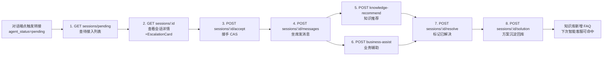
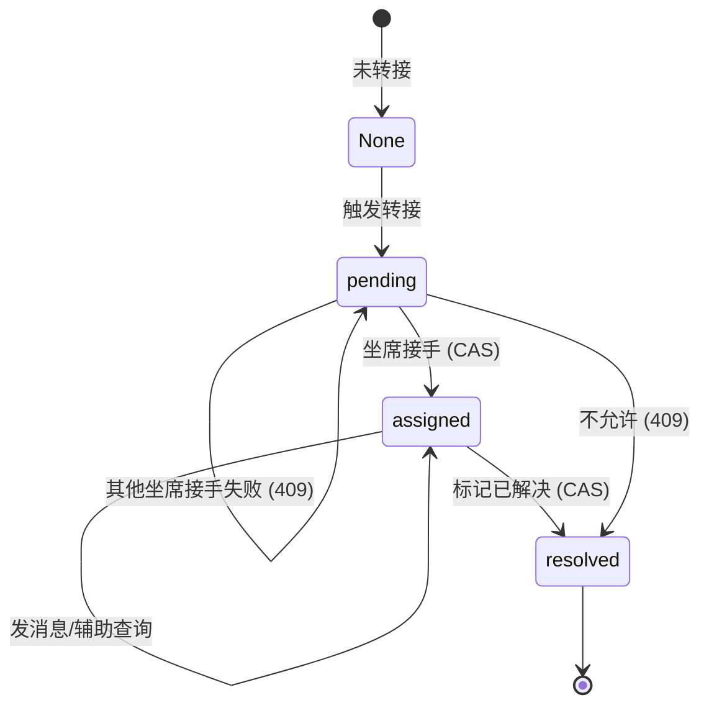

# 坐席辅助工作台使用教程

当智能客服判断需要转人工后，会话进入 `pending` 状态并进入坐席待接入队列。坐席辅助工作台提供 8 个端点，支撑坐席从「查看待接入 → 接手 → 沟通 → 辅助查询 → 解决 → 方案沉淀」的完整闭环。

!!! info "前置条件"

    - 端点前缀统一为 `/api/v1/agent`，鉴权头 `X-API-Key`
    - 已通过对话端点触发转接（`escalate_to_human=true`），会话 `agent_status` 为 `pending`
    - 转接上下文卡片 `EscalationCard` 已生成并缓存到会话

---

## 闭环概览

转接发生后，坐席侧通过 8 个端点形成完整处理闭环：



---

## 状态机

会话在坐席侧的状态流转严格受 CAS（Compare-And-Swap）保护，避免并发接手或重复操作：



| 状态 | 含义 | 允许的操作 |
| --- | --- | --- |
| `None` | 未转接，纯智能客服会话 | 仅对话端点 |
| `pending` | 已转接，待坐席接入 | 查看详情、接手 |
| `assigned` | 坐席已接手 | 发消息、知识推荐、业务辅助、标记解决 |
| `resolved` | 已解决 | 方案沉淀 |

!!! warning "状态流转约束"

    - `pending` 不能直接 `resolve`，必须先 `accept` 接手
    - `assigned` 才能发送消息，`pending`/`resolved` 发消息返回 409
    - 多坐席并发接手同一会话，只有一个成功，其余返回 409

---

## EscalationCard 结构

转接时生成的上下文卡片，让坐席接手前快速理解用户诉求与机器人已尝试方案，避免重复询问。

```json
{
  "session_id": "sess-9f3c2a1b",
  "user_id": "u_10086",
  "member_level": "gold",
  "history_ticket_count": 3,
  "turn_count": 4,
  "conversation_summary": "用户咨询订单 ORD-001 的物流状态，机器人未能查询到，用户情绪激动",
  "attempted_solutions": [
    "建议登录「我的订单」页面查看",
    "提供客服电话 400-xxx"
  ],
  "escalate_reason": "连续失败达阈值且用户情绪激动",
  "priority": "high"
}
```

| 字段 | 说明 |
| --- | --- |
| `member_level` | 会员等级，VIP 用户优先处理 |
| `history_ticket_count` | 历史工单数，反映用户过往诉求量 |
| `conversation_summary` | 对话摘要：核心问题与当前状态 |
| `attempted_solutions` | 机器人已给过的建议列表，避免重复方案 |
| `escalate_reason` | 本次转接的原因 |
| `priority` | 优先级：`highest/high/medium/low/info` |

---

## 端点详解

### 1. 待接入列表：GET /api/v1/agent/sessions/pending

列出所有待接入会话，按 `EscalationPriority` 降序排列，供坐席工作台首屏展示队列。

```bash
curl http://localhost:8000/api/v1/agent/sessions/pending \
  -H "X-API-Key: ${API_KEY}"
```

```json
[
  {
    "session_id": "sess-9f3c2a1b",
    "user_id": "u_10086",
    "priority": "highest",
    "escalate_reason": "用户主动要求转人工",
    "turn_count": 4,
    "created_at": "2026-07-03T10:00:00Z",
    "agent_status": "pending",
    "assigned_agent_id": null
  }
]
```

!!! tip "仅返回摘要字段"

    列表接口不返回完整 `history`，避免大量数据拖慢首屏。点击单条后再调用会话详情接口获取完整上下文。

### 2. 会话详情：GET /api/v1/agent/sessions/{session_id}

返回完整会话信息，含 `EscalationCard` 与 `history`。若卡片缓存缺失会即时重建并写回缓存。

```bash
curl http://localhost:8000/api/v1/agent/sessions/sess-9f3c2a1b \
  -H "X-API-Key: ${API_KEY}"
```

### 3. 接手会话：POST /api/v1/agent/sessions/{session_id}/accept

坐席接手会话，CAS 判断 `pending → assigned`。多坐席并发接手只有一个成功。

```bash
curl -X POST http://localhost:8000/api/v1/agent/sessions/sess-9f3c2a1b/accept \
  -H "Content-Type: application/json" \
  -H "X-API-Key: ${API_KEY}" \
  -d '{"agent_id": "agent-001"}'
```

```json
{
  "session_id": "sess-9f3c2a1b",
  "agent_status": "assigned",
  "assigned_agent_id": "agent-001",
  "turn_count": 4,
  "escalation_card": {...},
  "history": [...]
}
```

!!! note "agent_id 可选"

    `agent_id` 默认 `agent-default`，适用于无坐席身份系统的场景。生产环境建议传入真实坐席 ID，便于工单归属与绩效统计。

### 4. 发送消息：POST /api/v1/agent/sessions/{session_id}/messages

坐席在原会话上下文中发消息，追加到 `history`。**仅 `assigned` 状态允许**。

```bash
curl -X POST http://localhost:8000/api/v1/agent/sessions/sess-9f3c2a1b/messages \
  -H "Content-Type: application/json" \
  -H "X-API-Key: ${API_KEY}" \
  -d '{"content": "您好，我是坐席小李，我来帮您查询订单 ORD-001 的物流"}'
```

```json
{
  "message_id": "msg-uuid-xxx",
  "timestamp": "2026-07-03T10:05:00Z",
  "role": "assistant"
}
```

### 5. 知识推荐：POST /api/v1/agent/sessions/{session_id}/knowledge-recommend

坐席输入查询快速获取相关知识片段，复用 `HybridRetriever.retrieve`（向量 + BM25 混合检索）。未命中时返回空列表，不报错。

```bash
curl -X POST http://localhost:8000/api/v1/agent/sessions/sess-9f3c2a1b/knowledge-recommend \
  -H "Content-Type: application/json" \
  -H "X-API-Key: ${API_KEY}" \
  -d '{"query": "订单物流查询流程", "top_k": 5}'
```

```json
{
  "chunks": [
    {
      "content": "物流查询可通过订单详情页...",
      "score": 0.92,
      "source": "operation_manual.md"
    }
  ],
  "total": 1
}
```

!!! tip "接手前也可调用"

    知识推荐不要求 `assigned` 状态，坐席接手前也可预览知识，便于提前准备方案。

### 6. 业务辅助：POST /api/v1/agent/sessions/{session_id}/business-assist

复用 `BusinessAgent.execute`（含脱敏），让坐席用自然语言查询业务系统。业务异常不抛 5xx，降级为 `result.error` 字段，保证工作台不中断。

```bash
curl -X POST http://localhost:8000/api/v1/agent/sessions/sess-9f3c2a1b/business-assist \
  -H "Content-Type: application/json" \
  -H "X-API-Key: ${API_KEY}" \
  -d '{"query": "查一下订单 ORD-001 的状态"}'
```

```json
{
  "result": {
    "reply": "订单 ORD-001 当前状态：已发货，预计 7 月 5 日送达",
    "data": {"order_id": "ORD-001", "status": "shipped", "phone_masked": "138****1234"},
    "error": null,
    "need_confirmation": false,
    "scene": "order"
  },
  "masked_fields": ["phone_masked"]
}
```

!!! warning "脱敏字段标识"

    `masked_fields` 列出已脱敏字段名（如 `phone_masked`），前端据此标识"已脱敏"提示。写操作会返回 `need_confirmation=true`，需坐席二次确认。

### 7. 标记已解决：POST /api/v1/agent/sessions/{session_id}/resolve

标记会话已解决，CAS 判断 `assigned → resolved`。仅 `assigned` 状态可标记。

```bash
curl -X POST http://localhost:8000/api/v1/agent/sessions/sess-9f3c2a1b/resolve \
  -H "Content-Type: application/json" \
  -H "X-API-Key: ${API_KEY}" \
  -d '{"note": "已查询物流并告知用户预计送达时间"}'
```

```json
{
  "session_id": "sess-9f3c2a1b",
  "agent_status": "resolved",
  "resolved_at": "2026-07-03T10:15:00Z"
}
```

### 8. 方案沉淀：POST /api/v1/agent/sessions/{session_id}/solution

录入人工方案，沉淀为 FAQ 候选。进入 `pending` 审核队列，审核通过后入库为 FAQ，下次智能客服可检索命中，形成"人工处理 → 沉淀 → 下次智能回答"闭环。

```bash
curl -X POST http://localhost:8000/api/v1/agent/sessions/sess-9f3c2a1b/solution \
  -H "Content-Type: application/json" \
  -H "X-API-Key: ${API_KEY}" \
  -d '{
    "question": "订单 ORD-001 物流到哪了？",
    "solution": "该订单已发货，快递单号 SF1234567890，预计 7 月 5 日送达。可在顺丰官网查询实时物流。",
    "intent": "business_query"
  }'
```

```json
{
  "solution_id": "sol-uuid-xxx",
  "session_id": "sess-9f3c2a1b",
  "question": "订单 ORD-001 物流到哪了？",
  "solution": "该订单已发货...",
  "intent": "business_query",
  "status": "pending"
}
```

!!! tip "intent 可不传"

    `intent` 不传时由系统自动识别。建议坐席手动标注以提高准确度，便于后续归类与检索。

---

## 完整工作流示例

以下 Python 示例展示从「查看待接入 → 方案录入」的全流程：

```python
import httpx

BASE = "http://localhost:8000"
HEADERS = {"Content-Type": "application/json", "X-API-Key": ""}
AGENT_ID = "agent-001"

def agent_workflow():
    """坐席完整工作流：从查看待接入到方案录入。"""
    # 1. 查看待接入列表，按优先级降序
    pending = httpx.get(f"{BASE}/api/v1/agent/sessions/pending", headers=HEADERS).json()
    if not pending:
        print("暂无待接入会话")
        return
    session = pending[0]  # 取优先级最高的
    session_id = session["session_id"]
    print(f"接手会话：{session_id} 优先级={session['priority']}")

    # 2. 查看会话详情，了解用户诉求与机器人已尝试方案
    detail = httpx.get(f"{BASE}/api/v1/agent/sessions/{session_id}", headers=HEADERS).json()
    card = detail["escalation_card"]
    print(f"用户诉求：{card['conversation_summary']}")
    print(f"已尝试方案：{card['attempted_solutions']}")

    # 3. 接手会话（CAS，并发只有一个成功）
    accept = httpx.post(
        f"{BASE}/api/v1/agent/sessions/{session_id}/accept",
        headers=HEADERS, json={"agent_id": AGENT_ID},
    )
    if accept.status_code == 409:
        print("已被其他坐席接手")
        return
    print(f"接手成功：{accept.json()['agent_status']}")

    # 4. 发消息安抚用户
    httpx.post(f"{BASE}/api/v1/agent/sessions/{session_id}/messages",
               headers=HEADERS, json={"content": "您好，我来帮您处理这个问题"})

    # 5. 知识推荐：查询相关知识辅助回答
    knowledge = httpx.post(
        f"{BASE}/api/v1/agent/sessions/{session_id}/knowledge-recommend",
        headers=HEADERS, json={"query": card['conversation_summary'], "top_k": 3},
    ).json()
    print(f"推荐知识 {knowledge['total']} 条")

    # 6. 业务辅助：查询业务系统获取实时数据
    business = httpx.post(
        f"{BASE}/api/v1/agent/sessions/{session_id}/business-assist",
        headers=HEADERS, json={"query": "查询用户订单状态"},
    ).json()
    print(f"业务结果：{business['result']['reply']}")

    # 7. 标记已解决
    httpx.post(f"{BASE}/api/v1/agent/sessions/{session_id}/resolve",
               headers=HEADERS, json={"note": "已查询并告知用户"})
    print("会话已标记解决")

    # 8. 方案沉淀回库，下次智能客服可命中
    httpx.post(f"{BASE}/api/v1/agent/sessions/{session_id}/solution",
               headers=HEADERS, json={
                   "question": card['conversation_summary'],
                   "solution": business['result']['reply'],
                   "intent": "business_query",
               })
    print("方案已沉淀，等待审核入库")

agent_workflow()
```

---

## 常见问题

### 多坐席并发接手同一会话怎么办？

`accept` 端点内置 CAS（Compare-And-Swap）保护：只有第一个把状态从 `pending` 改为 `assigned` 的请求成功，其余返回 409。前端收到 409 应刷新待接入列表并提示"该会话已被其他坐席接手"。

### 接手前能查询知识吗？

可以。`knowledge-recommend` 不要求 `assigned` 状态，坐席可在接手前预览知识，便于提前准备方案。但 `messages` 必须在 `assigned` 后才能发送。

### 方案沉淀后多久能被检索到？

方案先进入 `pending` 审核队列，需通过 `POST /api/v1/escalation/solutions/{solution_id}/approve` 审核通过后才入库为 FAQ。入库后需调用 `POST /api/v1/performance/cache/invalidate` 清空热点缓存，新方案才能被对话端点检索命中。详见 [人工转接教程](escalation.zh.md)。

---

## 下一步

- [人工转接教程](escalation.zh.md)：转接触发条件与方案审核入库
- [业务系统集成教程](business.zh.md)：业务辅助端点的脱敏与适配器细节
- [对话端点教程](chat.zh.md)：转接是如何被触发的
