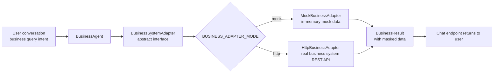

# Business System Integration Tutorial

The intelligent customer service system integrates with real enterprise business systems (orders/membership/returns/accounts) through a **business adapter** abstraction layer. `BusinessAgent` switches between an in-memory mock and a real HTTP API via configuration, with no code changes required. This tutorial covers the adapter pattern, the 4 categories of business queries, the masking mechanism, and custom adapter development.

!!! info "Prerequisites"

    - Business queries are routed automatically via the chat endpoint `/api/v1/chat`, or triggered manually via the agent assist endpoint
    - The adapter mode is controlled by `BUSINESS_ADAPTER_MODE` in `.env`
    - The default `mock` mode works out of the box without configuring any business system

---

## Adapter Architecture



!!! tip "Decoupled design"

    `BusinessAgent` depends only on the `BusinessSystemAdapter` abstract interface and is unaware whether the backend is mock or HTTP. Switching modes only requires changing `.env`; business logic needs no modification.

---

## Business Adapter Modes

### mock Mode (default, out of the box)

Based on the in-memory `MockBusinessAPI`, with preset sample order/membership/return/account data, suitable for development and demos:

```bash
# .env
BUSINESS_ADAPTER_MODE=mock
```

In mock mode, no external dependencies are required; the service is ready on startup. Preset data includes sample orders, members, return records, etc., for quickly verifying the business query flow.

### http Mode (real business system)

Calls the real business system REST API via `httpx`:

```bash
# .env
BUSINESS_ADAPTER_MODE=http
BUSINESS_API_BASE_URL=https://your-business-system.com/api
BUSINESS_API_KEY=your-business-api-key
BUSINESS_API_TIMEOUT=10
```

!!! warning "Auto-fallback when base_url is missing"

    When `BUSINESS_ADAPTER_MODE=http` but `BUSINESS_API_BASE_URL` is not configured, the system automatically falls back to mock mode and emits a warning, ensuring the service remains available rather than failing to start.

### HTTP Endpoint Mapping Convention

`HttpBusinessAdapter` calls the business system REST API according to the following convention:

| Business Method | HTTP Method | Path |
| --- | --- | --- |
| `query_order(order_id)` | GET | `/orders/{order_id}` |
| `create_return(order_id, reason)` | POST | `/returns` |
| `cancel_return(return_id)` | POST | `/returns/{return_id}/cancel` |
| `query_return(return_id)` | GET | `/returns/{return_id}` |
| `list_returns_by_user(user_id)` | GET | `/returns?user_id={user_id}` |
| `query_member(user_id)` | GET | `/members/{user_id}` |
| `query_account(user_id)` | GET | `/accounts/{user_id}` |
| `list_transactions(user_id)` | GET | `/accounts/{user_id}/transactions` |

!!! note "Error handling strategy"

    The HTTP adapter uniformly catches timeouts, network errors, and non-2xx responses, returning `None/[]` without raising exceptions. This lets the Agent take the "not found / failed" branch and give a friendly hint, preventing a single call from breaking the entire business flow. All errors are logged for ops troubleshooting.

---

## 4 Categories of Business Queries

### Business Scene Enumeration

| Scene | Enum Value | Description |
| --- | --- | --- |
| Order query | `order` | Order status / shipment / amount |
| Returns | `return` | Return creation / query / cancellation |
| Membership info | `member` | Points / tier / coupons |
| Account operations | `account` | Balance / bills / transaction history |

### Order Query

Supports querying by order number or phone number:

```python
# Triggered by user conversation: intent is recognized as business_query, params extracted for the order scene
# User: "Help me check the status of order ORD-2024-001"
# System: BusinessAgent calls adapter.query_order("ORD-2024-001")
```

mock mode has preset sample orders for direct testing:

=== "Trigger conversation with curl"

    ```bash
    curl -X POST http://localhost:8000/api/v1/chat \
      -H "Content-Type: application/json" \
      -H "X-API-Key: ${API_KEY}" \
      -d '{"message": "Help me check the status of order ORD-2024-001"}'
    ```

=== "Python business assist endpoint"

    ```python
    import httpx

    # Agent workbench calls the business assist endpoint
    resp = httpx.post(
        "http://localhost:8000/api/v1/agent/sessions/sess-xxx/business-assist",
        headers={"X-API-Key": ""},
        json={"query": "Check the status of order ORD-2024-001"},
        timeout=15.0,
    )
    print(resp.json()["result"]["reply"])
    ```

### Membership Info Query

```python
# User: "What is my membership tier and points?"
# System: BusinessAgent extracts user_id, calls adapter.query_member(user_id)
# Returns: tier, points, coupons, etc.
```

### Return Application

Write operations require a second confirmation:

```python
# User: "I want to request a return for order ORD-2024-001, reason: damaged goods"
# System: BusinessAgent calls adapter.create_return(order_id, reason)
# Returns: need_confirmation=True, awaiting user confirmation
# After user confirms: call confirm to complete the creation
```

!!! warning "Second confirmation for write operations"

    Write operations such as return creation/cancellation return `need_confirmation=true` and only execute after the user confirms, avoiding mistakes. `confirmation_token` is used to match the confirmation request.

### Account Operations

```python
# User: "Check my account balance and recent transactions"
# System: BusinessAgent calls adapter.query_account + list_transactions
# Returns: balance, bills, transaction list
```

---

## Identity Verification and Data Masking

### Phone Number Masking

Phone numbers in business results are automatically masked, keeping only the first 3 and last 4 digits:

```json
{
  "data": {
    "phone_masked": "138****1234",
    "order_id": "ORD-2024-001",
    "status": "shipped"
  }
}
```

The business assist endpoint response identifies masked fields:

```json
{
  "result": {
    "reply": "Order shipped...",
    "data": {"phone_masked": "138****1234"}
  },
  "masked_fields": ["phone_masked"]
}
```

!!! tip "Masked field indicator"

    `masked_fields` lists all masked field names (such as `phone_masked`, `id_card_masked`). The frontend uses this to show a "masked" hint so the user knows sensitive information is protected.

### Second Confirmation for Write Operations

Write operations (return creation/cancellation, account operations) return `need_confirmation=true` and `confirmation_token`. The caller must pass back the token or have the user reply with confirmation before execution:

```python
result = business_agent.execute(query="Request return for ORD-001 reason damaged goods")
if result.need_confirmation:
    # Wait for user confirmation; pass back confirmation_token
    user_confirm = input(f"Confirm execution of {result.reply}? (y/n)")
    if user_confirm == "y":
        confirm_result = business_agent.confirm(result.confirmation_token)
```

---

## BusinessAgent.execute Interface

`BusinessAgent` is the unified entry point for business queries, exposing the `execute` method:

```python
from app.agents.business_agent import get_business_agent

agent = get_business_agent()
result = agent.execute(query="Check the status of order ORD-001", session_id="sess-xxx")
```

### BusinessResult Fields

| Field | Type | Description |
| --- | --- | --- |
| `reply` | string | Final reply text to the user |
| `scene` | enum? | Matched business scene (order/return/member/account) |
| `data` | dict | Structured result data, **already masked** |
| `need_confirmation` | bool | Whether a second user confirmation is required (write operations) |
| `confirmation_token` | string? | Token for the pending operation |
| `error` | string? | Error code/message; None means success |
| `success` | bool | Whether execution succeeded |

!!! note "Relationship between error and success"

    - `success=true` + `error=None`: execution succeeded
    - `success=false` + `error="..."`: execution failed (auth/rate limit/missing data, etc.)
    - Business exceptions do not raise 5xx; they degrade to the `error` field, and `reply` still gives a readable hint

---

## Business Assist Endpoint: POST /api/v1/agent/sessions/{id}/business-assist

The agent workbench uses this endpoint to query the business system in natural language, reusing `BusinessAgent.execute` (with masking):

```bash
curl -X POST http://localhost:8000/api/v1/agent/sessions/sess-9f3c2a1b/business-assist \
  -H "Content-Type: application/json" \
  -H "X-API-Key: ${API_KEY}" \
  -d '{"query": "Check the status and shipment of order ORD-2024-001"}'
```

```json
{
  "result": {
    "reply": "Order ORD-2024-001 has shipped. Tracking number SF1234567890, estimated delivery July 5.",
    "data": {
      "order_id": "ORD-2024-001",
      "status": "shipped",
      "tracking_no": "SF1234567890",
      "phone_masked": "138****1234"
    },
    "need_confirmation": false,
    "scene": "order"
  },
  "masked_fields": ["phone_masked"]
}
```

!!! tip "Business exception fallback"

    When the business system fails, the endpoint does not raise 5xx; it degrades to the `result.error` field so the agent workbench is never interrupted:

    ```json
    {"result": {"error": "business_assist_failed: timeout"}, "masked_fields": []}
    ```

---

## Custom Business Adapter Development Guide

If your business system interface differs from the default HTTP convention, you can extend `BaseBusinessAdapter` to develop a custom adapter.

### Development Steps

1. **Extend the abstract base class**

    ```python
    from app.agents.business_adapters import BusinessSystemAdapter

    class MyBusinessAdapter(BusinessSystemAdapter):
        """Custom business adapter for an enterprise internal business system."""

        def query_order(self, order_id: str):
            # Implement query-by-order-id logic; return dict or None
            pass

        def create_return(self, order_id, reason, user_id=None):
            # Implement return creation logic
            pass

        # ... implement the other 6 abstract methods
    ```

2. **Implement all abstract methods**

    `BusinessSystemAdapter` defines 8 abstract methods (orders/returns/membership/accounts); subclasses must implement all of them:

    | Method | Returns | Description |
    | --- | --- | --- |
    | `query_order(order_id)` | dict? | Query by order ID; return None if not found |
    | `create_return(order_id, reason, user_id?)` | dict? | Create a return |
    | `cancel_return(return_id)` | dict? | Cancel a return |
    | `query_return(return_id)` | dict? | Query by return ID |
    | `list_returns_by_user(user_id)` | list | List all returns for a user |
    | `query_member(user_id)` | dict? | Query membership info |
    | `query_account(user_id)` | dict? | Query account info |
    | `list_transactions(user_id)` | list | List all transactions for a user |

3. **Error handling convention**

    - On business failure, return `None/[]` and **do not raise exceptions**; let the Agent take the "not found" branch
    - Network errors / timeouts / non-2xx are uniformly caught and logged
    - Sensitive fields in returned dicts (phone/ID card) are masked uniformly by the Agent; the adapter does not need to handle them

4. **Register with the factory**

    ```python
    from app.agents.business_adapters import get_business_adapter, _business_adapter

    def get_my_adapter():
        """Custom factory returning a singleton."""
        global _business_adapter
        if _business_adapter is None:
            _business_adapter = MyBusinessAdapter()
        return _business_adapter
    ```

!!! tip "Test isolation"

    Adapter instances are stateless (mock shares the underlying `MockBusinessAPI` singleton) and reused within the process. Tests can reset the singleton via `reset_business_adapter()` to rebuild after changing configuration.

### Custom Adapter Example

```python
"""Example adapter for an enterprise internal RPC business system."""
from typing import Any, Dict, List, Optional
from app.agents.business_adapters import BusinessSystemAdapter

class RpcBusinessAdapter(BusinessSystemAdapter):
    """Calls the business system via an enterprise internal RPC SDK.

    Unlike HttpBusinessAdapter, this reuses the company's existing RPC client,
    avoiding duplicate HTTP wrappers.
    """

    def __init__(self, rpc_client):
        # Inject the enterprise internal RPC client for easy mocking in tests
        self._rpc = rpc_client

    def query_order(self, order_id: str) -> Optional[Dict[str, Any]]:
        try:
            # Call the enterprise internal RPC; on exception return None to take the "not found" branch
            return self._rpc.call("order.query", {"order_id": order_id})
        except Exception:
            return None

    def query_member(self, user_id: str) -> Optional[Dict[str, Any]]:
        try:
            return self._rpc.call("member.query", {"user_id": user_id})
        except Exception:
            return None

    # ... implement the remaining methods, following the "failure returns None/[]" convention
```

---

## Next Steps

- [Agent Assist Workbench Tutorial](agent-assist.en.md): using the business assist endpoint in the workbench
- [Chat Endpoint Tutorial](chat.en.md): how business queries are triggered automatically through conversation
- [Observability Tutorial](observability.en.md): circuit breaker and fallback monitoring for business systems
