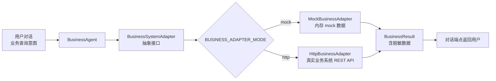

# 业务系统集成使用教程

智能客服系统通过**业务适配器**抽象层对接企业真实业务系统（订单/会员/退换货/账户），让 `BusinessAgent` 在内存 mock 与真实 HTTP API 之间按配置切换，无需改代码。本教程介绍适配器模式、4 类业务查询、脱敏机制与自定义适配器开发。

!!! info "前置条件"

    - 业务查询通过对话端点 `/api/v1/chat` 自动路由，或通过坐席辅助端点手动触发
    - 适配器模式由 `.env` 中 `BUSINESS_ADAPTER_MODE` 控制
    - 默认 `mock` 模式开箱即用，无需配置业务系统

---

## 适配器架构



!!! tip "解耦设计"

    `BusinessAgent` 只依赖 `BusinessSystemAdapter` 抽象接口，不感知具体后端是 mock 还是 HTTP。切换模式只需改 `.env`，业务逻辑零修改。

---

## 业务适配器模式

### mock 模式（默认，开箱即用）

基于内存 `MockBusinessAPI`，预置示例订单/会员/退换货/账户数据，适合开发与演示：

```bash
# .env
BUSINESS_ADAPTER_MODE=mock
```

mock 模式下无需任何外部依赖，启动即可用。预置数据包括示例订单、会员、退换货记录等，便于快速验证业务查询流程。

### http 模式（真实业务系统）

通过 `httpx` 调用真实业务系统 REST API：

```bash
# .env
BUSINESS_ADAPTER_MODE=http
BUSINESS_API_BASE_URL=https://your-business-system.com/api
BUSINESS_API_KEY=your-business-api-key
BUSINESS_API_TIMEOUT=10
```

!!! warning "base_url 缺失自动降级"

    `BUSINESS_ADAPTER_MODE=http` 但 `BUSINESS_API_BASE_URL` 未配置时，系统自动降级到 mock 模式并告警，保证服务可用不启动失败。

### HTTP 端点映射约定

`HttpBusinessAdapter` 按以下约定调用业务系统 REST API：

| 业务方法 | HTTP 方法 | 路径 |
| --- | --- | --- |
| `query_order(order_id)` | GET | `/orders/{order_id}` |
| `create_return(order_id, reason)` | POST | `/returns` |
| `cancel_return(return_id)` | POST | `/returns/{return_id}/cancel` |
| `query_return(return_id)` | GET | `/returns/{return_id}` |
| `list_returns_by_user(user_id)` | GET | `/returns?user_id={user_id}` |
| `query_member(user_id)` | GET | `/members/{user_id}` |
| `query_account(user_id)` | GET | `/accounts/{user_id}` |
| `list_transactions(user_id)` | GET | `/accounts/{user_id}/transactions` |

!!! note "错误处理策略"

    HTTP 适配器统一捕获超时/网络异常/非 2xx 响应，返回 `None/[]` 不抛异常，让 Agent 走"未找到/失败"分支给出友好提示，避免单次调用拖垮整条业务流程。所有错误记录日志便于运维排查。

---

## 4 类业务查询

### 业务场景枚举

| 场景 | 枚举值 | 说明 |
| --- | --- | --- |
| 订单查询 | `order` | 订单状态/物流/金额 |
| 退换货 | `return` | 退换货创建/查询/取消 |
| 会员信息 | `member` | 积分/等级/优惠券 |
| 账户操作 | `account` | 余额/账单/交易记录 |

### 订单查询

支持按订单号或手机号查询：

```python
# 用户对话触发：意图识别为 business_query，参数提取为 order 场景
# 用户："帮我查一下订单 ORD-2024-001 的状态"
# 系统：BusinessAgent 调用 adapter.query_order("ORD-2024-001")
```

mock 模式预置示例订单，可直接测试：

=== "curl 触发对话"

    ```bash
    curl -X POST http://localhost:8000/api/v1/chat \
      -H "Content-Type: application/json" \
      -H "X-API-Key: ${API_KEY}" \
      -d '{"message": "帮我查一下订单 ORD-2024-001 的状态"}'
    ```

=== "Python 业务辅助端点"

    ```python
    import httpx

    # 坐席工作台调用业务辅助端点
    resp = httpx.post(
        "http://localhost:8000/api/v1/agent/sessions/sess-xxx/business-assist",
        headers={"X-API-Key": ""},
        json={"query": "查一下订单 ORD-2024-001 的状态"},
        timeout=15.0,
    )
    print(resp.json()["result"]["reply"])
    ```

### 会员信息查询

```python
# 用户："我的会员等级和积分是多少？"
# 系统：BusinessAgent 提取 user_id，调用 adapter.query_member(user_id)
# 返回：等级、积分、优惠券等信息
```

### 退换货申请

写操作需二次确认：

```python
# 用户："我要申请退货，订单号 ORD-2024-001，原因是商品损坏"
# 系统：BusinessAgent 调用 adapter.create_return(order_id, reason)
# 返回：need_confirmation=True，等待用户确认
# 用户确认后：调用 confirm 完成创建
```

!!! warning "写操作二次确认"

    退换货创建/取消等写操作返回 `need_confirmation=true`，需用户二次确认后才真正执行，避免误操作。`confirmation_token` 用于匹配确认请求。

### 账户操作

```python
# 用户："查一下我的账户余额和最近交易"
# 系统：BusinessAgent 调用 adapter.query_account + list_transactions
# 返回：余额、账单、交易记录列表
```

---

## 身份校验与脱敏

### 手机号脱敏

业务结果中的手机号自动脱敏，仅保留首 3 位与后 4 位：

```json
{
  "data": {
    "phone_masked": "138****1234",
    "order_id": "ORD-2024-001",
    "status": "shipped"
  }
}
```

业务辅助端点响应会标识已脱敏字段：

```json
{
  "result": {
    "reply": "订单已发货...",
    "data": {"phone_masked": "138****1234"}
  },
  "masked_fields": ["phone_masked"]
}
```

!!! tip "脱敏字段标识"

    `masked_fields` 列出所有已脱敏字段名（如 `phone_masked`、`id_card_masked`），前端据此展示"已脱敏"提示，让用户知道敏感信息已保护。

### 写操作二次确认

写操作（退换货创建/取消、账户操作）返回 `need_confirmation=true` 与 `confirmation_token`，调用方需回传 token 或让用户回复确认才执行：

```python
result = business_agent.execute(query="申请退货 ORD-001 原因商品损坏")
if result.need_confirmation:
    # 等待用户确认，回传 confirmation_token
    user_confirm = input(f"确认执行 {result.reply}？(y/n)")
    if user_confirm == "y":
        confirm_result = business_agent.confirm(result.confirmation_token)
```

---

## BusinessAgent.execute 接口

`BusinessAgent` 是业务查询的统一入口，对外暴露 `execute` 方法：

```python
from app.agents.business_agent import get_business_agent

agent = get_business_agent()
result = agent.execute(query="查一下订单 ORD-001 的状态", session_id="sess-xxx")
```

### BusinessResult 字段

| 字段 | 类型 | 说明 |
| --- | --- | --- |
| `reply` | string | 给用户的最终回复文本 |
| `scene` | enum? | 命中的业务场景（order/return/member/account） |
| `data` | dict | 结构化结果数据，**已脱敏** |
| `need_confirmation` | bool | 是否需要用户二次确认（写操作） |
| `confirmation_token` | string? | 待确认操作的令牌 |
| `error` | string? | 错误码/错误信息，None 表示成功 |
| `success` | bool | 是否执行成功 |

!!! note "error 与 success 的关系"

    - `success=true` + `error=None`：执行成功
    - `success=false` + `error="..."`：执行失败（鉴权/限流/数据缺失等）
    - 业务异常不抛 5xx，降级为 `error` 字段，`reply` 仍给出可读提示

---

## 业务辅助端点：POST /api/v1/agent/sessions/{id}/business-assist

坐席工作台通过该端点用自然语言查询业务系统，复用 `BusinessAgent.execute`（含脱敏）：

```bash
curl -X POST http://localhost:8000/api/v1/agent/sessions/sess-9f3c2a1b/business-assist \
  -H "Content-Type: application/json" \
  -H "X-API-Key: ${API_KEY}" \
  -d '{"query": "查一下订单 ORD-2024-001 的状态和物流"}'
```

```json
{
  "result": {
    "reply": "订单 ORD-2024-001 已发货，快递单号 SF1234567890，预计 7 月 5 日送达。",
    "data": {
      "order_id": "ORD-2024-001",
      "status": "shipped",
      "tracking_no": "SF1234567890",
      "phone_masked": "138****1234"
    },
    "need_confirmation": false,
    "scene": "order"
  },
  "masked_fields": ["phone_masked"]
}
```

!!! tip "业务异常降级"

    业务系统故障时端点不抛 5xx，降级返回 `result.error` 字段，保证坐席工作台不中断：

    ```json
    {"result": {"error": "business_assist_failed: timeout"}, "masked_fields": []}
    ```

---

## 自定义业务适配器开发指南

如业务系统接口与默认 HTTP 约定不同，可继承 `BaseBusinessAdapter` 开发自定义适配器。

### 开发步骤

1. **继承抽象基类**

    ```python
    from app.agents.business_adapters import BusinessSystemAdapter

    class MyBusinessAdapter(BusinessSystemAdapter):
        """自定义业务适配器，对接企业内部业务系统。"""

        def query_order(self, order_id: str):
            # 实现按订单号查询逻辑，返回 dict 或 None
            pass

        def create_return(self, order_id, reason, user_id=None):
            # 实现创建退换货逻辑
            pass

        # ... 实现其余 6 个抽象方法
    ```

2. **实现全部抽象方法**

    `BusinessSystemAdapter` 定义了 8 个抽象方法（订单/退换货/会员/账户），子类必须全部实现：

    | 方法 | 返回 | 说明 |
    | --- | --- | --- |
    | `query_order(order_id)` | dict? | 按订单号查询，不存在返回 None |
    | `create_return(order_id, reason, user_id?)` | dict? | 创建退换货 |
    | `cancel_return(return_id)` | dict? | 取消退换货 |
    | `query_return(return_id)` | dict? | 按退换单号查询 |
    | `list_returns_by_user(user_id)` | list | 列出用户全部退换货 |
    | `query_member(user_id)` | dict? | 查询会员信息 |
    | `query_account(user_id)` | dict? | 查询账户信息 |
    | `list_transactions(user_id)` | list | 列出用户全部交易 |

3. **错误处理约定**

    - 业务失败返回 `None/[]`，**不抛异常**，让 Agent 走"未找到"分支
    - 网络错误/超时/非 2xx 统一捕获并记录日志
    - 返回的 dict 中敏感字段（手机号/身份证）由 Agent 统一脱敏，适配器无需关心

4. **注册到工厂**

    ```python
    from app.agents.business_adapters import get_business_adapter, _business_adapter

    def get_my_adapter():
        """自定义工厂，返回单例。"""
        global _business_adapter
        if _business_adapter is None:
            _business_adapter = MyBusinessAdapter()
        return _business_adapter
    ```

!!! tip "测试隔离"

    适配器实例无状态（mock 共享底层 `MockBusinessAPI` 单例），进程内复用。测试可通过 `reset_business_adapter()` 重置单例，便于切换配置后重建。

### 自定义适配器示例

```python
"""对接企业内部 RPC 业务系统的适配器示例。"""
from typing import Any, Dict, List, Optional
from app.agents.business_adapters import BusinessSystemAdapter

class RpcBusinessAdapter(BusinessSystemAdapter):
    """通过企业内部 RPC SDK 调用业务系统。

    与 HttpBusinessAdapter 不同，这里复用公司既有 RPC 客户端，
    避免重复封装 HTTP 接口。
    """

    def __init__(self, rpc_client):
        # 注入企业内部 RPC 客户端，便于测试 mock
        self._rpc = rpc_client

    def query_order(self, order_id: str) -> Optional[Dict[str, Any]]:
        try:
            # 调用企业内部 RPC，异常时返回 None 走"未找到"分支
            return self._rpc.call("order.query", {"order_id": order_id})
        except Exception:
            return None

    def query_member(self, user_id: str) -> Optional[Dict[str, Any]]:
        try:
            return self._rpc.call("member.query", {"user_id": user_id})
        except Exception:
            return None

    # ... 实现其余方法，遵循"失败返回 None/[]"约定
```

---

## 下一步

- [坐席辅助工作台教程](agent-assist.zh.md)：业务辅助端点在工作台中的使用
- [对话端点教程](chat.zh.md)：业务查询如何通过对话自动触发
- [可观测性教程](observability.zh.md)：业务系统熔断与降级监控
