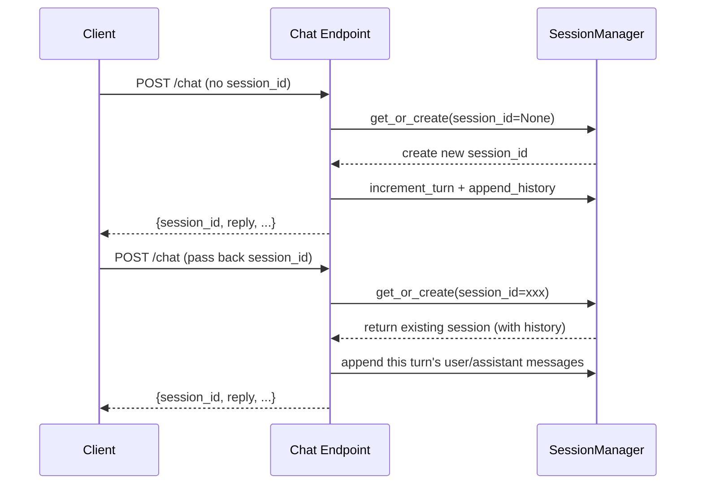
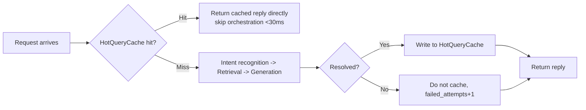

# Chat Endpoint Tutorial

The chat endpoint is the core entry point through which the intelligent customer service system exposes its Q&A capabilities. It offers two interfaces, **synchronous** and **SSE streaming**, that share the same session management and multi-agent orchestration logic. They differ only in whether the final generation phase streams tokens to the client.

!!! info "Prerequisites"

    - The service is running (default `http://localhost:8000`)
    - Endpoint prefix is uniformly `/api/v1/chat`
    - Auth header: `X-API-Key`. In development mode `API_KEY=empty` skips authentication; in production, configure `API_KEY` in `.env`

---

## Endpoint Overview

| Endpoint | Method | Description | Response Type |
| --- | --- | --- | --- |
| `/api/v1/chat` | POST | Returns the full reply synchronously | `application/json` |
| `/api/v1/chat/stream` | POST | Streams tokens one-by-one via SSE | `text/event-stream` |

Both endpoints accept identical inputs. You can switch between them freely based on whether you need a "typing effect".

---

## Synchronous Chat: POST /api/v1/chat

### Request Body

| Field | Type | Required | Description |
| --- | --- | :---: | --- |
| `message` | string | Yes | User message content |
| `session_id` | string | No | Session ID. Optional for the first turn; the system creates and returns one automatically |
| `channel` | string | No | Access channel, default `api`. Options: `web/app/wechat/dingtalk/api` |
| `user_id` | string | No | User identifier, used for member recognition and personalization |

### Response Body

```json
{
  "session_id": "sess-9f3c2a1b",
  "reply": "You can log in to the My Orders page to check the delivery status...",
  "status": "ok",
  "data": {
    "intent": "knowledge_qa",
    "sources": ["ProductFAQ.md", "ShippingGuide.md"],
    "escalate_to_human": false,
    "escalation_card": null,
    "turn_count": 2,
    "failed_attempts": 0,
    "emotion_score": 0.85,
    "sub_tasks": []
  }
}
```

!!! note "Key Field Descriptions"

    - `intent`: Intent recognition result. Possible values include `chitchat / knowledge_qa / business_query / emotion_sensitive / transfer_to_human / ticket`
    - `escalate_to_human`: Whether transfer to a human agent is triggered. When `true`, `escalation_card` is non-empty and can be passed directly to the agent workbench
    - `sources`: Knowledge source file names matched by RAG. Empty array when no match is found
    - `turn_count`: Number of turns completed in the current session
    - `failed_attempts`: Consecutive unresolved count. Reaching the threshold triggers transfer to a human agent

### Examples

=== "curl"

    ```bash
    # First turn: omit session_id and the system will create one automatically
    curl -X POST http://localhost:8000/api/v1/chat \
      -H "Content-Type: application/json" \
      -H "X-API-Key: ${API_KEY}" \
      -d '{
        "message": "When will my order ship?",
        "channel": "web",
        "user_id": "u_10086"
      }'
    ```

=== "Python (httpx)"

    ```python
    import httpx

    # Continue a multi-turn conversation via session_id; if absent, the server creates one
    resp = httpx.post(
        "http://localhost:8000/api/v1/chat",
        headers={
            "Content-Type": "application/json",
            "X-API-Key": "",  # leave empty in development mode
        },
        json={
            "message": "When will my order ship?",
            "channel": "web",
            "user_id": "u_10086",
        },
        timeout=30.0,
    )
    data = resp.json()
    # Save session_id for subsequent multi-turn continuation
    session_id = data["session_id"]
    print(data["reply"])
    print("Matched sources:", data["data"]["sources"])
    ```

---

## SSE Streaming Chat: POST /api/v1/chat/stream

The streaming endpoint returns `text/event-stream` and emits tokens one by one. It is suitable for implementing a typewriter effect on the frontend, with **first token < 1 second**.

### Event Types

| Event | When Triggered | Key data Fields |
| --- | --- | --- |
| `meta` | When orchestration starts (includes intent and sources) | `intent` / `sources` / `escalate` |
| `token` | Each time a text chunk is emitted (multiple times) | `content` |
| `done` | When the stream ends normally | `turn_count` / `escalate` / `answer` |
| `error` | On any stage failure | `message` |

!!! tip "First event fires before the LLM call"

    The streaming endpoint yields the `meta` event first, allowing the frontend to display the intent before the LLM is invoked, keeping first token under 200ms. Fast-path intents such as chitchat or transfer to human skip the LLM entirely.

### Receiving the Stream with curl

```bash
# -N disables buffering so tokens arrive at the terminal in real time
curl -N -X POST http://localhost:8000/api/v1/chat/stream \
  -H "Content-Type: application/json" \
  -H "X-API-Key: ${API_KEY}" \
  -d '{"message": "Tell me about your return and exchange policy"}'
```

Example output (one SSE event per line):

```text
event: meta
data: {"intent": "knowledge_qa", "sources": ["return_policy.md"]}

event: token
data: {"content": "Our return and exchange policy is as follows:"}

event: token
data: {"content": "You can request a return within 7 days of signing for the package..."}

event: done
data: {"turn_count": 1, "escalate": false, "answer": "Our return and exchange policy..."}
```

### Receiving the Stream with Python

=== "httpx (native SSE parsing)"

    ```python
    import httpx
    import json

    def stream_chat(message: str, session_id: str = None):
        """Receive SSE events and assemble the reply token by token."""
        with httpx.stream(
            "POST",
            "http://localhost:8000/api/v1/chat/stream",
            headers={"Content-Type": "application/json", "X-API-Key": ""},
            json={"message": message, "session_id": session_id},
            timeout=60.0,
        ) as resp:
            event_type = None
            full_answer = []
            for line in resp.iter_lines():
                if not line:
                    continue
                # SSE protocol: the event: and data: prefixes mark the event type and payload
                if line.startswith("event:"):
                    event_type = line.split(":", 1)[1].strip()
                elif line.startswith("data:"):
                    payload = json.loads(line.split(":", 1)[1].strip())
                    if event_type == "token":
                        print(payload["content"], end="", flush=True)
                        full_answer.append(payload["content"])
                    elif event_type == "done":
                        return payload
                    elif event_type == "error":
                        raise RuntimeError(payload["message"])

    stream_chat("Tell me about your return and exchange policy")
    ```

=== "sseclient-py (recommended library)"

    ```python
    import httpx
    from sseclient import SSEClient

    # sseclient handles event/data parsing automatically, making the code more concise
    resp = httpx.post(
        "http://localhost:8000/api/v1/chat/stream",
        headers={"Content-Type": "application/json", "X-API-Key": ""},
        json={"message": "Tell me about your return and exchange policy"},
        timeout=60.0,
    )
    client = SSEClient(resp.iter_lines())
    for event in client.events():
        data = json.loads(event.data)
        if event.event == "token":
            print(data["content"], end="", flush=True)
        elif event.event == "done":
            print("\nFull reply:", data["answer"])
            break
    ```

!!! warning "Disable nginx buffering"

    In production behind an nginx reverse proxy, ensure the upstream response header `X-Accel-Buffering: no` is in effect (the endpoint already sends it by default). Otherwise tokens will be buffered until the stream ends and then flushed all at once, defeating the streaming experience.

---

## Multi-turn Chat: Automatic Context Management

The system manages conversation context automatically via `SessionManager`, so the business side does not need to assemble history manually:

1. On the first turn, omit `session_id`; the response body returns the newly created `session_id`
2. On subsequent turns, pass the same `session_id` back. The system loads history and appends the new turn automatically
3. `turn_count` increments each turn, so the frontend can display "N turns completed"

```python
# Multi-turn example: reuse session_id to continue the context
session_id = None
questions = [
    "I want to check my order status",      # Turn 1
    "The order number is ORD-2024-001",     # Turn 2: carries forward "order"
    "Where is its shipment now?",           # Turn 3: context refers to ORD-2024-001
]

for question in questions:
    resp = httpx.post(
        "http://localhost:8000/api/v1/chat",
        headers={"X-API-Key": ""},
        json={"message": question, "session_id": session_id},
        timeout=30.0,
    )
    data = resp.json()
    session_id = data["session_id"]  # always pass it back to keep the same session
    print(f"[Turn {data['data']['turn_count']}] {data['reply']}")
```

!!! tip "Session expiration and cleanup"

    Sessions are stored in memory by default and are cleared on process restart. For production, configure `REDIS_URL` to persist sessions. Long-idle sessions are reclaimed automatically by the system's internal policy; the business side does not need to handle this.

---

## Session Management

Session creation, lookup, and continuation are all handled internally by `SessionManager`. The business side only needs to handle passing `session_id`.

### Session Lifecycle



### Session State Fields

Key state maintained internally by the session (some are exposed in the response `data` field):

- `turn_count`: current turn
- `failed_attempts`: consecutive unresolved count; reset to zero means this turn was resolved
- `current_intent`: most recently recognized intent
- `emotion_score`: user emotion score, between 0 and 1; lower means more agitated
- `agent_status`: agent-side status; becomes `pending/assigned/resolved` after escalation

---

## HotQueryCache Hit Scenarios

The system has a built-in hot query cache (`HotQueryCache`) that returns cached results directly for **repeated and already-resolved** knowledge Q&A, skipping the entire multi-agent orchestration.

!!! success "Hit Performance"

    - Hit condition: same query + same context fingerprint (session_id/intent/turn_count/user_id)
    - Hit latency: **first token < 30ms**, skipping intent recognition, retrieval, and the entire generation pipeline
    - Synchronous and streaming endpoints share the cache; a query cached by one endpoint can also hit on the other

### Hit Flow



### Verifying a Hit

```python
import time
import httpx

query = "What is the return and exchange policy?"

# First query: cache miss, runs the full orchestration (~1-2 seconds)
t1 = time.perf_counter()
httpx.post("http://localhost:8000/api/v1/chat",
           headers={"X-API-Key": ""}, json={"message": query})
print(f"First: {(time.perf_counter()-t1)*1000:.0f}ms")

# Second query: cache hit (first token <30ms, total <50ms)
t2 = time.perf_counter()
httpx.post("http://localhost:8000/api/v1/chat",
           headers={"X-API-Key": ""}, json={"message": query})
print(f"Hit: {(time.perf_counter()-t2)*1000:.0f}ms")
```

!!! warning "Cache must be cleared after knowledge base updates"

    After the knowledge base content changes, stale cache entries may return outdated replies. Call `POST /api/v1/performance/cache/invalidate` to clear the hot query cache. See the [Performance Optimization Tutorial](performance.en.md).

---

## Error Handling

### 429 Rate Limiting

The system applies concurrent rate limiting on LLM calls (default `MAX_CONCURRENT_LLM_CALLS=10`). When exceeded, it returns 429:

```json
{
  "detail": "Too many requests, please retry later"
}
```

**Client handling recommendation**: retry with exponential backoff 2-3 times, intervals 1s / 2s / 4s.

### 500 Service Error

Internal errors such as LLM service unavailable or vector store exceptions return 500 with a `detail` field. The system has multiple fallbacks built in:

- LLM unavailable → circuit breaker opens, returns fallback phrasing
- Vector store exception → degrades to BM25 keyword retrieval
- All fail → returns "no relevant content found" and increments `failed_attempts`

```python
import httpx
import time

def chat_with_retry(message, max_retries=3):
    """Chat call with retry, handling 429/5xx transient errors."""
    for attempt in range(max_retries):
        resp = httpx.post(
            "http://localhost:8000/api/v1/chat",
            headers={"X-API-Key": ""},
            json={"message": message},
            timeout=30.0,
        )
        if resp.status_code == 200:
            return resp.json()
        if resp.status_code == 429 and attempt < max_retries - 1:
            # Exponential backoff: 1s, 2s, 4s
            time.sleep(2 ** attempt)
            continue
        # 5xx or retries exhausted; raise for the upper layer to handle
        resp.raise_for_status()
    raise RuntimeError("Chat request retries exhausted")
```

### Errors on the Streaming Endpoint

The SSE protocol keeps the HTTP status at 200 and delivers errors via the `error` event. On receiving an `error` event, the client should stop reading and display the error message:

```python
if event.event == "error":
    msg = json.loads(event.data)["message"]
    print(f"\n[Stream error] {msg}")
    return
```

---

## Next Steps

- [Knowledge Base Management Tutorial](knowledge.en.md): how to give the chat endpoint knowledge to answer from
- [Agent Assist Workbench Tutorial](agent-assist.en.md): how agents take over after an escalation
- [Performance Optimization Tutorial](performance.en.md): tuning details for HotQueryCache and model routing
