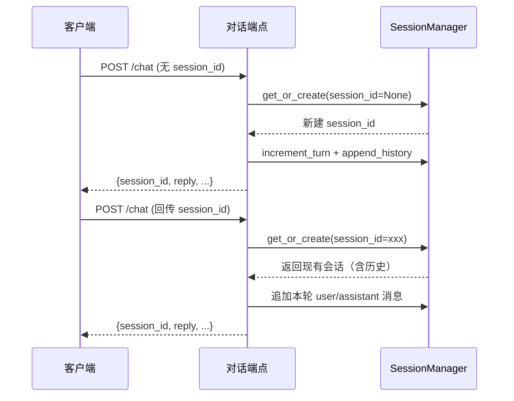
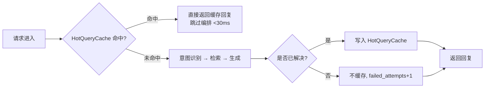

# 对话端点使用教程

对话端点是智能客服系统对外提供问答能力的核心入口，提供**同步**与 **SSE 流式**两套接口，共享同一套会话管理与多 Agent 编排逻辑，仅在最终生成阶段是否流式吐出上有所差异。

!!! info "前置条件"

    - 服务已启动（默认 `http://localhost:8000`）
    - 端点前缀统一为 `/api/v1/chat`
    - 鉴权头：`X-API-Key`。开发模式下 `API_KEY=空` 即免鉴权，生产环境需在 `.env` 配置 `API_KEY`

---

## 端点概览

| 端点 | 方法 | 说明 | 响应类型 |
| --- | --- | --- | --- |
| `/api/v1/chat` | POST | 同步返回完整回复 | `application/json` |
| `/api/v1/chat/stream` | POST | SSE 流式逐 Token 吐出 | `text/event-stream` |

两个端点入参完全一致，业务侧可按是否需要"打字效果"自由切换。

---

## 同步对话：POST /api/v1/chat

### 请求体

| 字段 | 类型 | 必填 | 说明 |
| --- | --- | :---: | --- |
| `message` | string | 是 | 用户消息内容 |
| `session_id` | string | 否 | 会话 ID，首次对话可不传，系统自动创建并返回 |
| `channel` | string | 否 | 接入渠道，默认 `api`，可选 `web/app/wechat/dingtalk/api` |
| `user_id` | string | 否 | 用户标识，用于会员识别与个性化 |

### 响应体

```json
{
  "session_id": "sess-9f3c2a1b",
  "reply": "您可以登录「我的订单」页面查看物流状态...",
  "status": "ok",
  "data": {
    "intent": "knowledge_qa",
    "sources": ["产品FAQ.md", "物流说明.md"],
    "escalate_to_human": false,
    "escalation_card": null,
    "turn_count": 2,
    "failed_attempts": 0,
    "emotion_score": 0.85,
    "sub_tasks": []
  }
}
```

!!! note "关键字段说明"

    - `intent`：意图识别结果，可能值为 `chitchat / knowledge_qa / business_query / emotion_sensitive / transfer_to_human / ticket` 等
    - `escalate_to_human`：是否触发转人工，为 `true` 时 `escalation_card` 非空，可直接传递给坐席工作台
    - `sources`：RAG 命中的知识来源文件名，未命中时为空数组
    - `turn_count`：当前会话已进行的对话轮数
    - `failed_attempts`：连续未解决次数，达到阈值会触发转人工

### 示例

=== "curl"

    ```bash
    # 首次对话：不传 session_id，系统会自动创建
    curl -X POST http://localhost:8000/api/v1/chat \
      -H "Content-Type: application/json" \
      -H "X-API-Key: ${API_KEY}" \
      -d '{
        "message": "我的订单什么时候发货？",
        "channel": "web",
        "user_id": "u_10086"
      }'
    ```

=== "Python (httpx)"

    ```python
    import httpx

    # 通过 session_id 续接多轮对话，缺失时由服务端自动创建
    resp = httpx.post(
        "http://localhost:8000/api/v1/chat",
        headers={
            "Content-Type": "application/json",
            "X-API-Key": "",  # 开发模式留空
        },
        json={
            "message": "我的订单什么时候发货？",
            "channel": "web",
            "user_id": "u_10086",
        },
        timeout=30.0,
    )
    data = resp.json()
    # 保存 session_id 以便后续多轮对话续接
    session_id = data["session_id"]
    print(data["reply"])
    print("命中来源：", data["data"]["sources"])
    ```

---

## SSE 流式对话：POST /api/v1/chat/stream

流式端点返回 `text/event-stream`，逐 Token 下发，适合前端实现打字机效果，**首 Token < 1 秒**。

### 事件类型

| 事件 | 触发时机 | data 关键字段 |
| --- | --- | --- |
| `meta` | 编排开始时（含意图与来源） | `intent` / `sources` / `escalate` |
| `token` | 每次吐出一段文本（多次） | `content` |
| `done` | 流正常结束 | `turn_count` / `escalate` / `answer` |
| `error` | 任一阶段异常 | `message` |

!!! tip "首事件先于 LLM 调用"

    流式端点会先 yield `meta` 事件，让前端在 LLM 调用前就能展示意图，把首 Token 控制在 200ms 内。闲聊/转人工等快通道意图命中时直接跳过 LLM。

### curl 流式接收

```bash
# -N 关闭缓冲，保证 token 实时下发到终端
curl -N -X POST http://localhost:8000/api/v1/chat/stream \
  -H "Content-Type: application/json" \
  -H "X-API-Key: ${API_KEY}" \
  -d '{"message": "介绍一下你们的退换货政策"}'
```

输出示例（每行一个 SSE 事件）：

```text
event: meta
data: {"intent": "knowledge_qa", "sources": ["return_policy.md"]}

event: token
data: {"content": "我们的退换货政策如下："}

event: token
data: {"content": "自签收之日起 7 天内可申请退货..."}

event: done
data: {"turn_count": 1, "escalate": false, "answer": "我们的退换货政策..."}
```

### Python 流式接收

=== "httpx (原生 SSE 解析)"

    ```python
    import httpx
    import json

    def stream_chat(message: str, session_id: str = None):
        """流式接收 SSE 事件，逐 token 拼装回复。"""
        with httpx.stream(
            "POST",
            "http://localhost:8000/api/v1/chat/stream",
            headers={"Content-Type": "application/json", "X-API-Key": ""},
            json={"message": message, "session_id": session_id},
            timeout=60.0,
        ) as resp:
            event_type = None
            full_answer = []
            for line in resp.iter_lines():
                if not line:
                    continue
                # SSE 协议：event: 与 data: 前缀分别标识事件类型与负载
                if line.startswith("event:"):
                    event_type = line.split(":", 1)[1].strip()
                elif line.startswith("data:"):
                    payload = json.loads(line.split(":", 1)[1].strip())
                    if event_type == "token":
                        print(payload["content"], end="", flush=True)
                        full_answer.append(payload["content"])
                    elif event_type == "done":
                        return payload
                    elif event_type == "error":
                        raise RuntimeError(payload["message"])

    stream_chat("介绍一下你们的退换货政策")
    ```

=== "sseclient-py (推荐库)"

    ```python
    import httpx
    from sseclient import SSEClient

    # sseclient 自动处理 event/data 解析，代码更简洁
    resp = httpx.post(
        "http://localhost:8000/api/v1/chat/stream",
        headers={"Content-Type": "application/json", "X-API-Key": ""},
        json={"message": "介绍一下你们的退换货政策"},
        timeout=60.0,
    )
    client = SSEClient(resp.iter_lines())
    for event in client.events():
        data = json.loads(event.data)
        if event.event == "token":
            print(data["content"], end="", flush=True)
        elif event.event == "done":
            print("\n完整回复：", data["answer"])
            break
    ```

!!! warning "nginx 缓冲关闭"

    生产环境若经过 nginx 反代，需确保上游响应头 `X-Accel-Buffering: no` 生效（端点已默认下发），否则 token 会被缓冲到流结束才一次性吐出，丧失流式体验。

---

## 多轮对话：上下文自动管理

系统通过 `SessionManager` 自动维护对话上下文，无需业务侧手动拼接历史：

1. 首次对话不传 `session_id`，响应体返回新创建的 `session_id`
2. 后续对话把该 `session_id` 回传，系统自动加载历史并写入新轮次
3. 每轮 `turn_count` 自增，便于前端展示"已进行 N 轮对话"

```python
# 多轮对话示例：复用 session_id 续接上下文
session_id = None
questions = [
    "我想查询订单状态",       # 第 1 轮
    "订单号是 ORD-2024-001",  # 第 2 轮：承接上文"订单"
    "那它的物流到哪了？",     # 第 3 轮：上下文指代 ORD-2024-001
]

for question in questions:
    resp = httpx.post(
        "http://localhost:8000/api/v1/chat",
        headers={"X-API-Key": ""},
        json={"message": question, "session_id": session_id},
        timeout=30.0,
    )
    data = resp.json()
    session_id = data["session_id"]  # 始终回传，保持同一会话
    print(f"[轮次 {data['data']['turn_count']}] {data['reply']}")
```

!!! tip "会话过期与清理"

    会话默认存储在内存中，进程重启会清空。生产环境建议配置 `REDIS_URL` 持久化会话。长时间无活动的会话由系统按内部策略自动回收，业务侧无需关心。

---

## 会话管理

会话的创建、查询、续接均由 `SessionManager` 内部完成，业务侧只需关注 `session_id` 的传递。

### 会话生命周期



### 会话状态字段

会话内部维护的关键状态（部分透出到响应 `data` 字段）：

- `turn_count`：当前轮次
- `failed_attempts`：连续未解决次数，归零表示本轮已解决
- `current_intent`：最近一次识别的意图
- `emotion_score`：用户情绪得分，0-1 之间，越低越激动
- `agent_status`：坐席侧状态，转接后变为 `pending/assigned/resolved`

---

## HotQueryCache 命中场景

系统内置热点查询缓存（`HotQueryCache`），对**重复且已解决**的知识问答直接返回缓存结果，跳过整套多 Agent 编排。

!!! success "命中性能"

    - 命中条件：相同 query + 相同上下文指纹（session_id/intent/turn_count/user_id）
    - 命中延迟：**首 Token < 30ms**，跳过意图识别、检索、生成全链路
    - 同步与流式端点共享缓存，任一端点命中过的查询在另一端点也能命中

### 命中流程



### 验证命中

```python
import time
import httpx

query = "退换货政策是什么？"

# 首次查询：未命中，走完整编排（约 1-2 秒）
t1 = time.perf_counter()
httpx.post("http://localhost:8000/api/v1/chat",
           headers={"X-API-Key": ""}, json={"message": query})
print(f"首次：{(time.perf_counter()-t1)*1000:.0f}ms")

# 再次查询：命中缓存（首 Token <30ms，整体 <50ms）
t2 = time.perf_counter()
httpx.post("http://localhost:8000/api/v1/chat",
           headers={"X-API-Key": ""}, json={"message": query})
print(f"命中：{(time.perf_counter()-t2)*1000:.0f}ms")
```

!!! warning "知识库更新后必须清缓存"

    知识库内容变更后，旧缓存可能返回过期回复。请调用 `POST /api/v1/performance/cache/invalidate` 清空热点缓存，详见 [性能优化教程](performance.zh.md)。

---

## 错误处理

### 429 限流

系统对 LLM 调用做了并发限流（默认 `MAX_CONCURRENT_LLM_CALLS=10`）。超限时返回 429：

```json
{
  "detail": "当前请求过多，请稍后重试"
}
```

**客户端处理建议**：指数退避重试 2-3 次，间隔 1s / 2s / 4s。

### 500 服务异常

LLM 服务不可用、向量库异常等内部错误返回 500，响应体含 `detail` 字段。系统已内置多重降级：

- LLM 不可用 → 熔断器打开，返回兜底话术
- 向量库异常 → 降级为 BM25 关键词检索
- 全部失败 → 返回"未找到相关内容"提示并累加 `failed_attempts`

```python
import httpx
import time

def chat_with_retry(message, max_retries=3):
    """带重试的对话调用，处理 429/5xx 临时性错误。"""
    for attempt in range(max_retries):
        resp = httpx.post(
            "http://localhost:8000/api/v1/chat",
            headers={"X-API-Key": ""},
            json={"message": message},
            timeout=30.0,
        )
        if resp.status_code == 200:
            return resp.json()
        if resp.status_code == 429 and attempt < max_retries - 1:
            # 指数退避：1s, 2s, 4s
            time.sleep(2 ** attempt)
            continue
        # 5xx 或重试耗尽，抛出供上层处理
        resp.raise_for_status()
    raise RuntimeError("对话请求重试耗尽")
```

### 流式端点的错误

SSE 协议约定 HTTP 状态保持 200，错误通过 `error` 事件下发。客户端收到 `error` 事件后应停止读取并展示错误信息：

```python
if event.event == "error":
    msg = json.loads(event.data)["message"]
    print(f"\n[流式异常] {msg}")
    return
```

---

## 下一步

- [知识库管理教程](knowledge.zh.md)：如何让对话端点有知识可答
- [坐席辅助工作台教程](agent-assist.zh.md)：转接后坐席如何接手处理
- [性能优化教程](performance.zh.md)：HotQueryCache 与模型路由的调优细节
