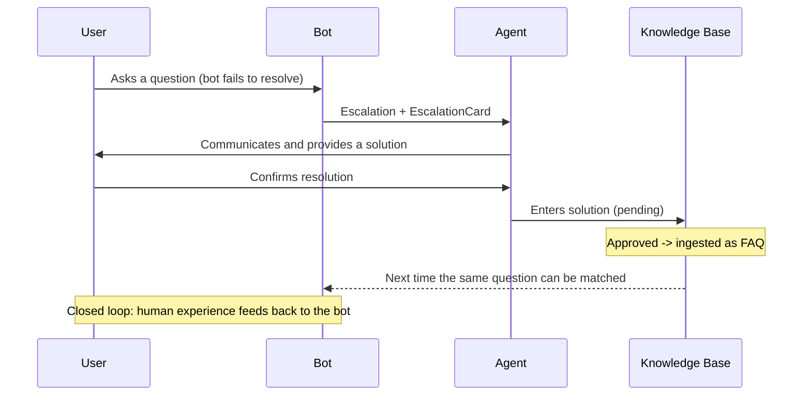

# Escalation Tutorial

The intelligent customer service system proactively escalates sessions to a human agent in specific scenarios, preventing the bot from repeatedly failing and worsening the user's mood. At escalation, an `EscalationCard` context card is generated so the agent can quickly understand the user's request before accepting. The solution consolidation closed loop feeds "human experience" back into the knowledge base.

!!! info "Prerequisites"

    - Escalation-related endpoints use the prefix `/api/v1/escalation`, auth header `X-API-Key`
    - Escalation is triggered automatically by the chat endpoint `/api/v1/chat`; the business side does not need to invoke trigger logic manually
    - For agent-side handling after escalation, see the [Agent Assist Workbench Tutorial](agent-assist.en.md)

---

## Escalation Closed Loop

```mermaid
flowchart LR
    A[Chat endpoint identifies<br/>trigger condition] --> B[Generate EscalationCard<br/>write to session]
    B --> C[Session agent_status=pending]
    C --> D[Agent views pending list]
    D --> E[Agent accepts]
    E --> F[Agent communicates + assist lookup]
    F --> G[Mark resolved]
    G --> H[Enter solution<br/>pending review]
    H --> I[Approved<br/>ingested as FAQ]
    I --> J[Next time the bot<br/>can retrieve and match]
```



---

## Escalation Triggers

The system uses the `EscalationEngine` rule engine to decide whether to escalate. There are 6 trigger conditions:

| Trigger | Rule | Priority | Description |
| --- | --- | --- | --- |
| Emotion sensitive | `emotion_score` is high and intent is `emotion_sensitive` | `high` | User is agitated; prioritize to avoid escalation |
| Consecutive failures | `failed_attempts ≥ threshold` | `medium` | Bot failed multiple times; transfer to a human |
| User explicit request | Matches keywords like "transfer to human" | `highest` | User explicitly requests; must escalate immediately |
| Outside working hours | Current time not in `[START, END)` | `info` | Only logged, no actual escalation (no agents on duty) |
| VIP user | Membership tier is VIP | `low` | VIP priority, but not mandatory |
| Business system unreachable | Business adapter call failed | `medium` | Business query failed; escalate as fallback |

!!! note "Priority semantics"

    - `highest`: must escalate immediately (user explicit request)
    - `high`: prioritize to avoid worsening (agitated user)
    - `medium`: handle by queue (consecutive failures / business unreachable)
    - `low`: VIP priority, but not mandatory
    - `info`: only logged, no actual escalation (off-hours)

### Configuration

Working hours and thresholds can be configured in `.env`:

```bash
# Human service hours (24-hour format, [START, END)). Outside this range, emotion/failure requests are not proactively escalated
# But an explicit "transfer to human" request from the user still escalates
WORKING_HOURS_START=9
WORKING_HOURS_END=18
TIMEZONE=Asia/Shanghai
```

!!! tip "Behavior outside working hours"

    Outside working hours, emotion-sensitive and consecutive-failure requests **are not proactively escalated** (because no agents are online); only `priority=info` is recorded. However, if the user explicitly says "transfer to human", the session is still escalated and joins the pending queue for handling the next day.

---

## EscalationCard Field Descriptions

The context card generated at escalation lets the agent quickly understand the user profile and the bot's handling history before accepting:

```json
{
  "session_id": "sess-9f3c2a1b",
  "user_id": "u_10086",
  "member_level": "gold",
  "history_ticket_count": 3,
  "turn_count": 4,
  "conversation_summary": "User asked about the shipment of order ORD-001; the bot failed to query it and the user became agitated",
  "attempted_solutions": [
    "Suggested logging in to the My Orders page to check",
    "Provided the customer service number 400-xxx"
  ],
  "escalate_reason": "Consecutive failures reached the threshold and the user was agitated",
  "priority": "high"
}
```

| Field | Type | Description |
| --- | --- | --- |
| `session_id` | string | Session ID |
| `user_id` | string? | User identifier |
| `member_level` | string | Membership tier, default `normal` |
| `history_ticket_count` | int | User's historical ticket count, reflecting past requests |
| `turn_count` | int | Number of turns in this conversation |
| `conversation_summary` | string | Conversation summary: core problem and current status |
| `attempted_solutions` | string[] | List of suggestions the bot already gave, to avoid repeating |
| `escalate_reason` | string | Reason for this escalation |
| `priority` | enum | Priority: `highest/high/medium/low/info` |

!!! note "Value of attempted_solutions"

    After accepting, the agent can review the suggestions the bot already gave, avoiding repeating "you can log in to the orders page" — the bot already said that. The agent should directly provide solutions the bot could not (such as querying specific order data).

---

## Escalation Phrasing Generation

When escalation occurs, the chat endpoint returns a fixed fallback phrasing to reassure the user, while exposing `escalation_card` for the frontend to display to the agent:

```json
{
  "session_id": "sess-9f3c2a1b",
  "reply": "We are sorry we could not resolve your issue. You have been transferred to a human agent. Please hold...",
  "status": "ok",
  "data": {
    "intent": "emotion_sensitive",
    "escalate_to_human": true,
    "escalation_card": {
      "session_id": "sess-9f3c2a1b",
      "priority": "high",
      "escalate_reason": "Consecutive failures reached the threshold and the user was agitated",
      "conversation_summary": "..."
    }
  }
}
```

!!! tip "Frontend handling recommendation"

    When the frontend receives `escalate_to_human=true`:
    1. Show the fallback phrasing to the user (`reply` field)
    2. Push `escalation_card` to the agent workbench's pending queue
    3. Stop subsequent bot conversation (the session has entered `pending` state)

---

## Escalation API

### Query Pending Solutions: GET /api/v1/escalation/solutions/pending

```bash
curl http://localhost:8000/api/v1/escalation/solutions/pending \
  -H "X-API-Key: ${API_KEY}"
```

```json
[
  {
    "solution_id": "sol-uuid-xxx",
    "session_id": "sess-9f3c2a1b",
    "question": "Where is the shipment of order ORD-001?",
    "solution": "The order has shipped. Tracking number SF1234567890...",
    "intent": "business_query",
    "status": "pending"
  }
]
```

### Enter a Human Solution: POST /api/v1/escalation/solution

A human agent (or the agent workbench) enters a solution, which enters the `pending` review queue:

```bash
curl -X POST http://localhost:8000/api/v1/escalation/solution \
  -H "Content-Type: application/json" \
  -H "X-API-Key: ${API_KEY}" \
  -d '{
    "session_id": "sess-9f3c2a1b",
    "question": "Where is the shipment of order ORD-001?",
    "solution": "The order has shipped. Tracking number SF1234567890, estimated delivery July 5.",
    "intent": "business_query"
  }'
```

!!! note "Difference from the agent endpoint"

    - `POST /api/v1/agent/sessions/{id}/solution`: entered by the agent in the workbench, associated with a specific session
    - `POST /api/v1/escalation/solution`: generic entry point; `session_id` is optional, suitable for offline entry
    - Both ultimately enter the same `pending` review queue

### Review and Ingest: POST /api/v1/escalation/solutions/{solution_id}/approve

After approval, the solution is ingested as FAQ knowledge. The next time the bot retrieves a similar question, it can match it:

```bash
curl -X POST http://localhost:8000/api/v1/escalation/solutions/sol-uuid-xxx/approve \
  -H "X-API-Key: ${API_KEY}"
```

```json
{
  "solution_id": "sol-uuid-xxx",
  "session_id": "sess-9f3c2a1b",
  "question": "Where is the shipment of order ORD-001?",
  "solution": "The order has shipped...",
  "intent": "business_query",
  "status": "approved"
}
```

!!! warning "Cache must be cleared after review"

    After a solution is ingested as a FAQ, call `POST /api/v1/performance/cache/invalidate` to clear the hot cache; otherwise the chat endpoint may still return the old fallback reply. We recommend triggering cache clearing automatically at the end of the review flow.

---

## How Agents Accept After Escalation

After escalation, the session enters `pending` and the agent accepts via the workbench API. For the full flow, see the [Agent Assist Workbench Tutorial](agent-assist.en.md). Core steps:

1. `GET /api/v1/agent/sessions/pending` to view the pending list
2. `GET /api/v1/agent/sessions/{id}` to view the `EscalationCard` and history
3. `POST /api/v1/agent/sessions/{id}/accept` to accept (CAS protected)
4. `POST /api/v1/agent/sessions/{id}/messages` to communicate with the user
5. `POST /api/v1/agent/sessions/{id}/resolve` to mark resolved
6. `POST /api/v1/agent/sessions/{id}/solution` to consolidate the solution

---

## Solution Consolidation Closed Loop

Solution consolidation is the key mechanism for feeding "human experience" back into the knowledge base, forming a complete loop:



### Complete Review and Ingestion Script

```python
import httpx

BASE = "http://localhost:8000"
HEADERS = {"X-API-Key": ""}

def review_and_ingest():
    """Review pending solutions; after approval, clear the cache so new knowledge takes effect immediately."""
    # 1. List pending solutions
    pending = httpx.get(f"{BASE}/api/v1/escalation/solutions/pending",
                        headers=HEADERS).json()
    for solution in pending:
        # 2. Human review (review logic omitted; in practice decided by a reviewer)
        approved = human_review(solution)
        if approved:
            # 3. Approved; ingest as FAQ
            httpx.post(
                f"{BASE}/api/v1/escalation/solutions/{solution['solution_id']}/approve",
                headers=HEADERS,
            )
            print(f"Ingested: {solution['question'][:30]}...")

    # 4. Critical: clear the hot cache so new FAQs are immediately retrievable
    httpx.post(f"{BASE}/api/v1/performance/cache/invalidate", headers=HEADERS)
    print(f"Reviewed {len(pending)} entries; cache cleared")

def human_review(solution):
    """Human review logic; returns whether to approve. In practice decided by the reviewer."""
    # Actual review logic omitted; the example defaults to approval
    return True

review_and_ingest()
```

---

## Next Steps

- [Agent Assist Workbench Tutorial](agent-assist.en.md): the agent's full handling flow after escalation
- [Knowledge Base Management Tutorial](knowledge.en.md): version management and quality checks after a solution is ingested
- [Performance Optimization Tutorial](performance.en.md): cache clearing and the solution activation mechanism
