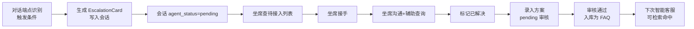
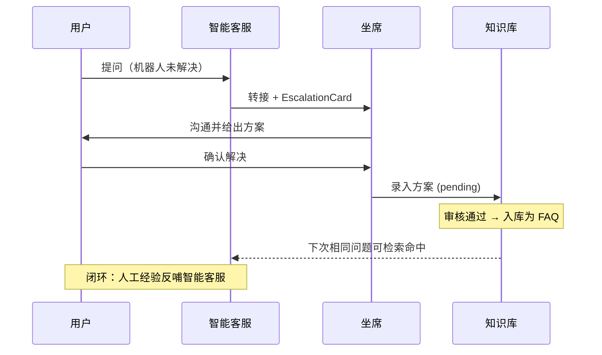

# 人工转接使用教程

智能客服在特定场景下会主动把会话转给人工，避免机器人反复失败导致用户情绪恶化。转接时生成 `EscalationCard` 上下文卡片，让坐席接手前快速理解用户诉求，并通过方案沉淀闭环让"人工经验"反哺知识库。

!!! info "前置条件"

    - 转接相关端点前缀 `/api/v1/escalation`，鉴权头 `X-API-Key`
    - 转接由对话端点 `/api/v1/chat` 自动触发，业务侧无需手动调用触发逻辑
    - 转接后坐席侧处理见 [坐席辅助工作台教程](agent-assist.zh.md)

---

## 转接闭环



---

## 转接触发条件

系统通过 `EscalationEngine` 规则引擎判定是否转接，共 6 类触发条件：

| 触发条件 | 命中规则 | 优先级 | 说明 |
| --- | --- | --- | --- |
| 情绪敏感 | `emotion_score` 高，意图为 `emotion_sensitive` | `high` | 用户情绪激动，优先处理避免激化 |
| 连续失败 | `failed_attempts ≥ 阈值` | `medium` | 机器人多次未解决，转人工接管 |
| 用户主动要求 | 命中"转人工"等关键词 | `highest` | 用户明确要求，必须立即转接 |
| 工作时间外 | 当前时间不在 `[START, END)` 区间 | `info` | 仅记录不实际转接（非工作时间无坐席） |
| VIP 用户 | 会员等级为 VIP | `low` | VIP 优先权，但非强制 |
| 业务系统不可达 | 业务适配器调用失败 | `medium` | 业务查询失败转人工兜底 |

!!! note "优先级语义"

    - `highest`：必须立即转接（用户主动要求）
    - `high`：优先处理避免激化（情绪激动）
    - `medium`：按队列处理（连续失败/业务不可达）
    - `low`：VIP 优先权，但非强制
    - `info`：仅记录，不实际转接（非工作时间）

### 配置项

`.env` 中可配置工作时间与阈值：

```bash
# 人工服务时间段（24 小时制，[START, END)），超出该区间不主动转接情绪/失败类诉求
# 但用户主动要求"转人工"时仍会转接
WORKING_HOURS_START=9
WORKING_HOURS_END=18
TIMEZONE=Asia/Shanghai
```

!!! tip "工作时间外的行为"

    非工作时间，情绪敏感与连续失败类诉求**不会主动转接**（因为无坐席在线），仅记录 `priority=info`。但用户主动说"转人工"时仍会转接，进入待接入队列等待次日处理。

---

## EscalationCard 字段说明

转接发生时生成的上下文卡片，让坐席接手前快速了解用户画像与机器人处理历程：

```json
{
  "session_id": "sess-9f3c2a1b",
  "user_id": "u_10086",
  "member_level": "gold",
  "history_ticket_count": 3,
  "turn_count": 4,
  "conversation_summary": "用户咨询订单 ORD-001 物流，机器人未能查询到，用户情绪激动",
  "attempted_solutions": [
    "建议登录「我的订单」页面查看",
    "提供客服电话 400-xxx"
  ],
  "escalate_reason": "连续失败达阈值且用户情绪激动",
  "priority": "high"
}
```

| 字段 | 类型 | 说明 |
| --- | --- | --- |
| `session_id` | string | 会话 ID |
| `user_id` | string? | 用户标识 |
| `member_level` | string | 会员等级，默认 `normal` |
| `history_ticket_count` | int | 用户历史工单数，反映过往诉求量 |
| `turn_count` | int | 本次对话已进行轮数 |
| `conversation_summary` | string | 对话摘要：核心问题与当前状态 |
| `attempted_solutions` | string[] | 机器人已给过的建议列表，避免重复方案 |
| `escalate_reason` | string | 本次转接的原因 |
| `priority` | enum | 优先级：`highest/high/medium/low/info` |

!!! note "attempted_solutions 的价值"

    坐席接手后可查看机器人已给过的建议，避免对用户重复说"您可以登录订单页面查看"——这条机器人已经说过。坐席应直接给出机器人无法提供的方案（如查询具体订单数据）。

---

## 转接话术生成

转接发生时，对话端点会返回固定兜底话术安抚用户，同时透出 `escalation_card` 供前端展示给坐席：

```json
{
  "session_id": "sess-9f3c2a1b",
  "reply": "非常抱歉未能解决您的问题，已为您转接人工客服，请稍候...",
  "status": "ok",
  "data": {
    "intent": "emotion_sensitive",
    "escalate_to_human": true,
    "escalation_card": {
      "session_id": "sess-9f3c2a1b",
      "priority": "high",
      "escalate_reason": "连续失败达阈值且用户情绪激动",
      "conversation_summary": "..."
    }
  }
}
```

!!! tip "前端处理建议"

    前端收到 `escalate_to_human=true` 时：
    1. 向用户展示兜底话术（`reply` 字段）
    2. 把 `escalation_card` 推送到坐席工作台的待接入队列
    3. 停止后续智能客服对话（会话已进入 `pending` 状态）

---

## 转接 API

### 查询待审核方案：GET /api/v1/escalation/solutions/pending

```bash
curl http://localhost:8000/api/v1/escalation/solutions/pending \
  -H "X-API-Key: ${API_KEY}"
```

```json
[
  {
    "solution_id": "sol-uuid-xxx",
    "session_id": "sess-9f3c2a1b",
    "question": "订单 ORD-001 物流到哪了？",
    "solution": "该订单已发货，快递单号 SF1234567890...",
    "intent": "business_query",
    "status": "pending"
  }
]
```

### 录入人工方案：POST /api/v1/escalation/solution

人工客服（或坐席工作台）录入解决方案，进入 `pending` 审核队列：

```bash
curl -X POST http://localhost:8000/api/v1/escalation/solution \
  -H "Content-Type: application/json" \
  -H "X-API-Key: ${API_KEY}" \
  -d '{
    "session_id": "sess-9f3c2a1b",
    "question": "订单 ORD-001 物流到哪了？",
    "solution": "该订单已发货，快递单号 SF1234567890，预计 7 月 5 日送达。",
    "intent": "business_query"
  }'
```

!!! note "与坐席端点的区别"

    - `POST /api/v1/agent/sessions/{id}/solution`：坐席在工作台录入，关联具体会话
    - `POST /api/v1/escalation/solution`：通用录入入口，可不传 `session_id`，便于离线录入
    - 两者最终都进入同一个 `pending` 审核队列

### 审核入库：POST /api/v1/escalation/solutions/{solution_id}/approve

审核通过后方案入库为 FAQ 知识，下次智能客服检索相似问题时可命中：

```bash
curl -X POST http://localhost:8000/api/v1/escalation/solutions/sol-uuid-xxx/approve \
  -H "X-API-Key: ${API_KEY}"
```

```json
{
  "solution_id": "sol-uuid-xxx",
  "session_id": "sess-9f3c2a1b",
  "question": "订单 ORD-001 物流到哪了？",
  "solution": "该订单已发货...",
  "intent": "business_query",
  "status": "approved"
}
```

!!! warning "审核后必须清缓存"

    方案入库为 FAQ 后，需调用 `POST /api/v1/performance/cache/invalidate` 清空热点缓存，否则对话端点可能仍返回旧的兜底回复。建议审核流程末尾自动触发清缓存。

---

## 转接后坐席如何接手

转接发生后会话进入 `pending` 状态，坐席通过工作台 API 接手处理。完整流程见 [坐席辅助工作台教程](agent-assist.zh.md)，核心步骤：

1. `GET /api/v1/agent/sessions/pending` 查看待接入列表
2. `GET /api/v1/agent/sessions/{id}` 查看 `EscalationCard` 与历史
3. `POST /api/v1/agent/sessions/{id}/accept` 接手（CAS 保护）
4. `POST /api/v1/agent/sessions/{id}/messages` 与用户沟通
5. `POST /api/v1/agent/sessions/{id}/resolve` 标记已解决
6. `POST /api/v1/agent/sessions/{id}/solution` 录入方案沉淀

---

## 方案沉淀闭环

方案沉淀是让"人工经验"反哺知识库的关键机制，形成完整闭环：



### 完整审核入库脚本

```python
import httpx

BASE = "http://localhost:8000"
HEADERS = {"X-API-Key": ""}

def review_and_ingest():
    """审核待入库方案，通过后清缓存让新知识立即生效。"""
    # 1. 列出待审核方案
    pending = httpx.get(f"{BASE}/api/v1/escalation/solutions/pending",
                        headers=HEADERS).json()
    for solution in pending:
        # 2. 人工审核（此处省略审核逻辑，实际由人工判断）
        approved = human_review(solution)
        if approved:
            # 3. 审核通过，入库为 FAQ
            httpx.post(
                f"{BASE}/api/v1/escalation/solutions/{solution['solution_id']}/approve",
                headers=HEADERS,
            )
            print(f"已入库：{solution['question'][:30]}...")

    # 4. 关键：清空热点缓存，让新 FAQ 立即可被检索
    httpx.post(f"{BASE}/api/v1/performance/cache/invalidate", headers=HEADERS)
    print(f"已审核 {len(pending)} 条，缓存已清空")

def human_review(solution):
    """人工审核逻辑，返回是否通过。实际由审核人员判断。"""
    # 此处省略实际审核判断，示例默认通过
    return True

review_and_ingest()
```

---

## 下一步

- [坐席辅助工作台教程](agent-assist.zh.md)：转接后坐席的完整处理流程
- [知识库管理教程](knowledge.zh.md)：方案入库后的版本管理与质量校验
- [性能优化教程](performance.zh.md)：缓存清理与方案生效机制
