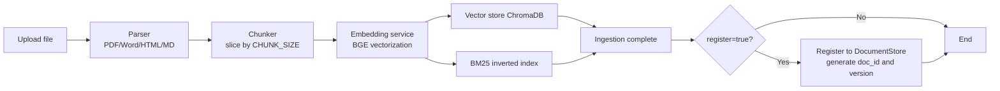

# Knowledge Base Management Tutorial

The knowledge base is the foundation of RAG Q&A. This tutorial covers how to use the HTTP API to ingest documents, query statistics, manage documents, run quality checks, roll back versions, evaluate retrieval, and clear the cache, building a high-quality knowledge base that the chat endpoint can retrieve and match.

!!! info "Prerequisites"

    - Endpoint prefix is uniformly `/api/v1/knowledge`, auth header `X-API-Key`
    - Vector data is stored at `CHROMA_PERSIST_DIR=./chroma_data` by default
    - Embedding model defaults to `BAAI/bge-large-zh-v1.5`, configurable via `EMBEDDING_MODEL`

---

## Endpoint Overview

| Endpoint | Method | Description |
| --- | --- | --- |
| `/api/v1/knowledge/ingest` | POST | Upload a document for ingestion (multipart) |
| `/api/v1/knowledge/stats` | GET | Knowledge base statistics |
| `/api/v1/knowledge/documents` | GET | Paginated document list |
| `/api/v1/knowledge/documents/{doc_id}` | GET | Document details (with version history) |
| `/api/v1/knowledge/documents/{doc_id}` | DELETE | Delete a document |
| `/api/v1/knowledge/quality/check` | POST | Quality check (deduplication/terminology/sensitive words) |
| `/api/v1/knowledge/documents/{doc_id}/rollback` | POST | Roll back to a specified version |
| `/api/v1/evaluation/run` | POST | Trigger retrieval evaluation |

---

## Document Ingestion: POST /api/v1/knowledge/ingest

Upload a file via multipart. The system automatically performs parsing → chunking → embedding → dual-index (vector + BM25) ingestion.

### Supported File Formats

| Extension | Parsing Method |
| --- | --- |
| `.pdf` | PDF text extraction |
| `.docx` / `.doc` | Word paragraph parsing |
| `.html` / `.htm` | HTML body extraction |
| `.md` / `.markdown` | Markdown structured chunking |
| `.txt` | Plain text line-by-line chunking |

### Form Parameters

| Field | Type | Required | Description |
| --- | --- | :---: | --- |
| `file` | file | Yes | Document file to ingest |
| `product_category` | string | No | Product category, default `unknown` |
| `applicable_version` | string | No | Applicable version, default `latest` |
| `knowledge_type` | string | No | Knowledge type: `faq/policy/doc/tutorial/ticket` |
| `published_at` | string | No | Publish time, ISO8601 string |
| `register` | bool | No | Whether to register to the document registry (enables version management), default `false` |
| `validate_quality` | bool | No | Whether to run quality checks at ingestion, default `false` |

### Ingestion Flow



!!! tip "Purpose of the register parameter"

    - `register=false` (default): only chunks are ingested; document metadata is not registered, so version management and rollback are unavailable
    - `register=true`: registers with `DocumentStore`, automatically generates `doc_id`, records `doc_hash` and version, and supports subsequent rollback and canary comparison
    - For production, always use `register=true` for version governance

### Examples

=== "curl"

    ```bash
    # Ingest a FAQ document with version management and quality checks enabled
    curl -X POST http://localhost:8000/api/v1/knowledge/ingest \
      -H "X-API-Key: ${API_KEY}" \
      -F "file=@docs/faq.md" \
      -F "knowledge_type=faq" \
      -F "product_category=General" \
      -F "register=true" \
      -F "validate_quality=true"
    ```

=== "Python (httpx)"

    ```python
    import httpx

    # Use the files parameter to build a multipart upload; metadata is passed via extra form fields
    with open("docs/return_policy.md", "rb") as f:
        resp = httpx.post(
            "http://localhost:8000/api/v1/knowledge/ingest",
            headers={"X-API-Key": ""},
            files={"file": ("return_policy.md", f, "text/markdown")},
            data={
                "knowledge_type": "policy",
                "product_category": "After-sales",
                "register": "true",
                "validate_quality": "true",
            },
            timeout=120.0,  # large documents take longer to embed; relax the timeout
        )
    result = resp.json()
    print(f"Ingested {result['chunk_count']} chunks, doc_id={result.get('doc_id')}")
    ```

### Response Body

```json
{
  "source": "return_policy.md",
  "chunk_count": 12,
  "doc_id": "doc-a1b2c3",
  "version": "v1",
  "quality_report": null
}
```

!!! warning "Cache must be cleared after ingestion"

    After a new document is ingested, the hot query cache may still hold stale replies. Always call `POST /api/v1/performance/cache/invalidate` to clear it; otherwise users may not get the latest knowledge.

---

## Knowledge Base Statistics: GET /api/v1/knowledge/stats

```bash
curl http://localhost:8000/api/v1/knowledge/stats -H "X-API-Key: ${API_KEY}"
```

```json
{
  "total_documents": 18,
  "total_chunks": 342,
  "total_sources": 12,
  "vector_store_size": 342,
  "bm25_index_size": 342,
  "last_updated": "2026-07-03T10:23:45Z"
}
```

!!! note "Dual-index consistency"

    The system maintains two indexes: the vector store (ChromaDB) and a BM25 inverted index. Both are written synchronously at ingestion so the two recall paths return aligned results during hybrid retrieval. If you notice inconsistent counts, trigger a full update rebuild (see the [Operations Management Tutorial](operations.en.md)).

---

## Document Management

### List Query

```bash
# Paginate registered documents; limit/offset controls paging
curl "http://localhost:8000/api/v1/knowledge/documents?limit=20&offset=0" \
  -H "X-API-Key: ${API_KEY}"
```

```json
{
  "items": [
    {
      "doc_id": "doc-a1b2c3",
      "source": "return_policy.md",
      "current_version": "v2",
      "status": "active",
      "version_count": 2,
      "updated_at": "2026-07-02T15:30:00Z"
    }
  ],
  "total": 18,
  "limit": 20,
  "offset": 0
}
```

### Document Details (with version history)

```bash
curl http://localhost:8000/api/v1/knowledge/documents/doc-a1b2c3 \
  -H "X-API-Key: ${API_KEY}"
```

Returns the full version history. Each version includes `version` / `doc_hash` / `status` / `chunk_count` / `created_at` for tracing every change.

### Delete a Document

```bash
curl -X DELETE http://localhost:8000/api/v1/knowledge/documents/doc-a1b2c3 \
  -H "X-API-Key: ${API_KEY}"
```

```json
{
  "doc_id": "doc-a1b2c3",
  "deleted_chunks": 12,
  "success": true
}
```

!!! warning "Deletion is irreversible"

    Deletion removes all chunks of the document from the vector store, but version metadata is retained (for audit). To restore, use the `rollback` endpoint to re-ingest from the stored text snapshot.

### Rebuild the Index

To rebuild an index, delete the document and `ingest` again. For bulk rebuilds, use the full update endpoint `/api/v1/update/full` described in the [Operations Management Tutorial](operations.en.md).

---

## Quality Check: POST /api/v1/knowledge/quality/check

Run a batch quality inspection on ingested content to identify three classes of issues: deduplication, terminology compliance, and sensitive words.

### Request Body

```json
{
  "source": "return_policy.md",
  "doc_id": null
}
```

Both `source` and `doc_id` are optional filters. When neither is provided, all content is inspected.

### Inspection Dimensions

| Dimension | Detected Content | Threshold Configuration |
| --- | --- | --- |
| Deduplication | Pairwise comparison of chunks in the library to find internal duplicates | `DEDUP_THRESHOLD=0.95` |
| Terminology | Checks terms against the dictionary `term_dict.json` | Built-in terminology table |
| Sensitive words | Matches sensitive words in `sensitive_words.txt` | Built-in sensitive word list |

```bash
curl -X POST http://localhost:8000/api/v1/knowledge/quality/check \
  -H "Content-Type: application/json" \
  -H "X-API-Key: ${API_KEY}" \
  -d '{"source": "return_policy.md"}'
```

```json
{
  "total_chunks": 12,
  "summary": "Found 2 issues: 1 duplicate, 1 sensitive word",
  "duplicates": [...],
  "term_violations": [],
  "sensitive_hits": [...]
}
```

!!! tip "Synchronous check at ingestion"

    Pass `validate_quality=true` at `ingest` to run the quality check inline within the ingestion flow. The result is written to the `quality_report` field of the response, avoiding a separate call afterward.

---

## Version Management

Once a document is registered with `DocumentStore`, each re-ingestion (when `doc_hash` changes) generates a new version. Old versions are retained and can be rolled back.

### Version Rollback: POST /api/v1/knowledge/documents/{doc_id}/rollback

```bash
curl -X POST http://localhost:8000/api/v1/knowledge/documents/doc-a1b2c3/rollback \
  -H "Content-Type: application/json" \
  -H "X-API-Key: ${API_KEY}" \
  -d '{"target_version": "v1"}'
```

```json
{
  "doc_id": "doc-a1b2c3",
  "rolled_back_to": "v1",
  "chunk_count": 10,
  "success": true
}
```

!!! note "Rollback mechanism"

    If the chunks of the target version have been deleted, the system automatically re-embeds and re-ingests from the stored text snapshot, ensuring rollback always succeeds.

### Incremental Update

Triggered via `/api/v1/update/incremental`. Only new files or files whose `doc_hash` changed are processed; records of deleted files are not removed. See the [Operations Management Tutorial](operations.en.md).

### Real-time Update

Use `/api/v1/update/file` for single-file real-time ingestion, suitable for API-triggered immediate updates (for example, ingesting a reviewed solution as a FAQ immediately after approval).

---

## Retrieval Evaluation: POST /api/v1/evaluation/run

Quantifies retrieval effectiveness to guide parameter tuning. The system ships with a 30-case default test set and also supports external test sets.

### Evaluation Metrics

| Metric | Meaning | Ideal Value |
| --- | --- | --- |
| `Recall@K` | Proportion of cases where the correct answer is hit within the top K results | Higher is better |
| `Hit Rate` | Proportion of cases with at least one correct result | Higher is better |
| `MRR` | Mean Reciprocal Rank (highest score when the first hit is correct) | Higher is better |
| `Hallucination rate` | Proportion of answers not grounded in retrieved content | Lower is better |

### Request Body

```json
{
  "testset_path": null,
  "top_k": null
}
```

- When `testset_path` is empty, the built-in default test set (30 cases) is used
- When `top_k` is empty, the tuning parameter `RERANK_TOP_K` (default 5) is used

### Evaluation Dataset Format

External test sets are JSON Lines files, one case per line:

```json
{"query": "What is the return and exchange policy?", "expected_sources": ["return_policy.md"], "expected_answer_keywords": ["7 days", "return"]}
{"query": "What membership tiers are there?", "expected_sources": ["member.md"], "expected_answer_keywords": ["regular", "silver", "gold"]}
```

### Examples

=== "curl"

    ```bash
    curl -X POST http://localhost:8000/api/v1/evaluation/run \
      -H "Content-Type: application/json" \
      -H "X-API-Key: ${API_KEY}" \
      -d '{"top_k": 5}'
    ```

=== "Python"

    ```python
    import httpx

    # Evaluate with an external test set; results are persisted to the evaluation_reports/ directory
    resp = httpx.post(
        "http://localhost:8000/api/v1/evaluation/run",
        headers={"X-API-Key": ""},
        json={"testset_path": "tests/sample_data/eval.jsonl", "top_k": 5},
        timeout=180.0,
    )
    report = resp.json()
    print(f"Recall@5: {report['recall_at_k']:.2%}")
    print(f"MRR: {report['mrr']:.3f}")
    print(f"Hallucination rate: {report['hallucination_rate']:.2%}")
    ```

### Query Historical Reports

```bash
# List historical report summaries
curl http://localhost:8000/api/v1/evaluation/reports -H "X-API-Key: ${API_KEY}"

# Query a single report in detail
curl http://localhost:8000/api/v1/evaluation/reports/{report_id} -H "X-API-Key: ${API_KEY}"
```

---

## Cache Clearing: POST /api/v1/performance/cache/invalidate

**Must be called after knowledge base updates**, otherwise the hot query cache will return stale replies.

```bash
curl -X POST http://localhost:8000/api/v1/performance/cache/invalidate \
  -H "X-API-Key: ${API_KEY}"
```

```json
{
  "success": true,
  "cleared": 47,
  "message": "Cleared 47 cache entries"
}
```

### Complete Ingestion Flow Script

```python
import httpx

BASE = "http://localhost:8000"
HEADERS = {"X-API-Key": ""}

def ingest_and_invalidate(file_path: str, knowledge_type: str = "faq"):
    """Complete ingestion flow: upload -> validate -> clear cache, ensuring new knowledge is immediately retrievable."""
    with open(file_path, "rb") as f:
        # register=true enables version management; validate_quality=true runs the check at ingestion
        resp = httpx.post(
            f"{BASE}/api/v1/knowledge/ingest",
            headers=HEADERS,
            files={"file": (file_path, f, "text/markdown")},
            data={
                "knowledge_type": knowledge_type,
                "register": "true",
                "validate_quality": "true",
            },
            timeout=120.0,
        )
    result = resp.json()
    print(f"Ingestion complete: {result['chunk_count']} chunks")

    # Critical: clear the hot cache to avoid returning stale replies
    httpx.post(f"{BASE}/api/v1/performance/cache/invalidate", headers=HEADERS)
    print("Hot cache cleared; new knowledge is now live")

ingest_and_invalidate("docs/faq.md", knowledge_type="faq")
```

---

## Next Steps

- [Chat Endpoint Tutorial](chat.en.md): how to expose Q&A once the knowledge base is ready
- [Performance Optimization Tutorial](performance.en.md): cache hit mechanism and retrieval tuning
- [Operations Management Tutorial](operations.en.md): bulk updates and version governance
