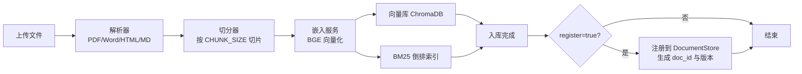

# 知识库管理使用教程

知识库是 RAG 问答的基础。本教程介绍如何通过 HTTP API 完成文档入库、统计查询、文档管理、质量校验、版本回滚、检索评估与缓存清理，构建可被对话端点检索命中的高质量知识库。

!!! info "前置条件"

    - 端点前缀统一为 `/api/v1/knowledge`，鉴权头 `X-API-Key`
    - 默认 `CHROMA_PERSIST_DIR=./chroma_data` 存储向量数据
    - 嵌入模型默认 `BAAI/bge-large-zh-v1.5`，可通过 `EMBEDDING_MODEL` 配置

---

## 端点概览

| 端点 | 方法 | 说明 |
| --- | --- | --- |
| `/api/v1/knowledge/ingest` | POST | 上传文档入库（multipart） |
| `/api/v1/knowledge/stats` | GET | 知识库统计信息 |
| `/api/v1/knowledge/documents` | GET | 分页查询文档列表 |
| `/api/v1/knowledge/documents/{doc_id}` | GET | 文档详情（含版本历史） |
| `/api/v1/knowledge/documents/{doc_id}` | DELETE | 删除文档 |
| `/api/v1/knowledge/quality/check` | POST | 质量校验（去重/术语/敏感词） |
| `/api/v1/knowledge/documents/{doc_id}/rollback` | POST | 回滚到指定版本 |
| `/api/v1/evaluation/run` | POST | 触发检索评估 |

---

## 文档入库：POST /api/v1/knowledge/ingest

通过 multipart 上传文件，系统自动完成解析 → 切分 → 嵌入 → 双索引（向量 + BM25）入库。

### 支持的文件格式

| 扩展名 | 解析方式 |
| --- | --- |
| `.pdf` | PDF 文本抽取 |
| `.docx` / `.doc` | Word 段落解析 |
| `.html` / `.htm` | HTML 正文提取 |
| `.md` / `.markdown` | Markdown 结构化切分 |
| `.txt` | 纯文本按行切分 |

### 表单参数

| 字段 | 类型 | 必填 | 说明 |
| --- | --- | :---: | --- |
| `file` | file | 是 | 待入库的文档文件 |
| `product_category` | string | 否 | 产品分类，默认 `unknown` |
| `applicable_version` | string | 否 | 适用版本，默认 `latest` |
| `knowledge_type` | string | 否 | 知识类型：`faq/policy/doc/tutorial/ticket` |
| `published_at` | string | 否 | 发布时间，ISO8601 字符串 |
| `register` | bool | 否 | 是否注册到文档注册表（启用版本管理），默认 `false` |
| `validate_quality` | bool | 否 | 入库时是否执行质量校验，默认 `false` |

### 入库流程



!!! tip "register 参数的作用"

    - `register=false`（默认）：仅入库 chunks，不注册文档元信息，无法版本管理与回滚
    - `register=true`：注册到 `DocumentStore`，自动生成 `doc_id`、记录 `doc_hash` 与版本，支持后续回滚与灰度对比
    - 生产环境建议始终 `register=true`，便于版本治理

### 示例

=== "curl"

    ```bash
    # 入库一份 FAQ 文档，启用版本管理与质量校验
    curl -X POST http://localhost:8000/api/v1/knowledge/ingest \
      -H "X-API-Key: ${API_KEY}" \
      -F "file=@docs/faq.md" \
      -F "knowledge_type=faq" \
      -F "product_category=通用" \
      -F "register=true" \
      -F "validate_quality=true"
    ```

=== "Python (httpx)"

    ```python
    import httpx

    # 用 files 参数构造 multipart 上传，metadata 通过额外表单字段传递
    with open("docs/return_policy.md", "rb") as f:
        resp = httpx.post(
            "http://localhost:8000/api/v1/knowledge/ingest",
            headers={"X-API-Key": ""},
            files={"file": ("return_policy.md", f, "text/markdown")},
            data={
                "knowledge_type": "policy",
                "product_category": "售后",
                "register": "true",
                "validate_quality": "true",
            },
            timeout=120.0,  # 大文档嵌入耗时较长，超时放宽
        )
    result = resp.json()
    print(f"入库 {result['chunk_count']} 个片段，doc_id={result.get('doc_id')}")
    ```

### 响应体

```json
{
  "source": "return_policy.md",
  "chunk_count": 12,
  "doc_id": "doc-a1b2c3",
  "version": "v1",
  "quality_report": null
}
```

!!! warning "入库后必须清缓存"

    新文档入库后，热点查询缓存可能仍持有旧回复。务必调用 `POST /api/v1/performance/cache/invalidate` 清空，否则用户可能拿不到最新知识。

---

## 知识库统计：GET /api/v1/knowledge/stats

```bash
curl http://localhost:8000/api/v1/knowledge/stats -H "X-API-Key: ${API_KEY}"
```

```json
{
  "total_documents": 18,
  "total_chunks": 342,
  "total_sources": 12,
  "vector_store_size": 342,
  "bm25_index_size": 342,
  "last_updated": "2026-07-03T10:23:45Z"
}
```

!!! note "双索引一致性"

    系统维护向量库（ChromaDB）与 BM25 倒排索引两套索引，入库时同步写入，保证混合检索时两路召回结果对齐。若发现统计数不一致，可触发全量更新重建（见 [运营管理教程](operations.zh.md)）。

---

## 文档管理

### 列表查询

```bash
# 分页查询已注册文档，limit/offset 控制分页
curl "http://localhost:8000/api/v1/knowledge/documents?limit=20&offset=0" \
  -H "X-API-Key: ${API_KEY}"
```

```json
{
  "items": [
    {
      "doc_id": "doc-a1b2c3",
      "source": "return_policy.md",
      "current_version": "v2",
      "status": "active",
      "version_count": 2,
      "updated_at": "2026-07-02T15:30:00Z"
    }
  ],
  "total": 18,
  "limit": 20,
  "offset": 0
}
```

### 文档详情（含版本历史）

```bash
curl http://localhost:8000/api/v1/knowledge/documents/doc-a1b2c3 \
  -H "X-API-Key: ${API_KEY}"
```

返回完整版本历史，每个版本含 `version` / `doc_hash` / `status` / `chunk_count` / `created_at`，便于追溯每次变更。

### 删除文档

```bash
curl -X DELETE http://localhost:8000/api/v1/knowledge/documents/doc-a1b2c3 \
  -H "X-API-Key: ${API_KEY}"
```

```json
{
  "doc_id": "doc-a1b2c3",
  "deleted_chunks": 12,
  "success": true
}
```

!!! warning "删除不可恢复"

    删除会移除向量库中该文档的全部 chunks，但版本元信息保留（便于审计）。如需恢复，可通过 `rollback` 端点用存储的文本快照重新入库。

### 重建索引

如需重建索引，删除文档后重新 `ingest` 即可。对于批量重建，建议使用 [运营管理教程](operations.zh.md) 中的全量更新接口 `/api/v1/update/full`。

---

## 质量校验：POST /api/v1/knowledge/quality/check

对已入库内容执行批量质量巡检，识别去重、术语规范、敏感词三类问题。

### 请求体

```json
{
  "source": "return_policy.md",
  "doc_id": null
}
```

`source` 与 `doc_id` 均为可选过滤条件，未提供时巡检全量内容。

### 校验维度

| 维度 | 检测内容 | 阈值配置 |
| --- | --- | --- |
| 去重 | 库内 chunks 两两比对，发现内部重复片段 | `DEDUP_THRESHOLD=0.95` |
| 术语 | 检查术语是否符合规范字典 `term_dict.json` | 内置术语表 |
| 敏感词 | 命中 `sensitive_words.txt` 中的敏感词 | 内置敏感词表 |

```bash
curl -X POST http://localhost:8000/api/v1/knowledge/quality/check \
  -H "Content-Type: application/json" \
  -H "X-API-Key: ${API_KEY}" \
  -d '{"source": "return_policy.md"}'
```

```json
{
  "total_chunks": 12,
  "summary": "发现 2 处问题：1 处重复，1 处敏感词",
  "duplicates": [...],
  "term_violations": [],
  "sensitive_hits": [...]
}
```

!!! tip "入库时同步校验"

    `ingest` 时传 `validate_quality=true` 可在入库流程内联执行质量校验，结果写入响应的 `quality_report` 字段，避免事后单独调用。

---

## 版本管理

文档注册到 `DocumentStore` 后，每次重新入库（`doc_hash` 变化）会生成新版本，老版本保留可回滚。

### 版本回滚：POST /api/v1/knowledge/documents/{doc_id}/rollback

```bash
curl -X POST http://localhost:8000/api/v1/knowledge/documents/doc-a1b2c3/rollback \
  -H "Content-Type: application/json" \
  -H "X-API-Key: ${API_KEY}" \
  -d '{"target_version": "v1"}'
```

```json
{
  "doc_id": "doc-a1b2c3",
  "rolled_back_to": "v1",
  "chunk_count": 10,
  "success": true
}
```

!!! note "回滚机制"

    目标版本的 chunks 若已被删除，系统会自动用存储的文本快照重新嵌入入库，保证回滚总能成功。

### 增量更新

通过 `/api/v1/update/incremental` 触发，仅处理新增或 `doc_hash` 变化的文件，不删除已不存在文件的记录。详见 [运营管理教程](operations.zh.md)。

### 实时更新

通过 `/api/v1/update/file` 单文件实时入库，适用于 API 触发的即时更新场景（如人工方案审核通过后立即入库为 FAQ）。

---

## 检索评估：POST /api/v1/evaluation/run

量化检索效果，指导调参。系统内置 30 条默认测试集，也支持外部测试集。

### 评估指标

| 指标 | 含义 | 理想值 |
| --- | --- | --- |
| `Recall@K` | 前 K 条结果中命中正确答案的比例 | 越高越好 |
| `Hit Rate` | 至少命中一条正确结果的比例 | 越高越好 |
| `MRR` | 平均倒数排名（首位命中得分最高） | 越高越好 |
| `幻觉率` | 回答未基于检索内容的比例 | 越低越好 |

### 请求体

```json
{
  "testset_path": null,
  "top_k": null
}
```

- `testset_path` 为空时使用内置默认测试集（30 条）
- `top_k` 为空时使用调优参数中的 `RERANK_TOP_K`（默认 5）

### 评估数据集格式

外部测试集为 JSON Lines 文件，每行一条：

```json
{"query": "退换货政策是什么？", "expected_sources": ["return_policy.md"], "expected_answer_keywords": ["7天", "退货"]}
{"query": "会员等级有哪些？", "expected_sources": ["member.md"], "expected_answer_keywords": ["普通", "银卡", "金卡"]}
```

### 示例

=== "curl"

    ```bash
    curl -X POST http://localhost:8000/api/v1/evaluation/run \
      -H "Content-Type: application/json" \
      -H "X-API-Key: ${API_KEY}" \
      -d '{"top_k": 5}'
    ```

=== "Python"

    ```python
    import httpx

    # 用外部测试集评估，结果持久化到 evaluation_reports/ 目录
    resp = httpx.post(
        "http://localhost:8000/api/v1/evaluation/run",
        headers={"X-API-Key": ""},
        json={"testset_path": "tests/sample_data/eval.jsonl", "top_k": 5},
        timeout=180.0,
    )
    report = resp.json()
    print(f"Recall@5: {report['recall_at_k']:.2%}")
    print(f"MRR: {report['mrr']:.3f}")
    print(f"幻觉率: {report['hallucination_rate']:.2%}")
    ```

### 查询历史报告

```bash
# 列出历史报告摘要
curl http://localhost:8000/api/v1/evaluation/reports -H "X-API-Key: ${API_KEY}"

# 查询单个报告详情
curl http://localhost:8000/api/v1/evaluation/reports/{report_id} -H "X-API-Key: ${API_KEY}"
```

---

## 缓存清理：POST /api/v1/performance/cache/invalidate

**知识库更新后必须调用**，否则热点查询缓存会返回过期回复。

```bash
curl -X POST http://localhost:8000/api/v1/performance/cache/invalidate \
  -H "X-API-Key: ${API_KEY}"
```

```json
{
  "success": true,
  "cleared": 47,
  "message": "已清空 47 条缓存"
}
```

### 完整入库流程脚本

```python
import httpx

BASE = "http://localhost:8000"
HEADERS = {"X-API-Key": ""}

def ingest_and_invalidate(file_path: str, knowledge_type: str = "faq"):
    """完整入库流程：上传 → 校验 → 清缓存，保证新知识立即可检索。"""
    with open(file_path, "rb") as f:
        # register=true 启用版本管理，validate_quality=true 入库即校验
        resp = httpx.post(
            f"{BASE}/api/v1/knowledge/ingest",
            headers=HEADERS,
            files={"file": (file_path, f, "text/markdown")},
            data={
                "knowledge_type": knowledge_type,
                "register": "true",
                "validate_quality": "true",
            },
            timeout=120.0,
        )
    result = resp.json()
    print(f"入库完成：{result['chunk_count']} 片段")

    # 关键：清空热点缓存，避免返回旧回复
    httpx.post(f"{BASE}/api/v1/performance/cache/invalidate", headers=HEADERS)
    print("热点缓存已清空，新知识立即生效")

ingest_and_invalidate("docs/faq.md", knowledge_type="faq")
```

---

## 下一步

- [对话端点教程](chat.zh.md)：知识库就绪后如何对外提供问答
- [性能优化教程](performance.zh.md)：缓存命中机制与检索调参
- [运营管理教程](operations.zh.md)：批量更新与版本治理
