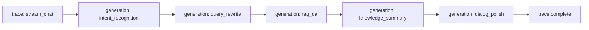

# Observability Tutorial

The system provides three layers of observability: **Langfuse LLM tracing** (full-chain visualization), **monitoring endpoints** (runtime state queries), and **circuit breakers and alerts** (self-healing and notifications). This tutorial covers configuration and typical troubleshooting scenarios.

!!! info "Prerequisites"

    - Observability endpoints use the prefixes `/api/v1/observability` and `/api/v1/monitor`, and **are not authenticated**, so ops dashboards can access them without credentials
    - When Langfuse is not configured, it automatically degrades to a no-op without affecting the main chain

---

## Observability Overview

```mermaid
flowchart TB
    A[Chat request] --> B[Monitor trace]
    A --> C[Langfuse trace]
    B --> D[/api/v1/monitor/*<br/>trace list/details/Agent stats]
    C --> E[Langfuse cloud dashboard<br/>full-chain visualization]
    F[Circuit breaker] --> G[/api/v1/observability/circuit-breakers]
    H[Alert engine] --> I[/api/v1/observability/alerts]
    J[Token tracking] --> K[/api/v1/observability/token-usage]
    L[Health check] --> M[/api/v1/observability/health]
```

---

## Langfuse LLM Tracing

Langfuse provides full LLM call-chain visualization, covering intent recognition → query rewrite → RAG → summary → polishing. It automatically reports tokens/cost/latency.

### Configuration

Enable Langfuse in `.env` by configuring 4 settings:

```bash
# Enable Langfuse (default False, degrades to no-op)
LANGFUSE_ENABLED=True
LANGFUSE_PUBLIC_KEY=pk-lf-xxx
LANGFUSE_SECRET_KEY=sk-lf-xxx
LANGFUSE_HOST=https://cloud.langfuse.com
```

!!! warning "Fallback mechanism"

    When any of the following is not met, Langfuse automatically degrades to a no-op (returning None) without affecting the main chain:
    - `LANGFUSE_ENABLED=False`
    - `LANGFUSE_PUBLIC_KEY` is empty
    - `LANGFUSE_SECRET_KEY` is empty
    - The langfuse library is not installed or fails to initialize

    Callers take the no-op branch accordingly, with zero impact on business logic.

### 11 Prompt Markers

The system tags 11 key prompts with `name` and `version`, making it easy to filter and compare by prompt type in the Langfuse dashboard:

| prompt name | Purpose | Trigger Scenario |
| --- | --- | --- |
| `intent_recognition` | Intent recognition | First step of each turn |
| `query_rewrite` | Query rewrite | Multi-turn coreference resolution |
| `rag_qa` | RAG Q&A | Knowledge Q&A intent |
| `knowledge_summary` | Knowledge summary | Summary after RAG hit |
| `dialog_polish` | Dialog polishing | Final DialogAgent polishing |
| `business_extract` | Business parameter extraction | Business query intent |
| `business_format` | Business result formatting | Business query result |
| `emotion_analyze` | Emotion analysis | Emotion-sensitive intent |
| `ticket_extract` | Ticket info extraction | Ticket intent |
| `turn_summary` | Single-turn summary | End of each turn |
| `session_summary` | Session summary | Session end / escalation |

!!! tip "Purpose of the version field"

    Each prompt is tagged with a `version`, making A/B testing of different prompt versions easy. After modifying a prompt, increment the version; the Langfuse dashboard can group stats by version for token/cost/latency.

### Trace Visualization

The full chain is visible in the Langfuse cloud dashboard:



Each generation automatically reports:

- **tokens**: prompt_tokens + completion_tokens
- **cost**: auto-converted by model pricing
- **latency**: single LLM call duration
- **metadata**: session_id / monitor_trace_id for correlation

### No Trace Created on Cache Hit

!!! note "Avoid empty traces"

    On a HotQueryCache hit there is no LLM call, and the system **does not create a Langfuse trace**, avoiding meaningless empty traces polluting the dashboard. A trace is only created when a cache miss goes through LLM orchestration, and is written to the holder for the outer layer to finish/mark state.

### Token/cost/latency Auto-reporting

Through the `langfuse.openai` wrapper, all LLM calls are automatically attached to the current trace, with no manual instrumentation needed:

```python
# The system internally wraps LLMClient with langfuse.openai
# LLM calls automatically report token/cost/latency to the current trace
# The business side does not need to care; trace_id is correlated with the monitor trace via metadata
```

---

## Monitoring Endpoints

### GET /api/v1/observability/health — Health Check

Runs all health checks and returns an aggregate report. Each check runs independently; a single failure does not affect the others:

```bash
curl http://localhost:8000/api/v1/observability/health
```

```json
{
  "status": "degraded",
  "checks": {
    "llm": {"status": "up", "latency_ms": 320},
    "vector_store": {"status": "up", "size": 342},
    "redis": {"status": "down", "error": "connection refused"},
    "disk": {"status": "up", "free_gb": 12.5}
  }
}
```

!!! tip "Check descriptions"

    - `llm`: LLM service connectivity, including latency
    - `vector_store`: ChromaDB availability and data size
    - `redis`: Redis connectivity (session storage)
    - `disk`: free disk space
    - `status`: `up` (all green) / `degraded` (partial degradation) / `down` (critical failure)

### GET /api/v1/monitor/traces — Trace List

Returns the recent trace list (summary, without step details), sorted by time descending:

```bash
curl "http://localhost:8000/api/v1/monitor/traces?limit=50"
```

```json
[
  {
    "trace_id": "trace-xxx",
    "session_id": "sess-9f3c2a1b",
    "status": "success",
    "duration_ms": 1850,
    "started_at": "2026-07-03T10:00:00Z",
    "steps_count": 5
  }
]
```

### GET /api/v1/monitor/traces/{trace_id} — Trace Details

Returns the details of a single trace, including each step and sub-tasks:

```bash
curl http://localhost:8000/api/v1/monitor/traces/trace-xxx
```

```json
{
  "trace_id": "trace-xxx",
  "session_id": "sess-9f3c2a1b",
  "status": "success",
  "duration_ms": 1850,
  "steps": [
    {"name": "intent_recognition", "duration_ms": 320, "status": "success"},
    {"name": "retrieval", "duration_ms": 180, "status": "success"},
    {"name": "generation", "duration_ms": 1200, "status": "success"}
  ],
  "sub_tasks": [...]
}
```

!!! tip "Troubleshooting slow queries"

    Use trace details to locate the slowest step. `generation` is usually the large-model call; if it is too slow, consider routing to the small model (see the [Performance Optimization Tutorial](performance.en.md)).

### GET /api/v1/monitor/agents — Agent Call Statistics

Returns each Agent's current state (call count, average duration, success rate):

```bash
curl http://localhost:8000/api/v1/monitor/agents
```

```json
[
  {
    "agent": "KnowledgeAgent",
    "calls": 156,
    "avg_duration_ms": 850,
    "success_rate": 0.95
  },
  {
    "agent": "BusinessAgent",
    "calls": 42,
    "avg_duration_ms": 1100,
    "success_rate": 0.88
  }
]
```

!!! note "Includes uncalled Agents"

    The result includes registered but uncalled Agents (`calls=0`), so the dashboard can display the full Agent list.

### Other Monitoring Endpoints

| Endpoint | Description |
| --- | --- |
| `GET /api/v1/monitor/overview` | System overview: total traces, success rate, average duration, active sessions |
| `GET /api/v1/monitor/sessions` | Active session list, sorted by last-active time descending |

---

## Circuit Breakers and Fallback

The system configures circuit breakers for external dependencies such as the LLM, vector store, and business systems. After consecutive failures reach the threshold, the breaker opens automatically, degrading to a fallback result to avoid cascading failures.

### View Circuit Breaker State: GET /api/v1/observability/circuit-breakers

```bash
curl http://localhost:8000/api/v1/observability/circuit-breakers
```

```json
{
  "llm": {
    "state": "closed",
    "failure_count": 0,
    "failure_threshold": 5,
    "recovery_timeout": 60,
    "last_failure": null
  },
  "vector_store": {
    "state": "open",
    "failure_count": 7,
    "failure_threshold": 5,
    "recovery_timeout": 60,
    "last_failure": "2026-07-03T10:00:00Z"
  }
}
```

| State | Meaning |
| --- | --- |
| `closed` | Closed (normal calls) |
| `open` | Open (tripping; degrade to fallback) |
| `half_open` | Half-open (probing pass-through) |

### Manually Reset a Circuit Breaker: POST /api/v1/observability/circuit-breakers/{name}/reset

Forced recovery after ops intervention, independent of recovery timeout:

```bash
curl -X POST http://localhost:8000/api/v1/observability/circuit-breakers/llm/reset
```

```json
{"name": "llm", "reset": true}
```

!!! warning "Manual reset risk"

    A manual reset immediately sets the breaker to `closed`, but if the underlying service is not recovered it will trip again. We recommend confirming the dependency service is healthy before resetting.

---

## Monitoring Alerts

The alert engine detects anomalies by rules and generates alerts. It supports filtering by level and source.

### Query Alerts: GET /api/v1/observability/alerts

```bash
# Filter by level
curl "http://localhost:8000/api/v1/observability/alerts?level=error"

# Filter by source
curl "http://localhost:8000/api/v1/observability/alerts?source=token_usage"

# Filter by time
curl "http://localhost:8000/api/v1/observability/alerts?since=2026-07-03T00:00:00Z"
```

```json
[
  {
    "level": "error",
    "source": "token_usage",
    "message": "Token usage exceeded 80% of the daily budget",
    "timestamp": "2026-07-03T14:00:00Z"
  }
]
```

!!! tip "Alert levels"

    - `info`: informational alert (e.g., cache hit rate drop)
    - `warn`: warning (e.g., response time increase)
    - `error`: error (e.g., circuit breaker open)
    - `critical`: critical (e.g., key service unavailable)

    Invalid `level` values return 400.

---

## Token Usage Tracking

### GET /api/v1/observability/token-usage

Returns Token usage statistics for the specified window:

```bash
# Per-minute stats
curl "http://localhost:8000/api/v1/observability/token-usage?window=minute"

# Per-hour stats (default)
curl http://localhost:8000/api/v1/observability/token-usage

# Per-day stats
curl "http://localhost:8000/api/v1/observability/token-usage?window=day"
```

```json
{
  "window": "hour",
  "total_tokens": 125000,
  "prompt_tokens": 98000,
  "completion_tokens": 27000,
  "estimated_cost_usd": 0.42,
  "by_model": {
    "gpt-4o-mini": {"tokens": 95000, "cost": 0.14},
    "gpt-4o": {"tokens": 30000, "cost": 0.28}
  }
}
```

!!! note "window values"

    `window` supports `minute` / `hour` / `day`; other values return 400. We recommend monitoring the daily budget by hour and investigating bursts by minute.

### Token Budget Alerts

Combined with the alert engine, an `error`-level alert is generated automatically when token usage exceeds the budget threshold. It can be queried via `/api/v1/observability/alerts?source=token_usage`.

---

## Typical Troubleshooting Scenarios

### Scenario 1: Response Time Spike

```bash
# 1. View the system overview to confirm average duration and success rate
curl http://localhost:8000/api/v1/monitor/overview

# 2. View recent traces to locate slow queries
curl "http://localhost:8000/api/v1/monitor/traces?limit=10"

# 3. View a specific trace's details to find the slowest step
curl http://localhost:8000/api/v1/monitor/traces/{trace_id}

# 4. Check whether a circuit breaker has opened
curl http://localhost:8000/api/v1/observability/circuit-breakers
```

### Scenario 2: LLM Service Unavailable

```bash
# 1. Run a health check to confirm the LLM status
curl http://localhost:8000/api/v1/observability/health

# 2. Check whether the breaker has opened automatically
curl http://localhost:8000/api/v1/observability/circuit-breakers | jq .llm

# 3. Manually reset after the service recovers (optional)
curl -X POST http://localhost:8000/api/v1/observability/circuit-breakers/llm/reset
```

### Scenario 3: Token Cost Anomaly

```bash
# 1. View daily token usage
curl "http://localhost:8000/api/v1/observability/token-usage?window=day"

# 2. View token-related alerts
curl "http://localhost:8000/api/v1/observability/alerts?source=token_usage"

# 3. In the Langfuse dashboard, investigate high-cost prompts by prompt name
```

---

## Next Steps

- [Performance Optimization Tutorial](performance.en.md): performance metrics and cache tuning
- [Operations Management Tutorial](operations.en.md): operations dashboards and go-live checks
- [Chat Endpoint Tutorial](chat.en.md): when traces are generated in a conversation
