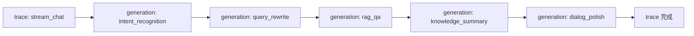

# 可观测性使用教程

系统提供三层可观测能力：**Langfuse LLM 链路追踪**（全链路可视化）、**监控端点**（运行时状态查询）、**熔断告警**（故障自愈与通知）。本教程介绍配置方法与典型排查场景。

!!! info "前置条件"

    - 可观测性端点前缀 `/api/v1/observability` 与 `/api/v1/monitor`，**不做鉴权**便于运维面板无凭据访问
    - Langfuse 未配置时自动降级 no-op，不影响主链路

---

## 可观测性总览

```mermaid
flowchart TB
    A[对话请求] --> B[Monitor trace]
    A --> C[Langfuse trace]
    B --> D[/api/v1/monitor/*<br/>trace 列表/详情/Agent 统计]
    C --> E[Langfuse 云端面板<br/>全链路可视化]
    F[熔断器] --> G[/api/v1/observability/circuit-breakers]
    H[告警引擎] --> I[/api/v1/observability/alerts]
    J[Token 追踪] --> K[/api/v1/observability/token-usage]
    L[健康检查] --> M[/api/v1/observability/health]
```

---

## Langfuse LLM 链路追踪

Langfuse 提供完整的 LLM 调用链路可视化，覆盖意图识别 → 查询改写 → RAG → 摘要 → 润色全链路，自动上报 token/cost/latency。

### 配置

`.env` 中启用 Langfuse，需配置 4 项：

```bash
# 启用 Langfuse（默认 False，降级 no-op）
LANGFUSE_ENABLED=True
LANGFUSE_PUBLIC_KEY=pk-lf-xxx
LANGFUSE_SECRET_KEY=sk-lf-xxx
LANGFUSE_HOST=https://cloud.langfuse.com
```

!!! warning "降级机制"

    以下任一条件不满足时，Langfuse 自动降级为 no-op（返回 None），不影响主链路：
    - `LANGFUSE_ENABLED=False`
    - `LANGFUSE_PUBLIC_KEY` 为空
    - `LANGFUSE_SECRET_KEY` 为空
    - langfuse 库未安装或初始化失败

    调用方据此走 no-op 分支，业务逻辑零感知。

### 11 个 prompt 标记

系统对 11 个关键 prompt 标记 `name` 与 `version`，便于在 Langfuse 面板按 prompt 类型筛选与对比：

| prompt name | 用途 | 触发场景 |
| --- | --- | --- |
| `intent_recognition` | 意图识别 | 每轮对话首步 |
| `query_rewrite` | 查询改写 | 多轮对话指代消解 |
| `rag_qa` | RAG 问答 | 知识问答意图 |
| `knowledge_summary` | 知识摘要 | RAG 命中后摘要 |
| `dialog_polish` | 对话润色 | DialogAgent 最终润色 |
| `business_extract` | 业务参数提取 | 业务查询意图 |
| `business_format` | 业务结果格式化 | 业务查询结果 |
| `emotion_analyze` | 情绪分析 | 情绪敏感意图 |
| `ticket_extract` | 工单信息提取 | 工单意图 |
| `turn_summary` | 单轮摘要 | 每轮结束 |
| `session_summary` | 会话摘要 | 会话结束/转接 |

!!! tip "version 字段的作用"

    每个 prompt 标记 `version`，便于 A/B 测试不同 prompt 版本的效果对比。修改 prompt 后递增 version，Langfuse 面板可按版本分组统计 token/cost/latency。

### trace 可视化

在 Langfuse 云端面板可看到完整链路：



每个 generation 自动上报：

- **token**：prompt_tokens + completion_tokens
- **cost**：按模型计费自动换算
- **latency**：单次 LLM 调用耗时
- **metadata**：session_id / monitor_trace_id 关联

### 缓存命中时不创建 trace

!!! note "避免空 trace"

    HotQueryCache 命中时无 LLM 调用，系统**不创建 Langfuse trace**，避免无意义的空 trace 污染面板。仅缓存未命中走 LLM 编排时才创建 trace，并写入 holder 供外层结束/标记状态。

### Token/cost/latency 自动上报

通过 `langfuse.openai` 包装器，所有 LLM 调用自动挂载到当前 trace，无需手动埋点：

```python
# 系统内部已用 langfuse.openai 包装 LLMClient
# 调用 LLM 时自动上报 token/cost/latency 到当前 trace
# 业务侧无需关心，trace_id 通过 metadata 关联 monitor trace
```

---

## 监控端点

### GET /api/v1/observability/health — 健康检查

执行全部健康检查并返回聚合报告，每项检查独立执行，单项失败不影响其他：

```bash
curl http://localhost:8000/api/v1/observability/health
```

```json
{
  "status": "degraded",
  "checks": {
    "llm": {"status": "up", "latency_ms": 320},
    "vector_store": {"status": "up", "size": 342},
    "redis": {"status": "down", "error": "connection refused"},
    "disk": {"status": "up", "free_gb": 12.5}
  }
}
```

!!! tip "检查项说明"

    - `llm`：LLM 服务连通性，含延迟
    - `vector_store`：ChromaDB 可用性与数据量
    - `redis`：Redis 连通性（会话存储）
    - `disk`：磁盘剩余空间
    - `status`：`up`（全绿）/ `degraded`（部分降级）/ `down`（关键故障）

### GET /api/v1/monitor/traces — trace 列表

返回最近 trace 列表（摘要，不含 steps 详情），按时间倒序：

```bash
curl "http://localhost:8000/api/v1/monitor/traces?limit=50"
```

```json
[
  {
    "trace_id": "trace-xxx",
    "session_id": "sess-9f3c2a1b",
    "status": "success",
    "duration_ms": 1850,
    "started_at": "2026-07-03T10:00:00Z",
    "steps_count": 5
  }
]
```

### GET /api/v1/monitor/traces/{trace_id} — trace 详情

返回单条 trace 详情，含每步与子任务：

```bash
curl http://localhost:8000/api/v1/monitor/traces/trace-xxx
```

```json
{
  "trace_id": "trace-xxx",
  "session_id": "sess-9f3c2a1b",
  "status": "success",
  "duration_ms": 1850,
  "steps": [
    {"name": "intent_recognition", "duration_ms": 320, "status": "success"},
    {"name": "retrieval", "duration_ms": 180, "status": "success"},
    {"name": "generation", "duration_ms": 1200, "status": "success"}
  ],
  "sub_tasks": [...]
}
```

!!! tip "排查慢查询"

    通过 trace 详情定位耗时最长的步骤。`generation` 通常是大模型调用，若耗时过长可考虑路由小模型（见 [性能优化教程](performance.zh.md)）。

### GET /api/v1/monitor/agents — Agent 调用统计

返回各 Agent 当前状态（调用次数、平均耗时、成功率）：

```bash
curl http://localhost:8000/api/v1/monitor/agents
```

```json
[
  {
    "agent": "KnowledgeAgent",
    "calls": 156,
    "avg_duration_ms": 850,
    "success_rate": 0.95
  },
  {
    "agent": "BusinessAgent",
    "calls": 42,
    "avg_duration_ms": 1100,
    "success_rate": 0.88
  }
]
```

!!! note "包含未调用的 Agent"

    返回结果包含已注册但未调用的 Agent（`calls=0`），便于面板展示完整 Agent 列表。

### 其他监控端点

| 端点 | 说明 |
| --- | --- |
| `GET /api/v1/monitor/overview` | 系统概览：总 trace 数、成功率、平均耗时、活跃会话数 |
| `GET /api/v1/monitor/sessions` | 活跃会话列表，按最后活跃时间倒序 |

---

## 熔断降级

系统对 LLM、向量库、业务系统等外部依赖配置熔断器，连续失败达到阈值自动打开熔断，降级返回兜底结果，避免雪崩。

### 查看熔断器状态：GET /api/v1/observability/circuit-breakers

```bash
curl http://localhost:8000/api/v1/observability/circuit-breakers
```

```json
{
  "llm": {
    "state": "closed",
    "failure_count": 0,
    "failure_threshold": 5,
    "recovery_timeout": 60,
    "last_failure": null
  },
  "vector_store": {
    "state": "open",
    "failure_count": 7,
    "failure_threshold": 5,
    "recovery_timeout": 60,
    "last_failure": "2026-07-03T10:00:00Z"
  }
}
```

| 状态 | 含义 |
| --- | --- |
| `closed` | 关闭（正常调用） |
| `open` | 打开（熔断中，降级返回兜底） |
| `half_open` | 半开（试探性放行） |

### 手动重置熔断器：POST /api/v1/observability/circuit-breakers/{name}/reset

运维介入后强制恢复，不依赖恢复时长：

```bash
curl -X POST http://localhost:8000/api/v1/observability/circuit-breakers/llm/reset
```

```json
{"name": "llm", "reset": true}
```

!!! warning "手动重置风险"

    手动重置会立即把熔断器置为 `closed`，但若底层服务未恢复会再次触发熔断。建议先确认依赖服务健康后再重置。

---

## 监控告警

告警引擎按规则检测异常并生成告警，支持按级别与来源过滤查询。

### 查询告警：GET /api/v1/observability/alerts

```bash
# 按级别过滤
curl "http://localhost:8000/api/v1/observability/alerts?level=error"

# 按来源过滤
curl "http://localhost:8000/api/v1/observability/alerts?source=token_usage"

# 按时间过滤
curl "http://localhost:8000/api/v1/observability/alerts?since=2026-07-03T00:00:00Z"
```

```json
[
  {
    "level": "error",
    "source": "token_usage",
    "message": "Token 用量超出日预算 80%",
    "timestamp": "2026-07-03T14:00:00Z"
  }
]
```

!!! tip "告警级别"

    - `info`：信息性告警（如缓存命中率下降）
    - `warn`：警告（如响应时间升高）
    - `error`：错误（如熔断器打开）
    - `critical`：严重（如关键服务不可用）

    无效的 `level` 值返回 400。

---

## Token 用量追踪

### GET /api/v1/observability/token-usage

返回指定窗口的 Token 用量统计：

```bash
# 按分钟统计
curl "http://localhost:8000/api/v1/observability/token-usage?window=minute"

# 按小时统计（默认）
curl http://localhost:8000/api/v1/observability/token-usage

# 按天统计
curl "http://localhost:8000/api/v1/observability/token-usage?window=day"
```

```json
{
  "window": "hour",
  "total_tokens": 125000,
  "prompt_tokens": 98000,
  "completion_tokens": 27000,
  "estimated_cost_usd": 0.42,
  "by_model": {
    "gpt-4o-mini": {"tokens": 95000, "cost": 0.14},
    "gpt-4o": {"tokens": 30000, "cost": 0.28}
  }
}
```

!!! note "window 取值"

    `window` 支持 `minute` / `hour` / `day`，其他值返回 400。建议按小时监控日预算，按分钟排查突发流量。

### Token 预算告警

配合告警引擎，Token 用量超出预算阈值时自动生成 `error` 级告警，可通过 `/api/v1/observability/alerts?source=token_usage` 查询。

---

## 典型排查场景

### 场景 1：响应时间突增

```bash
# 1. 查看系统概览，确认平均耗时与成功率
curl http://localhost:8000/api/v1/monitor/overview

# 2. 查看最近 trace，定位慢查询
curl "http://localhost:8000/api/v1/monitor/traces?limit=10"

# 3. 查看具体 trace 详情，找最慢步骤
curl http://localhost:8000/api/v1/monitor/traces/{trace_id}

# 4. 检查熔断器是否打开
curl http://localhost:8000/api/v1/observability/circuit-breakers
```

### 场景 2：LLM 服务不可用

```bash
# 1. 健康检查确认 LLM 状态
curl http://localhost:8000/api/v1/observability/health

# 2. 查看熔断器是否已自动打开
curl http://localhost:8000/api/v1/observability/circuit-breakers | jq .llm

# 3. 服务恢复后手动重置（可选）
curl -X POST http://localhost:8000/api/v1/observability/circuit-breakers/llm/reset
```

### 场景 3：Token 成本异常

```bash
# 1. 查看日 Token 用量
curl "http://localhost:8000/api/v1/observability/token-usage?window=day"

# 2. 查看 token 相关告警
curl "http://localhost:8000/api/v1/observability/alerts?source=token_usage"

# 3. 在 Langfuse 面板按 prompt name 排查高消耗 prompt
```

---

## 下一步

- [性能优化教程](performance.zh.md)：性能指标与缓存调优
- [运营管理教程](operations.zh.md)：运营看板与上线检查
- [对话端点教程](chat.zh.md)：trace 在对话中的生成时机
