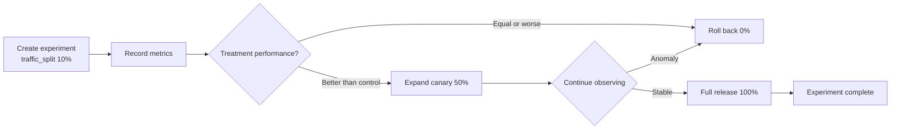
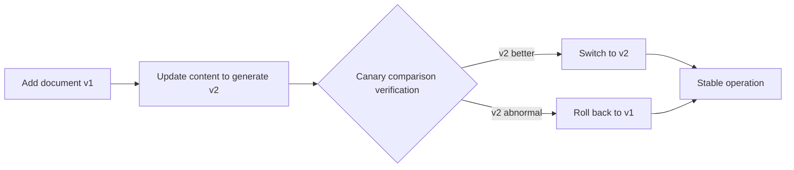

# Operations Management Tutorial

Operations management covers the daily operations dashboard, canary release experiments, historical ticket mining, and knowledge base update mechanisms. It is the operational entry point for continuous system optimization. This tutorial covers the API usage of each capability and typical operations scenarios.

!!! info "Prerequisites"

    - Operations endpoints use the prefix `/api/v1/operations` and **are not authenticated**, so ops dashboards can access them without credentials
    - Ticket mining endpoints use the prefix `/api/v1/mining` and require `X-API-Key` authentication
    - Document update endpoints use the prefix `/api/v1/update` and require `X-API-Key` authentication

---

## Endpoint Overview

| Endpoint | Method | Description | Auth |
| --- | --- | --- | :---: |
| `/api/v1/operations/dashboard` | GET | Operations dashboard aggregate data | No |
| `/api/v1/operations/experiments` | POST | Create a canary experiment | No |
| `/api/v1/operations/experiments` | GET | List experiments | No |
| `/api/v1/operations/experiments/{name}/results` | GET | Query experiment results | No |
| `/api/v1/operations/experiments/{name}/metrics` | POST | Record experiment metrics | No |
| `/api/v1/operations/release-checklist` | GET | Go-live checklist | No |
| `/api/v1/mining/tickets` | POST | Trigger ticket mining | Yes |
| `/api/v1/mining/status` | GET | Query mining report | Yes |
| `/api/v1/update/full` | POST | Full update | Yes |
| `/api/v1/update/incremental` | POST | Incremental update | Yes |
| `/api/v1/update/file` | POST | Single-file real-time update | Yes |
| `/api/v1/update/status` | GET | Query update status | Yes |

---

## Operations Dashboard: GET /api/v1/operations/dashboard

Returns aggregated dashboard data. Repeated calls within 30 seconds return cached results to avoid re-aggregation:

```bash
# Default uses the 30-second cache
curl http://localhost:8000/api/v1/operations/dashboard

# Force-refresh the cache, bypassing the cache window
curl "http://localhost:8000/api/v1/operations/dashboard?force_refresh=true"
```

```json
{
  "total_sessions": 1280,
  "escalation_rate": 0.12,
  "resolution_rate": 0.87,
  "avg_response_time_ms": 920,
  "hot_questions": [
    {"question": "Return and exchange policy", "count": 156},
    {"question": "Order shipment query", "count": 98}
  ],
  "collected_at": "2026-07-03T10:00:00Z"
}
```

### Key Metric Descriptions

| Metric | Meaning | Optimization Direction |
| --- | --- | --- |
| `total_sessions` | Total sessions | Reflects overall traffic |
| `escalation_rate` | Escalation rate | Lower is better; high suggests insufficient bot capability |
| `resolution_rate` | Resolution rate | Higher is better; reflects combined bot + human resolution |
| `avg_response_time_ms` | Average response time | Lower is better; see [Performance Optimization](performance.en.md) |
| `hot_questions` | Top N hot questions | Use to supplement the knowledge base or optimize hot-question caching |

!!! tip "Value of hot questions"

    `hot_questions` reflects high-frequency user requests. Operations should:
    1. High-frequency but unmatched questions → supplement the knowledge base
    2. High-frequency and matched questions → confirm HotQueryCache hit rate
    3. High-frequency escalated questions → improve the bot's answer capability

---

## Canary Release

Manage A/B tests via the `experiment.py` module, supporting canary ratio control and experiment result comparison.

### Create an Experiment: POST /api/v1/operations/experiments

```bash
curl -X POST http://localhost:8000/api/v1/operations/experiments \
  -H "Content-Type: application/json" \
  -d '{
    "name": "rag-rerank-v2",
    "description": "Compare the new reranker with the old retrieval effect",
    "variants": ["control", "treatment"],
    "traffic_split": {"control": 0.5, "treatment": 0.5}
  }'
```

!!! note "Duplicate experiment names overwrite and rebuild"

    If the experiment name already exists, it is overwritten and historical metrics are cleared, making it easy to restart the experiment. `traffic_split` controls the canary ratio; for example, `{"control": 0.9, "treatment": 0.1}` means 10% of traffic goes to the treatment group.

### List Experiments: GET /api/v1/operations/experiments

```bash
curl http://localhost:8000/api/v1/operations/experiments
```

### Record Experiment Metrics: POST /api/v1/operations/experiments/{name}/metrics

```bash
curl -X POST http://localhost:8000/api/v1/operations/experiments/rag-rerank-v2/metrics \
  -H "Content-Type: application/json" \
  -d '{
    "variant": "treatment",
    "metric_name": "resolution_rate",
    "value": 0.92
  }'
```

!!! tip "Recording is allowed even if the experiment does not exist"

    Metric recording does not check whether the experiment exists, making replay and offline analysis easy. `metric_name` can be any metric such as `resolution_rate` / `response_time_ms` / `hit_rate`.

### Query Experiment Results: GET /api/v1/operations/experiments/{name}/results

```bash
curl http://localhost:8000/api/v1/operations/experiments/rag-rerank-v2/results
```

```json
{
  "name": "rag-rerank-v2",
  "variants": {
    "control": {
      "samples": 640,
      "metrics": {
        "resolution_rate": {"mean": 0.85, "count": 640},
        "response_time_ms": {"mean": 950, "count": 640}
      }
    },
    "treatment": {
      "samples": 640,
      "metrics": {
        "resolution_rate": {"mean": 0.92, "count": 640},
        "response_time_ms": {"mean": 880, "count": 640}
      }
    }
  }
}
```

Returns 404 when the experiment does not exist.

### Canary Release Flow



---

## Ticket Mining

Use `ticket_miner.py` to cluster-analyze historical tickets, identify high-frequency problems, and consolidate them as knowledge base candidates.

### Trigger Mining: POST /api/v1/mining/tickets

```bash
curl -X POST http://localhost:8000/api/v1/mining/tickets \
  -H "Content-Type: application/json" \
  -H "X-API-Key: ${API_KEY}" \
  -d '{
    "start_time": "2026-06-01T00:00:00Z",
    "end_time": "2026-06-30T23:59:59Z",
    "status": "resolved"
  }'
```

All parameters are optional:

| Parameter | Description |
| --- | --- |
| `start_time` / `end_time` | Filter by `created_at` (closed interval) |
| `status` | Filter by ticket status; commonly `resolved` to mine only resolved tickets |

```json
{
  "started_at": "2026-07-03T10:00:00Z",
  "total_tickets": 320,
  "ingested": 45,
  "items": [
    {
      "question": "Order shipment query",
      "frequency": 28,
      "representative_solution": "Provide the tracking number and query entry..."
    }
  ],
  "errors": []
}
```

!!! tip "Value of mining results"

    `items` are clustered high-frequency problems; `frequency` reflects occurrence count, and `representative_solution` is a representative solution. Operations should:
    1. Add high-frequency problems to the knowledge base (ingest as FAQ)
    2. For problems already in the knowledge base but still appearing in tickets → optimize retrieval or answer quality
    3. Ingest mined solutions after human review

### Query Mining Status: GET /api/v1/mining/status

```bash
curl http://localhost:8000/api/v1/mining/status -H "X-API-Key: ${API_KEY}"
```

If mining has never been triggered, an empty report is returned (`total_tickets=0`) so the frontend can render the page on first entry.

---

## Knowledge Base Update Mechanisms

The system provides three update strategies for different scenarios:

### Full Update: POST /api/v1/update/full

Scans all supported-format documents in the directory and ingests them one by one. It compares `doc_hash` with `document_store`; entries that already exist and are unchanged are skipped. Records and corresponding chunks in `document_store` for files that no longer exist are deleted. Suitable for monthly full rebuilds.

```bash
curl -X POST http://localhost:8000/api/v1/update/full \
  -H "Content-Type: application/json" \
  -H "X-API-Key: ${API_KEY}" \
  -d '{
    "dir_path": "docs/knowledge",
    "extensions": [".md", ".pdf", ".docx"]
  }'
```

```json
{
  "mode": "full",
  "scanned": 25,
  "added": 3,
  "updated": 2,
  "skipped": 18,
  "deleted": 2,
  "failed": 0,
  "duration_seconds": 45.2,
  "errors": []
}
```

### Incremental Update: POST /api/v1/update/incremental

Scans the directory and processes only new files or files whose `doc_hash` changed; it does **not** delete records of files that no longer exist. Suitable for weekly incremental updates.

```bash
curl -X POST http://localhost:8000/api/v1/update/incremental \
  -H "Content-Type: application/json" \
  -H "X-API-Key: ${API_KEY}" \
  -d '{"dir_path": "docs/knowledge", "extensions": [".md"]}'
```

### Single-file Real-time Update: POST /api/v1/update/file

Reuses `pipeline.ingest_document` for ingestion and version registration. Suitable for API-triggered real-time updates:

```bash
curl -X POST http://localhost:8000/api/v1/update/file \
  -H "Content-Type: application/json" \
  -H "X-API-Key: ${API_KEY}" \
  -d '{
    "file_path": "docs/knowledge/new_faq.md",
    "metadata": {"knowledge_type": "faq"}
  }'
```

!!! warning "Cache must be cleared after updates"

    After any update strategy completes, you must call `POST /api/v1/performance/cache/invalidate` to clear the hot cache; otherwise the chat endpoint may return stale replies.

### Query Update Status: GET /api/v1/update/status

```bash
curl http://localhost:8000/api/v1/update/status -H "X-API-Key: ${API_KEY}"
```

```json
{
  "last_update": {
    "mode": "incremental",
    "scanned": 25,
    "added": 1,
    "duration_seconds": 12.5
  },
  "message": "The last incremental update completed in 12.50s"
}
```

When no update has ever been run, `last_update` is empty.

---

## Version Management and Rollback

Documents registered with `DocumentStore` support version management and rollback. See the [Knowledge Base Management Tutorial](knowledge.en.md).

### Typical Version Governance Flow



### Canary Comparison Verification

Write to the canary collection via `/api/v1/knowledge/canary/ingest`, then compare retrieval effectiveness between the main collection and the canary collection via `/api/v1/knowledge/canary/compare`:

```bash
# 1. Write v2 to the canary collection
curl -X POST http://localhost:8000/api/v1/knowledge/canary/ingest \
  -H "Content-Type: application/json" -H "X-API-Key: ${API_KEY}" \
  -d '{"doc_id": "doc-xxx", "version": "v2"}'

# 2. Compare the main collection (v1) with the canary collection (v2)
curl -X POST http://localhost:8000/api/v1/knowledge/canary/compare \
  -H "Content-Type: application/json" -H "X-API-Key: ${API_KEY}" \
  -d '{"doc_id": "doc-xxx", "version": "v2", "sample_queries": ["return and exchange policy"]}'
```

---

## Go-live Checklist: GET /api/v1/operations/release-checklist

Runs the go-live checklist and returns a report. Each check runs independently; a failure does not interrupt the others:

```bash
curl http://localhost:8000/api/v1/operations/release-checklist
```

```json
{
  "total": 8,
  "passed": 7,
  "failed": 1,
  "checks": [
    {"name": "llm_connectivity", "status": "passed"},
    {"name": "vector_store_size", "status": "passed"},
    {"name": "redis_connectivity", "status": "failed", "error": "connection refused"},
    {"name": "knowledge_ingested", "status": "passed"}
  ]
}
```

!!! tip "Mandatory check before go-live"

    Run this checklist before release to ensure all dependencies are ready. `failed` items must be fixed before go-live; we recommend releasing only when all `passed` are green.

---

## Complete Operations Flow Script

```python
import httpx

BASE = "http://localhost:8000"
AUTH_HEADERS = {"X-API-Key": ""}
NO_AUTH_HEADERS = {}

def weekly_operations():
    """Weekly operations flow: mine tickets -> incremental update -> clear cache -> dashboard check."""
    # 1. Mine last week's resolved tickets to identify high-frequency problems
    mining = httpx.post(
        f"{BASE}/api/v1/mining/tickets",
        headers=AUTH_HEADERS,
        json={"status": "resolved"},
        timeout=180.0,
    ).json()
    print(f"Mining complete: {mining['total_tickets']} tickets, {mining['ingested']} consolidated candidates")

    # 2. Incrementally update the knowledge base (ingest new documents)
    update = httpx.post(
        f"{BASE}/api/v1/update/incremental",
        headers=AUTH_HEADERS,
        json={"dir_path": "docs/knowledge", "extensions": [".md"]},
        timeout=300.0,
    ).json()
    print(f"Update complete: added {update['added']}, updated {update['updated']}")

    # 3. Critical: clear the hot cache so new knowledge takes effect
    httpx.post(f"{BASE}/api/v1/performance/cache/invalidate")
    print("Hot cache cleared")

    # 4. View the operations dashboard to confirm metrics are normal
    dashboard = httpx.get(
        f"{BASE}/api/v1/operations/dashboard?force_refresh=true"
    ).json()
    print(f"Resolution rate: {dashboard['resolution_rate']:.1%}")
    print(f"Escalation rate: {dashboard['escalation_rate']:.1%}")

weekly_operations()
```

---

## Next Steps

- [Knowledge Base Management Tutorial](knowledge.en.md): document ingestion and version management details
- [Observability Tutorial](observability.en.md): go-live checks and alerting
- [Performance Optimization Tutorial](performance.en.md): cache clearing and tuning after updates
