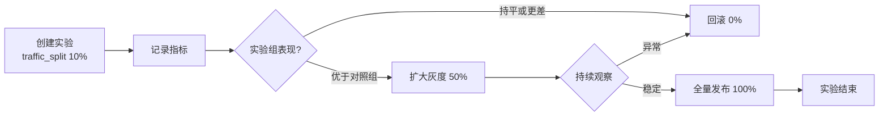
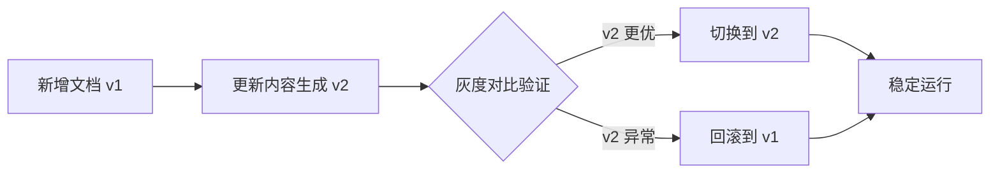

# 运营管理使用教程

运营管理覆盖日常运营看板、灰度发布实验、历史工单挖掘与知识库更新机制，是系统持续优化的运维入口。本教程介绍各能力的 API 用法与典型运营场景。

!!! info "前置条件"

    - 运营端点前缀 `/api/v1/operations`，**不做鉴权**便于运维面板无凭据访问
    - 工单挖掘端点前缀 `/api/v1/mining`，需 `X-API-Key` 鉴权
    - 文档更新端点前缀 `/api/v1/update`，需 `X-API-Key` 鉴权

---

## 端点概览

| 端点 | 方法 | 说明 | 鉴权 |
| --- | --- | --- | :---: |
| `/api/v1/operations/dashboard` | GET | 运营看板聚合数据 | 否 |
| `/api/v1/operations/experiments` | POST | 创建灰度实验 | 否 |
| `/api/v1/operations/experiments` | GET | 列出实验 | 否 |
| `/api/v1/operations/experiments/{name}/results` | GET | 查询实验结果 | 否 |
| `/api/v1/operations/experiments/{name}/metrics` | POST | 记录实验指标 | 否 |
| `/api/v1/operations/release-checklist` | GET | 上线检查清单 | 否 |
| `/api/v1/mining/tickets` | POST | 触发工单挖掘 | 是 |
| `/api/v1/mining/status` | GET | 查询挖掘报告 | 是 |
| `/api/v1/update/full` | POST | 全量更新 | 是 |
| `/api/v1/update/incremental` | POST | 增量更新 | 是 |
| `/api/v1/update/file` | POST | 单文件实时更新 | 是 |
| `/api/v1/update/status` | GET | 查询更新状态 | 是 |

---

## 运营看板：GET /api/v1/operations/dashboard

返回运营看板聚合数据，30 秒内重复调用返回缓存结果，避免重复聚合：

```bash
# 默认走 30 秒缓存
curl http://localhost:8000/api/v1/operations/dashboard

# 强制刷新缓存，跳过缓存窗口
curl "http://localhost:8000/api/v1/operations/dashboard?force_refresh=true"
```

```json
{
  "total_sessions": 1280,
  "escalation_rate": 0.12,
  "resolution_rate": 0.87,
  "avg_response_time_ms": 920,
  "hot_questions": [
    {"question": "退换货政策", "count": 156},
    {"question": "订单物流查询", "count": 98}
  ],
  "collected_at": "2026-07-03T10:00:00Z"
}
```

### 关键指标说明

| 指标 | 含义 | 优化方向 |
| --- | --- | --- |
| `total_sessions` | 会话总数 | 反映整体流量 |
| `escalation_rate` | 转接率 | 越低越好，高说明智能客服能力不足 |
| `resolution_rate` | 解决率 | 越高越好，反映智能+人工综合解决能力 |
| `avg_response_time_ms` | 平均响应时间 | 越低越好，见 [性能优化](performance.zh.md) |
| `hot_questions` | 热门问题 Top N | 据此补充知识库或优化高频问题缓存 |

!!! tip "热门问题的价值"

    `hot_questions` 反映用户高频诉求，运营应据此：
    1. 高频但未命中的问题 → 补充知识库
    2. 高频且命中的问题 → 确认 HotQueryCache 命中率
    3. 高频转人工的问题 → 优化机器人回答能力

---

## 灰度发布

通过 `experiment.py` 模块管理 A/B 测试，支持灰度比例控制与实验结果对比。

### 创建实验：POST /api/v1/operations/experiments

```bash
curl -X POST http://localhost:8000/api/v1/operations/experiments \
  -H "Content-Type: application/json" \
  -d '{
    "name": "rag-rerank-v2",
    "description": "对比新版 reranker 与旧版检索效果",
    "variants": ["control", "treatment"],
    "traffic_split": {"control": 0.5, "treatment": 0.5}
  }'
```

!!! note "实验名重复时覆盖重建"

    若实验名已存在，会覆盖并清空历史指标，便于重新启动实验。`traffic_split` 控制灰度比例，如 `{"control": 0.9, "treatment": 0.1}` 表示 10% 流量走实验组。

### 列出实验：GET /api/v1/operations/experiments

```bash
curl http://localhost:8000/api/v1/operations/experiments
```

### 记录实验指标：POST /api/v1/operations/experiments/{name}/metrics

```bash
curl -X POST http://localhost:8000/api/v1/operations/experiments/rag-rerank-v2/metrics \
  -H "Content-Type: application/json" \
  -d '{
    "variant": "treatment",
    "metric_name": "resolution_rate",
    "value": 0.92
  }'
```

!!! tip "即使实验不存在也允许记录"

    指标记录不校验实验是否存在，便于回放与离线分析。`metric_name` 可为 `resolution_rate` / `response_time_ms` / `hit_rate` 等任意指标。

### 查询实验结果：GET /api/v1/operations/experiments/{name}/results

```bash
curl http://localhost:8000/api/v1/operations/experiments/rag-rerank-v2/results
```

```json
{
  "name": "rag-rerank-v2",
  "variants": {
    "control": {
      "samples": 640,
      "metrics": {
        "resolution_rate": {"mean": 0.85, "count": 640},
        "response_time_ms": {"mean": 950, "count": 640}
      }
    },
    "treatment": {
      "samples": 640,
      "metrics": {
        "resolution_rate": {"mean": 0.92, "count": 640},
        "response_time_ms": {"mean": 880, "count": 640}
      }
    }
  }
}
```

实验不存在时返回 404。

### 灰度发布流程



---

## 工单挖掘

通过 `ticket_miner.py` 对历史工单聚类分析，识别高频问题，沉淀为知识库候选。

### 触发挖掘：POST /api/v1/mining/tickets

```bash
curl -X POST http://localhost:8000/api/v1/mining/tickets \
  -H "Content-Type: application/json" \
  -H "X-API-Key: ${API_KEY}" \
  -d '{
    "start_time": "2026-06-01T00:00:00Z",
    "end_time": "2026-06-30T23:59:59Z",
    "status": "resolved"
  }'
```

参数全部可选：

| 参数 | 说明 |
| --- | --- |
| `start_time` / `end_time` | 按 `created_at` 闭区间过滤 |
| `status` | 按工单状态过滤，常见传 `resolved` 仅挖掘已解决工单 |

```json
{
  "started_at": "2026-07-03T10:00:00Z",
  "total_tickets": 320,
  "ingested": 45,
  "items": [
    {
      "question": "订单物流查询",
      "frequency": 28,
      "representative_solution": "提供快递单号与查询入口..."
    }
  ],
  "errors": []
}
```

!!! tip "挖掘结果的价值"

    `items` 是聚类后的高频问题，`frequency` 反映出现次数，`representative_solution` 是代表性解决方案。运营应据此：
    1. 高频问题补充到知识库（入库为 FAQ）
    2. 已有知识但仍在工单中出现 → 优化检索或答案质量
    3. 挖掘出的方案经人工审核后入库

### 查询挖掘状态：GET /api/v1/mining/status

```bash
curl http://localhost:8000/api/v1/mining/status -H "X-API-Key: ${API_KEY}"
```

未触发过挖掘时返回空报告（`total_tickets=0`），便于前端首次进入页面渲染。

---

## 知识库更新机制

系统提供三种更新策略，适配不同场景：

### 全量更新：POST /api/v1/update/full

扫描目录下所有支持格式文档，逐个入库；与 `document_store` 比对 `doc_hash`，已存在且未变更的跳过；删除 `document_store` 中已不存在文件的记录与对应 chunks。适用于月度全量重建。

```bash
curl -X POST http://localhost:8000/api/v1/update/full \
  -H "Content-Type: application/json" \
  -H "X-API-Key: ${API_KEY}" \
  -d '{
    "dir_path": "docs/knowledge",
    "extensions": [".md", ".pdf", ".docx"]
  }'
```

```json
{
  "mode": "full",
  "scanned": 25,
  "added": 3,
  "updated": 2,
  "skipped": 18,
  "deleted": 2,
  "failed": 0,
  "duration_seconds": 45.2,
  "errors": []
}
```

### 增量更新：POST /api/v1/update/incremental

扫描目录，仅处理新增或 `doc_hash` 变化的文件；**不删除**已不存在文件的记录。适用于周度增量。

```bash
curl -X POST http://localhost:8000/api/v1/update/incremental \
  -H "Content-Type: application/json" \
  -H "X-API-Key: ${API_KEY}" \
  -d '{"dir_path": "docs/knowledge", "extensions": [".md"]}'
```

### 单文件实时更新：POST /api/v1/update/file

复用 `pipeline.ingest_document` 完成入库与版本注册，适用于 API 触发的实时更新场景：

```bash
curl -X POST http://localhost:8000/api/v1/update/file \
  -H "Content-Type: application/json" \
  -H "X-API-Key: ${API_KEY}" \
  -d '{
    "file_path": "docs/knowledge/new_faq.md",
    "metadata": {"knowledge_type": "faq"}
  }'
```

!!! warning "更新后必须清缓存"

    任一更新策略完成后，务必调用 `POST /api/v1/performance/cache/invalidate` 清空热点缓存，否则对话端点可能返回过期回复。

### 查询更新状态：GET /api/v1/update/status

```bash
curl http://localhost:8000/api/v1/update/status -H "X-API-Key: ${API_KEY}"
```

```json
{
  "last_update": {
    "mode": "incremental",
    "scanned": 25,
    "added": 1,
    "duration_seconds": 12.5
  },
  "message": "最近一次 incremental 更新于 12.50s 内完成"
}
```

未执行过更新时 `last_update` 为空。

---

## 版本管理与回滚

文档注册到 `DocumentStore` 后支持版本管理与回滚，详见 [知识库管理教程](knowledge.zh.md)。

### 典型版本治理流程



### 灰度对比验证

通过 `/api/v1/knowledge/canary/ingest` 写入灰度集合，再用 `/api/v1/knowledge/canary/compare` 对比主集合与灰度集合的检索效果：

```bash
# 1. 把 v2 写入灰度集合
curl -X POST http://localhost:8000/api/v1/knowledge/canary/ingest \
  -H "Content-Type: application/json" -H "X-API-Key: ${API_KEY}" \
  -d '{"doc_id": "doc-xxx", "version": "v2"}'

# 2. 对比主集合（v1）与灰度集合（v2）
curl -X POST http://localhost:8000/api/v1/knowledge/canary/compare \
  -H "Content-Type: application/json" -H "X-API-Key: ${API_KEY}" \
  -d '{"doc_id": "doc-xxx", "version": "v2", "sample_queries": ["退换货政策"]}'
```

---

## 上线检查清单：GET /api/v1/operations/release-checklist

执行上线检查清单并返回报告，每项检查独立执行，失败不中断其他检查：

```bash
curl http://localhost:8000/api/v1/operations/release-checklist
```

```json
{
  "total": 8,
  "passed": 7,
  "failed": 1,
  "checks": [
    {"name": "llm_connectivity", "status": "passed"},
    {"name": "vector_store_size", "status": "passed"},
    {"name": "redis_connectivity", "status": "failed", "error": "connection refused"},
    {"name": "knowledge_ingested", "status": "passed"}
  ]
}
```

!!! tip "上线前必检"

    发布前执行该检查清单，确保所有依赖就绪。`failed` 项需修复后再上线，`passed` 全绿才建议发布。

---

## 完整运营流程脚本

```python
import httpx

BASE = "http://localhost:8000"
AUTH_HEADERS = {"X-API-Key": ""}
NO_AUTH_HEADERS = {}

def weekly_operations():
    """周度运营流程：挖掘工单 → 增量更新 → 清缓存 → 看板检查。"""
    # 1. 挖掘上周已解决工单，识别高频问题
    mining = httpx.post(
        f"{BASE}/api/v1/mining/tickets",
        headers=AUTH_HEADERS,
        json={"status": "resolved"},
        timeout=180.0,
    ).json()
    print(f"挖掘完成：{mining['total_tickets']} 工单，{mining['ingested']} 沉淀候选")

    # 2. 增量更新知识库（新增文档入库）
    update = httpx.post(
        f"{BASE}/api/v1/update/incremental",
        headers=AUTH_HEADERS,
        json={"dir_path": "docs/knowledge", "extensions": [".md"]},
        timeout=300.0,
    ).json()
    print(f"更新完成：新增 {update['added']}，更新 {update['updated']}")

    # 3. 关键：清空热点缓存，让新知识生效
    httpx.post(f"{BASE}/api/v1/performance/cache/invalidate")
    print("热点缓存已清空")

    # 4. 查看运营看板，确认指标正常
    dashboard = httpx.get(
        f"{BASE}/api/v1/operations/dashboard?force_refresh=true"
    ).json()
    print(f"解决率：{dashboard['resolution_rate']:.1%}")
    print(f"转接率：{dashboard['escalation_rate']:.1%}")

weekly_operations()
```

---

## 下一步

- [知识库管理教程](knowledge.zh.md)：文档入库与版本管理细节
- [可观测性教程](observability.zh.md)：上线检查与监控告警
- [性能优化教程](performance.zh.md)：更新后的缓存清理与调优
