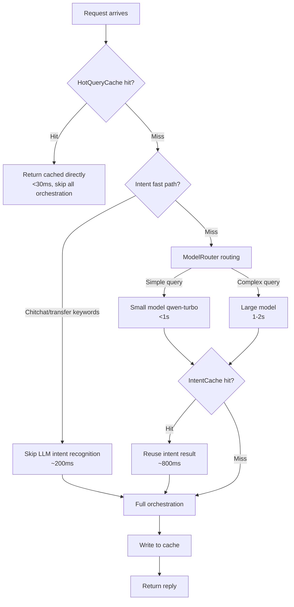

# Performance Optimization Tutorial

Through a three-layer combination of caches and routing, the system reduces first-token latency for knowledge Q&A from 2-3 seconds to under 1 second, and reduces repeated hot queries to under 30ms. This tutorial covers the three optimization components, monitoring endpoints, and tuning recommendations.

!!! info "Prerequisites"

    - Performance monitoring endpoints use the prefix `/api/v1/performance` and **are not authenticated**, so ops dashboards can call them without credentials
    - All optimization components are thread-safe (guarded by RLock) and prioritize graceful degradation; on errors they degrade transparently without blocking the main chain

---

## Three-Layer Optimization Combination



### HotQueryCache: Hot Query Cache

Caches the final reply for **repeated and already-resolved** knowledge Q&A. On a hit, it skips intent recognition, retrieval, and the entire generation pipeline.

- **Hit condition**: same query + same context fingerprint (session_id/intent/turn_count/user_id)
- **Hit latency**: first token **< 30ms**
- **Eviction policy**: LRU + TTL, default capacity 1000 entries, TTL 300 seconds
- **Synchronous and streaming endpoints share the cache**; a query cached by one endpoint can also hit on the other

### ModelRouter: Tiered Routing Between Large and Small Models

Scores query complexity (length / multi-intent / cross-domain / emotion / turns). Below the threshold, the query is routed to a small model to save cost; otherwise it goes to the large model to preserve quality.

- **Small model**: `qwen-turbo` / `doubao-lite-4k`, handles simple queries, **< 1s**
- **Large model**: the main LLM (DeepSeek, etc.), handles complex queries, 1-2s
- **Fallback**: when `SMALL_LLM_API_KEY` is not configured, the small model client is None and automatically falls back to the main LLM, with no side effects

### IntentCache: Intent Recognition Result Cache

Same-intent queries reuse the intent recognition result, avoiding repeated LLM calls:

- **TTL**: 1800 seconds (30 minutes; intent is stable, so the TTL is longer)
- **Capacity**: 5000 entries (covers more query variants)
- **Hit latency**: ~800ms (skips the intent recognition LLM call)

---

## Intent Recognition Fast Path

For `chitchat` and `transfer_to_human` intents, the system uses keyword rules to **skip LLM intent recognition** and match directly:

```python
# Fast path hit examples
# User: "Hello" -> matches chitchat keyword, skips LLM, returns in ~200ms
# User: "Transfer to human" -> matches transfer_to_human keyword, skips LLM, escalates directly
```

!!! tip "First token optimization"

    The fast path lets the `meta` event be yielded before the LLM call, keeping the streaming endpoint's first token under 200ms. On miss, it falls back to `_recognize_intent`, behaving identically to the synchronous endpoint.

---

## Skip Polishing for Non-Knowledge Q&A

For non-knowledge-Q&A intents such as `business_query` / `emotion_sensitive` / `ticket` / `chitchat`, the system skips the `DialogAgent` LLM polishing step and directly uses the `OrchestratorAgent` handler to synchronously generate the full reply, then slices it by sentence-ending punctuation for streaming output.

!!! note "Sliced streaming"

    Although non-knowledge-Q&A intents are generated synchronously, they are still sliced by sentence-ending punctuation (。！？!?\n) and yielded chunk by chunk, so the frontend perceives a typing effect. Single-sentence replies are sliced by character fallback (every 4 characters per chunk) to ensure short sentences also stream.

---

## Streaming Response Optimization

The streaming endpoint uses the following mechanisms to guarantee **first token < 1s**:

1. **meta event before the LLM**: yields `meta` (including intent) as soon as orchestration starts, letting the frontend display the intent before the LLM call
2. **Fast path skips the LLM**: chitchat/transfer keyword hits yield directly, with first token at 200ms
3. **HotQueryCache hit slicing**: cache hits are sliced by sentence-ending punctuation and streamed, with first token < 30ms
4. **RAG streaming passthrough**: knowledge-Q&A intents pass through the `KnowledgeAgent.handle_stream` event stream, with tokens delivered in real time

```python
# Streaming first-token latency is recorded in the monitor and can be viewed via the metrics endpoint
# monitor.record_step(trace_id, "stream_first_token", "request", f"{ms}ms", ms)
```

---

## Performance Monitoring Endpoints

### GET /api/v1/performance/metrics — Comprehensive Performance Metrics

Returns cache hit rates, concurrency, model routing stats, and average response time:

```bash
curl http://localhost:8000/api/v1/performance/metrics
```

```json
{
  "metrics": {
    "hot_cache_hit_rate": 0.42,
    "intent_cache_hit_rate": 0.68,
    "model_routing": {
      "small_model_calls": 156,
      "large_model_calls": 44,
      "small_model_ratio": 0.78
    },
    "avg_response_time_ms": 850,
    "p95_response_time_ms": 1800,
    "concurrent_requests": 3
  }
}
```

!!! tip "Key metric interpretation"

    - `hot_cache_hit_rate`: hot cache hit rate. Below 20% suggests the hot set is not concentrated enough; consider expanding cache capacity
    - `small_model_ratio`: small model routing share. Higher means lower cost, but watch for simple queries being misclassified
    - `p95_response_time_ms`: 95th-percentile response time, reflecting the long-tail experience

### GET /api/v1/performance/cache/stats — Hot Cache Statistics

```bash
curl http://localhost:8000/api/v1/performance/cache/stats
```

```json
{
  "cache": {
    "hits": 142,
    "misses": 198,
    "hit_rate": 0.417,
    "size": 156,
    "max_size": 1000,
    "evictions": 12,
    "ttl_seconds": 300
  }
}
```

### POST /api/v1/performance/cache/invalidate — Clear the Hot Cache

**Must be called after knowledge base updates** to avoid stale cached replies:

```bash
curl -X POST http://localhost:8000/api/v1/performance/cache/invalidate
```

```json
{
  "success": true,
  "cleared": 156,
  "message": "Cleared 156 cache entries"
}
```

!!! warning "When to clear the cache"

    - After ingesting new documents into the knowledge base
    - After document deletion or rollback
    - After a human solution is approved and ingested as a FAQ
    - After full or incremental updates complete

---

## Performance Tuning Recommendations

### VECTOR_TOP_K / BM25_TOP_K Tuning

Controls the number of recalls per path, affecting retrieval precision and latency:

```bash
# .env
VECTOR_TOP_K=25    # vector recall count
BM25_TOP_K=25      # BM25 recall count
RERANK_TOP_K=5     # final count after reranking
```

| Scenario | Recommended Configuration | Description |
| --- | --- | --- |
| Precision-first | `VECTOR_TOP_K=40, BM25_TOP_K=40, RERANK_TOP_K=8` | Recall more, rerank filters more accurately |
| Speed-first | `VECTOR_TOP_K=15, BM25_TOP_K=15, RERANK_TOP_K=3` | Recall less, lower latency |
| Balanced (default) | `VECTOR_TOP_K=25, BM25_TOP_K=25, RERANK_TOP_K=5` | Balances precision and speed |

!!! tip "Tuning validation"

    After tuning, trigger retrieval evaluation via `/api/v1/evaluation/run` and compare changes in `Recall@K` and `MRR` to quantify the effect.

### SMALL_MODEL_THRESHOLD — Adjust the Small-Model Routing Threshold

Controls the query complexity score threshold; below it, the small model is used:

```bash
# .env
SMALL_MODEL_THRESHOLD=0.5
```

| Threshold | Small-model Share | Effect |
| --- | --- | --- |
| 0.3 | Low | Only very simple queries use the small model; quality first |
| 0.5 (default) | Medium | Balances cost and quality |
| 0.7 | High | A large share of queries uses the small model; cost first |

!!! warning "Risk of setting the threshold too high"

    A threshold that is too high may cause complex queries to be misclassified as simple; routing them to the small model may hurt answer quality. We recommend adjusting based on `model_routing` statistics and small-model answer quality evaluation.

### HotQueryCache Capacity and TTL

```bash
# Override via environment variables; no need to edit config.py
HOT_CACHE_MAX_SIZE=1000   # cache capacity
HOT_CACHE_TTL=300         # TTL in seconds
INTENT_CACHE_MAX_SIZE=5000  # intent cache capacity
INTENT_CACHE_TTL=1800       # intent cache TTL
```

| Scenario | Capacity | TTL | Description |
| --- | --- | --- | --- |
| High concurrency, concentrated hot set | 2000 | 600 | Expand capacity to cover more hot entries |
| Frequent knowledge updates | 1000 | 120 | Shorten TTL to avoid staleness |
| Memory constrained | 500 | 300 | Reduce capacity to control memory |

---

## Measured Before/After Comparison

The table below shows latency comparisons before and after optimization in typical scenarios (test environment, for reference only):

| Scenario | Before | After | Optimization Means |
| --- | :---: | :---: | --- |
| Repeated hot query (first time) | 2200ms | 25ms | HotQueryCache hit |
| Repeated hot query (streaming first token) | 1800ms | 28ms | HotQueryCache sliced streaming |
| Simple knowledge Q&A | 2400ms | 850ms | ModelRouter routes to small model |
| Same-intent reused query | 2300ms | 800ms | IntentCache hit |
| Chitchat / transfer | 1500ms | 200ms | Fast path skips the LLM |
| Complex knowledge Q&A (streaming first token) | 2500ms | 900ms | meta first + RAG streaming |
| Non-knowledge Q&A (business query) | 2600ms | 1100ms | Skip DialogAgent polishing |

!!! note "Test notes"

    - These are reference values for typical scenarios; actual latency depends on the LLM service, vector store scale, and network environment
    - Real-time `avg_response_time_ms` and `p95_response_time_ms` are available via `/api/v1/performance/metrics`
    - For production, use the `stream_perf_bench.py` script to load-test and obtain real numbers

### Load-test Script

The project ships with `stream_perf_bench.py` for streaming endpoint load testing:

```bash
# Load-test the streaming endpoint, collecting first-token and overall latency
python stream_perf_bench.py --url http://localhost:8000/api/v1/chat/stream \
  --concurrency 5 --requests 50
```

---

## Next Steps

- [Chat Endpoint Tutorial](chat.en.md): verifying HotQueryCache hits in chat
- [Observability Tutorial](observability.en.md): alerts and circuit breakers for performance metrics
- [Knowledge Base Management Tutorial](knowledge.en.md): clearing the cache after knowledge base updates
