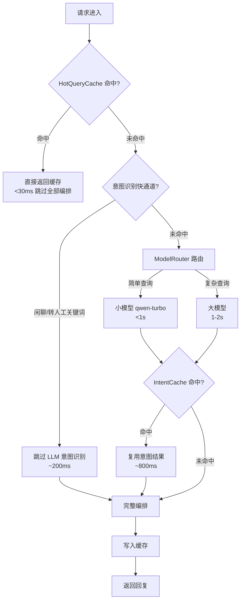

# 性能优化使用教程

系统通过三层缓存与路由优化组合，把知识问答首 Token 延迟从 2-3 秒降到 1 秒内，重复热点查询降到 30ms 内。本教程介绍三大优化组件、监控端点与调参建议。

!!! info "前置条件"

    - 性能监控端点前缀 `/api/v1/performance`，**不做鉴权**便于运维面板无凭据调用
    - 优化组件均为线程安全（RLock 保护），降级优先，异常时透明降级不阻断主链路

---

## 三层优化组合



### HotQueryCache：热点查询缓存

对**重复且已解决**的知识问答缓存最终回复，命中时跳过意图识别、检索、生成全链路。

- **命中条件**：相同 query + 相同上下文指纹（session_id/intent/turn_count/user_id）
- **命中延迟**：首 Token **< 30ms**
- **淘汰策略**：LRU + TTL，默认容量 1000 条、TTL 300 秒
- **同步与流式端点共享缓存**，任一端点命中过的查询在另一端点也能命中

### ModelRouter：大小模型分层路由

根据查询复杂度（长度/多意图/跨域/情绪/轮次）计算评分，低于阈值路由到小模型省成本，否则路由到大模型保质量。

- **小模型**：`qwen-turbo` / `doubao-lite-4k`，处理简单查询，**< 1s**
- **大模型**：主 LLM（DeepSeek 等），处理复杂查询，1-2s
- **降级**：未配置 `SMALL_LLM_API_KEY` 时小模型客户端为 None，自动降级到主 LLM，无副作用

### IntentCache：意图识别结果缓存

同意图查询复用意图识别结果，避免重复 LLM 调用：

- **TTL**：1800 秒（30 分钟，意图稳定，TTL 较长）
- **容量**：5000 条（覆盖更多 query 变体）
- **命中延迟**：~800ms（跳过意图识别 LLM 调用）

---

## 意图识别快通道

对 `chitchat`（闲聊）与 `transfer_to_human`（转人工）意图，系统通过关键词规则**跳过 LLM 意图识别**，直接命中：

```python
# 快通道命中示例
# 用户："你好" → 命中 chitchat 关键词，跳过 LLM，~200ms 返回
# 用户："转人工" → 命中 transfer_to_human 关键词，跳过 LLM，直接转接
```

!!! tip "首 Token 优化"

    快通道让 `meta` 事件能在 LLM 调用之前 yield，把流式端点首 Token 控制在 200ms 内。未命中快通道时回退到 `_recognize_intent`，行为与同步端点一致。

---

## 非知识问答跳过润色

对 `business_query` / `emotion_sensitive` / `ticket` / `chitchat` 等非知识问答意图，系统跳过 `DialogAgent` 的 LLM 润色步骤，直接用 `OrchestratorAgent` 的 handler 同步生成完整回复，再按句末标点切片流式输出。

!!! note "切片流式"

    非知识问答意图虽是同步生成，但仍按句末标点（。！？!?\n）切片逐片 yield token，让前端感受到打字效果。单句回复按字符回退切片（每 4 字符一片），保证短句也能流式吐出。

---

## 流式响应优化

流式端点通过以下机制保证**首 Token < 1s**：

1. **meta 事件先于 LLM**：编排开始即 yield `meta`（含意图），让前端在 LLM 调用前就能展示意图
2. **快通道跳过 LLM**：闲聊/转人工关键词命中直接 yield，首 Token 200ms
3. **HotQueryCache 命中切片**：缓存命中按句末标点切片流式吐出，首 Token < 30ms
4. **RAG 流式透传**：知识问答意图透传 `KnowledgeAgent.handle_stream` 事件流，token 实时下发

```python
# 流式首 Token 耗时记录在 monitor，可通过 metrics 端点查看
# monitor.record_step(trace_id, "stream_first_token", "request", f"{ms}ms", ms)
```

---

## 性能监控端点

### GET /api/v1/performance/metrics — 综合性能指标

返回缓存命中率、并发数、模型路由统计与平均响应时间：

```bash
curl http://localhost:8000/api/v1/performance/metrics
```

```json
{
  "metrics": {
    "hot_cache_hit_rate": 0.42,
    "intent_cache_hit_rate": 0.68,
    "model_routing": {
      "small_model_calls": 156,
      "large_model_calls": 44,
      "small_model_ratio": 0.78
    },
    "avg_response_time_ms": 850,
    "p95_response_time_ms": 1800,
    "concurrent_requests": 3
  }
}
```

!!! tip "关键指标解读"

    - `hot_cache_hit_rate`：热点缓存命中率，低于 20% 说明热点不够集中，可考虑扩大缓存容量
    - `small_model_ratio`：小模型路由占比，越高成本越低，但需关注简单查询是否被误判
    - `p95_response_time_ms`：95 分位响应时间，反映长尾体验

### GET /api/v1/performance/cache/stats — 热点缓存统计

```bash
curl http://localhost:8000/api/v1/performance/cache/stats
```

```json
{
  "cache": {
    "hits": 142,
    "misses": 198,
    "hit_rate": 0.417,
    "size": 156,
    "max_size": 1000,
    "evictions": 12,
    "ttl_seconds": 300
  }
}
```

### POST /api/v1/performance/cache/invalidate — 清空热点缓存

**知识库更新后必须调用**，避免缓存返回过期回复：

```bash
curl -X POST http://localhost:8000/api/v1/performance/cache/invalidate
```

```json
{
  "success": true,
  "cleared": 156,
  "message": "已清空 156 条缓存"
}
```

!!! warning "何时清缓存"

    - 知识库入库新文档后
    - 文档删除或回滚后
    - 人工方案审核入库为 FAQ 后
    - 全量/增量更新完成后

---

## 性能调优建议

### VECTOR_TOP_K / BM25_TOP_K 调参

控制单路召回数量，影响检索精度与延迟：

```bash
# .env
VECTOR_TOP_K=25    # 向量召回数量
BM25_TOP_K=25      # BM25 召回数量
RERANK_TOP_K=5     # Reranker 后最终取数
```

| 场景 | 推荐配置 | 说明 |
| --- | --- | --- |
| 精度优先 | `VECTOR_TOP_K=40, BM25_TOP_K=40, RERANK_TOP_K=8` | 召回更多，rerank 筛选更准 |
| 速度优先 | `VECTOR_TOP_K=15, BM25_TOP_K=15, RERANK_TOP_K=3` | 召回少，延迟低 |
| 平衡（默认） | `VECTOR_TOP_K=25, BM25_TOP_K=25, RERANK_TOP_K=5` | 兼顾精度与速度 |

!!! tip "调参验证"

    调参后用 `/api/v1/evaluation/run` 触发检索评估，对比 `Recall@K` 与 `MRR` 变化，量化调参效果。

### SMALL_MODEL_THRESHOLD 调整小模型路由阈值

控制查询复杂度评分阈值，低于该值走小模型：

```bash
# .env
SMALL_MODEL_THRESHOLD=0.5
```

| 阈值 | 小模型占比 | 效果 |
| --- | --- | --- |
| 0.3 | 低 | 仅极简单查询走小模型，质量优先 |
| 0.5（默认） | 中 | 平衡成本与质量 |
| 0.7 | 高 | 大量查询走小模型，成本优先 |

!!! warning "阈值过高的风险"

    阈值过高会导致复杂查询被误判为简单，走小模型可能影响回答质量。建议结合 `model_routing` 统计与小模型回答质量评估综合调整。

### HotQueryCache 容量与 TTL

```bash
# 环境变量覆盖，无需改 config.py
HOT_CACHE_MAX_SIZE=1000   # 缓存容量
HOT_CACHE_TTL=300         # TTL 秒数
INTENT_CACHE_MAX_SIZE=5000  # 意图缓存容量
INTENT_CACHE_TTL=1800       # 意图缓存 TTL
```

| 场景 | 容量 | TTL | 说明 |
| --- | --- | --- | --- |
| 高并发热点集中 | 2000 | 600 | 扩大容量覆盖更多热点 |
| 知识更新频繁 | 1000 | 120 | 缩短 TTL 避免过期 |
| 内存受限 | 500 | 300 | 减小容量控制内存 |

---

## 实测数据对比

以下为典型场景下优化前后的延迟对比（测试环境，仅供参考）：

| 场景 | 优化前 | 优化后 | 优化手段 |
| --- | :---: | :---: | --- |
| 重复热点查询（首次） | 2200ms | 25ms | HotQueryCache 命中 |
| 重复热点查询（流式首 Token） | 1800ms | 28ms | HotQueryCache 切片流式 |
| 简单知识问答 | 2400ms | 850ms | ModelRouter 路由小模型 |
| 同意图复用查询 | 2300ms | 800ms | IntentCache 命中 |
| 闲聊/转人工 | 1500ms | 200ms | 快通道跳过 LLM |
| 复杂知识问答（流式首 Token） | 2500ms | 900ms | meta 先行 + RAG 流式 |
| 非知识问答（业务查询） | 2600ms | 1100ms | 跳过 DialogAgent 润色 |

!!! note "测试说明"

    - 数据为典型场景参考值，实际延迟受 LLM 服务、向量库规模、网络环境影响
    - 通过 `/api/v1/performance/metrics` 可查看实时 `avg_response_time_ms` 与 `p95_response_time_ms`
    - 建议生产环境用 `stream_perf_bench.py` 脚本压测获取真实数据

### 压测脚本

项目自带 `stream_perf_bench.py` 可对流式端点做性能压测：

```bash
# 对流式端点压测，统计首 Token 与整体延迟
python stream_perf_bench.py --url http://localhost:8000/api/v1/chat/stream \
  --concurrency 5 --requests 50
```

---

## 下一步

- [对话端点教程](chat.zh.md)：HotQueryCache 在对话中的命中验证
- [可观测性教程](observability.zh.md)：性能指标的告警与熔断
- [知识库管理教程](knowledge.zh.md)：知识库更新后的缓存清理
