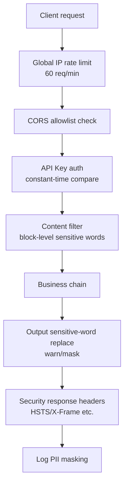

# Security Hardening Guide

This guide introduces the system's security configuration and best practices, helping ops staff safely promote the system from development mode to production.

!!! info "Prerequisites"

    - Read [Configuration Guide - Security Configuration](../configuration.md#security-configuration)
    - Copied `.env.example` to `.env` and filled it in for production

---

## Overview

The production hardening pass introduced multiple defense layers, following three principles: **secure by default, degradable, observable**.



Each layer has a fallback path to avoid single-point failures bringing down the main chain.

---

## API Key Configuration

`API_KEY` is the application-level authentication key that gates access to all business and ops endpoints.

### Configuration

```bash
# .env
# Strong random key (32+ bytes recommended; use openssl rand -hex 32)
API_KEY=your-strong-random-api-key
```

Clients must send it in the `X-API-Key` header:

```bash
curl -H "X-API-Key: your-strong-random-api-key" http://localhost:8000/api/v1/chat
```

### Behavior

- **Empty**: enters dev no-auth mode; all requests pass through; a `⚠️ API_KEY not configured` WARNING is logged at startup
- **Non-empty**: protected endpoints validate `X-API-Key` using `secrets.compare_digest` for constant-time comparison, preventing timing attacks
- **Failure response**: `401 Unauthorized` with a `WWW-Authenticate: ApiKey` header

!!! danger "Must configure in production"
    When `API_KEY` is empty, all endpoints (including ops endpoints like `/api/v1/knowledge/*` and `/api/v1/operations/*`) can be accessed anonymously.

??? tip "How to generate a strong random key"

    ```bash
    # Generate a 32-byte hex key
    openssl rand -hex 32

    # Or with Python
    python -c "import secrets; print(secrets.token_hex(32))"
    ```

---

## CORS Allowlist

`ALLOWED_ORIGINS` controls which domains may access the API cross-origin, preventing malicious sites from leveraging the browser to call the API.

### Configuration

```bash
# .env
# Comma-separated origins, no trailing slashes
ALLOWED_ORIGINS=https://example.com,https://app.example.com
```

### Behavior

| `ALLOWED_ORIGINS` | `DEBUG` | CORS behavior | Credentials allowed |
|-------------------|---------|---------------|---------------------|
| Non-empty | any | Only allowlisted origins | ✅ Yes |
| Empty | `True` | Allow all origins (`*`) | ❌ No |
| Empty | `False` | **Deny all cross-origin requests** | ❌ No |

!!! warning "Must configure in production"
    When `ALLOWED_ORIGINS` is empty and `DEBUG=False`, CORS denies all cross-origin requests and the frontend cannot access the API.

---

## Rate Limiting

A sliding-window algorithm throttles each client IP globally to prevent abuse.

### Configuration

```bash
# .env
# Default on; temporarily disable for load testing or debugging
RATE_LIMIT_ENABLED=True
```

### Behavior

- **Threshold**: 60 req/min/IP (default for normal business endpoints)
- **Algorithm**: sliding window + deque timestamps, smoother than fixed windows
- **Over-limit response**: HTTP 429, body includes `retry_after`, response header includes `Retry-After`
- **Heavy endpoints**: the `@rate_limit(10, 60)` decorator stacks a stricter limit (e.g., knowledge ingest at 10 req/min)
- **Disable fallback**: `RATE_LIMIT_ENABLED=False` degrades global rate limiting to pass-through

```bash
# Example over-limit response
HTTP/1.1 429 Too Many Requests
Retry-After: 12

{"detail":"请求过于频繁，请稍后再试","retry_after":12}
```

!!! tip "Multi-process deployments"
    The current limiter is in-process. With multiple workers (e.g., `gunicorn -w 4`), each worker counts independently, so the effective threshold is `60 × worker_count`. Production should switch to a shared-store limiter such as Redis.

??? info "Client IP extraction priority"

    `get_client_ip` extracts the client IP in this order:

    1. First value of `X-Forwarded-For` (original client IP)
    2. `X-Real-IP`
    3. Connection remote address `request.client.host`

    In production, always override `X-Forwarded-For` at the reverse proxy to prevent client spoofing.

---

## Sensitive-Word Filtering

Multi-pattern matching via the Aho-Corasick automaton, applied bidirectionally at runtime.

### Configuration

**Option 1: File-based (recommended)**

Edit `app/knowledge/sensitive_words.txt`. Each line follows `word|level`:

```text
# block: reject user input before it reaches the LLM
competitorA|block
internalCodenameXXX|block

# warn: replace with ***
badword1|warn
badword2

# mask: keep first/last char, mask the middle
phoneBrandY|mask
```

**Option 2: Environment variable (runtime injection)**

```bash
# .env
# Comma-separated, default level warn; merged with the file (deduplicated)
SENSITIVE_WORDS=temporaryWordA,temporaryWordB
```

### Three-Level Strategy

| Level | Input-side behavior | Output-side behavior | Use case |
|-------|---------------------|----------------------|----------|
| `block` | Reject before LLM; return fixed refusal reply | Not processed (never appears in output) | Strictly forbidden content |
| `warn` | Log only, no block | Replace whole word with `***` | General sensitive words |
| `mask` | Log only, no block | Keep first/last char, mask middle with `*` | Words needing context identification |

!!! tip "Applying changes"
    After editing the sensitive-word file, restart the service or call `reset_content_filter()` in code to rebuild the Aho-Corasick automaton.

??? info "Fallback"
    When `pyahocorasick` is not installed or the automaton fails to build, the content filter auto-degrades to disabled mode (`_enabled=False`); all input passes through without blocking the main chain.

---

## Log Masking

The `PIIMaskingFilter` log filter auto-detects and masks sensitive information in logs, preventing PII from being persisted.

### Covered Types

| PII type | Regex pattern | Masking rule | Example |
|----------|---------------|--------------|---------|
| Phone | `1[3-9]\d{9}` | Keep first 3 / last 4, mask middle 4 with `*` | `13812345678` → `138****5678` |
| ID card | 18-digit standard format | Keep first 6 / last 4, mask middle 8 with `*` | `110101199001011234` → `110101********1234` |
| Email | Standard email format | Keep first char of username, full domain | `alice@example.com` → `a***@example.com` |
| Bank card | `6` prefix, 16-19 digits | Keep first 4 / last 4, mask middle with `*` | `6222021234567890123` → `6222****0123` |

### Behavior

- Replacement order is email → ID card → bank card → phone, preventing the phone regex from matching 11-digit substrings inside longer numeric strings
- The filter is registered on all handlers of the root logger, covering logs from every module
- The filter is stateless and the regexes are read-only, so it is thread-safe

!!! note "No configuration needed"
    Log masking is on by default and requires no environment variables. To disable, comment out `handler.addFilter(pii_filter)` in `app/core/logging.py`.

---

## Session Management

A background daemon thread periodically cleans up expired sessions, preventing idle sessions from holding memory.

### Configuration

```bash
# .env
# Session timeout (seconds); sessions inactive longer than this are cleaned up
SESSION_TTL=1800

# Cleanup scan interval (seconds); background thread scans expired sessions at this cadence
SESSION_CLEANUP_INTERVAL=300
```

### Behavior

- At startup, the `lifespan` hook launches a daemon thread named `session-cleanup`
- The thread loops on `SESSION_CLEANUP_INTERVAL`: sleep first, then call `cleanup_expired_sessions(SESSION_TTL)`
- A single cleanup exception only logs a warning and does not exit the loop, keeping the thread alive
- `daemon=True` ensures the thread terminates automatically when the process exits

!!! tip "Tuning"
    - `SESSION_TTL` too short: users lose context after brief idle, bad UX
    - `SESSION_CLEANUP_INTERVAL` too short: increases lock contention on the main chain
    - Recommended combos: `1800/300` (30-min timeout, 5-min scan) or `3600/600` (1-hour timeout, 10-min scan)

---

## File Upload Security

The `POST /api/v1/knowledge/ingest` endpoint enforces two limits on uploaded files, preventing malicious file injection and OOM.

### Limits

| Dimension | Limit | Over-limit response |
|-----------|-------|---------------------|
| File type | `.md` / `.txt` / `.pdf` / `.docx` allowlist | 415 Unsupported Media Type |
| File size | 10 MB upper bound (`10 * 1024 * 1024` bytes) | 413 Payload Too Large |

### Behavior

```python
# app/api/v1/knowledge.py
ALLOWED_FILE_TYPES = {".md", ".txt", ".pdf", ".docx"}
MAX_FILE_SIZE = 10 * 1024 * 1024  # 10MB

# Check order: type first, then size — avoids reading large files unnecessarily
file_ext = Path(file.filename or "").suffix.lower()
if file_ext not in ALLOWED_FILE_TYPES:
    raise HTTPException(415, ...)

content = file.file.read()
if len(content) > MAX_FILE_SIZE:
    raise HTTPException(413, ...)
```

!!! warning "Extending the allowlist requires care"
    To support additional types (e.g., `.html`, `.doc`), make sure the parser stack (Unstructured + PyMuPDF + python-docx + BeautifulSoup4) covers them with no known vulnerabilities, to avoid XXE or SSRF risks.

---

## Ops API Authentication

Ops endpoints enforce `verify_api_key` as a hard dependency, preventing unauthorized calls from modifying the knowledge base or operations data.

### Protected Endpoints

| Route prefix | Main operations | Auth dependency |
|--------------|-----------------|-----------------|
| `/api/v1/knowledge/*` | Document ingest, delete, version rollback, canary validation | `Depends(verify_api_key)` |
| `/api/v1/operations/*` | Experiment management, operations dashboard, release checklist | `Depends(verify_api_key)` |
| `/api/v1/evaluation/*` | Retrieval evaluation, RAGAS evaluation | `Depends(verify_api_key)` |
| `/api/v1/performance/*` | Performance metrics, cache invalidation | `Depends(verify_api_key)` |

!!! note "Unauthenticated endpoints"
    `/api/v1/health`, `/api/v1/observability/*`, and `/api/v1/monitor/*` are not authenticated, so ops dashboards can access them without credentials. To block public access in production, enforce an IP allowlist at the reverse proxy.

---

## Production Deployment Checklist

Before deploying to production, confirm each item:

- [ ] Configure `API_KEY` (non-empty; 32+ bytes strong random key recommended)
- [ ] Configure `ALLOWED_ORIGINS` with the actual frontend domains (comma-separated)
- [ ] Set `DEBUG=False` to avoid leaking error stacks
- [ ] Set up an HTTPS reverse proxy (Nginx/Caddy); the HSTS header will take effect automatically
- [ ] Populate `app/knowledge/sensitive_words.txt` with business sensitive words in `word|level` format
- [ ] Confirm `RATE_LIMIT_ENABLED=True` (on by default)
- [ ] Override `X-Forwarded-For` at the reverse proxy to prevent client spoofing
- [ ] For multi-process deployments, switch to a Redis-based shared rate limiter
- [ ] Configure `LLM_API_KEY` and other business credentials to avoid mock mode
- [ ] Enable Langfuse tracing (`LANGFUSE_ENABLED=True`) for post-hoc auditing
- [ ] Route logs to a dedicated volume with rotation to prevent disk exhaustion

!!! example "Production .env snippet"

    ```bash
    APP_NAME=Customer Service Prod
    DEBUG=False

    # Security
    API_KEY=<strong-random-key>
    ALLOWED_ORIGINS=https://your-frontend.com
    RATE_LIMIT_ENABLED=True
    SENSITIVE_WORDS=competitorA,internalCodename
    SESSION_TTL=1800
    SESSION_CLEANUP_INTERVAL=300

    # Business credentials
    LLM_API_KEY=sk-your-deepseek-key
    LANGFUSE_ENABLED=True
    LANGFUSE_PUBLIC_KEY=pk-lf-xxx
    LANGFUSE_SECRET_KEY=sk-lf-xxx
    ```

---

## Related Docs

- [Configuration Guide](../configuration.md) — defaults and impact scope for all options
- [Quick Start](../quick-start.md) — up and running in a minute
- [Architecture - Fallback](../architecture/fallback.md) — fallback mechanisms per layer
- [Observability Tutorial](./observability.md) — Langfuse tracing and monitoring
