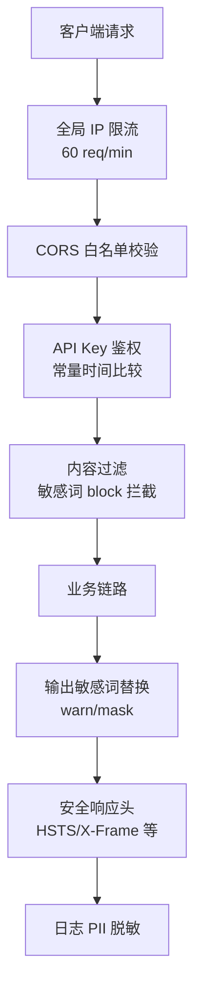

# 安全加固指南

本指南介绍系统的安全配置和最佳实践，帮助运维人员将系统从开发模式安全地推进到生产环境。

!!! info "前置条件"

    - 已阅读 [配置说明 - 安全配置](../configuration.md#_4)
    - 已通过 `.env.example` 复制出 `.env` 并按生产环境填写

---

## 概述

系统在生产化加固阶段引入了多层防御机制，遵循「默认安全、可降级、可观测」三大原则：



每一层都设计了降级路径，避免单点故障拖垮主链路。

---

## API Key 配置

`API_KEY` 是应用级鉴权密钥，控制所有业务端点与运维端点的访问。

### 配置方法

```bash
# .env
# 强随机 Key（建议 32 字节以上，可用 openssl rand -hex 32 生成）
API_KEY=your-strong-random-api-key
```

客户端请求时需在 `X-API-Key` 请求头携带：

```bash
curl -H "X-API-Key: your-strong-random-api-key" http://localhost:8000/api/v1/chat
```

### 工作机制

- **留空**：进入开发免鉴权模式（dev-mode），所有请求直接放行；启动时日志输出 `⚠️ API_KEY 未配置` WARNING
- **非空**：所有受保护端点校验 `X-API-Key`，使用 `secrets.compare_digest` 做恒定时间比较，防止时序攻击
- **失败响应**：返回 `401 Unauthorized`，带 `WWW-Authenticate: ApiKey` 头

!!! danger "生产环境必须配置"
    `API_KEY` 留空时所有端点（包括 `/api/v1/knowledge/*`、`/api/v1/operations/*` 等运维端点）均可匿名访问。

??? tip "如何生成强随机 Key"

    ```bash
    # 生成 32 字节十六进制 Key
    openssl rand -hex 32

    # 或使用 Python
    python -c "import secrets; print(secrets.token_hex(32))"
    ```

---

## CORS 白名单

`ALLOWED_ORIGINS` 控制允许跨源访问的域名，防止恶意站点借助浏览器跨源访问 API。

### 配置方法

```bash
# .env
# 逗号分隔多个源，不要带尾随斜杠
ALLOWED_ORIGINS=https://example.com,https://app.example.com
```

### 工作机制

| `ALLOWED_ORIGINS` | `DEBUG` | CORS 行为 | 是否允许凭据 |
|-------------------|---------|-----------|--------------|
| 非空 | 任意 | 仅允许白名单中的源 | ✅ 是 |
| 空 | `True` | 允许所有源（`*`） | ❌ 否 |
| 空 | `False` | **拒绝所有跨源请求** | ❌ 否 |

!!! warning "生产环境必须配置"
    `ALLOWED_ORIGINS` 留空 + `DEBUG=False` 时，CORS 拒绝所有跨源请求，前端将无法访问 API。

---

## 限流配置

系统通过滑动窗口算法对每个客户端 IP 做全局速率限制，防止恶意刷接口。

### 配置方法

```bash
# .env
# 默认开启，压测/调试时可临时关闭
RATE_LIMIT_ENABLED=True
```

### 工作机制

- **阈值**：60 req/min/IP（普通业务接口默认值）
- **算法**：滑动窗口 + deque 时间戳，比固定窗口更平滑
- **超限响应**：HTTP 429，body 含 `retry_after` 字段，响应头带 `Retry-After`
- **重操作端点**：通过 `@rate_limit(10, 60)` 装饰器叠加更严格限制（如知识库入库 10 req/min）
- **关闭降级**：`RATE_LIMIT_ENABLED=False` 时全局限流降级为放行

```bash
# 超限响应示例
HTTP/1.1 429 Too Many Requests
Retry-After: 12

{"detail":"请求过于频繁，请稍后再试","retry_after":12}
```

!!! tip "多进程部署"
    当前限流为单进程内存实现。多进程（如 gunicorn -w 4）部署时，每个 worker 独立计数，实际阈值为 `60 × worker 数`。生产环境建议替换为 Redis 等共享存储的限流方案。

??? info "客户端 IP 提取优先级"

    `get_client_ip` 按以下顺序提取客户端 IP：

    1. `X-Forwarded-For` 第一个值（最原始客户端 IP）
    2. `X-Real-IP`
    3. 连接远端地址 `request.client.host`

    生产环境务必在反向代理层覆盖 `X-Forwarded-For`，避免客户端伪造。

---

## 敏感词过滤

基于 AC 自动机（Aho-Corasick）的多模式敏感词匹配，运行时双向过滤。

### 配置方法

**方式 1：文件配置（推荐）**

编辑 `app/knowledge/sensitive_words.txt`，每行格式 `词|级别`：

```text
# block 级：直接拦截用户输入，不进入 LLM
竞品A|block
内部代号XXX|block

# warn 级：替换为 ***
违规词1|warn
违规词2

# mask 级：保留首尾字符，中间打码
手机品牌Y|mask
```

**方式 2：环境变量动态注入**

```bash
# .env
# 逗号分隔，默认 warn 级，与文件合并生效（去重）
SENSITIVE_WORDS=临时词A,临时词B
```

### 三级处理策略

| 级别 | 输入侧行为 | 输出侧行为 | 适用场景 |
|------|------------|------------|----------|
| `block` | 拒绝进入 LLM，返回固定拒绝回复 | 不处理（不会出现在输出） | 严禁出现的内容 |
| `warn` | 仅记录不拦截 | 整词替换为 `***` | 一般敏感词 |
| `mask` | 仅记录不拦截 | 保留首尾字符，中间用 `*` 替代 | 需保留上下文识别的词 |

!!! tip "修改后生效方式"
    敏感词文件修改后需重启服务，或在代码中调用 `reset_content_filter()` 重新构建 AC 自动机。

??? info "降级策略"
    `pyahocorasick` 未安装或构建失败时，内容过滤器自动降级为禁用模式（`_enabled=False`），所有输入直接放行，不阻断主链路。

---

## 日志脱敏

日志过滤器 `PIIMaskingFilter` 自动识别并打码日志中的敏感信息，避免 PII 落盘。

### 覆盖类型

| PII 类型 | 正则模式 | 脱敏规则 | 示例 |
|----------|----------|----------|------|
| 手机号 | `1[3-9]\d{9}` | 保留前 3 后 4，中间 4 位 `*` | `13812345678` → `138****5678` |
| 身份证 | 18 位标准格式 | 保留前 6 后 4，中间 8 位 `*` | `110101199001011234` → `110101********1234` |
| 邮箱 | 标准邮箱格式 | 用户名保留首字符，域名完整 | `alice@example.com` → `a***@example.com` |
| 银行卡 | `6` 开头 16-19 位 | 保留前 4 后 4，中间 `*` | `6222021234567890123` → `6222****0123` |

### 工作机制

- 替换顺序为邮箱 → 身份证 → 银行卡 → 手机号，防止手机号正则误匹配长数字串内部的 11 位子串
- 过滤器注册到 root logger 的所有 handler，覆盖全部模块日志
- 过滤器无状态、正则只读，多线程安全

!!! note "无需配置"
    日志脱敏默认启用，无需任何环境变量配置。如需禁用，可注释 `app/core/logging.py` 中 `handler.addFilter(pii_filter)` 一行。

---

## 会话管理

后台 daemon 线程定时清理过期会话，避免长时间闲置会话占用内存。

### 配置方法

```bash
# .env
# 会话超时时间（秒），超过该时长无活动的会话将被清理
SESSION_TTL=1800

# 清理扫描间隔（秒），后台线程每隔该时长扫描一次过期会话
SESSION_CLEANUP_INTERVAL=300
```

### 工作机制

- 应用启动时通过 `lifespan` 钩子拉起名为 `session-cleanup` 的 daemon 线程
- 线程按 `SESSION_CLEANUP_INTERVAL` 周期循环：先 sleep，再调用 `cleanup_expired_sessions(SESSION_TTL)`
- 单次清理异常仅记录 warning 不退出循环，保证清理线程长存
- `daemon=True` 确保进程退出时线程自动终止

!!! tip "参数调优"
    - `SESSION_TTL` 过短：用户短暂离开即丢失上下文，体验差
    - `SESSION_CLEANUP_INTERVAL` 过短：增加锁竞争，影响主链路
    - 推荐组合：`1800/300`（30 分钟超时，5 分钟扫描）或 `3600/600`（1 小时超时，10 分钟扫描）

---

## 文件上传安全

`POST /api/v1/knowledge/ingest` 端点对上传文件施加双重限制，防止恶意文件注入与 OOM。

### 限制规则

| 维度 | 限制 | 超限响应 |
|------|------|----------|
| 文件类型 | `.md` / `.txt` / `.pdf` / `.docx` 白名单 | 415 Unsupported Media Type |
| 文件大小 | 10 MB 上限（`10 * 1024 * 1024` 字节） | 413 Payload Too Large |

### 工作机制

```python
# app/api/v1/knowledge.py
ALLOWED_FILE_TYPES = {".md", ".txt", ".pdf", ".docx"}
MAX_FILE_SIZE = 10 * 1024 * 1024  # 10MB

# 校验顺序：先类型后大小，避免读取大文件浪费资源
file_ext = Path(file.filename or "").suffix.lower()
if file_ext not in ALLOWED_FILE_TYPES:
    raise HTTPException(415, ...)

content = file.file.read()
if len(content) > MAX_FILE_SIZE:
    raise HTTPException(413, ...)
```

!!! warning "扩展白名单需谨慎"
    若需支持其他类型（如 `.html`、`.doc`），务必确认解析器（Unstructured + PyMuPDF + python-docx + BeautifulSoup4）已覆盖且无已知漏洞，避免 XXE 或 SSRF 风险。

---

## 运维 API 鉴权

运维端点强制依赖 `verify_api_key`，防止未授权调用修改知识库或运营数据。

### 受保护端点

| 路由前缀 | 主要操作 | 鉴权依赖 |
|----------|----------|----------|
| `/api/v1/knowledge/*` | 文档入库、删除、版本回滚、灰度验证 | `Depends(verify_api_key)` |
| `/api/v1/operations/*` | 灰度实验管理、运营看板、上线检查清单 | `Depends(verify_api_key)` |
| `/api/v1/evaluation/*` | 检索评估、RAGAS 评估 | `Depends(verify_api_key)` |
| `/api/v1/performance/*` | 性能指标、缓存清理 | `Depends(verify_api_key)` |

!!! note "无鉴权端点"
    `/api/v1/health`、`/api/v1/observability/*`、`/api/v1/monitor/*` 健康检查与监控端点不做鉴权，便于运维面板无凭据访问。生产环境如需关闭公开访问，请在反向代理层做 IP 白名单限制。

---

## 生产部署清单

部署到生产环境前，请逐项确认：

- [ ] 配置 `API_KEY`（非空，建议 32 字节以上强随机 Key）
- [ ] 配置 `ALLOWED_ORIGINS` 为前端实际域名（逗号分隔）
- [ ] 设置 `DEBUG=False`，避免错误堆栈泄露
- [ ] 配置 HTTPS 反向代理（Nginx/Caddy），HSTS 头将自动生效
- [ ] 填充 `app/knowledge/sensitive_words.txt`，按 `词|级别` 格式录入业务敏感词
- [ ] 确认 `RATE_LIMIT_ENABLED=True`（默认已开启）
- [ ] 反向代理层覆盖 `X-Forwarded-For`，防止客户端伪造 IP
- [ ] 多进程部署时替换为 Redis 共享限流方案
- [ ] 配置 `LLM_API_KEY` 等业务密钥，避免走 mock 模式
- [ ] 启用 Langfuse 链路追踪（`LANGFUSE_ENABLED=True`），便于事后审计
- [ ] 日志输出到独立卷并设置轮转，避免磁盘被 PII 脱敏后的日志撑爆

!!! example "生产环境 .env 片段"

    ```bash
    APP_NAME=Customer Service Prod
    DEBUG=False

    # 安全配置
    API_KEY=<strong-random-key>
    ALLOWED_ORIGINS=https://your-frontend.com
    RATE_LIMIT_ENABLED=True
    SENSITIVE_WORDS=竞品A,内部代号
    SESSION_TTL=1800
    SESSION_CLEANUP_INTERVAL=300

    # 业务密钥
    LLM_API_KEY=sk-your-deepseek-key
    LANGFUSE_ENABLED=True
    LANGFUSE_PUBLIC_KEY=pk-lf-xxx
    LANGFUSE_SECRET_KEY=sk-lf-xxx
    ```

---

## 相关文档

- [配置说明](../configuration.md) — 全部配置项默认值与影响范围
- [快速开始](../quick-start.md) — 一分钟跑起来
- [架构设计 - 降级策略](../architecture/fallback.md) — 各层降级机制详解
- [可观测性教程](./observability.md) — Langfuse 链路追踪与监控
